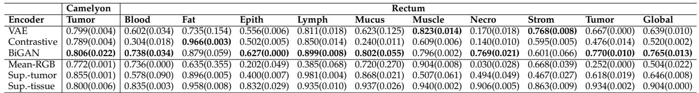
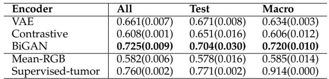
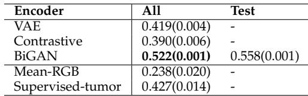

[← 返回 README](../README.md)

# 04 - Experiments and Results

## 📌 预览

实验部分由四条证据链组成：synthetic task 验证 NIC 是否能同时用局部/全局信息；patch-level tasks 比较 encoder 表示质量；Camelyon16/TUPAC16 检验弱图像级分类/回归；Grad-CAM 检查模型关注区域是否合理。

---

# 4 EXPERIMENTS AND RESULTS

We conducted a series of experiments to evaluate the performance of gigapixel NIC. First, we evaluated NIC in synthetic data to gain an understanding of the method and how its hyper-parameters affect performance. Second, we applied the method to several public histopathological datasets.

> 💡 **实验路线图**: synthetic 提供可控 ground truth，真实 WSI 提供临床任务，Rectum patch classification 则用于评价 encoder 是否学到可迁移组织语义。

# 4.1 Materials

In this work, a synthetic dataset and three histopathology cohorts from different sources were used for supervised and unsupervised training at patch and image level; patients and WSIs were unique across all cohorts.

> 💡 **数据划分重点**: encoder patch 训练、image-level CNN 训练、patch-level baseline 评估是不同层级的数据流，不能混成同一个监督设置。

# 4.1.1 Synthetic dataset

We developed and tested NIC with a synthetic dataset that mimicked the task of end-to-end WSI analysis before deploying it with real WSIs. As a substitute for WSIs, a set of images $T = \{ t _ { i } \}$ with $t _ { i } ~ \in \mathbb { R } ^ { A \times B }$ were used, each one associated with a dense pixel-level ground truth mask

$M = \{ m _ { i } \} ,$ where $m _ { i } \in \mathbb { R } ^ { A \times B } .$ , and an image-level scalar label $Y = \{ y _ { i } \}$ .

To emulate global patterns in the images (e.g., tumor lesions), we defined two rectangles within each mask placed at random locations and characterized by their own orientation: one was either vertically or horizontally oriented (non-tilted); the other was tilted either 45 or 135 degrees (tilted). Each rectangle was associated to a randomly selected MNIST [30] digit class. To emulate local patterns (e.g., cells), instances of MNIST digits were placed throughout the images at random locations. The class of these instances was determined by their spatial position, i.e., belonging to a certain rectangle class if placed within the boundaries of a rectangle or otherwise randomly selected. The label of each image was defined by the class of the tilted rectangle, with the non-tilted rectangle acting as a distraction. See Fig. 5 for an example image.

> 💡 **synthetic 任务设计**: 标签由 tilted rectangle 的 digit class 决定，non-tilted rectangle 是干扰项。这个设计强迫模型先定位正确全局形状，再读取局部 digit 类别。

Note that, in order to solve this classification task, NIC had to detect the tilted rectangle and its class without access to the ground-truth masks. Moreover, the method must combine local and global information, i.e., exploiting the local features that identify digit instances’ classes while recognizing their global spatial arrangement to detect the orientation of the rectangle.

We downsampled MNIST digits to $9 \times 9$ pixels, defining a patch size $P ~ = ~ 9$ and stride $S \ = \ 9$ pixels. WSIs are typically $5 0 0 0 0 \times 5 0 0 0 0$ pixels in size, with patch sizes of $1 2 8 \times 1 2 8$ pixels covering structures composed of a few cells. We mimicked this image-patch ratio by using an image size of $A = B = 3 6 0 0$ pixels, and inserted 25,920 digit instances per image $( 0 . 2 \%$ of the total possible locations). Rectangle size randomly ranged from 1800 pixels to 36 pixels (long side). This reduced image size enabled us to run more thorough experiments than what we could do with histopathological data.

> 💡 **尺度类比**: 3600/9 对应 WSI 的 50000/128，是为了模拟“巨大图像 + 很小局部结构”的比例，而不是追求 MNIST 本身的难度。

A total of 50,000 images with balanced labels were created across the 10 digit classes: 2500 to generate patches to train the encoders, 22,500 to train the NIC CNN (with $7 5 \%$ and $2 5 \%$ for training and validation), and 25,000 as an independent test set for the NIC CNN.

# 4.1.2 Camelyon16 histopathology dataset

The Camelyon16 [4] dataset is a publicly available multicenter cohort that consists of 400 sentinel lymph node H&E WSIs from breast cancer patients. Reference standard exists in two forms: fine-grained annotations of metastatic lesions and image-level labels indicating the presence of tumor metastasis in each slide. Sixty WSIs from the original training set were set aside to train encoders at patch level. The remaining WSIs were combined with the original test set $\scriptstyle ( \mathrm { n } = 3 4 0 )$ ) to train and evaluate a classification model using image-level labels only.

> 💡 **Camelyon16 的双重用途**: 图像级标签用于训练 NIC-CNN，细粒度 metastasis annotation 不参与训练，只在 Grad-CAM 对照和 lesion-size 分析中提供解释性证据。

# 4.1.3 TUPAC16 histopathology dataset

The TUPAC16 [3] dataset was used, consisting of 492 H&E WSIs from invasive breast cancer patients. It is a publicly available cohort with WSIs from The Cancer Genome Atlas [31] where each WSI is associated with a tumor proliferation speed score, an objective measurement that takes into account the RNA expression of 11 proliferationassociated genes [32]. We set aside 40 WSIs from this set to train encoders at patch level. The remaining WSIs $\scriptstyle ( \mathrm { n = 4 } 5 2 )$ ) were used to train and evaluate a regression model using image-level labels only. Additionally, 321 test WSIs with no public ground truth available were used to perform an independent evaluation.

> 💡 **TUPAC16 的价值**: proliferation speed 来自 11 个基因表达，不是病理专家直接画出的视觉类别。它更能检验 NIC 是否发现未知但可预测的形态学线索。

# 4.1.4 Rectum histopathology dataset

The Rectum dataset is a publicly available set of 74 H&E WSIs from rectal carcinoma patients [33]. Manual annotations of 9 tissue classes were made by an expert: blood cells, fatty tissue, epithelium, lymphocytes, mucus, muscle, necrosis, stroma, and tumor. The slides were randomized and organized into ten equal partitions at patient level, five of which were used for training, one for validation, and four for testing. This dataset was used to train and evaluate encoders at patch level only. We extracted a balanced distribution of 15K, 852, and 4K patches per class from the training, validation, and test slides, respectively.

> 💡 **Rectum 的角色**: 它不是 image-level NIC 主任务，而是用 9 类组织 patch 分类评估 encoder 是否能表达复杂组织类型。

# 4.1.5 Data preparation

Regarding the synthetic dataset, one million pairs of patches were extracted to train the encoders, augmented with scaling and elastic deformation. To avoid creating a dataset of empty patches, the probability of sampling a patch containing a white pixel was twice of that of an empty patch.

All WSIs in this study were preprocessed with a tissuebackground segmentation algorithm [28] in order to exclude areas not containing tissue from the analysis. Furthermore, all images were analyzed at $0 . 5 \mu \mathrm { m }$ /pixel resolution.

A set of patch datasets were assembled to train and evaluate each of the encoding networks described in Sec. 2 using the set of images that we set aside from each cohort: 60 WSIs from Camelyon16, 40 from TUPAC16, and all from Rectum. Each of these subcohorts were divided into training, validation, and test partitions.

The contrastive dataset was created by extracting an equal amount of patches from each source (i.e., Camelyon16, TUPAC16, and Rectum) and merged into 50,000 and 25,000 patch pairs for training and validation, respectively. The non-contrastive dataset was then created by randomizing all individual patches within the contrastive dataset.

The supervised-tumor dataset was created by extracting 50,000 , 10,000 , and 50,000 patches from the set of 60 Camelyon16 WSIs for training, validation, and testing, respectively. Finally, the supervised-tissue dataset consisted of the Rectum training, validation, and test sets containing 131,000 , 8000 , and 35,000 patches, respectively. Note that the patches in the supervised-tumor dataset and supervisedtissue dataset test sets did not undergo any augmentation. The fine-grained tumor annotations were used to sample a balanced distribution of tumor and non-tumor patches in the supervised-tumor dataset and 9-class patches in the supervised-tissue dataset.

> 💡 **公平比较控制**: VAE/BiGAN/contrastive 使用同一批 patch，只是训练目标不同；supervised baselines 使用人工 patch 标注，因此是上界/参考而不是同等弱监督设置。

# 4.2 Experimental results on synthetic data

The contrastive encoder was trained using the pairs of patches described in Sec. 4.1.5. The VAE and BiGAN encoders were subsequently trained using these same patches, concatenating and shuffling them along the pair dimension. Finally, a supervised encoder was trained with MNIST digits to serve as an oracle feature extractor. Once the encoders were trained, all images were encoded to produce a different embedded representation for each encoding configuration. Network architectures and training protocols are detailed in the Supplementary Material accompanying this paper.

*Fig. 6: Experimental results with synthetic data and image-level labels. Default hyper-parameter choice unless specified otherwise is: supervised encoder, code size 16, stride 9 pixels, and usage of 100% of training data.*

> 💡 **Figure 6 批读**: synthetic 中 contrastive 最接近 oracle，说明在这个几何+digit 任务里 same/different 增强约束比 BiGAN 更适合；小于 10% image size 的 lesion 性能快速下降，为后面 Camelyon16 小转移失败埋伏笔。

*Fig. 7: Grad-CAM visualization applied to randomly selected synthetic test images. Left images within the pairs correspond to the ground truth masks (unseen by the model), and right ones to the saliency heatmaps.*

> 💡 **Figure 7 批读**: 这里有真实 mask，因此可以做比 WSI 更干净的定位验证。平均 Jaccard 0.612 表示 heatmap 不只是分类副产物，而能大致恢复 tilted rectangle。

We explored different values for the method hyperparameters (e.g., code size and stride) using the synthetic data, and evaluated the accuracy of each resulting CNN in the independent test set. We analyzed how this performance was affected by the size of the simulated lesion, i.e., the size of the tilted rectangle. Results are summarized in Fig. 6. Overall, the contrastive encoder achieved the best performance among the unsupervised techniques, very close to that of the oracle, followed by the VAE and BiGAN encoders. This trend was maintained when analyzing the impact of the lesion size. We found out that the method’s performance degraded quickly when the size of the target lesion was smaller than $1 0 \%$ of the image size (see Fig. 6-a).

Additionally, the performance impact of the code size used to compress the images was assessed (Fig. 6-b). It was observed that larger code sizes generally improved performance, a result that was more evident for less accurate encoding methods like VAE and BiGAN. Subsequently, different stride values were tested using the oracle encoder and a code size of 16: it was found that a smaller stride, producing embedded images with larger spatial resolution, resulted in hampered performance (Fig. 6-c). Finally, the impact of training data size in performance was analyzed using the oracle encoder with code size 16 and stride 9 (Fig. 6-d). These results indicate that NIC required in the order of thousands of images to perform well, a requisite that is rarely met in real histopathological datasets.

> 💡 **Q&A 批注记录**:
> - Q: 为什么更小 stride 反而可能更差？
> - A: 更小 stride 增加 compressed grid 分辨率，也增加 CNN 输入规模和可学习自由度；在图像级标签数量有限时，过拟合压力可能超过分辨率收益。

In our last experiment, we applied Grad-CAM to visualize the regions of the input images that were responsible for the CNN prediction (see Fig. 7). Remarkably, the network seemed to be able to discern between background noise and the rectangular patterns. Upon visual inspection, the CNN generally focused on the tilted rectangle, the one responsible for the image-level label. We applied a simple generalpurpose post-processing routine to denoise the heatmaps and reject spurious activity. We measured the Jaccard similarity coefficient per image between the post-processed heatmap and the ground truth maps, and obtained 0.612 on average across test images.

# 4.3 Training of encoders

Due to the computationally expensive nature of experimenting with gigapixel WSIs, we only tested a subset of the hyper-parameters that we explored with synthetic data. We selected their values using the following heuristics. We used $P = 1 2 8 ,$ a common patch size used in the Computational Pathology literature [28], with a stride of the same size $S = 1 2 \bar { 8 }$ to perform non-overlapping patch sampling. We selected $R = 4 0 0$ to obtain crops corresponding to typical sizes of gigapixel WSIs $\mathrm { 5 0 , 0 0 0 \times 5 0 , 0 0 0 }$ pixels) and $T = 1 0$ as done in the literature [27]. Finally, we selected $C = 1 2 8$ to perform our experiments using a single GPU. Network architectures and training protocols are detailed in the Supplementary Material.

> 💡 **真实 WSI 超参**: $P=S=C=128$ 是本文主设置。它大幅压缩 WSI，但非重叠 patch 也意味着小病灶一旦被平均/编码弱化，后续 CNN 很难恢复。

We trained the contrastive encoder with the contrastive dataset, and the VAE and BiGAN models with the noncontrastive dataset. Note that these datasets contained the exact same image patches, ensuring a fair comparison among encoders. No manual annotations were required in this process. We trained a supervised baseline encoder for breast tumor classification using the supervised-tumor dataset, and a supervised baseline encoder for rectum tissue classification using the supervised-tissue dataset.

TABLE 1: Patch-level classification performance (accuracy). Task-1 and Task-2 in the text refer to columns Camelyon-Tumor and Rectum-Global. Reporting mean and standard deviation using two random weight initializations.

*TABLE 1: Patch-level classification performance (accuracy).*

> 💡 **Table 1 批读**: BiGAN 在 unsupervised encoders 中整体最好，Rectum-Global 为 0.765，高于 VAE 0.639 和 contrastive 0.520；但 supervised-tissue 0.904 显示有人工组织标签时仍有明显上界。

TABLE 2: Predicting the presence of metastasis at WSI level (AUC). Reporting mean and standard deviation using two random weight initializations.

*TABLE 2: Predicting the presence of metastasis at WSI level (AUC).*

> 💡 **Table 2 批读**: Camelyon16 上 BiGAN All AUC 0.725，接近 supervised-tumor 0.760；但 Macro 上 supervised-tumor 0.914 明显高于 BiGAN 0.720，说明弱监督压缩表示对大病灶也仍有差距。

It is widely recognized that color-based features can be very informative in histopathology image analysis [34]–[36]. Therefore, we included an additional encoding function to capture color information from the raw input by averaging the pixel intensity across spatial dimensions from input RGB patches. It provided a simple yet effective baseline to compare with more sophisticated encoding mechanisms.

This entire training process resulted in 6 encoding networks used in subsequent experiments: the mean-RGB baseline, VAE encoder, contrastive encoder, BiGAN encoder, supervised-tumor baseline, and supervised-tissue baseline.

# 4.4 Comparing encoding performance

Due to the lack of a common evaluation methodology for unsupervised representation learning, we compared the performance of these 6 encoders when used as fixed feature extractors for related supervised classification tasks. We defined two tasks: (1) discerning between tumor and nontumor patches on the supervised-tumor dataset (Task-1), and (2) performing 9-class tissue classification on the supervisedtissue dataset (Task-2). For each task, we trained an MLP on top of each encoder with frozen weights and reported the accuracy metric for each test set.

Results in Tab. 1 highlight several observations. First, VAE, contrastive, and BiGAN performed better than the lower baseline for both Task 1 and Task 2, stressing their ability to describe complex patterns beyond simple features related to color intensity. Second, the VAE encoder obtained a higher performance than the contrastive one, particularly for Task 2. Third, the BiGAN encoder achieved the best performance among all the unsupervised methods, with a relatively large margin for the more complex Task 2 with respect to the runner-up VAE model. Furthermore, the BiGAN encoder obtained the best result for 5 out of 9 classes in Task 2, and it achieved the first or second best result for 8 out of 9 classes among the unsupervised models. Remarkably, BiGAN succeeded at classifying patches from challenging tissue classes such as blood cells and necrotic tissue.

> 💡 **encoder 质量证据**: Patch-level 评估不直接证明 WSI 分类，但说明 BiGAN embedding 对组织类别更线性可分。这为它在 image-level CNN 中表现更好提供机制解释。

TABLE 3: Predicting tumor proliferation speed at WSI level (Spearman corr.). Reporting mean and standard deviation using two random weight initializations.

*TABLE 3: Predicting tumor proliferation speed at WSI level (Spearman corr.).*

> 💡 **Table 3 批读**: TUPAC16 是 unknown visual cue 的回归任务，BiGAN All Spearman 0.522，Test 0.558；这比 supervised-tumor baseline 的 All 0.427 更高，说明“肿瘤 patch 监督”不一定迁移到 proliferation speed。

# 4.5 Predicting the presence of metastasis at image level

In this experiment, we trained a CNN to perform binary classification on compressed gigapixel WSIs from the Camelyon16 cohort, identifying the presence of tumor metastasis using image-level labels only. Due to the limited amount of images in this cohort (340 WSIs), we divided the dataset into four equal-sized partitions and performed four rounds of cross-validation using two partitions for training, one for validation and one for testing, rotating them in each round. We trained a different CNN classifier for each encoder, i.e., mean-RGB, VAE, contrastive, BiGAN, and the upper baseline supervised-tumor. We reported the area under the receiver operating characteristic (AUC) on three evaluation sets.

The first evaluation set (All) concatenated all samples in each of the hold-out partitions. Note that each holdout partition was evaluated by a different CNN that had never seen the data. The second evaluation set (Test) was a subset of All that matched the official test set of the Camelyon16 Challenge, used for comparison with the public leaderboard. The third evaluation set (Macro) used the same WSIs as in Test but considering only those that presented a macro metastasis as positive labels, i.e., a tumor lesion larger than $2 \mathrm { m m }$ . The macro labels were only available for the Camelyon16 test set. The Macro set was relevant to evaluate how the method performed with lesions visible at low resolution.

Results in Tab. 2 demonstrate that the method presented in this work is an effective technique for gigapixel image analysis using image-level labels only. Regarding the All evaluation set, BiGAN achieved a remarkable performance of 0.716 AUC, with a relative difference from the supervised baseline of only $6 \%$ . The contrastive and VAE models also surpassed the lower baseline, but obtained substantially lower performance scores compared to BiGAN. Regarding the Test set, the BiGAN encoder obtained a lower performance of 0.674 AUC. In the Macro set, the performance gap between the supervised baseline and the BiGAN encoder increased substantially from 0.095 to 0.184. The state-of-theart in Camelyon16 obtained 0.9935 AUC in the Test set using accurate pixel-level annotations to train their model.

> 💡 **Camelyon16 结果注意**: 正文叙述中的 0.716/0.674 与表图中的 0.725/0.704 有轻微不一致，可能来自版本/抽取差异。阅读时应以表格图片为主，同时保留原文描述。

*Fig. 8: Experimental results with respect to lesion size in Camelyon16 all test set using multiple encoders.*

> 💡 **Figure 8 批读**: lesion size 越小，positive/negative score 越难分开。这直接解释了为什么 NIC 和 pixel-level annotation leaderboard 仍有大差距：微转移在压缩网格中可能只占极少位置。

Additionally, we analyzed the performance of our method as a function of the lesion size in the $A l l$ test set. The lesion size is a measurement determined by pathologists taking the distribution of tumor cell clusters within a WSI into account. Since this annotation was not available for all WSIs, we approximated it by computing the radius of an hypothetical circle with an area composed of all pixels annotated as tumor in each WSI. Results in Fig. 8 indicated that our method’s performance degraded with small tumor lesions across most encoders, in line with the results obtained with synthetic data. Furthermore, we experimented with different hyper-parameters such as code size, stride, and training data size using the supervised encoder (Fig. 9). We found that performance improvements might be gained from careful hyper-parameter tuning of the code size and stride parameters. Moreover, there seemed to be a weak but positive correlation between model performance and training data size.

# 4.6 Predicting tumor proliferation speed at image level

In this experiment, we trained a CNN to perform a regression task on compressed gigapixel WSIs from the TU-PAC16 cohort, predicting the tumor proliferation speed based on gene-expression profiling. We performed 4-fold cross-validation as in the previous experiment, and reported the Spearman correlation between the predicted and the true scores of two evaluation sets.

The first evaluation set (All) concatenated all samples in each of the hold-out partitions. The second evaluation set (Test) matched the test set used in the TUPAC16 Challenge, whose ground truth is not public. Using the encoder that obtained the highest performance, we evaluated each WSI in Test four times using each of the CNNs trained during crossvalidation and submitted the average score per slide. Our predictions were independently evaluated by the challenge organizers, ensuring a fair and independent comparison with the state of the art.

The results in Tab. 3 showed that BiGAN achieved the highest performance with a 0.521 Spearman correlation.

*Fig. 9: Hyper-parameter value analysis performed in Camelyon16 data using the supervised encoder.*

> 💡 **Figure 9 批读**: code size、stride、training WSI 数都影响性能，说明 NIC 不是“压得越狠越好”。小病灶任务需要在语义容量、空间分辨率和样本数之间折中。

Remarkably, this score was superior to that of any other unsupervised or supervised encoder. In addition, we obtained a score of 0.557 on the TUPAC16 Challenge test set, superior to the state-of-the-art for image-level regression with a score of 0.516. Note that the first entry of the leaderboard used an additional set of manual annotations of mitotic figures, thus it cannot be compared with our setup.

> 💡 **TUPAC16 证据强度**: 独立 organizer 评估减少了调参到测试集的风险；同时作者排除了使用 mitosis annotation 的 leaderboard 第一名，保持“image-level only”比较口径。

# 4.7 Visualizing where the information is located

We conducted a qualitative analysis on the trained CNNs to locate the spatial position of visual cues relevant in predicting the image-level labels. We applied the Grad-CAM algorithm to the CNNs trained for both tasks at image level. For the tumor metastasis prediction task, we compared the saliency maps with fine-grained manual annotations. Figures 10 and 11 include the results for a few samples; the results for the remaining WSIs can be found in the Supplementary Material. Note that each WSI was evaluated by a CNN that had not yet seen the image (hold-out partition).

Fig. 10 shows that the mean-RGB baseline model lacked the ability to focus on specific tissue regions, suggesting that it was unable to learn discriminative features from image-level labels. The VAE and contrastive models exhibited a suboptimal behavior, scattering attention all over the image. Remarkably, the BiGAN model seemed to focus on tumor regions only, discarding empty areas, fatty tissue, and healthy dense tissue. It showed a strong discriminative power to discern between tumor and non-tumor regions, even though the CNN had access to image-level labels only. For completeness, we also included the supervisedtumor baseline that also exhibited a focus on tumor regions. Nevertheless, these heatmaps are often difficult to interpret and cannot be used for a more quantitative analysis. Failure cases can be seen in the bottom part of Fig. 10, where the CNN highlighted non-tumorous regions.

Regarding Fig. 11, a similar trend to the one found in the previous task was observed for all encoders: the

*Fig. 10: Grad-CAM visualization applied to several WSIs from Camelyon16.*

> 💡 **Figure 10 批读**: BiGAN 的热图更集中在人工 tumor annotation 附近，而 mean-RGB 分散且缺少组织选择性。底部 failure case 很重要：弱监督定位不是可靠分割，模型也会高亮非肿瘤区域。

*Fig. 11: Grad-CAM visualization applied to a sample case from TUPAC16.*

> 💡 **Figure 11 批读**: TUPAC16 没有公开像素级真值，图中只能做视觉合理性判断。BiGAN 聚焦 active tumor-like regions，而 supervised-tumor baseline 反而看无关区域，说明“会找肿瘤”不等于“会预测 proliferation”。 

BiGAN model focused on very specific regions of the WSIs that seemed compatible with active tumor regions. The supervised-tumor baseline focused on irrelevant areas, in line with its poor performance for this task.

## 🔖 Section 总结

| 证据 | 支撑的 claim | 局限 |
|---|---|---|
| Synthetic accuracy + Grad-CAM | NIC 可结合局部 digit 与全局矩形位置 | synthetic 中 contrastive 最强，不等于真实 WSI 最强 |
| Table 1 patch tasks | BiGAN embedding 对组织语义最可分 | patch-level proxy 不能完全代表 image-level 任务 |
| Table 2 Camelyon16 | 弱图像级标签可做 metastasis prediction | 明显落后 pixel-level annotation 方法 |
| Table 3 TUPAC16 | NIC 可预测未知视觉线索相关回归标签 | Test GT 不公开，只能引用 challenge 评估 |
| Fig. 10/11 Grad-CAM | BiGAN-CNN 学到较合理的 where | heatmap 主要定性，存在失败案例 |
