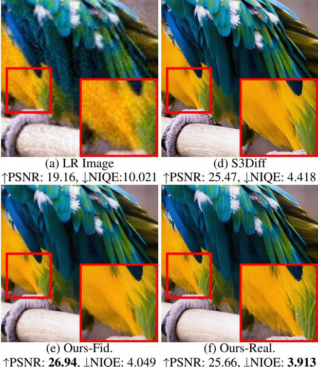
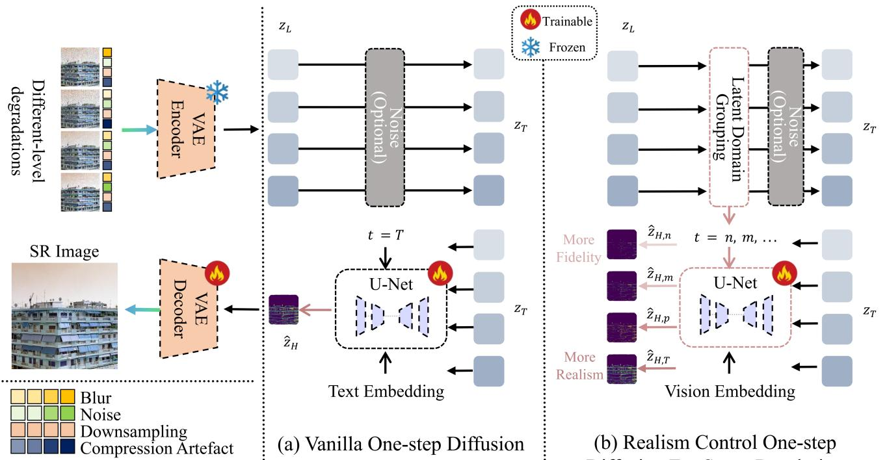

[← 返回 README](../README.md)

# Introduction

## 📌 预览
本节建立 RCOD-SR 的动机链：Real-ISR 退化复杂，multi-step SD-SR 质量高但慢，one-step SR 快但因固定 timestep 失去 fidelity-realism 控制。作者要证明的不是“单步可用”，而是“单步仍可按场景调真实感”。
---

> 💡 **Q&A 批注记录**:
> - Q: 为什么单步 SR 难以控制 realism？
> - A: 因为多数 one-step 模型在固定 timestep/固定蒸馏强度下学习一个确定映射，推理时没有多步采样那样的 noise schedule 可调自由度。
> - Q: 这里的 fidelity-realism trade-off 是什么？
> - A: fidelity 偏向保留 LR/GT 的结构和像素一致性，realism 偏向借助生成先验补自然纹理；SR 应用中二者常冲突，尤其是未知退化场景。

# Introduction
Image super-resolution (SR) (Dong et al. 2015; Zhang et al. 2018b, 2021; Ledig et al. 2017; Liang et al. 2021) aims to recover a high-resolution (HR) image from its low-resolution (LR) counterpart.
> 💡 **任务定义**: SR 的基础输入输出很简单：LR 到 HR。但这篇关心的是 Real-ISR，所以后面所有方法设计都围绕“未知退化下怎么既快又可控”展开。

Traditional image super-resolution simplifies the degradation process as known noise, blur, or downsampling. In recent years, real-world image super-resolution (Real-ISR) (Zhang et al. 2021; Wang et al. 2021) has attracted more attention due to the increasing demand for reconstructing high-resolution images under real-world unknown degradations, which is more challenging and practical in real applications.
> 💡 **问题背景**: Real-ISR 的难点在 unknown degradation：真实低质图不是简单 bicubic，下游方法必须同时处理模糊、噪声、压缩和纹理缺失。

*Figure S1: Figure S1: While previous one-step diffusion methods, such as S3Diff (Zhang et al. 2024) only yield one optimal result (b), our approach offers the flexibility to control images (cd) with different fidelity-realism trade-offs during inference, enhancing practical applicability across different scenarios.*
> 💡 **Figure 批读**: Fig. S1 是全文最直接的 claim 图：同一 LR 输入不应只输出一个“平均最优”结果，而应能根据场景选择保真档、均衡档或真实感档。读这张图时要警惕：更真实的纹理是否仍尊重原始结构。

While recent advances in Stable Diffusion (SD) models (Ho, Jain, and Abbeel 2020; Song et al. 2020), especially the large-scale pretrained text-to-image (T2I) models have demonstrated unprecedented capabilities in various downstream vision tasks (Zhang, Rao, and Agrawala 2023; Rombach et al. 2022). Some works leveraging pre-trained SD models for multi-step SR, such as DiffBIR (Lin et al. 2023), StableSR (Wang et al. 2024a), and SeeSR (Wu et al. 2024b), have achieved remarkable SR quality through iterative latent space optimization. Though these methods achieve impressive perceptual quality, they suffer from computational inefficiency. The caused latency by multi-step sampling makes real-time applications impractical.
> 💡 **效率动机**: 多步 SD-SR 的质量来自迭代 refinement，但实时应用最先被采样延迟卡住；one-step 方法就是在牺牲部分自由度换速度。

*Figure S2: Figure S2: Realism control one-step diffusion (RCOD) training process. The left part illustrates several synthesized real-world LR images by applying diverse degradations with varying types and intensities on an HR image. (a) Existing vanilla one-step diffusion (OSD) methods for super-resolution (SR): These LR images are directly sent into the diffusion forward and reverse process; the denoising U-Net tends to learn to recover the ‘average’ degradation, leading to a monotonous generation ability within the latent domain. (b) Our proposed Realism Control One-Step Diffusion employs a latent domain grouping strategy. This allows for adaptive control of timesteps (denoising degrees) during the forward process according to the degradation degree in the latent domain. As a result, the denoising U-Net can acquire a more diverse generation capability based on the timestep.*
> 💡 **Figure 批读**: Fig. S2 把“固定 timestep 问题”画清楚了：vanilla OSD 把不同退化强度都送入同一个训练/收敛空间，U-Net 只能学到单一生成能力；RCOD 则先按 latent metric 分组，再把 group 对应到不同 timestep/denoising degree。

To address the efficiency concerns, recent attempts focus on one-step diffusion frameworks (Wu et al. $2 0 2 4 \mathrm { a }$ ; Zhang et al. 2024), which distill multi-step diffusion priors into single-step inference through knowledge distillation and achieve 10×to $1 0 0 \times$ speedup over previous multi-step diffusion-based SR methods. However, existing one-step diffusion approaches face a fundamental dilemma: the deterministic single-step generation inherently lacks the controllable fidelity-realism balance that multi-step methods achieve via step-wise noise scheduling. As illustrated in Fig. S1, previous one-step diffusion super-resolution (SR) methods, such as S3Diff (Zhang et al. 2024), can only generate a single optimal result but can not meet the need for dynamic adjustment between fidelity and realism. The root cause lies in current OSD training paradigms. Most methods align all the LR inputs under different unknown degradations with a single convergence space through single timestep conditioned training, which results in a balanced static preference for fidelity or realism and prevents adaptive adjustments for scenario-specific requirements.
> 💡 **核心瓶颈**: 固定 timestep 训练会把不同退化样本压到同一个映射里，模型学到的是平均偏好，而不是可按图像/用户需求调节的策略。

Bearing the above concerns in mind, we propose a novel framework that provides one-step diffusion Real-ISR methods with the capability to monotonically control the level of realism. This framework, which we denote as Realism Controlled One-step Diffusion (RCOD), can be easily integrated into existing one-step diffusion methods for Real-
> 💡 **问题转折**: 这里的关键词是 monotonically control。作者不只是给两个模型版本，而是希望 timestep 增大时 realism 有单调变化，形成可解释的推理控制。

ISR. Specifically, during the training phase, we incorporate a Latent Domain Grouping (LDG) strategy into the latent diffusion process, grouping training data according to a latent domain metric. Through this strategy, the diffusion denoising network learns to perceive variations in degradation across training samples, thereby gaining adaptive restoration capabilities. Furthermore, to address the inherent limitations caused by text prompts, we introduce a Visual Prompt Injection Module (VPIM) to enhance prompt quality. Our contributions are summarized as follows:
> 💡 **模块关系**: Introduction 先点出 LDG 和 VPIM，但 DAS 也很关键：LDG 负责把退化程度变成 timestep 条件，VPIM 负责把 LR 图像本身变成视觉 prompt，DAS 负责让蒸馏 teacher 的采样强度跟 LDG 对齐。

• We propose a simple but effective latent domain grouping (LDG) strategy that reformulates the noise prediction process by partitioning the latent space into fidelity and realism oriented domains. This allows explicit control over detail preservation versus generative enhancement through simple training paradigm modifications, without requiring additional trainable parameters. During distillation, we introduce a degradation-aware sampling (DAS) strategy that reformulates timestep sampling in the pretrained model by adaptively aligning it with our LDG framework, enhancing controlling with regularization strength. • To reduce the computational burden of VLM and dependencies on manual text prompts, we propose a visual prompt injection module (VPIM) to replace text prompts with degradation-aware visual tokens, enhancing both restoration accuracy and semantic consistency.
> 💡 **贡献拆解**: 第一条贡献把 LDG 与 DAS 绑定在一起读：如果只有 LDG，student 可能学到分组；但蒸馏正则若仍随机采样大范围 timestep，会把分组边界冲淡。第二条贡献是工程上很实用的 VPIM：减少 VLM/text prompt 依赖，也降低 prompt 与 LR 内容不匹配的风险。

• We empirically evaluate our approach on widely used stable diffusion-based and their distillation version Real-ISR methods, demonstrating quality improvement and the effectiveness of proposed approach.
> 💡 **证据预期**: 这句意味着实验至少要覆盖两类底座：OSEDiff 这类从 SD 蒸馏来的 OSD，以及 S3Diff/SD-Turbo 路线。若 RCOD 只在单一底座有效，general framework 的说服力会下降。

---

## 🔖 Section 总结

### 关键数字速查
| 指标 | 数值 |
|------|------|
| 任务 | Real-world image super-resolution |
| 主矛盾 | 效率 vs 质量 vs 可控性 |
| 本文回答 | 把退化严重度映射到 latent domain group / timestep，使单步 Real-ISR 也能在推理时调 fidelity-realism trade-off。 |

### 核心洞察
1. 固定 timestep 是这篇对 OSD 的核心诊断：不同退化样本被压进同一个收敛空间，导致输出风格单调。
2. RCOD 的控制不是额外训练多个模型，而是复用 diffusion timestep 作为 denoising degree 控制入口。
3. 贡献列表需要在方法和实验中闭环：LDG 看可控性，DAS 看分组是否被蒸馏保持，VPIM 看 prompt 替换是否同时提升 FR/NR 指标。

### 可追问点
- 为什么单步 SR 难以控制 realism？
- LDG 真正控制的是什么？
- DAS 为什么不能简单用原 VSD 的随机 timestep？
