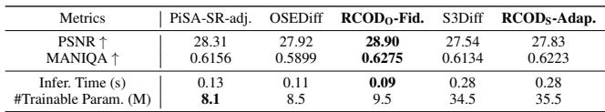
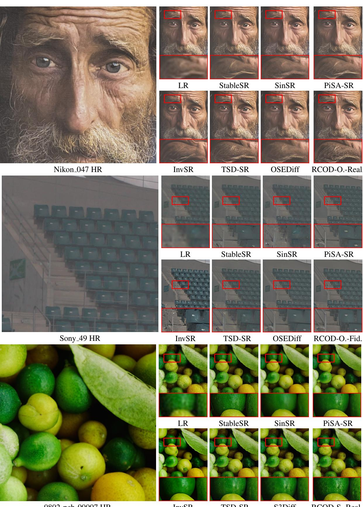
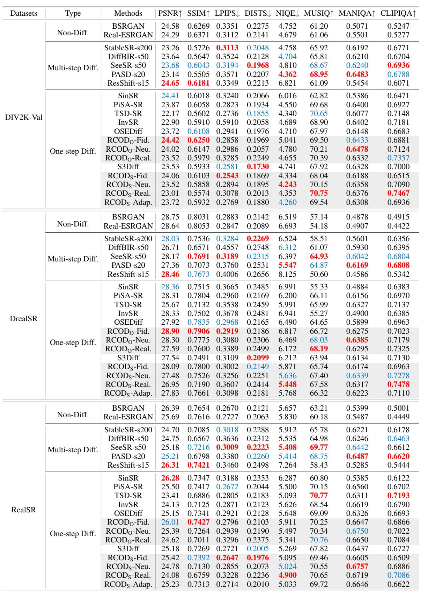
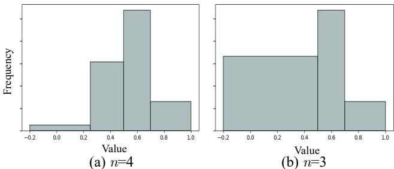

[← 返回 README](../README.md)

# Experiments

## 📌 预览
本文件合并 Experiments/Results/Analysis/Ablation，重点看 fidelity、realism、速度和可控性证据。

---

# Experiments

# Experiments Setups

Datasets: Following the training and testing settings of prior works(Wu et al. 2024b,a; Zhang et al. 2024), we employ LSDIR (Li et al. 2023) and the first 10K face images from FFHQ (Karras, Laine, and Aila 2019) for training and degradation pipeline of Real-ESRGAN (Wang et al. 2021) for LR image synthesizing. The synthetic test data use cropped $5 1 2 \times 5 1 2$ synthetic data from DIV2K-Val (Agustsson and Timofte 2017) and degraded using the Real-ESRGAN pipeline (Wang et al. 2021). The real-world data include LR-HR pairs from RealSR (Cai et al. 2019) and DRealSR (Wei et al. 2020), both with sizes of $1 2 8 \times 1 2 8 .$ - $5 1 2 \times 5 1 2$ for LR-HR pairs.

> 💡 **批注**: 注意 latent diffusion 架构路径：LQ/HR 往往先被 VAE 编码，再在 latent 空间完成 denoising 或调制。

Evaluation Metrics: We employ widely used FR and NR metrics. FR metrics include PSNR, SSIM (Wang et al. 2004), LPIPS (Zhang et al. 2018a), and DISTS (Ding et al. 2020). NR metrics include NIQE (Zhang, Zhang, and Bovik

> 💡 **批注**: 这是实验证据：要同时看保真指标、感知指标和速度指标。

Table S2: Quantitative comparison with state-of-the-art methods on both synthetic and real-world benchmarks. The best and second best results are highlighted in bold and underline, respectively.

> 💡 **批注**: 这是实验证据：要同时看保真指标、感知指标和速度指标。

*Table S2: Table S2: Quantitative comparison with state-of-the-art methods on both synthetic and real-world benchmarks. The best and second best results are highlighted in bold and underline, respectively.*

> 💡 **Table S2 批读**: 表格要横向看 SOTA 排名，也要纵向看 fidelity 指标和 perceptual 指标是否相互牺牲。

2015), MANIQA-pipal (Yang et al. 2022), MUSIQ (Ke et al.   
2021), and CLIPIQA (Wang, Chan, and Loy 2023).

> 💡 **批注**: 这是实验证据：要同时看保真指标、感知指标和速度指标。

Method Comparison: We compare our method with stateof-the-art methods (SOTA) in three categories: multi-step diffusion Real-ISR methods, including StableSR (Wang et al. 2024a), ResShift (Yue, Wang, and Loy 2023), Diff-BIR (Lin et al. 2023), and SeeSR (Wu et al. 2024b); onestep diffusion Real-ISR methods, such as SinSR (Wang et al. 2024b), OSEDiff (Wu et al. 2024a), S3Diff (Zhang et al. 2024), TSD-SR (Dong et al. 2025), PiSA-SR (default version) (Sun et al. 2025), and InvSR (Yue, Liao, and Loy 2025); and GAN-based methods, including BSR-GAN (Zhang et al. 2021) and Real-ESRGAN (Wang et al. 2021). We quantitatively compare recent SOTA OSD methods in Table S2 on real-world data. More qualitative comparisons and the full table including synthetic data, multi-step diffusion, and GAN-based methods are in SM.

> 💡 **批注**: 注意 latent diffusion 架构路径：LQ/HR 往往先被 VAE 编码，再在 latent 空间完成 denoising 或调制。

# Comparison with State-of-the-Arts

Quantitative Comparisons: We can observe in Table S2: $i$ ) By applying RCOD, on each dataset, the “-Fid.” versions $( t = 2 5 0$ ) have better full-reference (FR) metrics such as PSNR, SSIM, LPIPS, and FID, while keeping the noreference (NR) metrics relatively ordinary. In contrast, the “- Real.” versions $t = 7 5 0$ ) achieve obviously higher NR metrics like MANIQA, MUSIQ, and CLIPIQA. Most “-Neu.” versions $( t = 5 0 0 )$ ) fall within the middle range of the previous two versions. This illustrates that we can effectively and simply control the realism level (usually measured by perceptual NR metrics) during the inference stage, and that the realism level increases monotonically with the timestep. $i i \ "$ ) $\mathrm { R C O D } _ { \mathrm { S } }$ -Adap. has relatively balanced metrics between $\mathrm { R C O D } _ { \mathrm { S } }$ -Fid. and ${ \mathrm { R C O D } } _ { \mathrm { S } }$ -Neu.. This indicates that most estimated $M _ { L }$ values are closer to 1 than to 0. This roughly matches the cosine similarity value distributions in Fig. S4 (b). iii) When applying RCOD, $\mathrm { R C O D _ { O } }$ -Fid. and $\operatorname { R C O D } _ { \operatorname { S } }$ - Adap. perform better than their original methods (OSEDiff and S3Diff, respectively) on most metrics, including PSNR, SSIM, LPIPS, MANIQA, and MUSIQ. Even with a preference for fidelity in FR metrics, $\mathrm { R C O D _ { O } }$ -Fid. shows superior performance on some NR metrics, such as MANIQA and MUSIQ, compared to the original OSEDiff method on realworld data. Additionally, ${ \mathrm { R C O D } } _ { \mathrm { S } }$ -Real. usually achieves the best NR metrics (NIQE and CLIPIQA). iv) S3Diff shows better performance on the perceptual quality metric DISTS. This may arise from the negative online prompting (NOP) used in training, which provides a more accurate concept of high quality. However, since the text encoder and text prompt are replaced by VPIM in our $\mathrm { R C O D } _ { \mathrm { S } }$ , the NOP is also removed. Despite this, our ${ \mathrm { R C O D } } _ { \mathrm { S } }$ -Adap. performs better on other NR metrics.

> 💡 **批注**: 这里在讨论 fidelity-realism/perception-distortion 张力：SR 既要贴近结构，又要生成自然高频细节。

*Figure S5: Figure S5: Visual comparison $( \times 4 )$ of $\mathrm { R C O D _ { O } }$ -Real. with other methods on DRealSR data.*

> 💡 **Figure S5 批读**: 这张图通常承担方法动机、框架或视觉对比作用。重点看它证明的是质量、速度还是可控性。

Time Efficiency: In Table S3, we compare inference time and trainable parameters. All methods are tested on an A100 GPU with a $5 1 2 \times 5 1 2$ input image. RCOD keeps similar time efficiency and trainable parameters as the original methods while have higher PSNR and MANIQA. $\mathrm { R C O D _ { O } }$ even inferences faster as the text extractor is removed.

> 💡 **批注**: 这里涉及条件信号：prompt 是否准确、是否退化感知，会影响生成细节与语义一致性。

Qualitative Comparisons: Fig. S5 compares the visual qualities of different Real-ISR methods. $\mathrm { R C O D _ { O } }$ -Real. demonstrates its ability to recover more detailed and natural textures. Fig. S6 illustrates the changes in visual effects as $t$ increases, i.e, from $\mathrm { R C O D } _ { \mathrm { S } }$ -Fid. $( t ~ = ~ 2 5 0 )$ t o ${ \mathrm { R C O D } } _ { \mathrm { S } }$ -Real. $( t ~ = ~ 7 5 0 )$ . As $t$ increases during the inference stage, more skin texture and wrinkles are recovered. ${ \mathrm { R C O D } } _ { \mathrm { S } }$ -Adap. chooses a proper $t = 5 0 0$ in this case, where the $M _ { L }$ range is [0.5, 0.75) according to Eq. 5. The $M _ { L }$ of the LR image (0.621) falls within this range.

> 💡 **批注**: 这里涉及条件信号：prompt 是否准确、是否退化感知，会影响生成细节与语义一致性。

Ablation Study We performed a series of ablation studies of the RCOD framework, the details can be found in SM.

> 💡 **批注**: 这是实验证据：要同时看保真指标、感知指标和速度指标。

# Experiments

Quantitative Comparisons: We quantitatively compare recent SOTA SR methods in Table S4 including synthetic and real-world data, multi-step diffusion, and GAN-based methods. Compared with multi-step diffusion methods, our methods demonstrate better NR metrics and perceptual FR metrics across three datasets. Furthermore, their FR fidelity metrics are more competitive with those of multi-step diffusion methods when compared to other OSD methods. On the DrealSR dataset, $\mathrm { R C O D _ { O } }$ -Fid. can even surpass some multistep diffusion methods in many FR metrics (PSNR, SSIM, and LPIPS) and NR metrics (MUSIQ, MANIQA, and CLIP-IQA).

> 💡 **批注**: 这里在讨论 fidelity-realism/perception-distortion 张力：SR 既要贴近结构，又要生成自然高频细节。

Qualitative Comparisons: We conduct more qualitative comparisons in Fig. S7. On Sony 0049 (DRealSR), $\mathrm { R C O D _ { O } }$ -Fid. shows fewer artefacts of handrail than other OSD methods. On Nikon 047 (RealSR) and 0802 pch 00007 (DIV2K), $\mathrm { R C O D _ { O } }$ -Real. and $\mathrm { R C O D } _ { \mathrm { S } }$ - Real. both generate more detailed textures than other OSD methods.

> 💡 **批注**: 注意 latent diffusion 架构路径：LQ/HR 往往先被 VAE 编码，再在 latent 空间完成 denoising 或调制。

# Ablation Study

Effectiveness of VPIM and DAS: To validate the effectiveness of VPIM, we perform ablation studies by replacing the VLM and text encoder (“Text Model”) with VPIM in Table S5 for the “w/o VPIM-Fid.” and “w/o VPIM-Real.” configurations. We observe that both configurations achieve better PSNR, LPIPS, and MANIQA scores than the baseline (the original OSEDiff). This indicates that VPIM provides not only sufficient semantic information but also fidelity information from LR images. By removing DAS during distillation, as implemented in the w/o DAS-Fid.” and w/o DAS-Real.” configurations, we observe that DAS amplifies the performance gap between the fidelity-oriented and realism-oriented configurations. The fidelity-oriented variant achieves higher PSNR and lower LPIPS, while the realism-oriented variant yields higher MANIQA scores—indicating improved realism. This divergence in evaluation metrics demonstrates that DAS effectively enhances LDG’s ability to decouple fidelity preservation from realism generation, enabling finer control over the fidelity–realism trade-off through adaptive timestep regularization.

> 💡 **批注**: 这里在讨论 fidelity-realism/perception-distortion 张力：SR 既要贴近结构，又要生成自然高频细节。

Choice of $n$ : As mentioned in section “Latent Domain Grouping”, $n$ can only be $\leq 4$ . For sufficient flexibility, we

> 💡 **批注**: 注意 latent diffusion 架构路径：LQ/HR 往往先被 VAE 编码，再在 latent 空间完成 denoising 或调制。

*Table S3: Table S3: Efficiency comparison on an NVIDIA A100 GPU. The best results are highlighted in bold.*

> 💡 **Table S3 批读**: 表格要横向看 SOTA 排名，也要纵向看 fidelity 指标和 perceptual 指标是否相互牺牲。

Table S4: Quantitative comparison with state-of-the-art methods on both synthetic and real-world benchmarks. The best and second best results within both multi-step and one-step diffusion-based methods are highlighted in red and blue, respectively.

> 💡 **批注**: 这里的关键词是单步推理：作者试图把原本多次 denoising 的生成先验压缩到一次前向中。

*Figure S7: Figure S7: Visual comparison $( \times 4 )$ on RealSR (Nikon 047), DRealSR (Sony 49), and DIV2K (0802 pch 00007) data.*

> 💡 **Figure S7 批读**: 这张图通常承担方法动机、框架或视觉对比作用。重点看它证明的是质量、速度还是可控性。

*Table extracted: Table extracted by MinerU. Datasets Type Methods |PSNR↑ SSIM↑ LPIPS↓ DISTS↓ NIQE↓ MUSIQ↑ MANIQA↑ CLIPIQA↑ DIV2K-Val Non-Diff. BSRGANReal-ESRGAN 24.580.62690.33510.22754.752 61.20 0.5071 0.524724.290.63710.31*

> 💡 **Table extracted 批读**: 表格要横向看 SOTA 排名，也要纵向看 fidelity 指标和 perceptual 指标是否相互牺牲。

16 end Output: Trained generator $G _ { \theta }$

consider $n \geq 3 .$ . Therefore, we compare the training results for $n = 3$ and $n = 4$ in Table S6. We find that $\mathrm { R C O D _ { O } }$ -Real. $\mathit { n } = 4$ ) performs much worse than $\mathrm { R C O D _ { O } }$ -Real. $( n = 3$ ). To explain this phenomenon, we visualize the training data distribution for the two choices in Fig. S8. We observe that there is too little data for training at large $t$ (when $M _ { L }$ is small). Thus, we finally choose $n = 3$ for our experiment.

> 💡 **批注**: 这是实验证据：要同时看保真指标、感知指标和速度指标。

Robustness of $M _ { L }$ : Due to the encoder of the VAE being trainable in most SD-based method settings, we consider a domain shift phenomenon during training: the distribution of $M _ { L }$ may change after training. Therefore, we compare the $M _ { L }$ values of the entire training dataset before and after training in main manuscript Fig. 4 (b). The histogram shows a slight shift in the metric, with values becoming closer to larger similarities, but the overall distribution remains similar. This indicates that even though the model aligns the feature domains of LR and HR, $M _ { L }$ retains its robustness in measuring the divergence in the latent domain.

> 💡 **批注**: 注意 latent diffusion 架构路径：LQ/HR 往往先被 VAE 编码，再在 latent 空间完成 denoising 或调制。

Correlation of $M _ { L }$ and image quality: In Table 1(b) in main manuscript, we calculate |Spearman coefficient| $\uparrow$ of different $M _ { L }$ and image quality metrics (which are calculated by LR and HR images). Fig. S9 visualize the correlation of randomly selected 600 points. We can find that cosine similarity exhibits a higher correlation coefficient with image quality metrics compared to other distances.

> 💡 **批注**: 这是实验证据：要同时看保真指标、感知指标和速度指标。

*Figure S8: Figure S8: Distribution of (a) mean value of LR and HR training images in the latent domain, (b) the $M _ { L }$ metric in the latent domain of VAE before and after training.*

> 💡 **Figure S8 批读**: 这张图通常承担方法动机、框架或视觉对比作用。重点看它证明的是质量、速度还是可控性。

---

## 🔖 Section 总结

### 核心洞察
1. 检查 fidelity/perceptual/速度指标是否同时成立。
2. 关注消融和可控性曲线/视觉样例。
