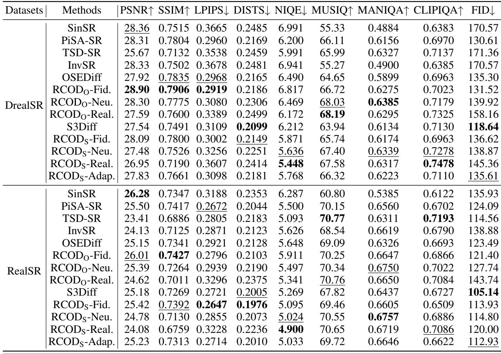
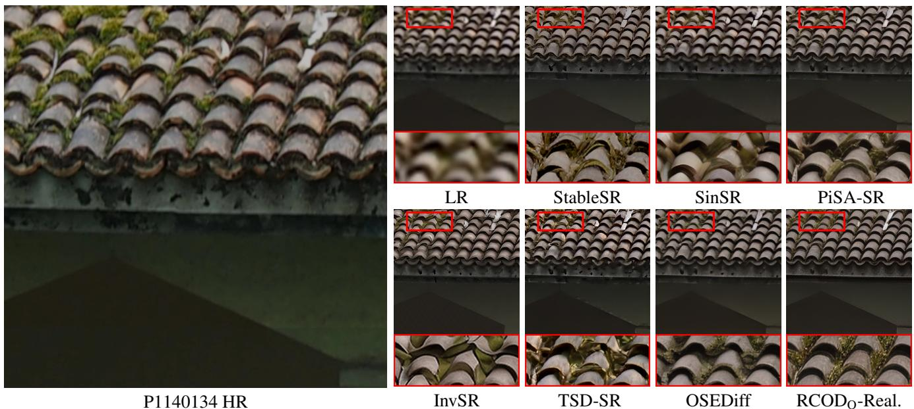

[← 返回 README](../README.md)

# Experiments

## 📌 预览
本节验证方法是否成立，重点看主结果、消融、效率和视觉/病例案例。

---

# Experiments Setups

Datasets: Following the training and testing settings of prior works(Wu et al. 2024b,a; Zhang et al. 2024), we employ LSDIR (Li et al. 2023) and the first 10K face images from FFHQ (Karras, Laine, and Aila 2019) for training and degradation pipeline of Real-ESRGAN (Wang et al. 2021) for LR image synthesizing. The synthetic test data use cropped $5 1 2 \times 5 1 2$ synthetic data from DIV2K-Val (Agustsson and Timofte 2017) and degraded using the Real-ESRGAN pipeline (Wang et al. 2021). The real-world data include LR-HR pairs from RealSR (Cai et al. 2019) and DRealSR (Wei et al. 2020), both with sizes of $1 2 8 \times 1 2 8 .$ - $5 1 2 \times 5 1 2$ for LR-HR pairs.

Evaluation Metrics: We employ widely used FR and NR metrics. FR metrics include PSNR, SSIM (Wang et al. 2004), LPIPS (Zhang et al. 2018a), and DISTS (Ding et al. 2020). NR metrics include NIQE (Zhang, Zhang, and Bovik

> 💡 **批注**: 这是实验证据段：同时看主指标、消融、效率和案例，判断 claim 是否被支撑。

Table S2: Quantitative comparison with state-of-the-art methods on both synthetic and real-world benchmarks. The best and second best results are highlighted in bold and underline, respectively.

> 💡 **批注**: 这是实验证据段：同时看主指标、消融、效率和案例，判断 claim 是否被支撑。

*Table S2: Table S2: Quantitative comparison with state-of-the-art methods on both synthetic and real-world benchmarks. The best and second best results are highlighted in bold and underline, respectively.*

> 💡 **Table S2 批读**: 表格要看主指标、次指标与效率/鲁棒性是否一致支持论文 claim。

2015), MANIQA-pipal (Yang et al. 2022), MUSIQ (Ke et al.   
2021), and CLIPIQA (Wang, Chan, and Loy 2023).

Method Comparison: We compare our method with stateof-the-art methods (SOTA) in three categories: multi-step diffusion Real-ISR methods, including StableSR (Wang et al. 2024a), ResShift (Yue, Wang, and Loy 2023), Diff-BIR (Lin et al. 2023), and SeeSR (Wu et al. 2024b); onestep diffusion Real-ISR methods, such as SinSR (Wang et al. 2024b), OSEDiff (Wu et al. 2024a), S3Diff (Zhang et al. 2024), TSD-SR (Dong et al. 2025), PiSA-SR (default version) (Sun et al. 2025), and InvSR (Yue, Liao, and Loy 2025); and GAN-based methods, including BSR-GAN (Zhang et al. 2021) and Real-ESRGAN (Wang et al. 2021). We quantitatively compare recent SOTA OSD methods in Table S2 on real-world data. More qualitative comparisons and the full table including synthetic data, multi-step diffusion, and GAN-based methods are in SM.

> 💡 **批注**: 这段是 one-step SR 主线：关注效率、保真-真实感权衡、扩散/flow 先验或单步生成路径。

# Implement Details

Model Setting: To verify our framework, we select two types of recent SOTA OSD Real-ISR methods: OSEDiff (Wu et al. 2024a), which is distilled from a pre-trained multi-step Stable Diffusion (SD) model, and S3Diff (Zhang et al. 2024), which directly uses SD-T (a distilled version of SD), as our base models. When RCOD is applied to them, they are named $\mathrm { R C O D _ { O } }$ and $\mathrm { R C O D } _ { \mathrm { S } }$ , respectively. The choice of $n = 3$ corresponds to three distinct generation levels in the inference stage: Fidelity, Neutral, and Realism. i.e, $t \ : = \ : 2 5 0$ , 500, and 750 during inference. Since the S3Diff is not directly distilled from a multi-step diffusion, we do not apply DAS on it. ${ \mathrm { R C O D } } _ { \mathrm { S } }$ -Adap. employs MEM during inference. The input to the MEM in this case is $z _ { L }$ and the features in the last layer degradation estimation model used in (Zhang et al. 2024). The MEM is trained after $\mathrm { R C O D } _ { \mathrm { S } }$ training, utilizing the same training data. More details please refer to SM.

> 💡 **批注**: 这段是 one-step SR 主线：关注效率、保真-真实感权衡、扩散/flow 先验或单步生成路径。

# Comparison with State-of-the-Arts

Quantitative Comparisons: We can observe in Table S2: $i$ ) By applying RCOD, on each dataset, the “-Fid.” versions $( t = 2 5 0$ ) have better full-reference (FR) metrics such as PSNR, SSIM, LPIPS, and FID, while keeping the noreference (NR) metrics relatively ordinary. In contrast, the “- Real.” versions $t = 7 5 0$ ) achieve obviously higher NR metrics like MANIQA, MUSIQ, and CLIPIQA. Most “-Neu.” versions $( t = 5 0 0 )$ ) fall within the middle range of the previous two versions. This illustrates that we can effectively and simply control the realism level (usually measured by perceptual NR metrics) during the inference stage, and that the realism level increases monotonically with the timestep. $i i \ "$ ) $\mathrm { R C O D } _ { \mathrm { S } }$ -Adap. has relatively balanced metrics between $\mathrm { R C O D } _ { \mathrm { S } }$ -Fid. and ${ \mathrm { R C O D } } _ { \mathrm { S } }$ -Neu.. This indicates that most estimated $M _ { L }$ values are closer to 1 than to 0. This roughly matches the cosine similarity value distributions in Fig. S4 (b). iii) When applying RCOD, $\mathrm { R C O D _ { O } }$ -Fid. and $\operatorname { R C O D } _ { \operatorname { S } }$ - Adap. perform better than their original methods (OSEDiff and S3Diff, respectively) on most metrics, including PSNR, SSIM, LPIPS, MANIQA, and MUSIQ. Even with a preference for fidelity in FR metrics, $\mathrm { R C O D _ { O } }$ -Fid. shows superior performance on some NR metrics, such as MANIQA and MUSIQ, compared to the original OSEDiff method on realworld data. Additionally, ${ \mathrm { R C O D } } _ { \mathrm { S } }$ -Real. usually achieves the best NR metrics (NIQE and CLIPIQA). iv) S3Diff shows better performance on the perceptual quality metric DISTS. This may arise from the negative online prompting (NOP) used in training, which provides a more accurate concept of high quality. However, since the text encoder and text prompt are replaced by VPIM in our $\mathrm { R C O D } _ { \mathrm { S } }$ , the NOP is also removed. Despite this, our ${ \mathrm { R C O D } } _ { \mathrm { S } }$ -Adap. performs better on other NR metrics.

> 💡 **批注**: 这段是 one-step SR 主线：关注效率、保真-真实感权衡、扩散/flow 先验或单步生成路径。

*Figure S5: Figure S5: Visual comparison $( \times 4 )$ of $\mathrm { R C O D _ { O } }$ -Real. with other methods on DRealSR data.*

> 💡 **Figure S5 批读**: 这张图通常承担方法框架、动机或视觉对比作用；重点看它支撑的是机制、效果还是局限。

Time Efficiency: In Table S3, we compare inference time and trainable parameters. All methods are tested on an A100 GPU with a $5 1 2 \times 5 1 2$ input image. RCOD keeps similar time efficiency and trainable parameters as the original methods while have higher PSNR and MANIQA. $\mathrm { R C O D _ { O } }$ even inferences faster as the text extractor is removed.

> 💡 **批注**: 这是实验证据段：同时看主指标、消融、效率和案例，判断 claim 是否被支撑。

Qualitative Comparisons: Fig. S5 compares the visual qualities of different Real-ISR methods. $\mathrm { R C O D _ { O } }$ -Real. demonstrates its ability to recover more detailed and natural textures. Fig. S6 illustrates the changes in visual effects as $t$ increases, i.e, from $\mathrm { R C O D } _ { \mathrm { S } }$ -Fid. $( t ~ = ~ 2 5 0 )$ t o ${ \mathrm { R C O D } } _ { \mathrm { S } }$ -Real. $( t ~ = ~ 7 5 0 )$ . As $t$ increases during the inference stage, more skin texture and wrinkles are recovered. ${ \mathrm { R C O D } } _ { \mathrm { S } }$ -Adap. chooses a proper $t = 5 0 0$ in this case, where the $M _ { L }$ range is [0.5, 0.75) according to Eq. 5. The $M _ { L }$ of the LR image (0.621) falls within this range.

> 💡 **批注**: 这段是 one-step SR 主线：关注效率、保真-真实感权衡、扩散/flow 先验或单步生成路径。

Ablation Study We performed a series of ablation studies of the RCOD framework, the details can be found in SM.

> 💡 **批注**: 这是实验证据段：同时看主指标、消融、效率和案例，判断 claim 是否被支撑。

---

## 🔖 Section 总结

### 核心洞察
1. 本节对应论文原始大分节，原文已完整保留。
2. 阅读重点是把本节的机制/证据映射到论文主 claim。
3. 后续如有疑问，可在本 section 继续补充更细批注。
