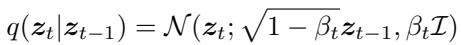
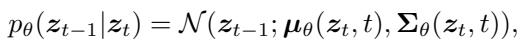
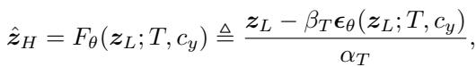
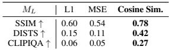
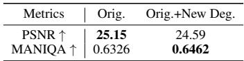
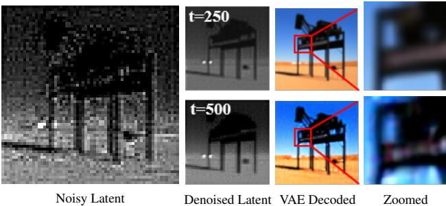
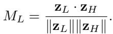
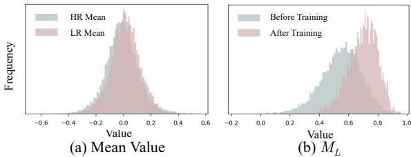

[← 返回 README](../README.md)

# Methodology

## 📌 预览
本节是 RCOD-SR 的核心。按数据流读：LR/HR 经 VAE 得到 latent，先用 cosine similarity 构造退化度量 $M_L$，再由 LDG 把 $M_L$ 离散成 group/timestep；训练时 U-Net 学会不同 denoising degree，蒸馏时 DAS 让 teacher regularization 与 group 对齐，条件端 VPIM 用 LR 视觉 token 替换 text prompt。
---

> 💡 **Q&A 批注记录**:
> - Q: LDG 真正控制的是什么？
> - A: 不是直接控制像素纹理，而是控制 denoising degree：退化越重或选择越偏 realism，模型被引导释放更多生成先验。
> - Q: 为什么 LDG 要放在 latent domain 而不是 pixel domain？
> - A: RCOD 依赖 SD/SD-Turbo 的 latent diffusion U-Net，timestep 控制的是 latent 去噪过程；用 latent 中 LR-HR 的偏离程度做分组，更贴近模型真正处理的表示空间。
> - Q: DAS 和 LDG 的关系是什么？
> - A: LDG 决定 student 当前样本该用哪个 timestep 学，DAS 决定 teacher regularization 在相邻/对应强度采样，避免蒸馏把所有 group 拉成同一个平均风格。

In this section, we first reveal the characteristic of denoising network in one-step diffusion for image super-resolution, and then propose our algorithm.
> 💡 **章节路线**: 作者先解释 one-step denoising network 为什么会因为固定 timestep 失去可调性，再给出 LDG、latent metric、MEM、DAS、VPIM。读法上要持续追踪同一个变量 $t$ 如何从训练分组变成推理控制旋钮。

# Preliminary: The Character of Denoising Network in One-step Diffusion for Real-ISR

In SD, the latent diffusion process starts with encoding an image into a latent representation $z _ { \mathrm { 0 } }$ using a VAE encoder. The forward diffusion process then adds Gaussian noise to $z _ { \mathrm { 0 } }$ over $T$ steps via a Markov chain defined as:
> 💡 **预备知识**: 这段回到标准 latent diffusion：$t$ 不是任意超参，它决定 latent 被加噪后的均值/方差偏离程度。RCOD 后面把 $t$ 借来控制 realism，是建立在这个物理含义上。

*Equation 1: Equation extracted by MinerU.*
> 💡 **公式批读**: Eq. 1 是前向加噪。$t$ 越大，$\alpha_t$ 越小、$\sigma_t$ 越大，latent 越远离原始图像分布；反向去噪时模型越需要依赖生成先验补内容。这正是 fidelity-realism 控制的理论入口。

following a variance schedule $\beta _ { 1 } , \ldots , \beta _ { T }$ . Here $z _ { 0 } \sim q ( z _ { 0 } )$ . The forward process is: $z _ { t } ~ = ~ \alpha _ { t } z _ { 0 } + \sigma _ { t } \epsilon$ , where $\begin{array} { r l } { \alpha _ { t } } & { { } = } \end{array}$ $\textstyle \prod _ { s = 1 } ^ { t } { \sqrt { 1 - \beta _ { s } } }$ , $\sigma _ { t } = \sqrt { 1 - \alpha _ { t } ^ { 2 } }$ , and $\epsilon \sim \mathcal { N } ( \mathbf { 0 } , \mathcal { T } )$ . Here, the mean of ${ \boldsymbol { z } } _ { t }$ becomes $\alpha _ { t } z _ { 0 }$ , and the variance is $\sigma _ { t } ^ { 2 } \mathcal { T }$ . With larger $t$ , more noise is added, resulting in a greater deviation of the mean (scaled by $\alpha _ { t } < 1 $ ) and an increased variance $( \sigma _ { t } ^ { 2 } )$ , distancing ${ \boldsymbol { z } } _ { t }$ from the original distribution $z _ { \mathrm { 0 } }$ .
> 💡 **机制批读**: 这里要抓住“更大 $t$ = 更大偏离 = 更强生成自由度”。RCOD 的假设是：低退化/重保真样本可用较小 denoising degree，高退化/重真实感场景可用较大 denoising degree。

The reverse process denoises ${ \boldsymbol { z } } _ { t }$ to recover $z _ { t - 1 }$
> 💡 **反向过程**: 多步 diffusion 通过逐步去噪自然拥有多个控制点；one-step 把这些控制点压成一次预测，所以需要重新设计 $t$ 的训练语义。

*Equation 2: Equation extracted by MinerU.*
> 💡 **公式批读**: Eq. 2 表示反向一步的条件高斯分布，U-Net 通过预测噪声决定均值/方差。RCOD 后面并不改 diffusion 基本形式，而是改变 U-Net 看到的 timestep 条件与蒸馏采样。

where a time-conditional U-Net $\epsilon _ { \theta }$ predicts the noise $\epsilon$ to estimate $\pmb { \mu } _ { \theta }$ and $\Sigma _ { \theta }$ . Multi-step diffusion models iteratively refine $z _ { T }$ back to $z _ { \mathrm { 0 } }$ over $T$ steps, while one-step diffusion methods, often distilled from multi-step models, predict the clean data directly from $z _ { T }$ in a single step, significantly reducing computation.
> 💡 **OSD 代价**: 单步预测把计算量降下来了，但也把多步过程中逐步调整噪声强度的路径压缩掉了。RCOD 后面的做法可以理解为：在单次 U-Net 调用中保留一个可解释的 timestep 条件。

For Real-ISR tasks using SD-based OSD methods like $\mathrm { W u }$ et al. 2024a), the process from LR latent features $z _ { L }$ to HR latent features $\hat { z } _ { H }$ is formulated as a one-step denoising process:
> 💡 **SR 化公式**: 这里把标准 diffusion 映射到 Real-ISR：输入不再是纯噪声，而是 LR latent $z_L$；输出是估计的 HR latent $\hat z_H$。因此 fidelity 风险会直接体现在 $z_L \to \hat z_H$ 的结构保持上。

*Equation 3: Equation extracted by MinerU.*
> 💡 **公式批读**: Eq. 3 是 vanilla OSD 的核心映射：$\hat z_H = F_\theta(z_L; T, c_y)$。问题恰在 $T$ 固定，所有退化样本共享同一个 denoising degree，推理时也没有 realism slider。

where $z _ { L }$ is the LR latent representation, $c _ { y }$ is the text embedding, and $\epsilon _ { \theta }$ is the denoising network predicting noise at timestep $T$ . As shown in Fig. S2(a), vanilla OSD methods learn a direct latent feature mapping from LR to HR images with or without adding additional noise.
> 💡 **固定条件问题**: $c_y$ 是语义条件，$T$ 是去噪强度条件。若 $T$ 不随退化/场景变化，模型很容易把多种退化学习成一个平均恢复策略。

In Real-ISR, images exhibit diverse degradation types and levels. SD-based methods use powerful generative image priors to recover LR images. However, OSD typically trains on all data with a fixed timestep $T$ with a constant noise level. This results in a model that generates a uniform amount of detail and converges to a confined domain, which may not suit images with varying degradation severity. Tab. S1 (a) demonstrates the results of training OSEDiff on two different degradation pipelines (DP). ‘Orig. $^ +$ New Deg.’ denotes a DP applying more degradations than the standard DP (‘Orig.’). It indicates that higher degradation in training results in a greater emphasis on realism. This exposes OSD’s flaw: by locking training to a single fixed T, the model optimizes for an “average” degradation, yielding a limited generation flexibility that struggles to adapt its output to meet the specific scenario requirements.
> 💡 **核心瓶颈**: 固定 timestep 训练会把不同退化样本压到同一个映射里，模型学到的是平均偏好，而不是可按图像/用户需求调节的策略。

In contrast, multi-step diffusion models provide greater flexibility in SR tasks. By selecting different timesteps $t$ during the inference stage, these models control the degree of noise adding and removing in diffusion, balancing fidelity and realism effectively.
> 💡 **对照基线**: 多步模型的可控性来自 noise schedule/采样步数；RCOD 的目标是把这种可控性压缩成 one-step 模型里的一个可选 timestep。

Therefore, to overcome the inherent limitation of OSD, which is incapable of adjusting its generation levels to adapt to varying scenarios, we propose a novel training strategy for real-world SR applications that can flexibly control the generation realism during the inference stage.
> 💡 **方法目标**: 关键不是训练时自动适应退化就结束，而是推理时用户/应用可以指定 $t$，从而选择更保真或更真实的输出。

*Table extracted: Table extracted by MinerU. ML L1 MSE Cosine Sim. SSIM ↑ 0.60 0.54 0.78 DISTS ↑ 0.15 0.11 0.42 CLIPIQA ↑ 0.06 0.05 0.27*
> 💡 **表格批读**: 这个 MinerU 表格对应 Table S1(b) 的距离度量比较。Cosine similarity 与 SSIM/DISTS/CLIPIQA 的 Spearman 相关更高，是作者选择它作为 $M_L$ 的证据。

Table S1: (a) Influence of degradation degree in training data. (b) |Spearman coefficient| $\uparrow$ comparison of different $M _ { L }$ distances and image quality metrics.
> 💡 **表格批读**: Table S1(a) 证明训练退化强度会改变模型偏好，支撑“平均退化”诊断；Table S1(b) 证明 cosine similarity 比 L1/MSE 更适合作为 latent degradation metric。

*Table S1: Table S1: (a) Influence of degradation degree in training data. (b) |Spearman coefficient| $\uparrow$ comparison of different $M _ { L }$ distances and image quality metrics.*
> 💡 **证据批读**: 这张表是方法合理性的前置证据，不是最终性能表。它回答两个问题：退化强度是否真的影响 OSD 的生成倾向，$M_L$ 是否能排序这种退化差异。

*Figure S3: Figure S3: Influence of different timesteps $t$ using SD-turbo.*
> 💡 **Figure 批读**: 这类曲线直接展示 fidelity-realism trade-off：PSNR 下降但 MUSIQ/真实感上升时，说明生成先验正在替代保真约束。

# Latent Domain Grouping
> 💡 **小节预览**: LDG 是 RCOD 的核心：把退化严重度从“不可见变量”变成 timestep/group 条件，推理时才能调 realism。

To achieve dynamic fidelity-realism trade-offs control in OSD generated SR results, we focus on the most basic condition in denoising network, i.e, timestep condition. Unlike prompts from a text encoder or a vision encoder, the timestep condition is an unremovable component in the diffusion process. At the same time, it controls the mean and variance of noisy latent feature $z _ { T }$ . With the larger mean and variance difference between $z _ { T }$ and $z _ { \mathrm { 0 } }$ , more contents will be generated during the denoising process. Fig. S3 shows an example of influence of different $t$ . In the foundational model SDturbo, the higher timestep value during the diffusion process usually reflects the the higher capability generating.
> 💡 **LDG 入口**: 作者选择 timestep 而不是 prompt 做控制变量，因为 timestep 是 diffusion 去噪网络的内生条件。直觉上，$t$ 越高，模型越多依赖生成先验，realism 越强但 fidelity 风险也越高。

Therefore, to easily control the generation degree, we propose a latent domain grouping (LDG) strategy. Recall Eq. (3), we do not use a single fixed timestep $T$ , but choose a timestep $t$ according to a metrics:
> 💡 **LDG 定义**: LDG 的本质是把“样本退化程度”变成“训练时的 timestep 条件”。这一步把不可控的 fixed $T$ 改成 sample-specific $t$。

*Equation 4: Equation extracted by MinerU.*
> 💡 **公式批读**: Eq. 4 把 $M_L$ 离散到 $n$ 个 group，再映射到间隔为 $k$ 的 timestep。它不是连续估计退化，而是构造几个可训练稳定的 realism 档位。

where $M _ { L }$ denotes a latent metric that can perceive the “level of degradation” of features in latent domain, $M _ { L \mathrm { - m i n } }$ is the minimum value of $M _ { L }$ in training data, $k$ is interval of timestep, $\lfloor . \rfloor$ denotes the maximum integer no larger than the entry inside, $n$ is number of groups for timestep.
> 💡 **超参含义**: $n$ 决定控制档位数量，$k$ 决定档位间 timestep 间隔。档位越多不一定越好，因为高退化/高 $t$ 分组可能样本不足，附录里 $n=4$ 的消融会验证这一点。

To employ this strategy both on SD and distillation version of SD, i.e, SD-Turbo (SDT), which distilled a four specific steps from the original 1000-step diffusion process, we set $n$ to be $\leq 4$ and $k = 2 5 0$ .
> 💡 **底座约束**: 这里说明 LDG 不是无限细的 slider。由于 SD-Turbo 只保留 4 个特定步，$n \leq 4$、$k=250$ 是为了兼容 SD 与 SD-Turbo 的 timestep 语义。

By the grouping strategy, denoising network can learn different degrees of generation according to timestep. In the training stage, grouping is based on the $M _ { L }$ described in the next subsection. In the inference stage, we can easily choose a timestep to control the level of realism for SR in different scenarios. Furthermore, due to our grouping strategy, the realism level increases monotonically with the timestep.
> 💡 **推理控制**: 训练时 $t$ 来自 $M_L$，推理时 $t$ 可以由用户指定。这是 RCOD 的关键可用性：不必重新训练或切模型，就能在 fidelity/neutral/realism 档之间切换。

# Latent Metric for Denoising Network

The latent metric $M _ { L }$ is designed to enable the denoising network in the latent domain to perceive the “level of degradation” of the low-resolution features $\mathbf { z } _ { L }$ . Here, we define the “level of degradation” as the extent to which $\mathbf { z } _ { L }$ deviates from its HR counterpart $\mathbf { z } _ { H }$ . Thus, the definition of the latent metric $M _ { L }$ should reflect the characteristics of $\mathbf { z } _ { L }$ that indicate this degradation.
> 💡 **度量定义**: $M_L$ 的监督来自训练对中的 LR/HR latent 差异。它不是无参考质量分数，而是“LR latent 相对 HR latent 偏离多少”的训练期 proxy。

A simple choice might be to use the difference between the mean values of $\mathbf { z } _ { L }$ and $\mathbf { z } _ { H }$ , as the forward diffusion process scales the mean of $\mathbf { z } _ { L }$ over time. However, as shown in Fig. S4(a), the mean values of $\mathbf { z } _ { L }$ and $\mathbf { z } _ { H }$ are similar across the training data. This suggests that mean difference fails to effectively capture the degradation level.
> 💡 **反例批读**: 均值差不好用，因为 VAE latent 的全局均值对退化不敏感。若用这个度量分组，group 可能只是噪声，不会形成稳定的 denoising degree。

Instead, we use cosine similarity (CS) as $M _ { L }$ :

*Equation 5: Equation extracted by MinerU.*
> 💡 **公式批读**: Eq. 5 用 cosine similarity 衡量 $z_L$ 和 $z_H$ 的方向一致性。方向偏离比均值或逐点误差更能反映高维语义/结构退化，所以更适合做分组依据。

Cosine similarity is a widely adopted measure in representation learning (e.g., contrastive learning (Chen et al. 2020)). It can quantify the divergence between high-dimensional latent features $\mathbf { z } _ { L }$ and $\mathbf { z } _ { H }$ , which can reflect high-level changes caused by degradation. As shown in Fig. S4(b), most cosine similarity values lie between 0 and 1, providing a clear range to distinguish varying degrees of degradation for the denoising network.
> 💡 **度量批注**: Cosine similarity 分布在 0 到 1 之间，方便离散成 group；但它仍是假设全图退化可以用一个标量概括，局部退化不均匀时会有信息损失。

*Figure S4: Figure S4: Distribution of (a) mean value of LR and HR training images in the latent domain, (b) the $M _ { L }$ metric in nc y the latent domain of VAE before and after training.*
> 💡 **Figure 批读**: Fig. S4(a) 说明均值不能区分退化；Fig. S4(b) 说明训练前后 $M_L$ 分布虽有轻微偏移但大体稳定。这个稳定性很重要，因为 LDG 依赖 $M_L$ 分组不被训练过程破坏。

Value ValueDifferent distances inherently introduce a certain preference or bias, to evaluate the bias of different $M _ { L }$ , we calculate correlation coefficient (|Spearman Corr.| ↑) of CS, L1, and MSE with different metrics in Table S1 (b). The metrics are calculated between LR and HR images. The correlation reflects the degree of association between various $M _ { L }$ and different metrics. CS exhibits a higher correlation coefficient with objective (SSIM), perceptual (DISTS), and semantic (CLIPIQA) metrics compared to other distances in latent space. More visualization results can be seen in Supplementary Materials (SM).
> 💡 **指标批注**: 这里用 Spearman 相关而不是直接回归质量，说明作者更关心排序能力：只要 $M_L$ 能把退化程度大致排出来，就可以服务于 LDG 分组。

# Metric Estimation

Since $\mathbf { z } _ { H }$ is introduced as a latent metric, we can only calculate it during training. In the inference stage, beyond manually choosing a timestep, we also consider an adaptive timestep selection, i.e., estimating an $M _ { L }$ for each LR image. Benefiting from the powerful representation ability of the pre-trained model, we use features from intermediate layers as input and a simple MLP as a metric estimation module (MEM), operating independently of OSD training.
> 💡 **MEM 批注**: 推理时没有 HR，所以不能直接算 $M_L(z_L,z_H)$。MEM 是一个退化度量估计器，用 LR/中间特征预测 group；它提供自动档，但论文也保留用户手动选 $t$ 的控制接口。

# Degradation-aware Sampling Distillation
> 💡 **小节预览**: DAS 负责让 teacher regularization 的强度跟 LDG 对齐，避免蒸馏目标把所有样本拉回同一个平均风格。

Previous VSD method for SR (Wu et al. 2024a), utilizes the regularization network (a pre-trained SD) that sampled timesteps across a wide range (20-980). This aims to generate regularization latent features and, in turn, optimize the distribution of the OSD network. However, to better integrate the distillation process with the concept of degradation in the latent space, we propose a Degradation-Aware Sampling (DAS) strategy. DAS redefines how timesteps are sampled in the pre-trained model, adaptively aligning this process with our LDG framework to provide explicit control over regularization strength. The DAS can be written as:
> 💡 **DAS 批注**: 原 VSD 在大范围随机采样 teacher timestep，适合给 student 提供分布正则，但不关心当前样本属于哪个退化 group。DAS 的作用是让正则强度随 LDG 的 $t$ 变化，避免 teacher 把不同 realism 档又拉回平均。

*Equation 6: Equation extracted by MinerU.*
> 💡 **公式批读**: Eq. 6 给 regularization network 采样 $t_r$。它不是重新定义 student 的 $t$，而是规定 teacher/regularizer 在与 LDG 对应的区间取样，从蒸馏侧保持分组差异。

where $t _ { r }$ is the sample timestep for regularization network, $t$ is the chosen timestep in OSD network by LDG, $S ( t _ { m i n } , t _ { m a x } )$ denotes uniformly random sampling of an integer from the range $[ t _ { m i n } , t _ { m a x } ]$ .
> 💡 **变量关系**: $t$ 是 student/OSD 的当前档位，$t_r$ 是 regularization teacher 的采样步。DAS 让两者相关，而不是独立随机。

By applying DAS, the degradation grouping information is delivered from LDG, thereby aligning this process with LDG and control over regularization strength.
> 💡 **蒸馏闭环**: 这句是 LDG-DAS 闭环：LDG 产生分组，DAS 把分组传到蒸馏正则。没有 DAS，模型可能训练时看到了不同 $t$，但正则目标仍不给这些 $t$ 明确分工。

# Visual Prompt Injection Module
> 💡 **小节预览**: VPIM 解决 text prompt 与退化图像不匹配的问题，把当前 LR 图像线索转成视觉条件。

In previous SD-based super-resolution (SR) methods like OSEDiff (Wu et al. 2024a) and SeeSR (Wu et al. 2024b), text encoders, sometimes paired with a vision-language model (VLM) as a text prompt extractor, improve non-reference (NR) metrics, which assess realism, but often constrain fullreference (FR) metrics, which assess fidelity to the ground truth. This trade-off arises because text prompts provide high-level semantic guidance to enhance realism, yet they may compromise structural accuracy.
> 💡 **语义对齐批注**: SR 里的 prompt 不是越强越好，关键是让文本对应到正确图像区域；否则生成先验会把细节画错对象。

LR feature $\mathbf { z } _ { L }$ solely from the VAE encoder offers limited semantic information. Without additional context, the conditioned U-Net struggles to generate high-quality outputs. Text prompts attempt to bridge this gap by injecting external semantic cues, but they come with drawbacks: VLMs increase computational costs, and the prompts may not fully align with the image’s content. Some methods like S3Diff (Zhang et al. 2024) use fixed text to reduce complexity, yet still struggle to balance NR and FR metrics.
> 💡 **Prompt 风险**: 文本 prompt 能增强语义，但 SR 需要对齐当前图像细节。外部 VLM 可能慢，固定 prompt 又太粗；二者都可能让生成先验画出“看似合理但不属于输入”的细节。

To address these issues, we propose the Visual Prompt Injection Module (VPIM), which replaces conventional text prompts with degradation-aware visual tokens. VPIM substitutes the text encoder (typically a CLIP text model) with a CLIP vision model and an MLP layer for dimension alignment. The LR image serves as its input, i.e, visual prompt, and the output is fed into the cross-attention of the U-Net. By adopting VPIM, we eliminate the need for VLMs, reduce computational overhead, and provide the U-Net with image-specific semantic information directly from the LR input. The visual prompt is tied to the image’s pixel characteristics, leading to improvement in both fidelity and realism.
> 💡 **VPIM 批注**: VPIM 把条件从外部文本转成图像驱动 token，适合 Real-ISR：退化、纹理和语义都在 LR 图里，而不一定在 prompt 里。

With the combination of LDG, latent metric, DAS, and VPIM, we proposed a Realism control one-step diffusion (RCOD) framework, a realism-flexible one-step diffusion model with enhanced performance that can be applied to various recent mainstream one-step diffusion Real-ISR methods, thereby improving their capabilities. We provide a pseudo-code example of our RCOD in SM.
> 💡 **整体批读**: 方法闭环是：$M_L$ 估计退化，LDG 把退化映射到 $t$，DAS 让蒸馏强度跟 $t$ 对齐，VPIM 给 U-Net 图像相关条件。这样 RCOD 才能既保持单步推理，又在推理时用 $t$ 控制 fidelity-realism。

---

## 🔖 Section 总结

### 关键数字速查
| 指标 | 数值 |
|------|------|
| 输入 | 真实退化 LR image + 可选 realism 控制强度 |
| 核心模块 | LDG / DAS / VPIM |
| 输出 | 可按 realism level 调节的 SR image |

### 核心洞察
1. 固定 timestep 问题是方法设计的起点：所有退化共享 $T$ 会学成单一生成偏好。
2. LDG 的核心假设是 cosine similarity 能在 latent domain 中排序退化严重度；这个假设决定控制是否单调可靠。
3. DAS 是防止蒸馏破坏 LDG 的关键，VPIM 是防止 prompt 条件与 LR 图像脱节的关键。
4. 推理阶段可手动选 $t$，也可用 MEM 自动估计；二者分别对应用户控制和自适应控制。

### 可追问点
- 为什么单步 SR 难以控制 realism？
- LDG 真正控制的是什么？
- $M_L$ 在没有 HR 的真实测试图上如何使用？
- 为什么 $n=4$ 不一定比 $n=3$ 好？
