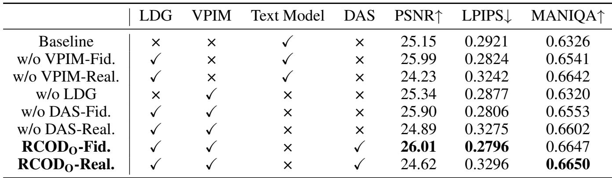
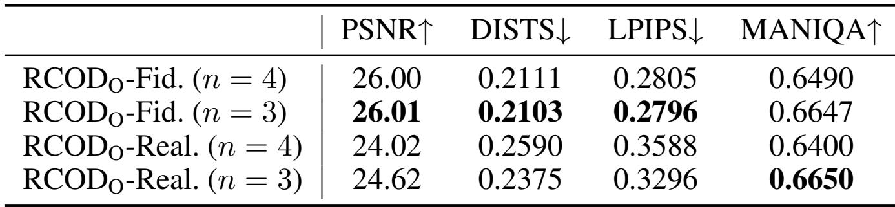
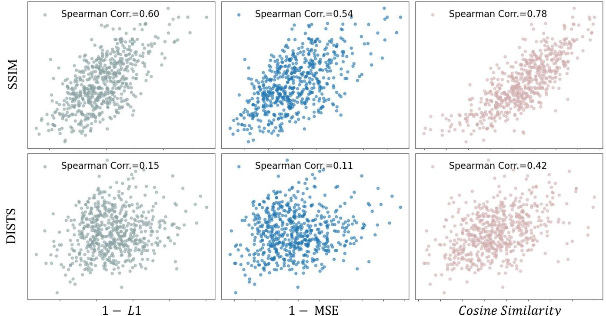

[← 返回 README](../README.md)

# Appendix

## 📌 预览
附录通常包含实现细节、额外实验和推导，是复现与查漏的重点。

---

# Supplementary Material for “Realism Control One-step Diffusion for Real-World Image Super-Resolution”

# In the supplementary material, we provide the following contents:

• Algorithm Details: Pseudo-code of our RCODO training strategy (referring to Section Methodology in the main paper).   
• Implement Details: Hyper-parameters setting and experimental environments (As a complement to Section Implement Details in the main paper).   
• Experiments: Full table of quantitative comparisons and more visual Comparisons (as a complement to Section Experiments in the main paper).   
• Ablation Study (referring to Section Ablation Study in the main paper).

> 💡 **列表批读**: 这组条目通常是在列贡献、设置、发现或模块；建议逐条对应到论文 claim。

# Implement Details

Training: The training takes over $3 0 \mathrm { k }$ iterations, with a batch size of 4 and a learning rate of $\mathrm { 2 e ^ { - 5 } }$ . We adopted LoRA for fine-tuning. Follow the original setting $\mathrm { W u }$ et al. 2024a; Zhang et al. 2024), for $\mathrm { R C O D } _ { \mathrm { S } }$ , the rank parameter in LoRA is set as 16 for the VAE encoder and 32 for the diffusion UNet, respectively. For $\mathrm { R C O D _ { O } }$ , all rank is set to 4.

> 💡 **批注**: 这段是 one-step SR 主线：关注效率、保真-真实感权衡、扩散/flow 先验或单步生成路径。

Hardware and Software Environments: We train and test our model on NVIDIA A100 GPU. The amount of training memory is about $2 8 \ \mathrm { G B }$ with batch size 1 using $\mathrm { R C O D _ { O } }$ . We use a Linux system with pytorch version 2.4.

> 💡 **批注**: 这段是 latent memory / medical VLM 主线：关注视觉证据如何进入 latent space、如何被记忆/更新/调用，以及是否能支撑可靠诊断。

# Algorithm Details

Pseudo-code The pseudo-code of our RC-OSD training strategy is summarized as Algorithm 1. In inference stage, we do not need to compute $M _ { L }$ . Instead, we directly calculate $\hat { z } _ { H } = F _ { \theta } ( z _ { L } ; t , c _ { y } )$ , where $t$ a user-specified parameter that controls the level of realism for SR output. The choice of $t$ depends on the different application scenarios and is discussed in Subsection “Latent Domain Grouping”.

> 💡 **批注**: 这段是 one-step SR 主线：关注效率、保真-真实感权衡、扩散/flow 先验或单步生成路径。

# Experiments

Quantitative Comparisons: We quantitatively compare recent SOTA SR methods in Table S4 including synthetic and real-world data, multi-step diffusion, and GAN-based methods. Compared with multi-step diffusion methods, our methods demonstrate better NR metrics and perceptual FR metrics across three datasets. Furthermore, their FR fidelity metrics are more competitive with those of multi-step diffusion methods when compared to other OSD methods. On the DrealSR dataset, $\mathrm { R C O D _ { O } }$ -Fid. can even surpass some multistep diffusion methods in many FR metrics (PSNR, SSIM, and LPIPS) and NR metrics (MUSIQ, MANIQA, and CLIP-IQA).

> 💡 **批注**: 这段是 one-step SR 主线：关注效率、保真-真实感权衡、扩散/flow 先验或单步生成路径。

Qualitative Comparisons: We conduct more qualitative comparisons in Fig. S7. On Sony 0049 (DRealSR), $\mathrm { R C O D _ { O } }$ -Fid. shows fewer artefacts of handrail than other OSD methods. On Nikon 047 (RealSR) and 0802 pch 00007 (DIV2K), $\mathrm { R C O D _ { O } }$ -Real. and $\mathrm { R C O D } _ { \mathrm { S } }$ - Real. both generate more detailed textures than other OSD methods.

> 💡 **批注**: 这是实验证据段：同时看主指标、消融、效率和案例，判断 claim 是否被支撑。

# Ablation Study

Effectiveness of VPIM and DAS: To validate the effectiveness of VPIM, we perform ablation studies by replacing the VLM and text encoder (“Text Model”) with VPIM in Table S5 for the “w/o VPIM-Fid.” and “w/o VPIM-Real.” configurations. We observe that both configurations achieve better PSNR, LPIPS, and MANIQA scores than the baseline (the original OSEDiff). This indicates that VPIM provides not only sufficient semantic information but also fidelity information from LR images. By removing DAS during distillation, as implemented in the w/o DAS-Fid.” and w/o DAS-Real.” configurations, we observe that DAS amplifies the performance gap between the fidelity-oriented and realism-oriented configurations. The fidelity-oriented variant achieves higher PSNR and lower LPIPS, while the realism-oriented variant yields higher MANIQA scores—indicating improved realism. This divergence in evaluation metrics demonstrates that DAS effectively enhances LDG’s ability to decouple fidelity preservation from realism generation, enabling finer control over the fidelity–realism trade-off through adaptive timestep regularization.

> 💡 **批注**: 这段是 one-step SR 主线：关注效率、保真-真实感权衡、扩散/flow 先验或单步生成路径。

Choice of $n$ : As mentioned in section “Latent Domain Grouping”, $n$ can only be $\leq 4$ . For sufficient flexibility, we

*Table extracted: Table extracted by MinerU. Datasets Type Methods |PSNR↑ SSIM↑ LPIPS↓ DISTS↓ NIQE↓ MUSIQ↑ MANIQA↑ CLIPIQA↑ DIV2K-Val Non-Diff. BSRGANReal-ESRGAN 24.580.62690.33510.22754.752 61.20 0.5071 0.524724.290.63710.31*

> 💡 **Table extracted 批读**: 表格要看主指标、次指标与效率/鲁棒性是否一致支持论文 claim。

Table S4: Quantitative comparison with state-of-the-art methods on both synthetic and real-world benchmarks. The best and second best results within both multi-step and one-step diffusion-based methods are highlighted in red and blue, respectively.

> 💡 **批注**: 这段是 one-step SR 主线：关注效率、保真-真实感权衡、扩散/flow 先验或单步生成路径。

*Figure S7: Figure S7: Visual comparison $( \times 4 )$ on RealSR (Nikon 047), DRealSR (Sony 49), and DIV2K (0802 pch 00007) data.*

> 💡 **Figure S7 批读**: 这张图通常承担方法框架、动机或视觉对比作用；重点看它支撑的是机制、效果还是局限。

*Table extracted: Table extracted by MinerU. TOhal0 VPIM Y , training iteration N iz ← LRA;←RA ← parameters Yθ ← Yφ; random initialize trainable parameters MLPθ 2 for i ← 1 to N do 3 Sample low-resolution image x L and corres*

> 💡 **Table extracted 批读**: 表格要看主指标、次指标与效率/鲁棒性是否一致支持论文 claim。

16 end Output: Trained generator $G _ { \theta }$

consider $n \geq 3 .$ . Therefore, we compare the training results for $n = 3$ and $n = 4$ in Table S6. We find that $\mathrm { R C O D _ { O } }$ -Real. $\mathit { n } = 4$ ) performs much worse than $\mathrm { R C O D _ { O } }$ -Real. $( n = 3$ ). To explain this phenomenon, we visualize the training data distribution for the two choices in Fig. S8. We observe that there is too little data for training at large $t$ (when $M _ { L }$ is small). Thus, we finally choose $n = 3$ for our experiment.

> 💡 **批注**: 这是实验证据段：同时看主指标、消融、效率和案例，判断 claim 是否被支撑。

Robustness of $M _ { L }$ : Due to the encoder of the VAE being trainable in most SD-based method settings, we consider a domain shift phenomenon during training: the distribution of $M _ { L }$ may change after training. Therefore, we compare the $M _ { L }$ values of the entire training dataset before and after training in main manuscript Fig. 4 (b). The histogram shows a slight shift in the metric, with values becoming closer to larger similarities, but the overall distribution remains similar. This indicates that even though the model aligns the feature domains of LR and HR, $M _ { L }$ retains its robustness in measuring the divergence in the latent domain.

> 💡 **批注**: 这段是 one-step SR 主线：关注效率、保真-真实感权衡、扩散/flow 先验或单步生成路径。

Correlation of $M _ { L }$ and image quality: In Table 1(b) in main manuscript, we calculate |Spearman coefficient| $\uparrow$ of different $M _ { L }$ and image quality metrics (which are calculated by LR and HR images). Fig. S9 visualize the correlation of randomly selected 600 points. We can find that cosine similarity exhibits a higher correlation coefficient with image quality metrics compared to other distances.

> 💡 **批注**: 这是实验证据段：同时看主指标、消融、效率和案例，判断 claim 是否被支撑。

*Figure S8: Figure S8: Distribution of (a) mean value of LR and HR training images in the latent domain, (b) the $M _ { L }$ metric in the latent domain of VAE before and after training.*

> 💡 **Figure S8 批读**: 这张图通常承担方法框架、动机或视觉对比作用；重点看它支撑的是机制、效果还是局限。

# References

Agustsson, E.; and Timofte, R. 2017. Ntire 2017 challenge on single image super-resolution: Dataset and study. In CVPRW, 126–135.

> 💡 **批注**: 这段是 one-step SR 主线：关注效率、保真-真实感权衡、扩散/flow 先验或单步生成路径。

Cai, J.; Zeng, H.; Yong, H.; Cao, Z.; and Zhang, L. 2019. Toward real-world single image super-resolution: A new benchmark and a new model. In ICCV, 3086–3095.

> 💡 **批注**: 这段是 one-step SR 主线：关注效率、保真-真实感权衡、扩散/flow 先验或单步生成路径。

Chen, B.; Li, G.; Wu, R.; Zhang, X.; Chen, J.; Zhang, J.; and Zhang, L. 2025. Adversarial diffusion compression for real-world image super-resolution. In CVPR, 28208–28220.

> 💡 **批注**: 这段是 one-step SR 主线：关注效率、保真-真实感权衡、扩散/flow 先验或单步生成路径。

Chen, J.; Pan, J.; and Dong, J. 2025. Faithdiff: Unleashing diffusion priors for faithful image super-resolution. In CVPR, 28188–28197.

> 💡 **批注**: 这段是 one-step SR 主线：关注效率、保真-真实感权衡、扩散/flow 先验或单步生成路径。

Table S5: Ablation study of modules. The best results are highlighted in bold.

*Table S5: Table S5: Ablation study of modules. The best results are highlighted in bold.*

> 💡 **Table S5 批读**: 表格要看主指标、次指标与效率/鲁棒性是否一致支持论文 claim。

*Table extracted: Table extracted by MinerU. PSNR↑ DISTS↓ LPIPS↓ MANIQA↑ RCODo-Fid. (n = 4) 26.00 0.2111 0.2805 0.6490 RCODo-Fid. (n = 3) 26.01 0.2103 0.2796 0.6647 RCODo-Real. (n = 4) 24.02 0.2590 0.3588 0.6400 RCODo-Real. (*

> 💡 **Table extracted 批读**: 表格要看主指标、次指标与效率/鲁棒性是否一致支持论文 claim。

Table S6: Ablation study of grouping strategy. The best results are highlighted in bold.

Chen, T.; Kornblith, S.; Norouzi, M.; and Hinton, G. 2020. A simple framework for contrastive learning of visual representations. In ICML, 1597–1607.

Ding, K.; Ma, K.; Wang, S.; and Simoncelli, E. P. 2020. Image quality assessment: Unifying structure and texture similarity. IEEE PAMI, 44(5): 2567–2581.

Dong, C.; Loy, C. C.; He, K.; and Tang, X. 2015. Image super-resolution using deep convolutional networks. IEEE transactions on pattern analysis and machine intelligence, 38(2): 295–307.

> 💡 **批注**: 这段是 one-step SR 主线：关注效率、保真-真实感权衡、扩散/flow 先验或单步生成路径。

Dong, L.; Fan, Q.; Guo, Y.; Wang, Z.; Zhang, Q.; Chen, J.; Luo, Y.; and Zou, C. 2025. Tsd-sr: One-step diffusion with target score distillation for real-world image superresolution. In CVPR, 23174–23184.

> 💡 **批注**: 这段是 one-step SR 主线：关注效率、保真-真实感权衡、扩散/flow 先验或单步生成路径。

Ho, J.; Jain, A.; and Abbeel, P. 2020. Denoising diffusion probabilistic models. In NeurIPS.

Hu, E. J.; Shen, Y.; Wallis, P.; Allen-Zhu, Z.; Li, Y.; Wang, S.; Wang, L.; and Chen, W. 2022. Lora: Low-rank adaptation of large language models. In ICLR.

> 💡 **批注**: 这段是 one-step SR 主线：关注效率、保真-真实感权衡、扩散/flow 先验或单步生成路径。

Ignatov, A.; Kobyshev, N.; Timofte, R.; Vanhoey, K.; and Van Gool, L. 2017. Dslr-quality photos on mobile devices with deep convolutional networks. In ICCV.

Ji, X.; Cao, Y.; Tai, Y.; Wang, C.; Li, J.; and Huang, F. 2020. Real-world super-resolution via kernel estimation and noise injection. In CVPRW.

> 💡 **批注**: 这段是 one-step SR 主线：关注效率、保真-真实感权衡、扩散/flow 先验或单步生成路径。

Karras, T.; Laine, S.; and Aila, T. 2019. A style-based generator architecture for generative adversarial networks. In CVPR.

Ke, J.; Wang, Q.; Wang, Y.; Milanfar, P.; and Yang, F. 2021. Musiq: Multi-scale image quality transformer. In ICCV. Kim, J.; Kwon Lee, J.; and Mu Lee, K. 2016. Accurate image super-resolution using very deep convolutional networks. In CVPR.   
Ledig, C.; Theis, L.; Huszar, F.; Caballero, J.; Cunningham, ´ A.; Acosta, A.; Aitken, A.; Tejani, A.; Totz, J.; Wang, Z.; et al. 2017. Photo-realistic single image super-resolution using a generative adversarial network. In CVPR, 4681–4690. Li, Y.; Zhang, K.; Liang, J.; Cao, J.; Liu, C.; Gong, R.; Zhang, Y.; Tang, H.; Liu, Y.; Demandolx, D.; et al. 2023. Lsdir: A large scale dataset for image restoration. In CVPR, 1775–1787.   
Liang, J.; Cao, J.; Sun, G.; Zhang, K.; Van Gool, L.; and Timofte, R. 2021. Swinir: Image restoration using swin transformer. In ICCV.   
Lin, X.; He, J.; Chen, Z.; Lyu, Z.; Fei, B.; Dai, B.; Ouyang, W.; Qiao, Y.; and Dong, C. 2023. Diffbir: Towards blind image restoration with generative diffusion prior. arXiv preprint arXiv:2308.15070.   
Liu, A.; Liu, Y.; Gu, J.; Qiao, Y.; and Dong, C. 2022. Blind image super-resolution: A survey and beyond. IEEE PAMI, 45(5): 5461–5480.   
Meng, C.; Rombach, R.; Gao, R.; Kingma, D.; Ermon, S.;

> 💡 **批注**: 这段是 one-step SR 主线：关注效率、保真-真实感权衡、扩散/flow 先验或单步生成路径。

*Figure S9: Figure S9: Visualization of |Spearman coefficient| $\uparrow$ of different $M _ { L }$ distances and image quality metrics.*

> 💡 **Figure S9 批读**: 这张图通常承担方法框架、动机或视觉对比作用；重点看它支撑的是机制、效果还是局限。

Ho, J.; and Salimans, T. 2023. On distillation of guided diffusion models. In CVPR, 14297–14306.

Q Nguyen, T. H.; and Tran, A. 2024. Swiftbrush: One-step Ptext-to-image diffusion model with variational score distil-Llation. In CVPR.   
Rombach, R.; Blattmann, A.; Lorenz, D.; Esser, P.; and Ommer, B. 2022. High-resolution image synthesis with latent diffusion models. In CVPR, 10684–10695.   
Salimans, T.; and Ho, J. 2022. Progressive distillation ?1for fast sampling of diffusion models. arXiv preprint arXiv:2202.00512.   
Song, Y.; Dhariwal, P.; Chen, M.; and Sutskever, I. 2023. Consistency models. In ICML.   
SSIMSong, Y.; Sohl-Dickstein, J.; Kingma, D. P.; Kumar, A.; Ermon, S.; and Poole, B. 2020. Score-based generative model-后ing through stochastic differential equations. arXiv preprint arXiv:2011.13456.   
Sun, L.; Wu, R.; Ma, Z.; Liu, S.; Yi, Q.; and Zhang, L. 2025. Pixel-level and semantic-level adjustable super-resolution: A dual-lora approach. In Proceedings of the Computer Vision and Pattern Recognition Conference, 2333–2343. Wang, J.; Chan, K. C.; and Loy, C. C. 2023. Exploring clip for assessing the look and feel of images. In AAAI, vol-Correlatioume 37, 2555–2563.   
0.0521 Correlation between cs_Wang, J.; Yue, Z.; Zhou, S.; Chan, K. C.; and Loy, C. C. 2024a. Exploiting diffusion prior for real-world image super-resolution. International Journal of Computer Vision, 后：1–21. Wang, X.; Xie, L.; Dong, C.; and Shan, Y. 2021. Realesrgan: Training real-world blind super-resolution with pure synthetic data. In ICCV.   
Wang, Y.; Yang, W.; Chen, X.; Wang, Y.; Guo, L.; Chau, L.- P.; Liu, Z.; Qiao, Y.; Kot, A. C.; and Wen, B. 2024b. SinSR: Diffusion-Based Image Super-Resolution in a Single Step. vs.In CVPR.   
? Wang, Z.; Bovik, A. C.; Sheikh, H. R.; and Simoncelli, E. P. Cosine2004. Image quality assessment: from error visibility to Similaritystructural similarity. IEEE TIP, 13(4): 600–612.   
Wang, Z.; Lu, C.; Wang, Y.; Bao, F.; Li, C.; Su, H.; and Zhu, ?? J. 2024c. Prolificdreamer: High-fidelity and diverse text-to-3d generation with variational score distillation. In NeurIPS. Wei, P.; Xie, Z.; Lu, H.; Zhan, Z.; Ye, Q.; Zuo, W.; and Lin, L. 2020. Component divide-and-conquer for real-world image super-resolution. In ECCV, 101–117. Springer.   
Wu, R.; Sun, L.; Ma, Z.; and Zhang, L. 2024a. Onestep effective diffusion network for real-world image superresolution. NeurIPS, 37: 92529–92553.   
e and psnr: -0.6121Wu, R.; Yang, T.; Sun, L.; Zhang, Z.; Li, S.; and Zhang, L. 2024b. Seesr: Towards semantics-aware real-world image super-resolution. In CVPR.   
Yang, S.; Wu, T.; Shi, S.; Lao, S.; Gong, Y.; Cao, M.; Wang, J.; and Yang, Y. 2022. Maniqa: Multi-dimension attention network for no-reference image quality assessment. In snr: 0.066CVPR, 1191–1200.   
e and psnr: -0.2718Yin, T.; Gharbi, M.; Park, T.; Zhang, R.; Shechtman, E.; Durand, F.; and Freeman, W. T. 2024a. Improved Distribution Matching Distillation for Fast Image Synthesis. arXiv preprint arXiv:2405.14867. Yin, T.; Gharbi, M.; Zhang, R.; Shechtman, E.; Durand, F.; Freeman, W. T.; and Park, T. 2024b. One-step diffusion with distribution matching distillation. In CVPR, 6613–6623. Yue, Z.; Liao, K.; and Loy, C. C. 2025. Arbitrary-steps image super-resolution via diffusion inversion. In CVPR, 23153–23163.   
Yue, Z.; Wang, J.; and Loy, C. C. 2023. Resshift: Efficient diffusion model for image super-resolution by residual shifting. In NeurIPS.   
Zhang, A.; Yue, Z.; Pei, R.; Ren, W.; and Cao, X. 2024. Degradation-guided one-step image super-resolution with diffusion priors. arXiv preprint arXiv:2409.17058.   
Zhang, K.; Liang, J.; Van Gool, L.; and Timofte, R. 2021. Designing a practical degradation model for deep blind image super-resolution. In ICCV, 4791–4800.   
Zhang, L.; Rao, A.; and Agrawala, M. 2023. Adding conditional control to text-to-image diffusion models. In ICCV, 3836–3847.   
Zhang, L.; Zhang, L.; and Bovik, A. C. 2015. A featureenriched completely blind image quality evaluator. IEEE TIP, 24(8): 2579–2591.   
Zhang, R.; Isola, P.; Efros, A. A.; Shechtman, E.; and Wang, O. 2018a. The unreasonable effectiveness of deep features as a perceptual metric. In CVPR, 586–595.   
Zhang, Y.; Li, K.; Li, K.; Wang, L.; Zhong, B.; and Fu, Y. 2018b. Image super-resolution using very deep residual channel attention networks. In ECCV.   
Zhu, Y.; Wang, R.; Lu, S.; Li, J.; Yan, H.; and Zhang, K. 2024. Oftsr: One-step flow for image super-resolution with tunable fidelity-realism trade-offs. arXiv preprint arXiv:2412.09465.

> 💡 **批注**: 这段是 one-step SR 主线：关注效率、保真-真实感权衡、扩散/flow 先验或单步生成路径。

---

## 🔖 Section 总结

### 核心洞察
1. 本节对应论文原始大分节，原文已完整保留。
2. 阅读重点是把本节的机制/证据映射到论文主 claim。
3. 后续如有疑问，可在本 section 继续补充更细批注。
