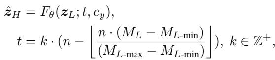

[← 返回 README](../README.md)

# Latent Domain Grouping

## 📌 预览
Method 是核心：关注输入从 LQ 到 latent/feature 的路径、训练目标、控制变量以及与 teacher/先验的交互方式。

> 💡 **与 RCOD-SR 主线的关系**: RCOD-SR 在 one-step diffusion Real-ISR 中引入 latent domain grouping、退化感知采样蒸馏和视觉 prompt 注入，让单步模型在推理时可控地调节 realism。

---

To achieve dynamic fidelity-realism trade-offs control in OSD generated SR results, we focus on the most basic condition in denoising network, i.e, timestep condition. Unlike prompts from a text encoder or a vision encoder, the timestep condition is an unremovable component in the diffusion process. At the same time, it controls the mean and variance of noisy latent feature $z _ { T }$ . With the larger mean and variance difference between $z _ { T }$ and $z _ { \mathrm { 0 } }$ , more contents will be generated during the denoising process. Fig. S3 shows an example of influence of different $t$ . In the foundational model SDturbo, the higher timestep value during the diffusion process usually reflects the the higher capability generating.

> 💡 **批注**: 这里在讨论 fidelity-realism/perception-distortion 张力：SR 既要贴近 GT/LQ 结构，又要生成自然高频细节。

Therefore, to easily control the generation degree, we propose a latent domain grouping (LDG) strategy. Recall Eq. (3), we do not use a single fixed timestep $T$ , but choose a timestep $t$ according to a metrics:

> 💡 **批注**: 注意 latent diffusion 架构路径：LQ/HR 往往先被 VAE 编码，再在 latent 空间完成 denoising 或调制。

*Equation 4: Equation extracted by MinerU.*

> 💡 **Equation 4 批读**: 这类公式通常定义 forward/reverse process、loss 或 alignment 目标；建议把每个符号对应到输入、teacher/student、控制变量。

where $M _ { L }$ denotes a latent metric that can perceive the “level of degradation” of features in latent domain, $M _ { L \mathrm { - m i n } }$ is the minimum value of $M _ { L }$ in training data, $k$ is interval of timestep, $\lfloor . \rfloor$ denotes the maximum integer no larger than the entry inside, $n$ is number of groups for timestep.

> 💡 **批注**: 注意 latent diffusion 架构路径：LQ/HR 往往先被 VAE 编码，再在 latent 空间完成 denoising 或调制。

To employ this strategy both on SD and distillation version of SD, i.e, SD-Turbo (SDT), which distilled a four specific steps from the original 1000-step diffusion process, we set $n$ to be $\leq 4$ and $k = 2 5 0$ .

> 💡 **批注**: 这是蒸馏逻辑：用 teacher 或 score regularization 把多步/大模型能力迁移给单步模型。

By the grouping strategy, denoising network can learn different degrees of generation according to timestep. In the training stage, grouping is based on the $M _ { L }$ described in the next subsection. In the inference stage, we can easily choose a timestep to control the level of realism for SR in different scenarios. Furthermore, due to our grouping strategy, the realism level increases monotonically with the timestep.

> 💡 **批注**: 这里在讨论 fidelity-realism/perception-distortion 张力：SR 既要贴近 GT/LQ 结构，又要生成自然高频细节。

---

## 🔖 Section 总结

### 核心洞察

1. 明确输入、输出、teacher/student 或控制变量。
2. 把每个 loss/模块对应到 fidelity、realism、speed 或 controllability。
3. 关注哪些组件是训练时使用，哪些是推理时仍有成本。

### 关键数字速查

| 指标 | 数值 |
|------|------|
| Inference steps | 1 |
| Control variable | latent-domain group / denoising degree |
| Accepted venue | AAAI 2026 Oral according to arXiv comment |
| Training data change | minimal paradigm modification and original training data claimed |
