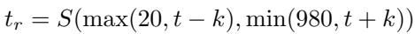

[← 返回 README](../README.md)

# Degradation-aware Sampling Distillation

## 📌 预览
Method 是核心：关注输入从 LQ 到 latent/feature 的路径、训练目标、控制变量以及与 teacher/先验的交互方式。

> 💡 **与 RCOD-SR 主线的关系**: RCOD-SR 在 one-step diffusion Real-ISR 中引入 latent domain grouping、退化感知采样蒸馏和视觉 prompt 注入，让单步模型在推理时可控地调节 realism。

---

Previous VSD method for SR (Wu et al. 2024a), utilizes the regularization network (a pre-trained SD) that sampled timesteps across a wide range (20-980). This aims to generate regularization latent features and, in turn, optimize the distribution of the OSD network. However, to better integrate the distillation process with the concept of degradation in the latent space, we propose a Degradation-Aware Sampling (DAS) strategy. DAS redefines how timesteps are sampled in the pre-trained model, adaptively aligning this process with our LDG framework to provide explicit control over regularization strength. The DAS can be written as:

> 💡 **批注**: 这是蒸馏逻辑：用 teacher 或 score regularization 把多步/大模型能力迁移给单步模型。

*Equation 6: Equation extracted by MinerU.*

> 💡 **Equation 6 批读**: 这类公式通常定义 forward/reverse process、loss 或 alignment 目标；建议把每个符号对应到输入、teacher/student、控制变量。

where $t _ { r }$ is the sample timestep for regularization network, $t$ is the chosen timestep in OSD network by LDG, $S ( t _ { m i n } , t _ { m a x } )$ denotes uniformly random sampling of an integer from the range $[ t _ { m i n } , t _ { m a x } ]$ .

> 💡 **批注**: 注意 latent diffusion 架构路径：LQ/HR 往往先被 VAE 编码，再在 latent 空间完成 denoising 或调制。

By applying DAS, the degradation grouping information is delivered from LDG, thereby aligning this process with LDG and control over regularization strength.

> 💡 **批注**: 这是控制机制：作者试图把退化强度、区域差异或 timestep 映射成可操作的生成强度。

---

## 🔖 Section 总结

### 核心洞察

1. 明确输入、输出、teacher/student 或控制变量。
2. 把每个 loss/模块对应到 fidelity、realism、speed 或 controllability。
3. 关注哪些组件是训练时使用，哪些是推理时仍有成本。

### 关键数字速查

| 指标 | 数值 |
|------|------|
| Inference steps | 1 |
| Control variable | latent-domain group / denoising degree |
| Accepted venue | AAAI 2026 Oral according to arXiv comment |
| Training data change | minimal paradigm modification and original training data claimed |
