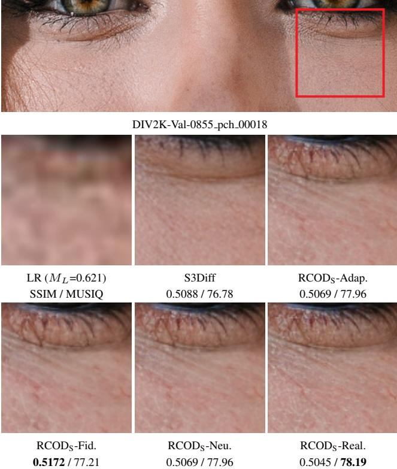

[← 返回 README](../README.md)

# Conclusion

## 📌 预览
Conclusion 总结贡献和限制；适合回看本文真正解决了 one-step SR 的哪一个子问题。

---

We propose RCOD, a framework that enhances one-step diffusion methods for Real-ISR through flexible realism control. RCOD employs latent grouping with degradationaware sampling during distillation and introduces a robust latent metric enabling denoising networks to assess degradation levels. Applied to two distinct one-step diffusion methods, RCOD achieves superior super-resolution performance across most FR and NR metrics while maintaining computational efficiency. We believe RCOD holds promise for diverse Real-ISR scenarios with varying requirements.

> 💡 **批注**: 这里的关键词是单步推理：作者试图把原本多次 denoising 的生成先验压缩到一次前向中。

Table S3: Efficiency comparison on an NVIDIA A100 GPU. The best results are highlighted in bold.

> 💡 **批注**: 这是实验证据：要同时看保真指标、感知指标和速度指标，避免被单一数字误导。

*Table S3: Table S3: Efficiency comparison on an NVIDIA A100 GPU. The best results are highlighted in bold.*

> 💡 **Table S3 批读**: 表格要横向看 SOTA 排名，也要纵向看 fidelity 指标和 perceptual 指标是否相互牺牲。

*Figure S6: Figure S6: Visual comparison $( \times 4 )$ of realism controls during $\operatorname { R C O D } _ { \operatorname { S } }$ inference stage. The best results are in bold.*

> 💡 **Figure S6 批读**: 这张图通常承担方法动机、框架或视觉对比的作用。阅读时重点看它证明的是质量、速度还是可控性，而不是只看视觉效果。

---

## 🔖 Section 总结

### 核心洞察

1. 本节帮助定位论文贡献边界。
2. 读完后回到 README 的方法对比表中归纳。

### 关键数字速查

| 指标 | 数值 |
|------|------|
| Inference steps | 1 |
| Control variable | latent-domain group / denoising degree |
| Accepted venue | AAAI 2026 Oral according to arXiv comment |
| Training data change | minimal paradigm modification and original training data claimed |
