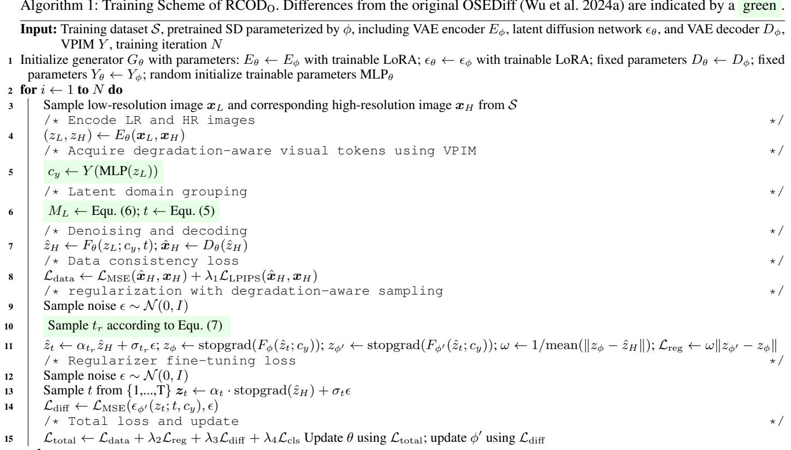

[← 返回 README](../README.md)

# Ablation Study

## 📌 预览
Analysis/Ablation 用来判断每个模块是否必要，特别要看控制变量、loss 和轻量化组件是否各自贡献明确。

---

Effectiveness of VPIM and DAS: To validate the effectiveness of VPIM, we perform ablation studies by replacing the VLM and text encoder (“Text Model”) with VPIM in Table S5 for the “w/o VPIM-Fid.” and “w/o VPIM-Real.” configurations. We observe that both configurations achieve better PSNR, LPIPS, and MANIQA scores than the baseline (the original OSEDiff). This indicates that VPIM provides not only sufficient semantic information but also fidelity information from LR images. By removing DAS during distillation, as implemented in the w/o DAS-Fid.” and w/o DAS-Real.” configurations, we observe that DAS amplifies the performance gap between the fidelity-oriented and realism-oriented configurations. The fidelity-oriented variant achieves higher PSNR and lower LPIPS, while the realism-oriented variant yields higher MANIQA scores—indicating improved realism. This divergence in evaluation metrics demonstrates that DAS effectively enhances LDG’s ability to decouple fidelity preservation from realism generation, enabling finer control over the fidelity–realism trade-off through adaptive timestep regularization.

> 💡 **批注**: 这里在讨论 fidelity-realism/perception-distortion 张力：SR 既要贴近 GT/LQ 结构，又要生成自然高频细节。

Choice of $n$ : As mentioned in section “Latent Domain Grouping”, $n$ can only be $\leq 4$ . For sufficient flexibility, we

> 💡 **批注**: 注意 latent diffusion 架构路径：LQ/HR 往往先被 VAE 编码，再在 latent 空间完成 denoising 或调制。

*Table extracted: Table extracted by MinerU. Datasets Type Methods |PSNR↑ SSIM↑ LPIPS↓ DISTS↓ NIQE↓ MUSIQ↑ MANIQA↑ CLIPIQA↑ DIV2K-Val Non-Diff. BSRGANReal-ESRGAN 24.580.62690.33510.22754.752 61.20 0.5071 0*

> 💡 **Table extracted 批读**: 表格要横向看 SOTA 排名，也要纵向看 fidelity 指标和 perceptual 指标是否相互牺牲。

Table S4: Quantitative comparison with state-of-the-art methods on both synthetic and real-world benchmarks. The best and second best results within both multi-step and one-step diffusion-based methods are highlighted in red and blue, respectively.

> 💡 **批注**: 这里的关键词是单步推理：作者试图把原本多次 denoising 的生成先验压缩到一次前向中。

*Figure S7: Figure S7: Visual comparison $( \times 4 )$ on RealSR (Nikon 047), DRealSR (Sony 49), and DIV2K (0802 pch 00007) data.*

> 💡 **Figure S7 批读**: 这张图通常承担方法动机、框架或视觉对比的作用。阅读时重点看它证明的是质量、速度还是可控性，而不是只看视觉效果。

*Table extracted: Table extracted by MinerU. TOhal0 VPIM Y , training iteration N iz ← LRA;←RA ← parameters Yθ ← Yφ; random initialize trainable parameters MLPθ 2 for i ← 1 to N do 3 Sample low-resolution*

> 💡 **Table extracted 批读**: 表格要横向看 SOTA 排名，也要纵向看 fidelity 指标和 perceptual 指标是否相互牺牲。

16 end Output: Trained generator $G _ { \theta }$

consider $n \geq 3 .$ . Therefore, we compare the training results for $n = 3$ and $n = 4$ in Table S6. We find that $\mathrm { R C O D _ { O } }$ -Real. $\mathit { n } = 4$ ) performs much worse than $\mathrm { R C O D _ { O } }$ -Real. $( n = 3$ ). To explain this phenomenon, we visualize the training data distribution for the two choices in Fig. S8. We observe that there is too little data for training at large $t$ (when $M _ { L }$ is small). Thus, we finally choose $n = 3$ for our experiment.

> 💡 **批注**: 这是实验证据：要同时看保真指标、感知指标和速度指标，避免被单一数字误导。

Robustness of $M _ { L }$ : Due to the encoder of the VAE being trainable in most SD-based method settings, we consider a domain shift phenomenon during training: the distribution of $M _ { L }$ may change after training. Therefore, we compare the $M _ { L }$ values of the entire training dataset before and after training in main manuscript Fig. 4 (b). The histogram shows a slight shift in the metric, with values becoming closer to larger similarities, but the overall distribution remains similar. This indicates that even though the model aligns the feature domains of LR and HR, $M _ { L }$ retains its robustness in measuring the divergence in the latent domain.

> 💡 **批注**: 注意 latent diffusion 架构路径：LQ/HR 往往先被 VAE 编码，再在 latent 空间完成 denoising 或调制。

Correlation of $M _ { L }$ and image quality: In Table 1(b) in main manuscript, we calculate |Spearman coefficient| $\uparrow$ of different $M _ { L }$ and image quality metrics (which are calculated by LR and HR images). Fig. S9 visualize the correlation of randomly selected 600 points. We can find that cosine similarity exhibits a higher correlation coefficient with image quality metrics compared to other distances.

> 💡 **批注**: 这是实验证据：要同时看保真指标、感知指标和速度指标，避免被单一数字误导。

*Figure S8: Figure S8: Distribution of (a) mean value of LR and HR training images in the latent domain, (b) the $M _ { L }$ metric in the latent domain of VAE before and after training.*

> 💡 **Figure S8 批读**: 这张图通常承担方法动机、框架或视觉对比的作用。阅读时重点看它证明的是质量、速度还是可控性，而不是只看视觉效果。

---

## 🔖 Section 总结

### 核心洞察

1. 本节帮助定位论文贡献边界。
2. 读完后回到 README 的方法对比表中归纳。

### 关键数字速查

| 指标 | 数值 |
|------|------|
| Inference steps | 1 |
| Control variable | latent-domain group / denoising degree |
| Accepted venue | AAAI 2026 Oral according to arXiv comment |
| Training data change | minimal paradigm modification and original training data claimed |
