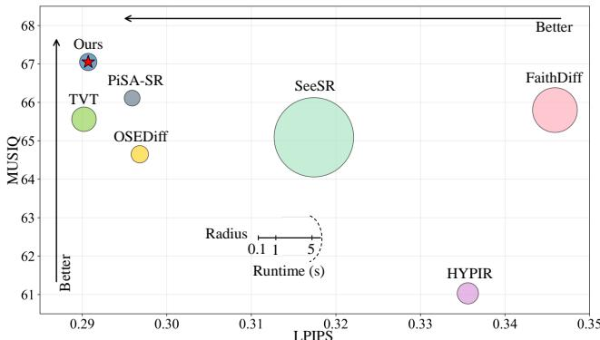

[← 返回 README](../README.md)

# 1. Introduction

## 📌 预览
本节建立研究动机、现有方法缺口和贡献列表，是理解论文叙事的入口。

---

The goal of the single image super-resolution (SISR) task is to recover a high-quality (HQ) image from its corresponding degraded low-quality (LQ) observation. Previous approaches, e.g., CNN-based [9, 12, 36, 38, 39, 66, 67], Transformer-based [5, 7, 8, 26, 58, 65], and GAN-based ones [24, 28, 45, 60], have markedly advanced the field of SISR by leveraging local information, capturing long-range dependencies, and incorporating adversarial learning. Nevertheless, they still fail to generate realistic and texture-rich details from severely degraded LQ inputs.

> 💡 **批注**: 这段是 one-step SR 主线：关注效率、保真-真实感权衡、扩散/flow 先验或单步生成路径。

Recent diffusion-based SISR methods [6, 14, 30, 43, 56] have drawn increasing attention by harnessing the strong generative priors of pretrained text-to-image diffusion models (e.g., Stable Diffusion (SD) [35]), achieving remarkable perceptual quality. However, these approaches generally depend on iterative denoising over dozens or even hundreds of steps, resulting in substantial computational overhead and limiting their practical applicability. To address this issue, recent efforts have focused on accelerating the diffusion process by simplifying it into a single-step procedure. Although current one-step methods have shown encouraging results, they still suffer from three major limitations.

> 💡 **批注**: 这段是 one-step SR 主线：关注效率、保真-真实感权衡、扩散/flow 先验或单步生成路径。

*Figure 1.: Figure 1. Performance and runtime comparison among SD-based SISR methods on the DrealSR [49] benchmark. CODSR achieves high-quality reconstruction at a low latency, demonstrating a better balance between fidelity and generative quality compared with existing state-of-the-art diffusion-based methods.*

> 💡 **Figure 1. 批读**: 这张图通常承担方法框架、动机或视觉对比作用；重点看它支撑的是机制、效果还是局限。

A notable limitation of existing methods is the inferior fidelity performance. A primary factor contributing to this is the LQ information loss caused by the compression encoding. Existing methods [55] attempt to alleviate this by expanding the spatial resolution of features in the latent space, but the fundamental problem of information loss due to compression persists. To address this, we develop an LQguided feature modulation module that leverages original uncompressed information from LQ inputs to modulate the diffusion process for improved fidelity performance.

> 💡 **批注**: 这段是 one-step SR 主线：关注效率、保真-真实感权衡、扩散/flow 先验或单步生成路径。

In addition, existing one-step diffusion-based methods [13, 40, 50, 55] suffer from a lack of region-discriminative activation of generative priors. These approaches directly feed the LQ latent into the denoising network, deviating from the pre-trained diffusion model’s inherent denoising mode of recovering images from noisy latents. This deviation limits the model’s ability to extract and generate high-frequency information from noise, thereby inhibiting the full release of the model’s generative potential. Moreover, by treating all spatial regions equally, these methods overlook the varying demands for generative capacity across different image areas, often resulting in artifacts over smooth regions and insufficient detail in textured ones. To overcome these issues, we propose a region-adaptive generative prior activation method. This approach computes a Sobel-based gradient map from the grayscale LQ image to distinguish high-frequency regions from low-frequency ones and then adds adaptive noise to the high-frequency region, thereby enabling a region-aware activation of generative priors. The targeted approach ensures that generative priors are more effectively activated for various image areas during the reverse process, enhancing perceptual richness without compromising local structural fidelity.

> 💡 **批注**: 这段是 one-step SR 主线：关注效率、保真-真实感权衡、扩散/flow 先验或单步生成路径。

Beyond the aforementioned limitations, a critical remaining challenge is the text misalignment. Text prompts offer valuable semantic guidance for SISR. Existing methods [50, 55] mostly employ DAPE [51] as a text extractor. However, they overlook the issue of text misalignment, where the interaction regions of the text embeddings in the diffusion model are not spatially aligned with corresponding semantic regions of the text. To rectify this misalignment and achieve precise semantic grounding, we propose a text-matching guidance method. This method leverages Grounded-SAM2 [34] to generate text-interactive region maps, which are then used to guide and spatially align the text–image interactions throughout the diffusion process.

> 💡 **批注**: 这段是 latent memory / medical VLM 主线：关注视觉证据如何进入 latent space、如何被记忆/更新/调用，以及是否能支撑可靠诊断。

In this paper, we propose a controllable one-step diffusion network for super-resolution (CODSR), which activates the diffusion priors in a region-discriminative manner while improving fidelity by an LQ-guided feature modulation. Together with a text-matching guidance strategy, our CODSR shows a good capability of balancing fidelity and reality. The contributions are summarized as follows:

> 💡 **批注**: 这段是 one-step SR 主线：关注效率、保真-真实感权衡、扩散/flow 先验或单步生成路径。

• We propose an LQ-guided feature modulation module that leverages original uncompressed information from LQ inputs to provide high-fidelity conditioning for the diffusion process. We present a region-adaptive generative prior activation method that effectively enhances perceptual richness without sacrificing local structural fidelity. • We introduce a text-matching guidance strategy that spatially aligns the text-image interactions to fully harness the conditioning potential of text prompts. • Extensive evaluations and analyses show that our CODSR achieves superior perceptual quality and competitive fidelity compared to state-of-the-art methods.

> 💡 **列表批读**: 这组条目通常是在列贡献、设置、发现或模块；建议逐条对应到论文 claim。

---

## 🔖 Section 总结

### 核心洞察
1. 本节对应论文原始大分节，原文已完整保留。
2. 阅读重点是把本节的机制/证据映射到论文主 claim。
3. 后续如有疑问，可在本 section 继续补充更细批注。
