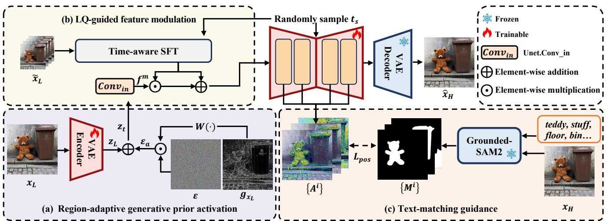

[← 返回 README](../README.md)

# 2. Related Work

## 📌 预览
本节不是背景罗列，而是在定位 CODSR 的空位：传统/GAN 方法真实纹理不足或训练不稳，多步 diffusion 质量好但慢，已有 one-step diffusion 仍把区域、LQ 信息和文本条件处理得太粗。
---

> 💡 **Q&A 批注记录**:
> - Q: RGPA 和普通加噪有什么区别？
> - A: 普通 latent 加噪只给全图一个生成强度；RGPA 把 Sobel 梯度映射成噪声权重，让生成先验按区域激活，目标是减少平坦区域伪纹理、增强纹理区域细节。

Non-generation based methods. Early CNN-based methods [9, 36, 38, 39, 66, 67], initiated by SRCNN [12] focus on exploiting local information within LQ images to reconstruct HQ images. However, their restricted receptive field of CNN-based models hinders the integration of global image context and impedes further quality improvements. Transformer-based methods [5, 7, 8, 26, 58, 65] address this bottleneck by leveraging self-attention to capture longrange dependencies, leading to substantial performance improvements.
> 💡 **谱系定位**: CNN/Transformer 类方法更偏确定性重建，优势是保真和稳定，短板是严重退化时缺少自然纹理。CODSR 后面引入 diffusion prior，就是为了补这类方法缺的“生成分布知识”。

GAN-based methods. Pioneering work such as SRGAN [24] enhances perceptual quality by combining adversarial [15] and perceptual losses. This approach is advanced by ESRGAN [44], which incorporates residual-in-residual dense blocks and a relativistic average discriminator to improve high-frequency detail reconstruction. To better model real-world degradations, BSRGAN [60] and Real-ESRGAN [45] subsequently employ complex degradation pipelines to synthesize more realistic training pairs, improving generalization ability on images with unknown degradations. Building on this progress, DASR [27] introduces a lightweight network to estimate degradation parameters for handling images with diverse degradation levels. Although these GAN-based methods significantly improve perceptual quality, their adversarial training often results in instability. Diffusion-based full-step methods. Diffusion models [10, 17, 33] have shown remarkable potential for SISR by leveraging powerful generative priors learned from large-scale text-to-image training. Early work [10, 21, 22, 30] adapts pre-trained denoising diffusion probabilistic models to restore images degraded by simple operators such as bicubic downsampling. The advent of Stable Diffusion (SD) [37] spurs a new wave of SD-based SISR methods, often incorporating controllable adapters [33, 62] for conditional guidance. StableSR [43] introduces a time-aware encoder and feature warping to balance fidelity and perceptual quality. DiffBIR [30] adopts a two-stage pipeline that first removes degradation and then refines details using SD. PASD [54] fuses pixel-level and semantic information through pixelaware cross-attention. SeeSR [51] enhances semantic robustness with degradation-aware tag-style prompts. However, these methods rely on multi-step denoising, resulting in significant computational costs and limited practicality.
> 💡 **谱系定位**: GAN 方法把 perceptual quality 往前推了一步，但 adversarial loss 容易制造局部假纹理；多步 SD-SR 的纹理更自然，却被几十步采样拖慢。CODSR 继承的是 diffusion prior，而不是 GAN 的全局对抗生成逻辑。

Diffusion-based one-step methods. To address this, recent studies accelerate the diffusion process by compressing it into a single-step [59]. SinSR [46] derives a deterministic sampling process from ResShift [57] and adopts a consistency-preserving loss to improve the performance. AddSR [52] incorporates adversarial diffusion distillation and proposes a prediction-based self-refinement strategy to reconstruct richer high-frequency details without introducing additional modules. OSEDiff [50] directly uses the LQ image as input and applies the variational score distillation [48] to compress multi-step denoising into a single efficient generation step. TSD-SR [13] employs a target score distillation to enhance reality and a distribution-aware sampling mechanism to improve detail reconstruction. PiSA-SR [40] designs dual LoRA modules to separately learn pixel-level and semantic-level objectives, effectively balancing fidelity and perceptual quality while enabling flexible control of SISR results during inference. TVT [55] proposes a transfer VAE training strategy that adapts the $\times 8$ VAE of SD into a $\times 4$ variant through a two-stage training framework, preserving fine structural details. Although PiSA-SR and TVT improve fidelity to some extent, the issue of information loss due to compression still persists. HYPIR [31] leverages pretrained diffusion priors and lightweight adversarial LoRA fine-tuning, eliminating iterative sampling and distillation while achieving high-quality restoration. However, most aforementioned methods treat different regions in an image indiscriminately, thus failing to meet the requirements for generating images with different content regions. In contrast, we propose to explore region-discriminative activation of generative priors, in order to enhance perceptual richness without compromising local structural fidelity.
> 💡 **本文空位**: 这一段列的 one-step 方法大多解决“如何变快”，少数解决像素/语义双目标或 VAE 结构保留；CODSR 的新增点是把生成先验的释放做成区域级，并且承认 VAE 压缩、text misalignment 是 one-step SR 的具体瓶颈。

*Figure 2.: Figure 2. An overview of our CODSR. (a) The region-adaptive generative prior activation method introduces gradient-driven adaptive noise to achieve the region-aware activation of generative priors. (b) The LQ-guided feature modulation module exploits the uncompressed LQ information to modulate the diffusion process for restoring faithful structural details. (c) The text-matching guidance strategy harnesses the region maps generated by Grounded-SAM2 [34], which correspond to the textual descriptions, to constrain the text–image interaction regions within the cross-attention layers, thereby enabling effective textual guidance during generation.*
> 💡 **Figure 批读**: Figure 2 要按三条支线读：(a) RGPA 在 z_L 前向加自适应噪声，(b) LQFM 用未压缩 LQ 特征调制 U-Net，(c) TMG 用 Grounded-SAM2 mask 约束 cross-attention。框架图已经把“局部真实感、结构保真、语义对齐”三件事拆开了。

---

## 🔖 Section 总结

### 关键数字速查
| 指标 | 数值 |
|------|------|
| 谱系 | deterministic restoration → GAN SR → multi-step diffusion SR → one-step diffusion SR |
| 本文位置 | 在 one-step diffusion SR 里补区域先验激活、LQ 结构补偿和文本区域对齐。 |
| 比较维度 | 速度、保真、真实感、可控性、部署 |

### 核心洞察
1. Related Work 的关键是看 CODSR 相比 OSEDiff/PiSA-SR/TVT/HYPIR 多解决了什么，而不是只看谁同属 one-step。
2. VAE 信息损失、区域无差别加噪、文本错位，是本文从已有方法中抽出的三个具体缺口。
3. 最强 baseline 不只是一类：full-step 代表质量上限，one-step 代表效率竞争，GAN 代表传统真实感基线。

### 可追问点
- RGPA 和普通加噪有什么区别？
- 为什么还要 LQFM？
- CODSR 与 PiSA-SR 的“可控”差异是全局像素/语义 LoRA 控制，还是局部区域噪声控制？
