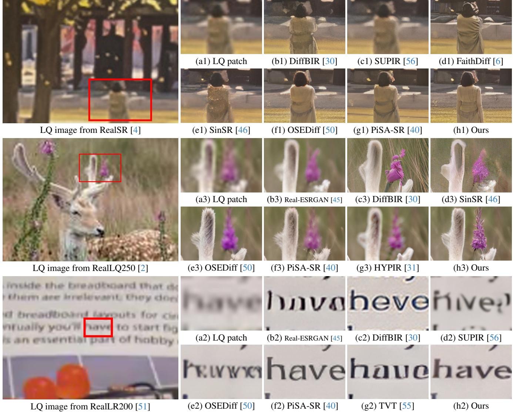
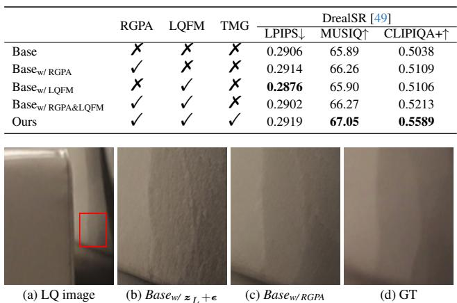
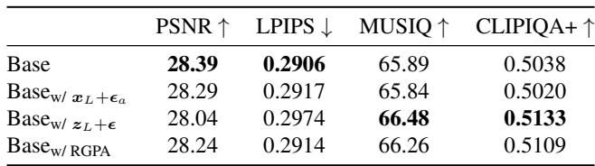
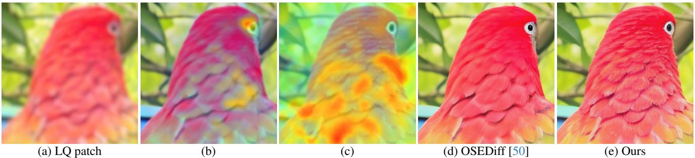
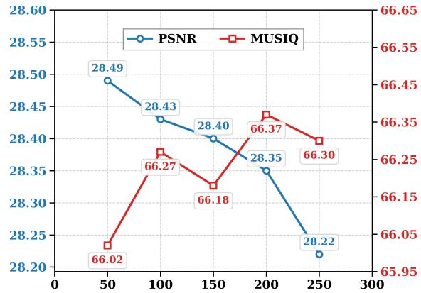
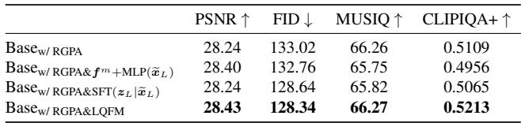
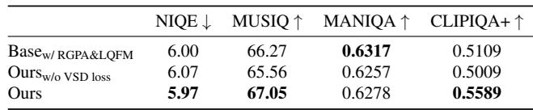

[← 返回 README](../README.md)

# Experiments

## 📌 预览
本文件合并 Experiments/Results/Analysis/Ablation，重点看 fidelity、realism、速度和可控性证据。

---

# 4. Experimental Results

# 4.1. Experimental settings

Training datasets. Following the protocols [40, 50, 51], we collect a training dataset including the images from LS-DIR [25], DIV2K [1], Flicker2K [29], DIV8K [16] and the first 10K images from FFHQ [20]. The corresponding LQ images are synthesized from their HQ counterparts through the complex degradation model in Real-ESRGAN [45].

> 💡 **批注**: 这是控制机制：作者试图把退化强度、区域差异或 timestep 映射成可操作的生成强度。

Testing datasets. We evaluate our method on four realworld datasets, including RealSR [4], DrealSR [49], RealPhoto60 [56] and RealDeg [6]. For RealSR and DRealSR, the LQ-HQ pairs involve a $\times 4$ super-resolution task from $1 2 8 \times 1 2 8$ to $5 1 2 \times 5 1 2$ . While for RealPhoto60, the LQ images $( 5 1 2 \times 5 1 2 )$ are upscaled by $\times 2$ to $1 0 2 4 \times 1 0 2 4$ . In addition, RealDeg [6] contains 238 images of old photographs, classic film stills, and social media photos under diverse real-world degradation types.

> 💡 **批注**: 注意 latent diffusion 架构路径：LQ/HR 往往先被 VAE 编码，再在 latent 空间完成 denoising 或调制。

Compared methods. We compare our method with representative approaches, including full-step diffusion-based methods (i.e., DiffBIR [30], SeeSR [51], SUPIR [56], and FaithDiff [6]) and one-step diffusion-based methods (i.e., SinSR [46], OSEDiff [50], TVT [55], PiSA-SR [40], and HYPIR [31]). In addition, we also include GAN-based super-resolution methods such as RealESRGAN [45] and BSRGAN [60] for comprehensive comparison, as detailed in the supplemental material. For a fair comparison, all reported results for competing methods are produced using their publicly available official implementations and pretrained models.

> 💡 **批注**: 这里的关键词是单步推理：作者试图把原本多次 denoising 的生成先验压缩到一次前向中。

Evaluation metrics. We evaluate all methods using fullreference and no-reference image quality metrics. For fullreference assessment, we employ PSNR and SSIM [47], computed on the Y channel in YCbCr space to evaluate reconstruction fidelity, alongside LPIPS [64] and DISTS [11] to measure perceptual similarity. The no-reference metrics include NIQE [61], MUSIQ [23], MANIQA-pipal [53], and CLIPIQA $^ +$ [42], which estimate perceptual quality without references.

> 💡 **批注**: 这里在讨论 fidelity-realism/perception-distortion 张力：SR 既要贴近结构，又要生成自然高频细节。

*Figure 3.: Figure 3. Qualitative comparisons of different methods on the RealSR [4] dataset, RealLQ250 [2] dataset and RealLR200 [51] dataset. Compared to competing methods, our approach generates a more realistic image with fine-scale structures and details. Please zoom in for a better view.*

> 💡 **Figure 3. 批读**: 这张图通常承担方法动机、框架或视觉对比作用。重点看它证明的是质量、速度还是可控性。

Implementation details. Our implementation is built upon the SD 2.1-base [37]. Similar to OSEDiff [50], we optimize LoRA [18] adapters within the VAE encoder and the U-Net network while keeping the VAE decoder fixed. The LoRA ranks are configured as 4 for the VAE encoder and 16 for the U-Net, respectively. We use RAM [68] for prompt extraction during training and DAPE [51] at inference. Our model is trained using 4 NVIDIA 4090 GPUs with a batch size of

> 💡 **批注**: 注意 latent diffusion 架构路径：LQ/HR 往往先被 VAE 编码，再在 latent 空间完成 denoising 或调制。

16, using the AdamW optimizer [32] with a learning rate of $5 e ^ { - 5 }$ . In the first-stage training, we employ the GAN loss used in S3Diff [59]. In the second stage, the VSD loss is incorporated with a weighting coefficient of 2. More experimental results are included in the supplemental material.

> 💡 **批注**: 这是蒸馏逻辑：用 teacher 或 score regularization 把多步/大模型能力迁移给单步模型。

# 4.2. Comparison with the state of the art

Quantitative evaluations against diffusion-based fullstep methods. We first compare our approach with diffusion-based full-step methods [6, 30, 51, 56] in Table 1. Our method performs the best in terms of the all full-reference metrics (PSNR, SSIM, LPIPS, and DISTS) as well as the no-reference metrics NIQE and MUSIQ while delivering comparable results on other metrics. Notably, our method improves the MUSIQ by at least 1.96 and 5.15 on the datasets of DRealSR and RealDeg, respectively.

> 💡 **批注**: 这是实验证据：要同时看保真指标、感知指标和速度指标。

*Figure 4.: Figure 4. Comparisons between $B a s e _ { w / \ z _ { L } + \epsilon }$ and $B a s e _ { w / R G P A }$ on the DrealSR [49] benchmark. While $B a s e _ { w / \ z _ { L } + \epsilon }$ introduces unpleasant details in smooth areas, our method achieves more faithful reconstructions.*

> 💡 **Figure 4. 批读**: 这张图通常承担方法动机、框架或视觉对比作用。重点看它证明的是质量、速度还是可控性。

Quantitative evaluations against diffusion-based onestep methods. We then evaluate the proposed approach against diffusion-based one-step methods [31, 40, 46, 50, 55]. The quantitative results in Table 1 show that our method outperforms all competing approaches across all no-reference metrics. The NIQE, MUSIQ, and CLIPIQA+ of our method is at least 0.15, 0.39, and 0.0133 higher than the competing methods across all datasets.

> 💡 **批注**: 这里的关键词是单步推理：作者试图把原本多次 denoising 的生成先验压缩到一次前向中。

Qualitative results. Figure 3 shows the visual comparisons. For the example from RealSR [4], the full-step methods [6, 30, 56] cannot effectively recover a clear figure viewed from the behind that is consistent with the LQ input. The result generated by [46] exhibits obvious artificial textures. Compared to these competing methods, our approach yields a clearer result with a more realistic background and better-defined foreground. Figure 3 also shows an example from RealLQ250 [2], our method further demonstrates a superior capability for storing high-quality images, e.g., clear and natural flowers and antlers. For the example from RealLR200 [51], the methods [45, 50, 56] struggle to recover characters from the LQ input, while [30, 40, 55] introduce background noise or structurally distorted characters, leading to compromised readability. In contrast, our method faithfully restores text with sharper edges, continuous strokes, and minimal background artifacts, yielding a highly legible result.

> 💡 **批注**: 这里涉及条件信号：prompt 是否准确、是否退化感知，会影响生成细节与语义一致性。

# 5. Analysis and Discussion

Effect of region-adaptive generative prior activation. To validate the effectiveness of the proposed RGPA, we first compare a baseline method stripped of all the proposed modules of RGPA, LQFM, and TMG (Base for short) against a variant incorporating only the RGPA $( B a s e _ { w / R G P A }$ for short). Table 2 shows the quantitative comparison, where we find that employing RGPA facilitates the release of generative priors for enhanced perceptual quality, cf. 65.89/0.5038 for Base vs. 66.27/0.5109 for $B a s e _ { w / R G P A }$ in terms of MUSIQ/CLIPIQA+.

> 💡 **批注**: 这里在讨论 fidelity-realism/perception-distortion 张力：SR 既要贴近结构，又要生成自然高频细节。

Table 2. Effectiveness of each module in our proposed network. All methods are trained using the same settings as the proposed framework for fair comparison.   
Table 3. Quantitvative comparison of different noise strategies on the DrealSR [49] benchmark.

> 💡 **批注**: 这是实验证据：要同时看保真指标、感知指标和速度指标。

*Table 2.: Table 2. Effectiveness of each module in our proposed network. All methods are trained using the same settings as the proposed framework for fair comparison. Table 3. Quantitvative comparison of different noise strategies on the DrealSR [49] benchmark.*

> 💡 **Table 2. 批读**: 表格要横向看 SOTA 排名，也要纵向看 fidelity 指标和 perceptual 指标是否相互牺牲。

To further analyze the effect of RGPA, we compare $B a s e _ { w / R G P A }$ with two baselines that individually add an adaptive noise $\epsilon _ { a }$ to the input LQ image $\scriptstyle { \mathbf { \mathcal { x } } } _ { L }$ $( B a s e _ { w / \pmb { x } _ { L } + \pmb { \epsilon } _ { a } }$ for short) or replace the adaptive noise with standard Gaussian noise $\epsilon$ in the latent space $( B a s e _ { w / z _ { L } + \epsilon }$ for short). As shown in Table 3, adding noise $\epsilon _ { a }$ to $\scriptstyle { \mathbf { \mathcal { x } } } _ { L }$ fails to enhance the generative capability, since perturbing the image space does not align the noise pathway between the forward and reverse processes in the latent space. Although adding standard Gaussian noise $\epsilon$ to the latent code $z _ { L }$ can enhance generative prior utilization, it significantly compromises fidelity, introducing artifacts in flat regions, as shown in Figure 4(b). In contrast, the method with our proposed RGPA achieves a superior balance, enabling region-adaptive activation of generative priors while faithfully preserving local structures (Figure 4(c)).

> 💡 **批注**: 这里在讨论 fidelity-realism/perception-distortion 张力：SR 既要贴近结构，又要生成自然高频细节。

We additionally investigate the impact of adaptive noise $\epsilon _ { a }$ intensity on reconstruction by adjusting the timestep $t _ { s }$ during the forward process. The trend in Figure 6 demonstrates a clear trade-off between fidelity and quality: higher $t _ { s }$ values (i.e., greater noise intensity) enhance the release of generative priors, as illustrated in the increasing MUSIQ values, but concurrently degrade fidelity, as evidenced by the decrease in PSNR. This property is characterized by a transition from fidelity-preserving reconstruction at lower noise levels to perceptually-oriented generation at higher levels. To balance these competing objectives, we set $t _ { s } =$ 100 as the default setting for subsequent experiments.

> 💡 **批注**: 这里在讨论 fidelity-realism/perception-distortion 张力：SR 既要贴近结构，又要生成自然高频细节。

Effect of LQ-guided feature modulation. To validate the effectiveness of our LQFM, we compare $B a s e _ { w / R G P A }$ with a variant that is augmented with the LQFM module $( B a s e _ { w / R G P A \& L Q F M }$ for short). As shown in Table 4, using LQFM yields substantial improvements in both fidelity and perceptual metrics. We further compare $B a s e _ { w / R G P A \& L Q F M }$ with two variants that respectively replace the modulation in (4) with the element-wise addition ${ \pmb f } ^ { m } + \mathrm { M L P } ( { \pmb x } _ { L } )$ $( B a s e _ { w / R G P A \mathcal { E } f ^ { m } + M L P ( \widetilde { \pmb { x } } _ { L } ) }$ for short) or $\mathrm { S F T } ( z _ { L } \quad \vert \quad \widetilde { \pmb { x } } _ { L } )$

> 💡 **批注**: 这里在讨论 fidelity-realism/perception-distortion 张力：SR 既要贴近结构，又要生成自然高频细节。

*Figure 5.: Figure 5. Visualization comparison of DAAMs [41] for the query word “bird”. (b) and (c) are DAAMs for OSEDiff [50] and our method. Compared to [50], our method achieves more precise text–image interaction in the semantic region corresponding to the bird, resulting in more realistic feather generation.*

> 💡 **Figure 5. 批读**: 这张图通常承担方法动机、框架或视觉对比作用。重点看它证明的是质量、速度还是可控性。

*Figure 6.: Figure 6. PSNR and MUSIQ metrics variation with different timestep on the DrealSR [49] benchmark.*

> 💡 **Figure 6. 批读**: 这张图通常承担方法动机、框架或视觉对比作用。重点看它证明的是质量、速度还是可控性。

Table 4. Comparison of different modulation strategies on the DrealSR [49] benchmark.

> 💡 **批注**: 这是实验证据：要同时看保真指标、感知指标和速度指标。

*Table 4.: Table 4. Comparison of different modulation strategies on the DrealSR [49] benchmark.*

> 💡 **Table 4. 批读**: 表格要横向看 SOTA 排名，也要纵向看 fidelity 指标和 perceptual 指标是否相互牺牲。

$( B a s e _ { w / R G P A \& S F T } ( z _ { L } | \widetilde { \pmb { x } } _ { L } )$ for short). The comparison results ein Table 4 show that using element-wise addition performs suboptimally, even degrading no-reference metrics compared to $B a s e _ { w / R G P A }$ . We attribute this to the domain gap between the LQ input and U-Net features, which introduces instability into the denoising process and can lead to its eventual collapse of the denoising paradigm. Moreover, modulating the latent feature $z _ { L }$ causes a more pronounced drop in no-reference metrics than modulating the intermediate feature $\pmb { f } ^ { m }$ , as it disrupts the Gaussian diagonal distribution of $z _ { L }$ and consequently limits the effective utilization of generative priors during the reverse process. In contrast, our proposed LQFM effectively enhances restoration fidelity while maintaining better generative performance.

> 💡 **批注**: 这里在讨论 fidelity-realism/perception-distortion 张力：SR 既要贴近结构，又要生成自然高频细节。

Effect of text-matching guidance. To demonstrate the effectiveness of the TMG, we compare our full model with $B a s e _ { w / R G P A \& L Q F M } .$ . As shown in Table 2, our approach with TMG yields further improvements across all non-reference metrics, underscoring its critical role in enhancing the generation capability of the model. Figure 5 visualizes diffusion attentive attribution maps (DAAMs) of our method and [50], where the method [50] suffers from text misalignment even with the regularization of pre-trained models. In contrast, our proposed TMG effectively alleviates the misalignment issue, leading to more accurate and consistent text–image interactions.

> 💡 **批注**: 这里涉及条件信号：prompt 是否准确、是否退化感知，会影响生成细节与语义一致性。

Table 5. Comparison of different semantic enhancement strategies on the DrealSR [49] benchmark.

> 💡 **批注**: 这里涉及条件信号：prompt 是否准确、是否退化感知，会影响生成细节与语义一致性。

*Table 5.: Table 5. Comparison of different semantic enhancement strategies on the DrealSR [49] benchmark.*

> 💡 **Table 5. 批读**: 表格要横向看 SOTA 排名，也要纵向看 fidelity 指标和 perceptual 指标是否相互牺牲。

To further investigate the influence of semantic knowledge distillation in the second training stage, we compare our CODSR with a baseline that replaces the VSD loss in (5) with the GAN loss $\left( O u r s _ { w / o } \ : V S D \ : l o s s \right.$ for short). As shown in Table 5, using GAN Loss fails to fully unleash the semantic generation capability due to the lack of effective semantic guidance in the second-stage training, whereas the VSD Loss enables semantic knowledge distillation from the pretrained model, thereby enhancing the generative ability.

> 💡 **批注**: 这是蒸馏逻辑：用 teacher 或 score regularization 把多步/大模型能力迁移给单步模型。

---

## 🔖 Section 总结

### 核心洞察
1. 检查 fidelity/perceptual/速度指标是否同时成立。
2. 关注消融和可控性曲线/视觉样例。
