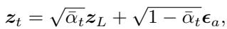
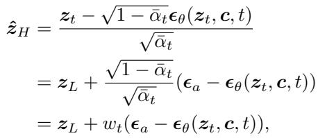
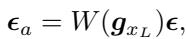
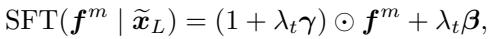
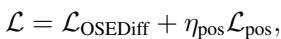
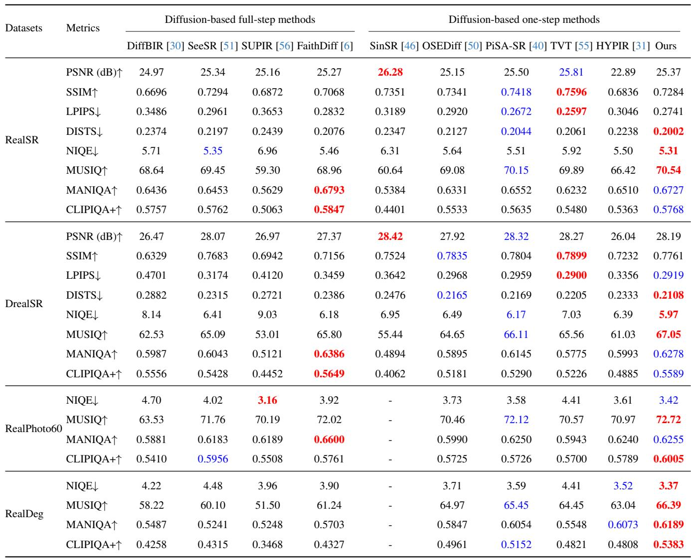

[← 返回 README](../README.md)

# 3. Proposed Method

## 📌 预览
本节是核心方法，重点看模块输入输出、训练目标、推理路径和与 baseline 的差异。

---

The goal of this paper is to develop an effective one-step diffusion-based SR method that is capable of balancing the reality and fidelity of restored images. We first propose a region-adaptive generative prior activation method to discriminatively add noise to regions with varying demands while preserving local fidelity. We then introduce an LQguided feature modulation module that conditions the intermediate features of the U-Net on the LQ image to enhance the reconstruction fidelity. Furthermore, we leverage Grounded-SAM2 [34] to identify text regions within the image, providing effective guidance for text interaction in the diffusion process and thereby mitigating text misalignment. The overall architecture of the proposed method is shown in Figure 2. The following subsections elaborate on the design of each component.

> 💡 **批注**: 这段是 one-step SR 主线：关注效率、保真-真实感权衡、扩散/flow 先验或单步生成路径。

# 3.1. Region-adaptive generative prior activation

Different from existing one-step methods [13, 40, 50, 55] that directly feed the LQ latent into the denoising network, we introduce the deliberate addition of Gaussian noise to the LQ latent before denoising, in order to better unleash the generative priors of diffusion models for producing visually realistic outputs. To further achieve region-aware activation of diffusion priors, we propose a region-adaptive generative prior activation (RGPA) method that distinguishes between flat and textured regions via the Sobel gradient map and accordingly constructs spatially adaptive noise for the forward process.

> 💡 **批注**: 这段是 one-step SR 主线：关注效率、保真-真实感权衡、扩散/flow 先验或单步生成路径。

Specifically, we first encode the LQ image $\scriptstyle { \mathbf { \mathcal { x } } } _ { L }$ into the latent features $z _ { L }$ using a VAE encoder. Instead of directly denoising, we construct the noisy latent ${ \boldsymbol { z } } _ { t }$ by adding the adaptive noise $\epsilon _ { a }$ in a one-step forward process:

> 💡 **批注**: 这段是 one-step SR 主线：关注效率、保真-真实感权衡、扩散/flow 先验或单步生成路径。

*Equation 1: Equation extracted by MinerU.*

> 💡 **Equation 1 批读**: 公式通常定义过程、loss 或更新规则；建议把符号对应到输入、模型、记忆/控制变量与输出。

where $\bar { \alpha } _ { t }$ is the cumulative parameter controlling the noise level at timestep $t$ . During the reverse process, the clean latent $\hat { z } _ { H }$ is recovered using the noise $\boldsymbol { \epsilon } _ { \theta } ( z _ { t } , \boldsymbol { c } , t )$ predicted

> 💡 **批注**: 这是实验证据段：同时看主指标、消融、效率和案例，判断 claim 是否被支撑。

by the U-Net, conditioned on the text embedding $^ c$

*Equation 2: Equation extracted by MinerU.*

> 💡 **Equation 2 批读**: 公式通常定义过程、loss 或更新规则；建议把符号对应到输入、模型、记忆/控制变量与输出。

where $\begin{array} { r } { w _ { t } = \frac { \sqrt { 1 - \bar { \alpha } _ { t } } } { \sqrt { \bar { \alpha } _ { t } } } } \end{array}$ is a time-dependent noise coefficient.

The adaptive noise $\epsilon _ { a }$ is derived by a gradient-weighted process. First, the Sobel operator is applied to compute the gradient map of $\scriptstyle { \mathbf { \mathcal { x } } } _ { L }$ , denoted as ${ \mathbf { \mathit { g } } } _ { { \mathit { x } } _ { L } }$ The noise weighting coefficients are then obtained by a mapping operator $W ( \cdot )$ , which performs $1 6 \times 1 6$ patch-wise averaging followed by a piecewise transformation similar to UPSR [63]. The final adaptive noise $\epsilon _ { a }$ is thus formulated as:

*Equation 3: Equation extracted by MinerU.*

> 💡 **Equation 3 批读**: 公式通常定义过程、loss 或更新规则；建议把符号对应到输入、模型、记忆/控制变量与输出。

where $\epsilon \sim \mathcal { N } ( 0 , I )$ . Additionally, to enhance the robustness of the model, a timestep $t _ { s } \in [ t _ { \operatorname* { m i n } } , t _ { \operatorname* { m a x } } ]$ is randomly sampled during training, encouraging the model to generalize across various noise levels. During inference, this design provides flexible control over the trade-off between fidelity and generative quality simply by adjusting the timestep.

> 💡 **批注**: 这段是 one-step SR 主线：关注效率、保真-真实感权衡、扩散/flow 先验或单步生成路径。

# 3.2. LQ-guided feature modulation

To mitigate the LQ information loss caused by compression encoding of VAE, we propose a plug-and-play LQ-guided feature modulation (LQFM) module. In order to preserve as much information as possible while adjusting the spatial resolution of the LQ image $\scriptstyle { \mathbf { \mathcal { x } } } _ { L }$ , a pixel-unshuffle operation is first applied to $\scriptstyle { \mathbf { \mathcal { x } } } _ { L }$ to obtain the feature $\widetilde { \pmb { x } } _ { L }$ .

> 💡 **批注**: 这段是 one-step SR 主线：关注效率、保真-真实感权衡、扩散/flow 先验或单步生成路径。

To effectively utilize the information in the LQ feature $\widetilde { \pmb { x } } _ { L }$ to guide the diffusion process and achieve faithful SISR, ewe adopt a time-aware spatial feature transform (SFT) layer that fuses $\widetilde { \pmb { x } } _ { L }$ with intermediate U-Net features to bridge the representation discrepancy. Specifically, we develop a time-aware SFT layer, conditioned on $\widetilde { \pmb { x } } _ { L }$ , which performs a spatial affine transformation on the output feature $\pmb { f } ^ { m }$ of the first convolutional layer in the U-Net:

> 💡 **批注**: 这段是 one-step SR 主线：关注效率、保真-真实感权衡、扩散/flow 先验或单步生成路径。

*Equation 4: Equation extracted by MinerU.*

> 💡 **Equation 4 批读**: 公式通常定义过程、loss 或更新规则；建议把符号对应到输入、模型、记忆/控制变量与输出。

where the pair of modulation parameters $( \gamma , \beta ) = \mathcal { M } ( \widetilde { \pmb { x } } _ { L } )$ are generated by a mapping function $\mathcal { M }$ , which consists of two MLP layers, $\odot$ denotes the element-wise multiplication, and $\begin{array} { r } { \lambda _ { t } = \frac { 1 } { w _ { t } } } \end{array}$ is a time-dependent coefficient that controls the strength of the modulation, thereby making LQFM time-aware and compatible with RGPA.

> 💡 **批注**: 这是实验证据段：同时看主指标、消融、效率和案例，判断 claim 是否被支撑。

To preserve the integrity of the latent space, our method modulates the intermediate feature $f _ { m }$ of the U-Net, rather than the LQ latent code $z _ { L }$ . This targeted modulation mitigates the risk of information loss and maintains the stability of the original latent distribution, thereby ensuring a more robust denoising process (see Section 5).

> 💡 **批注**: 这段是 one-step SR 主线：关注效率、保真-真实感权衡、扩散/flow 先验或单步生成路径。

# 3.3. Text-matching guidance

To strengthen text-image alignment and effectively leverage the conditioning potential of text prompts, we propose a text-matching guidance (TMG) strategy. It employs Grounded-SAM2 [34], an open-vocabulary segmentation model, to derive region maps corresponding to text prompts. These maps provide explicit spatial guidance for modulating the interaction of text conditions with the latent features within the U-Net, ensuring that the textual conditioning is applied to semantically relevant image areas.

> 💡 **批注**: 这段是 one-step SR 主线：关注效率、保真-真实感权衡、扩散/flow 先验或单步生成路径。

Specifically, we employ NLTK [3] to remove adjectives from the prompt extracted by RAM [68], as they are too abstract for precise spatial guidance. The remaining nouns $\{ n ^ { 1 } , \ldots , n ^ { N } \}$ , together with $\scriptstyle { \mathbf { \mathcal { x } } } _ { L }$ , are then fed into Grounded-SAM2 [34] to generate $\{ M ^ { 1 } , \ldots , M ^ { N } \}$ , where $M ^ { i }$ indicates the binary region mask corresponding to the noun $n ^ { i }$ . To ensure the effectiveness of the guidance, we perform a validity check on $M ^ { i }$ and discard it if the number of active pixels is below a predefined threshold. These masks explicitly define the regions for text interaction during the reverse process. We then achieve the text-matching interaction between $n ^ { i }$ and $\scriptstyle { \mathbf { \mathcal { x } } } _ { L }$ via each cross-attention layer in the U-Net, and produce the averaged attention map $A ^ { i }$ across all layers that correspond to the noun $n ^ { i }$ , supervised by the positive area loss from CoMat [19].

> 💡 **批注**: 这段信息较密，建议拆成“问题/设定 → 方法/机制 → 结果/影响”三层读。

# 3.4. Loss function

We train the proposed network using a two-stage training strategy. To better constrain the network training in the first stage, we use the pixel-wise content loss function and the learned perceptual image patch similarity (LPIPS) [64] loss function. In addition, the GAN-based loss function [59] is used to enhance the generation quality, particularly by improving realistic details and textures.

> 💡 **批注**: 这是实验证据段：同时看主指标、消融、效率和案例，判断 claim 是否被支撑。

In the second stage, we adopt a dual-LoRA training strategy inspired by PiSA-SR [40]. To further enhance the semantic generation capability, semantic knowledge is distilled from a pretrained model using VSD loss [50]. The LoRA adapters trained in the first stage are frozen, while additional LoRA adapters are integrated exclusively into the cross-attention layers of the U-Net to enhance text alignment. This stage focuses on optimizing the following objective to address potential text misalignment issues:

> 💡 **批注**: 这段是 one-step SR 主线：关注效率、保真-真实感权衡、扩散/flow 先验或单步生成路径。

*Equation 5: Equation extracted by MinerU.*

> 💡 **Equation 5 批读**: 公式通常定义过程、loss 或更新规则；建议把符号对应到输入、模型、记忆/控制变量与输出。

where $\mathcal { L } _ { \mathrm { { O S E D i f f } } }$ denotes the loss function used in OSEDiff [50], $\eta _ { \mathrm { p o s } }$ is a weight parameter that is empirically set to 1 in the proposed method and ${ \mathcal { L } } _ { \mathrm { p o s } }$ is the positive area loss used in CoMat [19] to supervise text-matching interaction.

> 💡 **批注**: 这是实验证据段：同时看主指标、消融、效率和案例，判断 claim 是否被支撑。

Table 1. Quantitative comparison with state-of-the-art diffusion-based SR methods on four real-world test datasets. $\uparrow$ indicates higher is better, $\downarrow$ indicates lower is better. The best and the second-best results are highlighted in red and blue, respectively.

> 💡 **批注**: 这段是 one-step SR 主线：关注效率、保真-真实感权衡、扩散/flow 先验或单步生成路径。

*Table 1.: Table 1. Quantitative comparison with state-of-the-art diffusion-based SR methods on four real-world test datasets. $\uparrow$ indicates higher is better, $\downarrow$ indicates lower is better. The best and the second-best results are highlighted in red and blue, respectively.*

> 💡 **Table 1. 批读**: 表格要看主指标、次指标与效率/鲁棒性是否一致支持论文 claim。

---

## 🔖 Section 总结

### 核心洞察
1. 本节对应论文原始大分节，原文已完整保留。
2. 阅读重点是把本节的机制/证据映射到论文主 claim。
3. 后续如有疑问，可在本 section 继续补充更细批注。
