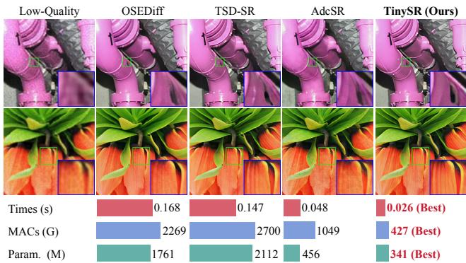
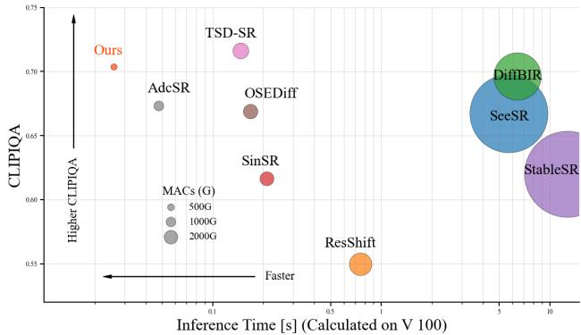

[← 返回 README](../README.md)

# Introduction

## 📌 预览
本文件合并 Introduction/Related Work，重点读多步扩散慢、单步不可控/过重/不保真等动机链。

---

# 1. Introduction

Real-world image super-resolution (Real-ISR) [42, 54] aims to reconstruct high-fidelity images from low-quality observations corrupted by compound degradations including noise contamination, nonlinear blur, and compression artifacts. Recently, diffusion models (DMs) have demonstrated significant promise for Real-ISR by leveraging their powerful priors to effectively address complex degradation patterns while recovering realistic textures and details [19, 34]. Their impressive performance over GAN-based Real-ISR methods [30] has driven their widespread adoption in practical downstream applications. However, for resource-constrained environments, the iterative sampling nature and high computational demands of DMs fundamentally limit their deployment [8].

> 💡 **批注**: 这里在讨论 fidelity-realism/perception-distortion 张力：SR 既要贴近结构，又要生成自然高频细节。

*Figure 1.: Figure 1. A comprehensive comparison of recent Real-ISR models in terms of visual quality, inference time, computational cost (MACs), and parameter count, highlighting the superior efficiency and performance of our proposed method.*

> 💡 **Figure 1. 批读**: 这张图通常承担方法动机、框架或视觉对比作用。重点看它证明的是质量、速度还是可控性。

Significant efforts in reducing diffusion model sampling steps have dramatically improved the inference latency of DM-based Real-ISR approaches. Recent advancements in efficient Real-ISR models, such as OSEDiff [48] and TSD-SR [13] seek to condense the denoising process into a single step by carefully designed distillation while preserving high-quality restoration performance. However, these methods still depend on large pre-trained models, which require significant computational resources and footprint, posing challenges for real-time applications and edgedevice deployment. There is a critical demand for more efficient and compact models that can be readily achieved while maintaining competitive performance.

> 💡 **批注**: 这里的关键词是单步推理：作者试图把原本多次 denoising 的生成先验压缩到一次前向中。

Diffusion compression primarily involves several key techniques, including operator optimization [11, 38], precision quantization [17, 27], width pruning [4, 8, 45], and depth pruning [10, 15, 25, 28]. Depth pruning serves as a simple but effective technique, favored for its linear acceleration and straightforward implementation. The conventional paradigm for depth pruning is dependent upon empirical [25] or importance-based metrics [16, 33] to guide layer selection, yet it overlooks the recoverability of the model’s performance on its target task after being pruned. Instead of relying on static importance scores, probability-based mask learning aims to iteratively refine this sampling distribution, such that layers with greater performance recoverability are more likely to be sampled. However, in ultra-deep networks, mask learning confronts a combinatorial explosion in the search space, which results in prohibitive optimization complexity and slow convergency [15].

> 💡 **批注**: 这是效率相关段落：单步只是减少采样次数，模型结构和 VAE 仍可能是主要延迟来源。

Beyond deep architecture limitation, DMs-based Real-ISR models exhibit two other computational bottlenecks: high overhead from VAE (Variational Auto-Encoder) [26] and inefficiencies from redundant condition modules during super-resolution process. AdcSR [5] eliminates the VAE encoder by employing a PixelUnshuffle operation [37]. However, fine-grained channel pruning is required in denoising networks to align channel dimensions, which significantly increases overall complexity and coupling between its components. Regarding prompts and time embeddings, recent studies [5, 13] indicate that these conditions contribute minimally to the one-step Real-ISR model, suggesting that a more efficient model can be achieved by eliminating these inputs and related modules.

> 💡 **批注**: 这里的关键词是单步推理：作者试图把原本多次 denoising 的生成先验压缩到一次前向中。

Based on these analyses, we propose TinySR, a compact yet effective DMs-based Real-SR model that eliminates computational redundancies in TSD-SR while maintaining restoration quality. Following mask learning, we propose identifying candidate layers that exhibit highperformance recoverability. We partition the network into non-overlapping blocks and introduce sets of learnable probabilities $p ( m )$ for each blcok to constrain search space. We propose Dynamic Inter-block Activation, a method that leverages the learnable probability $q ( t )$ for soft boundary exploration, and introduce a novel Expansion-Corrosion Strategy to determine the optimal pruning scheme. These proposed techniques involve a strategic trade-off between optimization complexity and exploratory potential. Furthermore, we propose several strategies to further compress the Real-ISR model. To lighten the VAE, we perform channel-wise pruning, remove its computationally intensive attention modules, and replace its standard convolutions with depthwise separable convolutions [20]. We eliminate time- and prompt-related modules to further enhance computational efficiency. Extensive experiments on standard Real-ISR benchmarks demonstrate that our method is up to $\pmb { 5 . 6 8 } \times$ faster, with $84 \%$ MAC and $83 \%$ parameter reductions compared to its teacher, TSD-SR, yet preserves strong perceptual quality (Fig. 1) and comparable quantitative results (Fig. 2) .

> 💡 **批注**: 这里在讨论 fidelity-realism/perception-distortion 张力：SR 既要贴近结构，又要生成自然高频细节。

*Figure 2.: Figure 2. Performance and efficiency comparison among DMsbased Real-ISR methods on an NVIDIA V100 GPU. All metrics are evaluated on the RealSR benchmark. TinySR achieves the fastest inference, lightest computation (low MACs) and commendable performance (high CLIPIQA).*

> 💡 **Figure 2. 批读**: 这张图通常承担方法动机、框架或视觉对比作用。重点看它证明的是质量、速度还是可控性。

Overall, our contribution is summarized as follows: • A Real-ISR model called TinySR that achieves $\pmb { 5 . 6 8 } \times$ speedup and $83 \%$ parameter reduction compared to its teacher, while maintaining a strong perceptual quality. • A novel depth pruning method that incorporates Dynamic Inter-block Activation and Expansion-Corrosion Strategy to enable more effective pruning decisions with preserved model performance. • Component streamlining strategies incorporate lightweight VAE, redundant conditional structures pruning, and modulation parameters pre-caching.

> 💡 **批注**: 这里在讨论 fidelity-realism/perception-distortion 张力：SR 既要贴近结构，又要生成自然高频细节。

# 2. Related Work

Real-World Image Super-Resolution. Real-world image super-resolution (Real-ISR) addresses the challenges of reconstructing high-resolution images from low-quality inputs affected by complex, unknown degradations. Early approaches like BSRGAN [54] and Real-ESRGAN [42] pioneered synthetic degradation modeling using random blur, noise, and compression patterns to enhance generalization. While these methods improved the model’s performance, they often introduced undesirable artifacts. The emergence of diffusion models, particularly Stable Diffusion [14, 36], marked a significant advancement in perceptual quality. Techniques incorporating StableSR [40] , DiffBIR [31] and SeeSR [49] demonstrated remarkable results in SR tasks, but their iterative denoising process rendered them impractical for time-sensitive applications. Recent efforts have focused on distilling multi-step diffusion processes into efficient one-step networks. Real-ISR methods such as OSEDiff [48] and TSD-SR [13] introduced specialized distillation techniques for this purpose. Nevertheless, these models still inherit the substantial computational overhead of their diffusion backbones, with parameter counts often exceeding one billion. This high complexity poses a significant challenge for their deployment on mobile and edge devices.

> 💡 **批注**: 这里的关键词是单步推理：作者试图把原本多次 denoising 的生成先验压缩到一次前向中。

*Figure 3.: Figure 3. Depth pruning closely aligns with the theoretical linear acceleration curve compared with width pruning.*

> 💡 **Figure 3. 批读**: 这张图通常承担方法动机、框架或视觉对比作用。重点看它证明的是质量、速度还是可控性。

Efficient Pruning and Compression Techniques. The deployment of large diffusion models on resource-constrained hardware necessitates efficient model compression techniques. TinyFusion [15] enables real-time generation by using learnable depth pruning, which is optimized with LoRA-based fine-tuning and Gumbel-Softmax sampling [22]. Other methods, such as BK-SDM [25] and Snap-Fusion [28], reduce model size and latency through structural pruning and on-the-fly architecture modification. In the domain of super-resolution, AdcSR [5] introduces an adversarial compression methodology that achieves a $3 . 7 \times$ speedup and a $74 \%$ reduction in parameters, while preserving output quality through well-designed adversarial distillation. Collectively, these methods represent a substantial advancement in model compression, enabling resourceconstrained hardware to generate high-quality outputs with improved computational efficiency.

> 💡 **批注**: 这是蒸馏逻辑：用 teacher 或 score regularization 把多步/大模型能力迁移给单步模型。

---

## 🔖 Section 总结

### 核心洞察
1. 把本文 gap 和 one-step SR 主线对应起来。
2. 注意作者如何区分效率、保真、真实感和可控性。
