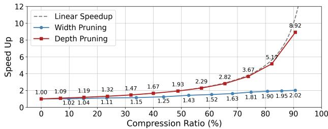

[← 返回 README](../README.md)

# 2. Related Work

## 📌 预览
本节定位相关方法谱系，重点看作者如何区分自己与已有工作。

---

Real-World Image Super-Resolution. Real-world image super-resolution (Real-ISR) addresses the challenges of reconstructing high-resolution images from low-quality inputs affected by complex, unknown degradations. Early approaches like BSRGAN [54] and Real-ESRGAN [42] pioneered synthetic degradation modeling using random blur, noise, and compression patterns to enhance generalization. While these methods improved the model’s performance, they often introduced undesirable artifacts. The emergence of diffusion models, particularly Stable Diffusion [14, 36], marked a significant advancement in perceptual quality. Techniques incorporating StableSR [40] , DiffBIR [31] and SeeSR [49] demonstrated remarkable results in SR tasks, but their iterative denoising process rendered them impractical for time-sensitive applications. Recent efforts have focused on distilling multi-step diffusion processes into efficient one-step networks. Real-ISR methods such as OSEDiff [48] and TSD-SR [13] introduced specialized distillation techniques for this purpose. Nevertheless, these models still inherit the substantial computational overhead of their diffusion backbones, with parameter counts often exceeding one billion. This high complexity poses a significant challenge for their deployment on mobile and edge devices.

> 💡 **批注**: 这段是 one-step SR 主线：关注效率、保真-真实感权衡、扩散/flow 先验或单步生成路径。

*Figure 3.: Figure 3. Depth pruning closely aligns with the theoretical linear acceleration curve compared with width pruning.*

> 💡 **Figure 3. 批读**: 这张图通常承担方法框架、动机或视觉对比作用；重点看它支撑的是机制、效果还是局限。

Efficient Pruning and Compression Techniques. The deployment of large diffusion models on resource-constrained hardware necessitates efficient model compression techniques. TinyFusion [15] enables real-time generation by using learnable depth pruning, which is optimized with LoRA-based fine-tuning and Gumbel-Softmax sampling [22]. Other methods, such as BK-SDM [25] and Snap-Fusion [28], reduce model size and latency through structural pruning and on-the-fly architecture modification. In the domain of super-resolution, AdcSR [5] introduces an adversarial compression methodology that achieves a $3 . 7 \times$ speedup and a $74 \%$ reduction in parameters, while preserving output quality through well-designed adversarial distillation. Collectively, these methods represent a substantial advancement in model compression, enabling resourceconstrained hardware to generate high-quality outputs with improved computational efficiency.

> 💡 **批注**: 这段是 one-step SR 主线：关注效率、保真-真实感权衡、扩散/flow 先验或单步生成路径。

---

## 🔖 Section 总结

### 核心洞察
1. 本节对应论文原始大分节，原文已完整保留。
2. 阅读重点是把本节的机制/证据映射到论文主 claim。
3. 后续如有疑问，可在本 section 继续补充更细批注。
