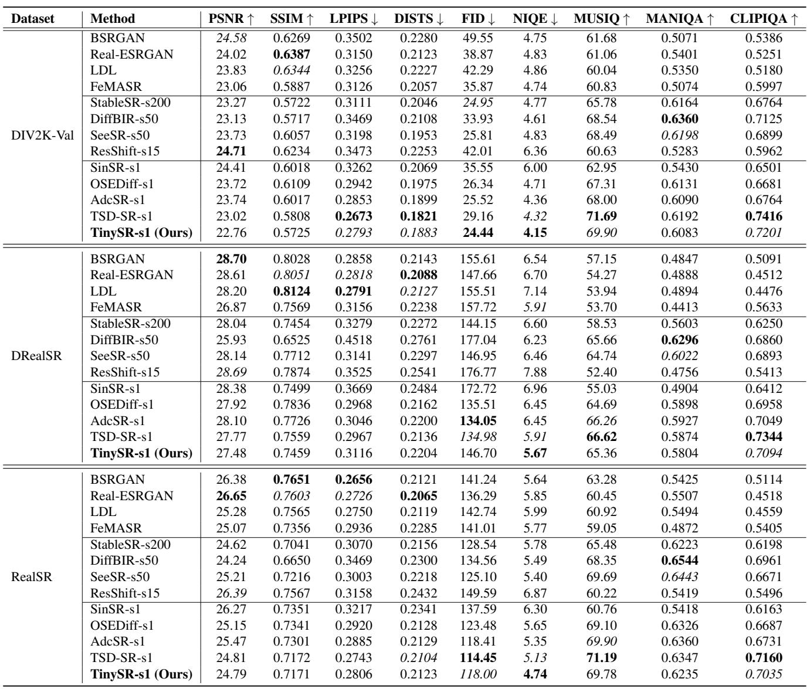
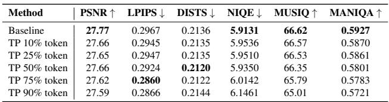
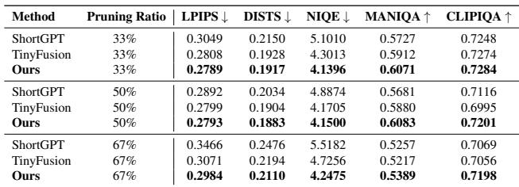
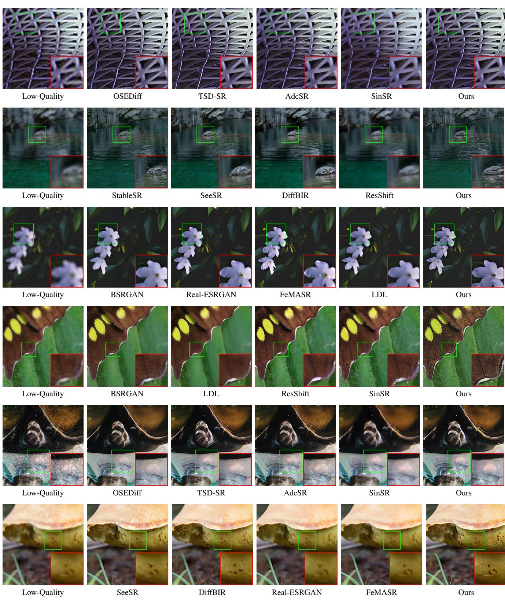
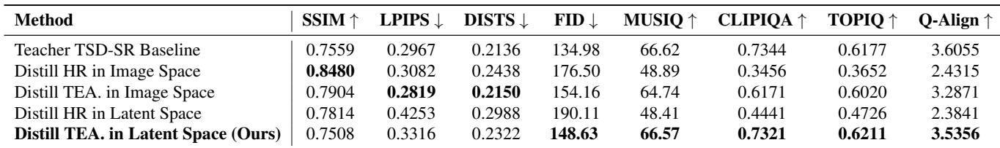
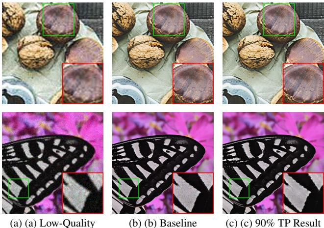
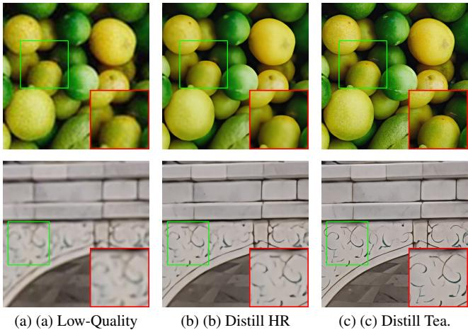

[← 返回 README](../README.md)

# Experiments

## 📌 预览
本文件合并 Experiments/Results/Analysis/Ablation，重点看 fidelity、realism、速度和可控性证据。

---

# 4. Experiments

# 4.1. Experimental Settings

Datasets. We utilize DIV2K [1], Flickr2K [39], LSDIR [29], and FFHQ [23] for training. To synthesize lowresolution and high-resolution image pairs, we employ the same degradation pipeline as described in Real-ESRGAN [42]. We evaluate the performance of our model on the synthetic DIV2K-Val [1] dataset, alongside two real-world datasets, RealSR [3] and DRealSR [46]. The datasets consist of paired images with $1 2 8 \mathrm { x } 1 2 8$ low-quality and 512x512 high-quality resolutions.

> 💡 **批注**: 注意 latent diffusion 架构路径：LQ/HR 往往先被 VAE 编码，再在 latent 空间完成 denoising 或调制。

Evaluation Metrics. For evaluating our method, we apply both full-reference and no-reference metrics. Full-reference metrics include PSNR and SSIM [44] (calculated on the Y channel in YCbCr space) for fidelity, LPIPS [56] and DISTS [12] for perceptual quality, and FID [18] for distribution comparison. No-reference metrics include NIQE [55], MUSIQ [24], MANIQA [51], CLIPIQA [40], TOPIQ [7] and Q-Align [47].

> 💡 **批注**: 这里在讨论 fidelity-realism/perception-distortion 张力：SR 既要贴近结构，又要生成自然高频细节。

# 4.2. Comparison with Existing SR Methods

We categorize existing outstanding SR models into two groups, single-step and multi-step diffusion models. Singlestep models include SinSR [43], OSEDiff [48], TSD-SR [13], and AdcSR [5], and multi-step models include StableSR [41], DiffBIR [31], SeeSR [49], and ResShift [53]. Additional details of GAN-based Real-ISR methods [6, 30, 42, 54] are given in the supplementary material.

> 💡 **批注**: 这里的关键词是单步推理：作者试图把原本多次 denoising 的生成先验压缩到一次前向中。

Quality Comparison. Tab. 1 shows a comparison with DMs-based baselines in Real-ISR tasks. For the first four full-reference metrics, our model achieves performance comparable to its teacher TSD-SR and outperforms most other models, securing the second rank for LPIPS and DISTS. Furthermore, our model achieves the best result for the distribution metric FID. For the latter three no-reference metrics, it demonstrates competitive performance: outperforming all other models for NIQE, and ranking second for both MUSIQ and CLIPIQA, thereby surpassing most other methods.

> 💡 **批注**: 这是蒸馏逻辑：用 teacher 或 score regularization 把多步/大模型能力迁移给单步模型。

Table 1. Quantitative comparison of various methods on the DIV2K-Val dataset, with all efficiency metrics benchmarked on a NVIDIA V100 GPU. The best and second-best results are highlighted in bold, italic, respectively.

> 💡 **批注**: 这是实验证据：要同时看保真指标、感知指标和速度指标。

*Table 1.: Table 1. Quantitative comparison of various methods on the DIV2K-Val dataset, with all efficiency metrics benchmarked on a NVIDIA V100 GPU. The best and second-best results are highlighted in bold, italic, respectively.*

> 💡 **Table 1. 批读**: 表格要横向看 SOTA 排名，也要纵向看 fidelity 指标和 perceptual 指标是否相互牺牲。

As illustrated in Fig. 1 and Fig. 8, TinySR achieves competitive performance in recovering high-quality, sharp, and photorealistic images. Visual artifacts, specifically the generation of fake textures, are frequently observed in outputs from multi-step models such as StableSR, SeeSR, DiffBIR, and ResShift due to their propensity for over-generation. A clear example, demonstrated in Fig. 8 (top), is the spurious generation of hair patterns in regions where they should not exist. OSEDiff and AdcSR consistently demonstrate suboptimal restoration performance, frequently yielding outputs with discernible blur. While TSD-SR exhibits excellent generation capabilities, it also tends to produce fake textures, as shown in Fig. 8 (bottom). TinySR, by contrast, demonstrates robust capabilities in reconstructing natural textures, notably encompassing structural integrity, botanical patterns, and sculpted surface details.

> 💡 **批注**: 注意 latent diffusion 架构路径：LQ/HR 往往先被 VAE 编码，再在 latent 空间完成 denoising 或调制。

Efficiency Comparison. As demonstrated by the last four columns of Tab. 1, the proposed TinySR exhibits superior efficiency in terms of step number, inference time, and computational cost. By leveraging one-step inference and advanced compression, our model achieves dramatic efficiency gains over leading multi-step Real-ISR methods while maintaining comparable performance. Compared to StableSR, SeeSR, DiffBIR, and ResShift, our model delivers significant speed improvements $4 8 9 \times$ , $2 2 0 \times$ , $2 4 7 \times$ , $2 9 \times$ ) with corresponding MAC reductions $1 8 7 \times$ , $1 5 4 \times$ , $5 7 \times$ , and $1 2 \times$ ). Compared to the one-step model SinSR and OSEDiff, it achieves $8 . 1 \times$ and $6 . 4 \times$ acceleration, respectively. Compared to its teacher, TSD-SR, it achieves a $5 . 6 8 \times$ acceleration, a $84 \%$ reduction in computation, and a

> 💡 **批注**: 这里的关键词是单步推理：作者试图把原本多次 denoising 的生成先验压缩到一次前向中。

Table 2. Performance comparison of depth pruning methods on the DIV2K-Val dataset. Our method exhibits superior recovery performance relative to other pruning strategies.

> 💡 **批注**: 这是效率相关段落：单步只是减少采样次数，模型结构和 VAE 仍可能是主要延迟来源。

*Table 2.: Table 2. Performance comparison of depth pruning methods on the DIV2K-Val dataset. Our method exhibits superior recovery performance relative to other pruning strategies.*

> 💡 **Table 2. 批读**: 表格要横向看 SOTA 排名，也要纵向看 fidelity 指标和 perceptual 指标是否相互牺牲。

$83 \%$ decrease in total parameters, as shown in Fig. 5. Notably, In a direct comparison with the current state-of-theart SR compression model, AdcSR, our model also demonstrates superior efficiency, with a $1 . 8 \times$ speedup and a $2 . 4 5 \times$ computation reduction.

> 💡 **批注**: 这是效率相关段落：单步只是减少采样次数，模型结构和 VAE 仍可能是主要延迟来源。

# 4.3. Comparison with Depth Pruning Methods

We evaluate the depth pruning methods following these baselines: (1) Perturbation-based – We randomly prune models and select one with minimal task loss (LPIPS) for training; (2) Similarity-based – Typically, these methods base their decisions on an analysis of the similarity between each layer’s input and output, such as Flux-Lite [10] and ShortGPT [33]; (3) Metric-based – Decision-making through metric in general, such as Sensitivity Analysis [16] and SnapFusion [28]. (4) Experience-based - We follow the design of BK-SDM [25] for corresponding pruning; (5) Probability-based – Decision by optimized probability parameters, such as TinyFusion [15] and our method. Randomly generating and then selecting the minimum loss yields a low initial loss, but exhibits extremely weak recovery ability after training. Similarity-based methods demonstrate suboptimal fidelity (poor DISTS) and pronounced inconsistencies across various no-reference metrics. For example, ShortGPT performs well on CLIPIQA but struggles considerably on MANIQA. Metric-based methods often exhibit a bias towards the metrics they optimize. For instance, while Sensitivity Analysis performs well on reference metrics, and SnapFusion excels on CLIPIQA due to its pruning scheme’s relation to it, both approaches demonstrate shortcomings in other metrics. Although BK-SDM and Tiny-Fusion show some effectiveness, our method exhibits enhanced recoverability over all other approaches, performing favorably across both full-reference and no-reference evaluation metrics.

> 💡 **批注**: 这里在讨论 fidelity-realism/perception-distortion 张力：SR 既要贴近结构，又要生成自然高频细节。

*Figure 8.: Figure 8. Qualitative comparisons of different DMs-based Real-ISR methods. Please zoom in for a better view.*

> 💡 **Figure 8. 批读**: 这张图通常承担方法动机、框架或视觉对比作用。重点看它证明的是质量、速度还是可控性。

Table 3. Ablation study of VAE compression on DrealSR.

*Table 3.: Table 3. Ablation study of VAE compression on DrealSR.*

> 💡 **Table 3. 批读**: 表格要横向看 SOTA 排名，也要纵向看 fidelity 指标和 perceptual 指标是否相互牺牲。

# 4.4. Ablation Study

Effect of VAE Compression. Tab. 3 presents the ablation studies of VAE compression process. Channel pruning offers a significant reduction in computational overhead, with only a minor compromise to perceptual reconstruction fidelity. While removing the attention module effectively doubles inference speed, it can somewhat impact reconstruction quality. For lightweight convolution, an alternative approach, employing SnapGen’s [8] strategy of expanding channels in SepConv intermediate layers, yields performance comparable to our proposed solution. However, our method notably exhibit reduced computational overhead and superior inference efficiency. Our efforts culminated in a lightweight VAE that delivers reconstruction quality on par with the teacher, concurrently achieving a $1 0 \times$ increase in inference speed and a $2 2 \times$ reduction in MACs.

> 💡 **批注**: 这里在讨论 fidelity-realism/perception-distortion 张力：SR 既要贴近结构，又要生成自然高频细节。

Table 4. Ablation study of removing the text embeddings, time embeddings, and related modules on RealSR.

> 💡 **批注**: 这里涉及条件信号：prompt 是否准确、是否退化感知，会影响生成细节与语义一致性。

*Table 4.: Table 4. Ablation study of removing the text embeddings, time embeddings, and related modules on RealSR.*

> 💡 **Table 4. 批读**: 表格要横向看 SOTA 排名，也要纵向看 fidelity 指标和 perceptual 指标是否相互牺牲。

Effect of Removing the Text and Time Modules. Tab. 4 presents the ablation study on the elimination of text and time conditions, which demonstrates that our approach achieves a highly favorable trade-off between efficiency and quality. Excising the text embeddings and related context modules yields a 486M parameter, 108G MACs, and 8ms time reduction, while only marginally decreasing the CLIP-IQA score by 0.0046 and the MANIQA score by 0.0048. Subsequent removal of the time modules further reduces parameters by 8M with a negligible impact on final quality.

> 💡 **批注**: 这里在讨论 fidelity-realism/perception-distortion 张力：SR 既要贴近结构，又要生成自然高频细节。

# B. More Comparisons on Benchmarks

# B.1. More Quantitative Comparisons

We compared GAN-based and diffusion-based methods across various datasets (DIV2K-Val [1], DrealSR [46], RealSR [3]), with the results presented in Table A.1. We observe that traditional GAN-based approaches [6, 30, 42, 54] generally excel on full-reference metrics, particularly PSNR and SSIM. However, some studies indicate that PSNR and SSIM often do not accurately reflect fidelity under more complex degradation conditions [13, 50, 52]. In most perceptual quality metrics, such as NIQE [55], MUSIQ [24], MANIQA [51] and CLIPIQA [40], diffusionbased methods demonstrate superior performance compared to these GANs, highlighting their enhanced capability in generating natural textures. TinySR achieved competitive performance across most metrics, demonstrating comparable results to its teacher model, TSD-SR, and showcasing the robust recoverability of the pruning methods.

> 💡 **批注**: 这里在讨论 fidelity-realism/perception-distortion 张力：SR 既要贴近结构，又要生成自然高频细节。

# B.2. More Qualitative Comparisons

Figure B.1 presents a visual comparison between the GANbased and diffusion-based methods. GAN-based methods often struggle to recover fine, high-frequency details, resulting in blurred textures. For instance, models such as BSRGAN, Real-ESRGAN, LDL, and FeMASR produce blurring on petal textures. Similarly, BSRGAN and LDL create overly smooth butterfly wings, while Real-ESRGAN and FeMASR fail to reconstruct crisp mushroom textures. This consistent lack of detail suggests a fundamental limitation in the ability of these GAN-based approaches to restore high-frequency information. Multi-step diffusionbased methods, such as StableSR, DiffBIR, SeeSR, and ResShift, can introduce artifacts when restoring natural textures like water and rocks, and may also produce blurred details. Notably, DiffBIR is particularly susceptible to overgeneration, which can result in illogical or unnatural textures, as has been observed in the restoration of images containing mushrooms. Methods like OSEdiff, AdcSR, and SinSR can suffer from incomplete denoising and are prone to generating broken or fragmented textures during the super resolution process. Our model demonstrates highly competitive performance, excelling in both structural and texture recovery. Compared to other methods, it restores a greater degree of high-frequency detail while rigorously maintaining overall structural integrity.

> 💡 **批注**: 这里涉及条件信号：prompt 是否准确、是否退化感知，会影响生成细节与语义一致性。

# C. More Ablation Studies.

# C.1. Ablation Study on Prompt Condition

Table C.1 presents the results of token pruning of the teacher model. We found that pruning prompt information does not negatively impact certain full-referenced metrics. In fact, some metrics, such as LPIPS and DISTS, even show improvement at specific pruning rates. Token pruning primarily affects no-referenced metrics. However, we observe no significant performance degradation even at a $50 \%$ pruning ratio. Furthermore, performance degrades gracefully at higher pruning percentages without a sharp decline, which suggests that the contribution of textual information to the final image synthesis is limited. As shown in Figure C.1, although TP $90 \%$ token’s output contains less fine-grained detail than the baseline, it effectively removes the noise from the low-quality input, resulting in an image with high visual quality.

> 💡 **批注**: 这是蒸馏逻辑：用 teacher 或 score regularization 把多步/大模型能力迁移给单步模型。

# C.2. Ablation Study on Pruning Ratio

Table C.2 compares the performance of our method against ShortGPT and TinyFusion across various metrics at token pruning ratios of $33 \%$ , $50 \%$ , and $67 \%$ . The results show our approach surpassing TinyFusion [15] and ShotGPT [33] at every pruning ratio, which demonstrates its robust ability to recover performance. Furthermore, the model exhibits only a slight degradation in performance as the pruning ratio is increased from $33 \%$ to $50 \%$ , indicating the continued presence of parameter redundancy at the $33 \%$ level. However, as the pruning rate increases from $50 \%$ to $67 \%$ , the model’s performance on metrics such as DISTS and MANIQA declines sharply, indicating that excessive pruning leads to irreversible performance degradation.

> 💡 **批注**: 这是效率相关段落：单步只是减少采样次数，模型结构和 VAE 仍可能是主要延迟来源。

# C.3. Ablation Study of Knowledge Distillation

Table C.3 demonstrates the effectiveness of our knowledge distillation method under stage 1. We can draw the following conclusions: (1) Distillation employing GT (High-Quality) data consistently resulted in unsatisfactory performance, whether applied in the image space or the latent space. As illustrated in Figure C.2, distillation using GT data yields smooth, blurred results, whereas using the teacher produces clearer textures. (2) Distillation performed in the image space achieves better scores on fullreference metrics such as SSIM, LPIPS, and DISTS. Distillation in the latent space yields superior no-reference metrics (MUSIQ, CLIPIQA, TOPIQ and Q-Align), with most even matching those of the teacher model. However, a potential compromise in reference metrics necessitates a second stage of training, which we perform in the image space.

> 💡 **批注**: 这是蒸馏逻辑：用 teacher 或 score regularization 把多步/大模型能力迁移给单步模型。

Table A.1. Quantitative comparison among different GAN-based and diffusion-based Real-ISR approaches on both synthetic and realworld benchmarks. “s” denotes the required number of sampling steps in the diffusion-based method. The best and second-best results are highlighted in bold, italic, respectively

> 💡 **批注**: 这是实验证据：要同时看保真指标、感知指标和速度指标。

*Table A.1.: Table A.1. Quantitative comparison among different GAN-based and diffusion-based Real-ISR approaches on both synthetic and realworld benchmarks. “s” denotes the required number of sampling steps in the diffusion-based method. The best and second-best results are highlighted in bold, italic, respectively*

> 💡 **Table A.1. 批读**: 表格要横向看 SOTA 排名，也要纵向看 fidelity 指标和 perceptual 指标是否相互牺牲。

Table C.1. Ablation study of prompt token pruning (TP) on DrealSR dataset. The best is highlighted in bold.

> 💡 **批注**: 这里涉及条件信号：prompt 是否准确、是否退化感知，会影响生成细节与语义一致性。

*Table C.1.: Table C.1. Ablation study of prompt token pruning (TP) on DrealSR dataset. The best is highlighted in bold.*

> 💡 **Table C.1. 批读**: 表格要横向看 SOTA 排名，也要纵向看 fidelity 指标和 perceptual 指标是否相互牺牲。

# C.4. Ablation Study of Losses in Stage 2

We conduct an ablation study on the Stage 2 training losses, as shown in Table C.4. The results indicate that Stage 2 training significantly improved image quality, particularly

> 💡 **批注**: 这是实验证据：要同时看保真指标、感知指标和速度指标。

Table C.2. Ablation study of pruning ratio on DIV2K-Val dataset. The best is highlighted in bold.

> 💡 **批注**: 这是效率相关段落：单步只是减少采样次数，模型结构和 VAE 仍可能是主要延迟来源。

*Table C.2.: Table C.2. Ablation study of pruning ratio on DIV2K-Val dataset. The best is highlighted in bold.*

> 💡 **Table C.2. 批读**: 表格要横向看 SOTA 排名，也要纵向看 fidelity 指标和 perceptual 指标是否相互牺牲。

in terms of image fidelity. Specifically, we find that the inclusion of LPIPS loss is highly beneficial for improving

> 💡 **批注**: 这里在讨论 fidelity-realism/perception-distortion 张力：SR 既要贴近结构，又要生成自然高频细节。

*Figure B.1.: Figure B.1. Qualitative comparisons of GAN-based and diffusion-based Real-ISR methods. Please zoom in for a better view.*

> 💡 **Figure B.1. 批读**: 这张图通常承担方法动机、框架或视觉对比作用。重点看它证明的是质量、速度还是可控性。

reference metrics such as DISTS and FID. The addition

of GAN loss, in turn, is helpful for enhancing several no-

Table C.3. Ablation studies of Stage 1 distillation loss on DrealSR dataset. The best (other than Teacher) is highlighted in bold.

> 💡 **批注**: 这是蒸馏逻辑：用 teacher 或 score regularization 把多步/大模型能力迁移给单步模型。

*Table C.3.: Table C.3. Ablation studies of Stage 1 distillation loss on DrealSR dataset. The best (other than Teacher) is highlighted in bold.*

> 💡 **Table C.3. 批读**: 表格要横向看 SOTA 排名，也要纵向看 fidelity 指标和 perceptual 指标是否相互牺牲。

*Figure C.1.: Figure C.1. Applying $90 \%$ token pruning (TP) yields visually comparable results to the baseline with a slight quality drop, indicating the limited contribution of the default prompt.*

> 💡 **Figure C.1. 批读**: 这张图通常承担方法动机、框架或视觉对比作用。重点看它证明的是质量、速度还是可控性。

*Figure C.2.: Figure C.2. Visual comparison of knowledge distillation: highresolution ground truth versus teacher.*

> 💡 **Figure C.2. 批读**: 这张图通常承担方法动机、框架或视觉对比作用。重点看它证明的是质量、速度还是可控性。

reference metrics, including NIQE and MANIQA. We ultimately weighted the two new losses to balance the trade-off between fidelity and the generative ability.

> 💡 **批注**: 这里在讨论 fidelity-realism/perception-distortion 张力：SR 既要贴近结构，又要生成自然高频细节。

---

## 🔖 Section 总结

### 核心洞察
1. 检查 fidelity/perceptual/速度指标是否同时成立。
2. 关注消融和可控性曲线/视觉样例。
