[← 返回 README](../README.md)

# 3. Methodology

## 📌 预览
本节是核心方法，重点看模块输入输出、训练目标、推理路径和与 baseline 的差异。

---

We aim to learn a compact but effective diffusion model for real-world image super-resolution (Real-ISR). To mitigate the computational load and inference latency caused by the excessively deep architecture of the TSD-SR network, we prioritize depth pruning (Sec. 3.1) due to its superior pruning efficiency, as shown in Fig. 3. In Sec. 3.2, we introduce several key innovations to improve computational efficiency, including a lightweight VAE, a conditional information removal strategy, and a pre-caching technology. Last, the complete training recipes are given in Sec. 3.3.

> 💡 **批注**: 这段是 one-step SR 主线：关注效率、保真-真实感权衡、扩散/flow 先验或单步生成路径。

# 3.1. Dynamic Depth Pruning

Depth Pruning Formulation. Consider an $N$ -layers transformer parameterized by $\Phi ~ = ~ [ \phi _ { 1 } , \phi _ { 2 } , \ldots , \phi _ { N } ] ^ { T }$ , where each $\phi _ { i } ~ \in { \mathbb { R } } ^ { D }$ . Our goal is to identify an optimal binary mask $m \in \{ 0 , 1 \} ^ { N }$ that enables effective pruning while maintaining strong Super-Resolution (SR) performance. The pruning mechanism is defined by:

> 💡 **批注**: 这段是 one-step SR 主线：关注效率、保真-真实感权衡、扩散/flow 先验或单步生成路径。

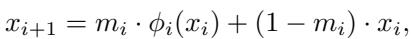
*Equation 1: Equation extracted by MinerU.*

> 💡 **Equation 1 批读**: 公式通常定义过程、loss 或更新规则；建议把符号对应到输入、模型、记忆/控制变量与输出。

here, $x _ { i }$ is the input to the $i$ -th layer, and $\phi _ { i } ( x _ { i } )$ is its output. Traditional methods for determining the masking scheme commonly rely on heuristic-based layer importance (e.g., sensitivity analysis and metrics-based selection) or empirical manual configurations. However, these carefully designed strategies typically overlook the intricate and interdependent layer dynamics within SR diffusion transformers, leading to suboptimal optimization and potentially weak recoverability in the retained layers.

> 💡 **批注**: 这段是 one-step SR 主线：关注效率、保真-真实感权衡、扩散/flow 先验或单步生成路径。

Inspired by TinyFusion [15], instead of pursuing models that rely on immediate high-importance feedback, we propose identifying candidate layers with strong recoverability, enabling more efficient teacher-student knowledge distillation. We formalize the pruning process as a bi-level optimization problem:

> 💡 **批注**: 这段是 one-step SR 主线：关注效率、保真-真实感权衡、扩散/flow 先验或单步生成路径。

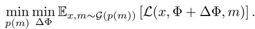
*Equation 2: Equation extracted by MinerU.*

> 💡 **Equation 2 批读**: 公式通常定义过程、loss 或更新规则；建议把符号对应到输入、模型、记忆/控制变量与输出。

This objective is to identify an optimal mask that minimizes the loss function $\mathcal { L }$ during the optimization process. Since discrete mask selection is non-differentiable, we reparameterize each mask option with a learnable probability parameter $p ( m )$ and then use Gumbel-Softmax [22] trick $\mathcal { G }$ to do differentiable sampling:

> 💡 **批注**: 这是实验证据段：同时看主指标、消融、效率和案例，判断 claim 是否被支撑。

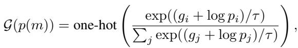
*Equation 3: Equation extracted by MinerU.*

> 💡 **Equation 3 批读**: 公式通常定义过程、loss 或更新规则；建议把符号对应到输入、模型、记忆/控制变量与输出。

where $g _ { i }$ is random noise drawn from the Gumbel distribution and $\tau$ refers to the temperature term. The probabilistic sampling of $m$ can be achieved by $m = \mathcal { G } ( \boldsymbol { p } ( \boldsymbol { m } ) ) ^ { T } \cdot \mathcal { M } , \mathcal { M }$ represents the complete search space. For the final pruning decision, we pick $m$ with maximum $p ( m )$ , as it reveals the strongest recovery. We call this process mask learning.

Search Space Dilemma. A significant challenge in standard mask learning arises from the combinatorial explosion. Let $M : N$ denote the selection of $M$ from $N$ layers, and $C _ { N } ^ { M }$ denote the set of combinations. As $N$ grows, pruning $50 \%$ will show an explosive trend. For instance, pruning $50 \%$ of a 24-layer transformer $C _ { 2 4 } ^ { 1 2 }$ leads to 2,704,156 possible solutions, making direct probabilistic optimization expensive. Naive approaches address this by partitioning an $N$ -layer network into $K$ non-overlapping blocks of size $B$ , enforcing uniform pruning within each. Assuming statistical independence of the pruning decisions, the total probability $p ( m )$ can be factored into the product of local probabilities $\overset { \cdot } { p } ( \overset { \cdot } { m } ^ { ( j ) } )$ :

> 💡 **批注**: 这段信息较密，建议拆成“问题/设定 → 方法/机制 → 结果/影响”三层读。

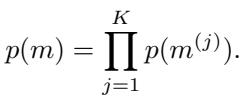
*Equation 4: Equation extracted by MinerU.*

> 💡 **Equation 4 批读**: 公式通常定义过程、loss 或更新规则；建议把符号对应到输入、模型、记忆/控制变量与输出。

While this simplifies the search, it drastically curtails the space of possible solutions. The cardinality of this feasible

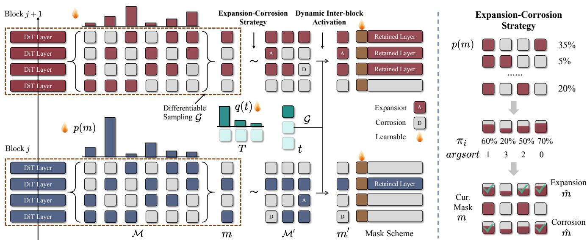
*Figure 4.: Figure 4. Our proposed mask learning method performs a probability-based decision for candidate solutions, jointly optimized with network weight updates. $p ( m )$ characterizes the probability distribution for each block’s pruning scheme. We perform a transformation probability $q ( t )$ to facilitate dynamic interaction between masks in different blocks, namely Dynamic Inter-block Activation. Leveraging the transfer scheme, we employ an Expansion-Corrosion Strategy to determine the final mask by expanding on elements with maximum marginal probability and corroding those with low marginal probability.*

> 💡 **Figure 4. 批读**: 这张图通常承担方法框架、动机或视觉对比作用；重点看它支撑的是机制、效果还是局限。

subspace, denoted $\mathcal { M } _ { v a l i d }$ is given by:

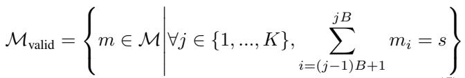
*Equation 5: Equation extracted by MinerU.*

> 💡 **Equation 5 批读**: 公式通常定义过程、loss 或更新规则；建议把符号对应到输入、模型、记忆/控制变量与输出。

The accessible fraction of the search space is $\begin{array} { r l } { \frac { | \mathcal { M } _ { \mathrm { v a l i d } } | } { | \mathcal { M } | } } & { = } \end{array}$ $\frac { 4 6 , 6 5 6 } { 2 , 7 0 4 , 1 5 6 } \approx 1 . 7 2 5 \%$ . This demonstrates that over $98 \%$ of all possible pruning masks are rendered unreachable by the imposition of this seemingly innocuous local constraint. Consequently, the true optimal pruning scheme may be inadvertently excluded from this narrowly defined search space.

Dynamic Inter-block Activation. To transcend the limitations of this static partitioning, we introduce a novel pruning framework based on dynamic inter-block activation, as shown in Fig. 4. The core motivation is to relax the rigid local constraints and empower the pruning process to discover its own optimal layer distribution across the network. Instead of confining the search to the highly-constrained $\mathcal { M } _ { v a l i d }$ , our method begins within this space yet is allowed to explore beyond it. We achieve this by defining a set of probabilistic transformation operators, $T$ , governed by distribution parameters $q ( t )$ . Specifically, $T _ { j  h } ( m , k )$ transforms $m$ into $m ^ { \prime }$ by pruning $k$ active layers from block $j$ (or $h$ ) while restoring $k$ layers in $h$ (or $j$ ). This mechanism ensures that the total number of active layers remains constant across the pair of blocks $( j , h )$ while dynamically adjusting their individual sparsity profiles. The transformation distribution parameters $q ( t )$ , are also learnable and applicable to sample a specific scheme through $\mathcal { G }$ . For example, we assume $k = 1 , h = j + 1$ and define the option space as $\mathcal { M } ^ { \prime } = \{ m ^ { - } , m , m ^ { + } \}$ , where $m$ is the pruning mask sampled by $p ( m )$ , and $m ^ { - }$ (resp. $m ^ { + }$ ) denotes $T _ { j  j + 1 } ( m , 1 )$ (resp. $T _ { j  j + 1 } ( m , 1 ) )$ ). The specific mask can be represented as $m ^ { \prime } = \mathcal { G } ( q ( t ) ) ^ { T } \cdot \mathcal { M } ^ { \prime }$ . And the total probability can be expressed as:

> 💡 **批注**: 这是实验证据段：同时看主指标、消融、效率和案例，判断 claim 是否被支撑。

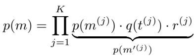
*Equation 6: Equation extracted by MinerU.*

> 💡 **Equation 6 批读**: 公式通常定义过程、loss 或更新规则；建议把符号对应到输入、模型、记忆/控制变量与输出。

where $r$ is the probability of reaching $m$ through $t$ , and is related to expansion-corrosion strategies.

Expansion-Corrosion Strategy. Instead of random perturbation-based expansion or corrosion, our approach utilizes the maximum marginal probability:

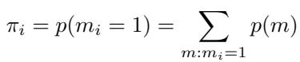
*Equation 7: Equation extracted by MinerU.*

> 💡 **Equation 7 批读**: 公式通常定义过程、loss 或更新规则；建议把符号对应到输入、模型、记忆/控制变量与输出。

which is derived from training priors. Specifically, we start by sorting the values of $\pi _ { i }$ in descending order. Then we iteratively select candidate layers, corresponding to these sorted values, to form our candidate mask $\hat { m }$ , which is guaranteed to be $| m \vee \hat { m } | _ { 1 } - | m | _ { 1 } = k$ for expansion and $| m | _ { 1 } - | m \wedge \hat { m } | _ { 1 } = k$ for erosion. To ensure backpropagation, we replace the original intersection and union operations with the following simplified computations:

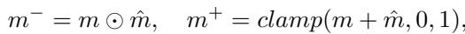
*Equation 8: Equation extracted by MinerU.*

> 💡 **Equation 8 批读**: 公式通常定义过程、loss 或更新规则；建议把符号对应到输入、模型、记忆/控制变量与输出。

here, $\odot$ represents the element-wise product. This continuous relaxation maintains the meaning of expansion or corrosion while allowing for gradient flow, which is crucial for training our pruning models.

> 💡 **批注**: 这段是 one-step SR 主线：关注效率、保真-真实感权衡、扩散/flow 先验或单步生成路径。

Pruning Decision. Unlike traditional mask learning, where decisions are made directly from $p ( m )$ , our approach determines the transformations for each block based on maximum $q ( t )$ and then selects the final mask based on $\pi$ .

# 3.2. Component Streamlining

Efficient VAE Architecture. We identify three primary performance bottlenecks in the VAE of the TSD-SR framework: 1) Excessively large channel dimensions. As shown in Fig. 6(a), the MACs of components exhibit significant and widely varying reductions after pruning, particularly across compute-intensive modules such as the down, up and mid blocks. 2) Computationally intensive attention mechanisms. As shown in Fig. 6(b), compared to the resnet block, the attention block poses a more significant computational bottleneck, primarily due to its considerably higher MAC count. 3) Time-consuming standard convolution. Convolutional operations are computationally dominant within the VAE, constituting more than $8 5 \%$ of the overall computational workload. To address the above problem, we perform pruning on both the encoder and decoder. Specifically, following [2], we first prune the maximum channel width to 64 throughout the network, substantially reducing both parameter count and computational complexity. All self-attention modules are subsequently removed from the architecture to mitigate their substantial computational expense. To better accommodate higher compression rates, we integrate depthwise separable convolutions [9, 20] into the encoder. However, the same modification proves detrimental to the decoder’s performance, leading us to restrict the use of lightweight convolutions to the encoder alone.

> 💡 **批注**: 这段是 one-step SR 主线：关注效率、保真-真实感权衡、扩散/flow 先验或单步生成路径。

Pruning Redundant Conditional Structures. In the TSD-SR model (our teacher), prompt embeddings, essential for text-to-image generation, contribute minimally to image SR tasks (Fig. 7), as it uses the default prompt embedding. Similarly, the time embedding layers, crucial for multi-step diffusion, are redundant in single-step SR and can be removed to reduce computational cost without affecting output quality. The removal of redundant structures effectively reduces model inference latency, as shown in Fig. 5.

> 💡 **批注**: 这段是 one-step SR 主线：关注效率、保真-真实感权衡、扩散/flow 先验或单步生成路径。

Pre-cache Modulation Param. In TSD-SR architecture, shift and scale parameters are generated by adaLN-Zero modulation [14, 35]. A key finding is that these modulation parameters generated by our model stabilize post-training and no longer exhibit input dependency. This property enables us to pre-compute and cache these parameters, which are then loaded for inference, leading to a significant reduction in computational overhead.

> 💡 **批注**: 这段是 one-step SR 主线：关注效率、保真-真实感权衡、扩散/flow 先验或单步生成路径。

Collectively, the above optimizations yield a compact model with an $83 \%$ reduction in parameters and an $84 \%$ reduction in MACs, while maintaining comparable quality and a $5 . 6 8 \times$ acceleration, as demonstrated in Fig. 5.

> 💡 **批注**: 这段是 one-step SR 主线：关注效率、保真-真实感权衡、扩散/flow 先验或单步生成路径。

# 3.3. Training Scheme

VAE Training. We train the VAE encoder $\mathcal { E } _ { t i n y }$ by aligning latent space features using MSE loss:

> 💡 **批注**: 这段是 one-step SR 主线：关注效率、保真-真实感权衡、扩散/flow 先验或单步生成路径。

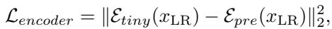
*Equation 9: Equation extracted by MinerU.*

> 💡 **Equation 9 批读**: 公式通常定义过程、loss 或更新规则；建议把符号对应到输入、模型、记忆/控制变量与输出。

here, $x _ { \mathrm { L R } }$ represents low-quality data, $\mathcal { E } _ { \mathrm { p r e } }$ is the pretrained encoder. Training is conducted for $1 0 0 \mathrm { k }$ steps using a batch size of 64 and a learning rate (AdamW optimizer [32]) of 3e-4 for this phase. We use LPIPS loss and GAN loss to train the VAE decoder $\mathcal { D } _ { t i n y }$ :

> 💡 **批注**: 这段是 one-step SR 主线：关注效率、保真-真实感权衡、扩散/flow 先验或单步生成路径。

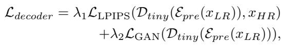
*Equation 10: Equation extracted by MinerU.*

> 💡 **Equation 10 批读**: 公式通常定义过程、loss 或更新规则；建议把符号对应到输入、模型、记忆/控制变量与输出。

here, $x _ { \mathrm { H R } }$ represents high-quality data. We set $\lambda _ { 1 }$ to 3 and $\lambda _ { 2 }$ to 1. These two loss functions are jointly optimized to ensure both high fidelity and superior perceptual quality in the reconstructed images.

> 💡 **批注**: 这段是 one-step SR 主线：关注效率、保真-真实感权衡、扩散/flow 先验或单步生成路径。

Pruning Decision Training. To ensure the recoverability of pruning, we design the optimization of mask learning using distillation and task losses. Specifically, the task loss is defined as LPIPS loss and $\mathrm { L _ { 1 } }$ loss is utilized for the distillation loss. The total loss is expressed as follows:

> 💡 **批注**: 这是蒸馏逻辑：重点看 teacher 的什么能力被迁移给 student，以及训练/推理阶段各自保留哪些模块。

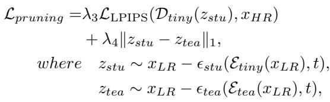
*Equation 11: Equation extracted by MinerU.*

> 💡 **Equation 11 批读**: 公式通常定义过程、loss 或更新规则；建议把符号对应到输入、模型、记忆/控制变量与输出。

$\epsilon _ { s t u }$ denotes the student denoising network, while $\epsilon _ { t e a }$ represents the teacher. $t$ denotes timesteps, and $\mathcal { E } _ { t e a }$ denotes the teacher encoder. Training is conducted for $1 0 0 \mathrm { k }$ iterations across 8 NVIDIA V100 GPUs, employing a learning rate of 5e-5 and a global batch size of 8. We use LoRA [21] for training. $\lambda _ { 3 }$ and $\lambda _ { 4 }$ are both set to 1.

> 💡 **批注**: 这段是 one-step SR 主线：关注效率、保真-真实感权衡、扩散/flow 先验或单步生成路径。

Restoration Training. A two-stage training approach is utilized to expedite model convergence. The first stage involves latent space training with the distillation loss for efficient feature alignment:

> 💡 **批注**: 这段是 one-step SR 主线：关注效率、保真-真实感权衡、扩散/flow 先验或单步生成路径。

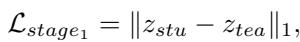
*Equation 12: Equation extracted by MinerU.*

> 💡 **Equation 12 批读**: 公式通常定义过程、loss 或更新规则；建议把符号对应到输入、模型、记忆/控制变量与输出。

The meaning of $z _ { s t u }$ and $z _ { t e a }$ is the same as mentioned above. Training in the latent space enables us to use a larger global batch size (128) on 8 V100 GPUs. We set the learning rate to 1e-4 and the LoRA rank to 64. The second stage then adds LPIPS and GAN losses in the pixel space to improve image-level fidelity:

> 💡 **批注**: 这段是 one-step SR 主线：关注效率、保真-真实感权衡、扩散/flow 先验或单步生成路径。

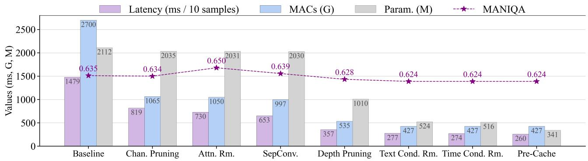
*Figure 5.: Figure 5. Comparisons of performance and efficiency for various design of efficient TinySR. Quality is measured by the MANIQA score, calculated on RealSR dataset. Efficiency is assessed via latency, MACs, and parameters. Latency and MACs are benchmarked for superresolution a $1 2 8 \times 1 2 8$ low-quality image on a n NVIDIA V100 GPU. Our model achieves a $5 . 6 8 \times$ acceleration with $83 \%$ fewer parameters and $84 \%$ lower MACs, while maintaining comparable quality to the baseline.*

> 💡 **Figure 5. 批读**: 这张图通常承担方法框架、动机或视觉对比作用；重点看它支撑的是机制、效果还是局限。

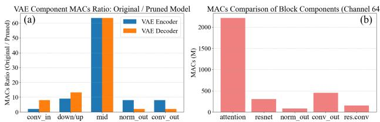
*Figure 6.: Figure 6. Left: Channel pruning effectively reduces MACs across all modules, particularly in the computationally intensive down/up and middle blocks. Right: Attention mechanism dominates the computational cost in a 64-channel VAE.*

> 💡 **Figure 6. 批读**: 这张图通常承担方法框架、动机或视觉对比作用；重点看它支撑的是机制、效果还是局限。

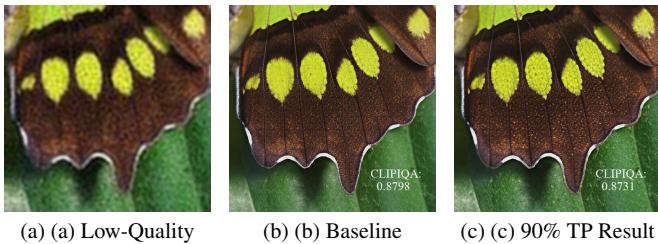
*Figure 7.: Figure 7. Applying $90 \%$ token pruning (TP) yields visually comparable results to the baseline with a slight quality drop, indicating the limited contribution of the default prompt.*

> 💡 **Figure 7. 批读**: 这张图通常承担方法框架、动机或视觉对比作用；重点看它支撑的是机制、效果还是局限。

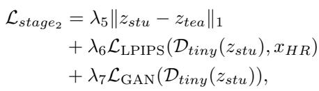
*Equation 13: Equation extracted by MinerU.*

> 💡 **Equation 13 批读**: 公式通常定义过程、loss 或更新规则；建议把符号对应到输入、模型、记忆/控制变量与输出。

where $\lambda _ { 5 } , \lambda _ { 6 }$ , and $\lambda _ { 7 }$ are set to 5, 1, and 0.3, respectively. We fine-tune our model for $5 0 \mathrm { k }$ steps on 8 V100 GPUs, with a global batch size of 96, a learning rate of 1e-6 for student (5e-6 for discriminator), and a LoRA rank of 64.

> 💡 **批注**: 这段是 one-step SR 主线：关注效率、保真-真实感权衡、扩散/flow 先验或单步生成路径。

Comprehensive experimental details for the training procedure are available in the supplementary material.

---

## 🔖 Section 总结

### 核心洞察
1. 本节对应论文原始大分节，原文已完整保留。
2. 阅读重点是把本节的机制/证据映射到论文主 claim。
3. 后续如有疑问，可在本 section 继续补充更细批注。
