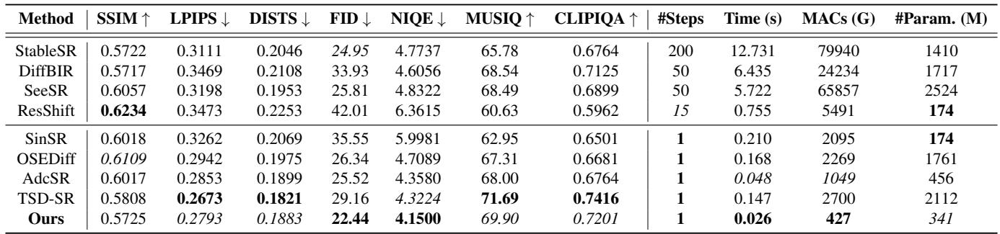
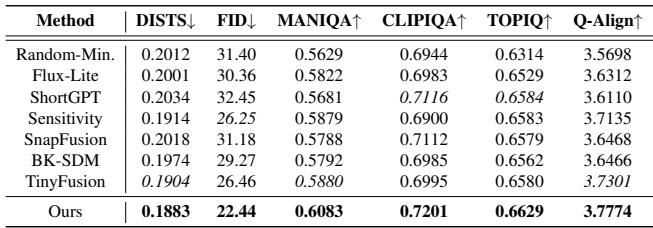
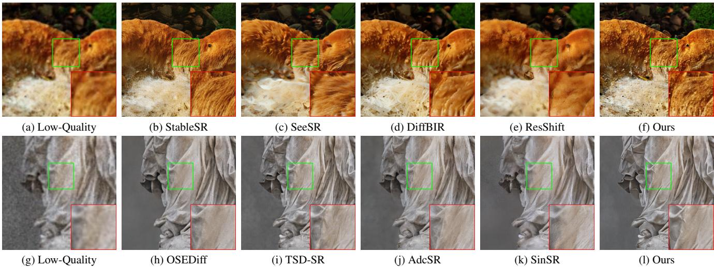
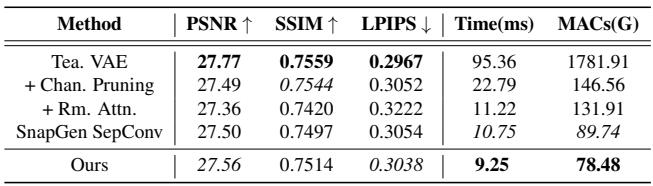
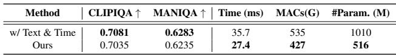

[← 返回 README](../README.md)

# 4. Experiments

## 📌 预览
本节验证 TinySR 的 claim，重点看主结果、消融、效率、视觉案例和 trade-off 是否一致。
---

> 💡 **Q&A 批注记录**:
> - Q: 剪掉 time/prompt 分支是否危险？
> - A: 单步 teacher 往往固定 timestep/prompt 使用，移除可减少冗余；但这也意味着 TinySR 更适合固定单步 SR 推理，不适合继续依赖文本控制或多步时间条件的模型。

# 4.1. Experimental Settings
> 💡 **小节预览**: 实验要同时看三件事：质量指标是否守住、速度是否真的来自压缩、消融是否支撑 DIA/VAE/time-prompt 这些核心 claim。

Datasets. We utilize DIV2K [1], Flickr2K [39], LSDIR [29], and FFHQ [23] for training. To synthesize lowresolution and high-resolution image pairs, we employ the same degradation pipeline as described in Real-ESRGAN [42]. We evaluate the performance of our model on the synthetic DIV2K-Val [1] dataset, alongside two real-world datasets, RealSR [3] and DRealSR [46]. The datasets consist of paired images with $1 2 8 \mathrm { x } 1 2 8$ low-quality and 512x512 high-quality resolutions.
> 💡 **数据批读**: 训练退化沿用 Real-ESRGAN pipeline，测试覆盖 synthetic DIV2K-Val 和真实 RealSR/DRealSR。输入输出固定为 128x128 到 512x512，也解释了后文 latency/MACs 的 benchmark 条件。

Evaluation Metrics. For evaluating our method, we apply both full-reference and no-reference metrics. Full-reference metrics include PSNR and SSIM [44] (calculated on the Y channel in YCbCr space) for fidelity, LPIPS [56] and DISTS [12] for perceptual quality, and FID [18] for distribution comparison. No-reference metrics include NIQE [55], MUSIQ [24], MANIQA [51], CLIPIQA [40], TOPIQ [7] and Q-Align [47].
> 💡 **实验设置**: 这里要核对三点：训练退化是否公平、测试集是否真实、指标是否同时覆盖 fidelity 与 perceptual quality。

# 4.2. Comparison with Existing SR Methods
> 💡 **小节预览**: 主对比要把 TinySR 放在两类 baseline 之间读：多步 diffusion 质量强但慢，one-step diffusion 快但模型仍重，TinySR 要占据更好的速度-质量折中点。

We categorize existing outstanding SR models into two groups, single-step and multi-step diffusion models. Singlestep models include SinSR [43], OSEDiff [48], TSD-SR [13], and AdcSR [5], and multi-step models include StableSR [41], DiffBIR [31], SeeSR [49], and ResShift [53]. Additional details of GAN-based Real-ISR methods [6, 30, 42, 54] are given in the supplementary material.
> 💡 **Baseline 批读**: TSD-SR 是 teacher，也是最关键参照；AdcSR 是压缩型 SR baseline；OSEDiff/SinSR 是其他单步路线。TinySR 赢多步模型速度不意外，真正要看它相对 TSD-SR/AdcSR 的质量和效率。

Quality Comparison. Tab. 1 shows a comparison with DMs-based baselines in Real-ISR tasks. For the first four full-reference metrics, our model achieves performance comparable to its teacher TSD-SR and outperforms most other models, securing the second rank for LPIPS and DISTS. Furthermore, our model achieves the best result for the distribution metric FID. For the latter three no-reference metrics, it demonstrates competitive performance: outperforming all other models for NIQE, and ranking second for both MUSIQ and CLIPIQA, thereby surpassing most other methods.
> 💡 **质量批读**: 这段的重点是“接近 teacher”而不是全面 SOTA。TinySR 在 LPIPS/DISTS/FID 和部分 no-reference 指标上保持竞争力，说明压缩后没有明显滑向模糊重建；但仍要结合视觉图检查伪纹理。

Table 1. Quantitative comparison of various methods on the DIV2K-Val dataset, with all efficiency metrics benchmarked on a NVIDIA V100 GPU. The best and second-best results are highlighted in bold, italic, respectively.
> 💡 **实验批读**: Table 1 要横向看质量指标，纵向看 steps/time/MACs/params。TinySR 的主张不是单个指标最高，而是在大幅降参数和 MACs 后仍保住接近 teacher 的 perceptual quality。

*Table 1.: Table 1. Quantitative comparison of various methods on the DIV2K-Val dataset, with all efficiency metrics benchmarked on a NVIDIA V100 GPU. The best and second-best results are highlighted in bold, italic, respectively.*
> 💡 **表格批读**: 读表顺序建议是 TSD-SR teacher → TinySR → AdcSR/OSEDiff/SinSR → 多步方法。重点比较 TinySR 是否用更少 params/MACs 达到接近 teacher 的 LPIPS/DISTS/FID/NIQE/MUSIQ/CLIPIQA。

As illustrated in Fig. 1 and Fig. 8, TinySR achieves competitive performance in recovering high-quality, sharp, and photorealistic images. Visual artifacts, specifically the generation of fake textures, are frequently observed in outputs from multi-step models such as StableSR, SeeSR, DiffBIR, and ResShift due to their propensity for over-generation. A clear example, demonstrated in Fig. 8 (top), is the spurious generation of hair patterns in regions where they should not exist. OSEDiff and AdcSR consistently demonstrate suboptimal restoration performance, frequently yielding outputs with discernible blur. While TSD-SR exhibits excellent generation capabilities, it also tends to produce fake textures, as shown in Fig. 8 (bottom). TinySR, by contrast, demonstrates robust capabilities in reconstructing natural textures, notably encompassing structural integrity, botanical patterns, and sculpted surface details.
> 💡 **视觉批读**: 作者强调 TinySR 反而能减少一些 teacher 或多步模型的 fake texture，这一点很有意思：压缩不一定只带来退化，也可能抑制过生成。但这需要更多失败案例验证，不能只靠少量可视化下结论。

Efficiency Comparison. As demonstrated by the last four columns of Tab. 1, the proposed TinySR exhibits superior efficiency in terms of step number, inference time, and computational cost. By leveraging one-step inference and advanced compression, our model achieves dramatic efficiency gains over leading multi-step Real-ISR methods while maintaining comparable performance. Compared to StableSR, SeeSR, DiffBIR, and ResShift, our model delivers significant speed improvements $4 8 9 \times$ , $2 2 0 \times$ , $2 4 7 \times$ , $2 9 \times$ ) with corresponding MAC reductions $1 8 7 \times$ , $1 5 4 \times$ , $5 7 \times$ , and $1 2 \times$ ). Compared to the one-step model SinSR and OSEDiff, it achieves $8 . 1 \times$ and $6 . 4 \times$ acceleration, respectively. Compared to its teacher, TSD-SR, it achieves a $5 . 6 8 \times$ acceleration, a $84 \%$ reduction in computation, and a
> 💡 **效率批读**: 相对多步方法的百倍加速主要来自 one-step，本身不是 TinySR 独有；相对 TSD-SR 的 5.68x、84% MAC reduction、83% parameter reduction 才是本文压缩策略的直接证据。

Table 2. Performance comparison of depth pruning methods on the DIV2K-Val dataset. Our method exhibits superior recovery performance relative to other pruning strategies.
> 💡 **剪枝机制**: TinySR 的剪枝不是按层数粗暴裁剪，而是先估计 block 对输出的动态贡献，再逐步搜索更小结构。

*Table 2.: Table 2. Performance comparison of depth pruning methods on the DIV2K-Val dataset. Our method exhibits superior recovery performance relative to other pruning strategies.*
> 💡 **表格批读**: Table 2 专门验证剪枝策略，不是验证完整 TinySR 系统。看点是 DIA + Expansion-Corrosion 是否比随机、similarity、metric、TinyFusion 类方法有更强 recoverability，尤其是否在 reference 和 no-reference 指标上同时稳定。

$83 \%$ decrease in total parameters, as shown in Fig. 5. Notably, In a direct comparison with the current state-of-theart SR compression model, AdcSR, our model also demonstrates superior efficiency, with a $1 . 8 \times$ speedup and a $2 . 4 5 \times$ computation reduction.
> 💡 **对 AdcSR**: AdcSR 是最值得单独对比的压缩 SR 方法。TinySR 声称额外 1.8x 加速和 2.45x 计算降低，说明它的系统压缩比只改 VAE encoder 或 adversarial compression 更彻底。

# 4.3. Comparison with Depth Pruning Methods
> 💡 **小节预览**: TinySR 这里从 teacher 结构里判断哪些 block 真有用，目标是删掉低贡献计算而尽量保住 SR 质量。

We evaluate the depth pruning methods following these baselines: (1) Perturbation-based – We randomly prune models and select one with minimal task loss (LPIPS) for training; (2) Similarity-based – Typically, these methods base their decisions on an analysis of the similarity between each layer’s input and output, such as Flux-Lite [10] and ShortGPT [33]; (3) Metric-based – Decision-making through metric in general, such as Sensitivity Analysis [16] and SnapFusion [28]. (4) Experience-based - We follow the design of BK-SDM [25] for corresponding pruning; (5) Probability-based – Decision by optimized probability parameters, such as TinyFusion [15] and our method. Randomly generating and then selecting the minimum loss yields a low initial loss, but exhibits extremely weak recovery ability after training. Similarity-based methods demonstrate suboptimal fidelity (poor DISTS) and pronounced inconsistencies across various no-reference metrics. For example, ShortGPT performs well on CLIPIQA but struggles considerably on MANIQA. Metric-based methods often exhibit a bias towards the metrics they optimize. For instance, while Sensitivity Analysis performs well on reference metrics, and SnapFusion excels on CLIPIQA due to its pruning scheme’s relation to it, both approaches demonstrate shortcomings in other metrics. Although BK-SDM and Tiny-Fusion show some effectiveness, our method exhibits enhanced recoverability over all other approaches, performing favorably across both full-reference and no-reference evaluation metrics.
> 💡 **剪枝实验批读**: 这段在解释为什么“初始 loss 低”不等于“训练后好”。TinySR 的 DIA/Expansion-Corrosion 目标是找可恢复结构，所以应该看训练后的多指标稳定性，而不是某个静态重要性分数。

*Figure 8.: Figure 8. Qualitative comparisons of different DMs-based Real-ISR methods. Please zoom in for a better view.*
> 💡 **Figure 批读**: Fig. 8 要重点看两类失败：多步/teacher 的过生成假纹理，以及单步/压缩模型的模糊或细节断裂。TinySR 的目标是在这两类错误之间取更稳的中间点。

Table 3. Ablation study of VAE compression on DrealSR.

*Table 3.: Table 3. Ablation study of VAE compression on DrealSR.*
> 💡 **表格批读**: Table 3 是 VAE 压缩的证据链：channel pruning、attention removal、SepConv 各自带来多少速度/MAC 收益，以及最终 decoder 质量是否还能接近 teacher。

# 4.4. Ablation Study

Effect of VAE Compression. Tab. 3 presents the ablation studies of VAE compression process. Channel pruning offers a significant reduction in computational overhead, with only a minor compromise to perceptual reconstruction fidelity. While removing the attention module effectively doubles inference speed, it can somewhat impact reconstruction quality. For lightweight convolution, an alternative approach, employing SnapGen’s [8] strategy of expanding channels in SepConv intermediate layers, yields performance comparable to our proposed solution. However, our method notably exhibit reduced computational overhead and superior inference efficiency. Our efforts culminated in a lightweight VAE that delivers reconstruction quality on par with the teacher, concurrently achieving a $1 0 \times$ increase in inference speed and a $2 2 \times$ reduction in MACs.
> 💡 **VAE 消融**: 10x VAE inference speed 和 22x MAC reduction 说明 VAE 不是小开销。注意 attention removal 会影响质量，SepConv 也只适合 encoder，这些都是 TinySR 压缩边界。

Table 4. Ablation study of removing the text embeddings, time embeddings, and related modules on RealSR.
> 💡 **实验批读**: Table 4 检验的是“默认 prompt 与固定 timestep 是否真冗余”。如果质量指标只小幅下降而 params/MACs/time 明显下降，移除条件模块才站得住。

*Table 4.: Table 4. Ablation study of removing the text embeddings, time embeddings, and related modules on RealSR.*
> 💡 **表格批读**: 先看 text embedding/context module 的收益：486M 参数、108G MACs、8ms 减少；再看 time module 的额外 8M 参数减少。质量只轻微下降，是本文删条件分支的主要依据。

Effect of Removing the Text and Time Modules. Tab. 4 presents the ablation study on the elimination of text and time conditions, which demonstrates that our approach achieves a highly favorable trade-off between efficiency and quality. Excising the text embeddings and related context modules yields a 486M parameter, 108G MACs, and 8ms time reduction, while only marginally decreasing the CLIP-IQA score by 0.0046 and the MANIQA score by 0.0048. Subsequent removal of the time modules further reduces parameters by 8M with a negligible impact on final quality.
> 💡 **指标解读**: PSNR/SSIM 偏结构保真，LPIPS/DISTS/NIQE/MUSIQ/CLIPIQA 偏感知质量；one-step SR 的 claim 通常要看两类指标是否同步成立。

---

## 🔖 Section 总结

### 关键数字速查
| 指标 | 数值 |
|------|------|
| 读表顺序 | 主结果 → 消融 → 效率 → 视觉案例 |
| 核心检查 | fidelity 与 perceptual quality 是否同时合理 |
| 风险 | no-reference 指标提升不等于结构真实 |

### 核心洞察
1. 主表证明 TinySR 在相对 teacher 大幅减参/降 MAC 后仍保住竞争性质量，不能只读成“速度第一”。
2. Table 2 证明 DIA/Expansion-Corrosion 的 recoverability，Table 3/4 证明 VAE 和 time/prompt 模块确实是系统瓶颈。
3. 视觉案例要特别看 fake texture、模糊细节和结构断裂；这些风险比单个 no-reference 指标更接近真实部署问题。

### 可追问点
- TinySR 的核心不是新的生成先验吗？
- 为什么要同时压缩 VAE？
- 条件模块移除后的 TinySR 是否在复杂语义图像上更容易丢细节或失去可控性？
