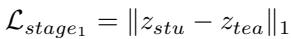
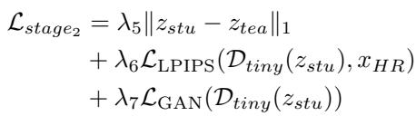
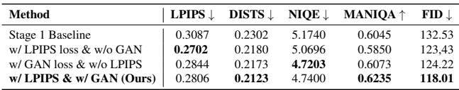

[← 返回 README](../README.md)

# Appendix

## 📌 预览
附录补充实现与额外实验，重点查复现细节、超参敏感性和失败边界。
---

> 💡 **Q&A 批注记录**:
> - Q: TinySR 的核心不是新的生成先验吗？
> - A: 对，它更像系统压缩论文：核心贡献在剪枝和模块移除，让已有 one-step diffusion SR 更小更快。

# Supplementary Material

# A. Implementation Details

# A.1. Data Processing.

Following [5, 13, 48, 49], the super-resolution process is conducted with a scale factor of 4, upsampling images from $1 2 8 \times 1 2 8$ to $5 1 2 \times 5 1 2$ . To create the degraded dataset, Ground Truth (GT) images are first randomly cropped from their original sources. Subsequently, these GT images are synthesized into $1 2 8 \mathrm { x } 1 2 8$ degraded data via the well-established Real-ESRGAN [6] degradation pipeline, involving various corruptions such as noise, blurring, and compression. This data processing method is widely adopted and well-established. [41, 43, 50, 53]. Moreover, to minimize memory overhead and accelerate training, we preencode the low-quality, high-quality, and teacher-generated references into the VAE’s latent representations. These latent representations are then cached, enabling their swift retrieval during the training phase.
> 💡 **附录批读**: 这里补的是复现路径：预编码 LQ/HQ/teacher reference 的 latent 可以明显降低训练 I/O 和显存压力，但也要求缓存使用的 VAE/teacher 版本与训练配置严格一致。

# A.2. VAE Training.
> 💡 **小节预览**: 这是系统级加速部分：one-step SR 的瓶颈不只在 U-Net，VAE 与条件分支也要一起压缩。

For the standard Teacher VAE, we first reduce the number of channels in all intermediate layers to 64 and remove all attention mechanisms, following [2]. Subsequently, all standard convolutional layers are substituted with depthwise separable convolutions $( S e p C o n \nu )$ , in line with the methodology proposed by [9, 20].

We train the VAE encoder $\mathcal { E } _ { t i n y }$ by aligning latent space features using MSE loss. The training objective is defined as:
> 💡 **VAE 批读**: 附录给出更具体训练配方：tiny encoder 用 latent MSE 对齐 pretrained encoder，tiny decoder 用 LPIPS 和 GAN loss 补感知质量；这解释了为什么 VAE 压缩不是简单删层。

*Equation 14: Equation extracted by MinerU.*
> 💡 **公式批读**: 该损失服务于 VAE 或 student-teacher 对齐；读公式时重点看监督来自 pretrained VAE、TSD-SR teacher 还是 pixel-space perceptual/GAN loss。

Here, $x _ { \mathrm { L R } }$ represents low-quality data, $\mathcal { E } _ { \mathrm { p r e } }$ is the pretrained encoder. Training is conducted for 100k steps using a batch size of 64 and a learning rate (AdamW optimizer) of 3e-4 for this phase.

We use LPIPS loss and GAN loss to train the VAE decoder Dtiny:

*Equation 15: Equation extracted by MinerU.*
> 💡 **公式批读**: 该损失服务于 VAE 或 student-teacher 对齐；读公式时重点看监督来自 pretrained VAE、TSD-SR teacher 还是 pixel-space perceptual/GAN loss。

Here, $x _ { \mathrm { H R } }$ represents high-quality data. We set $\lambda _ { 1 }$ to 3 and $\lambda _ { 2 }$ to 1. We employ a learning rate of 5e-4 for the decoder and 1e-5 for the discriminator during training. We train the model for $2 0 0 \mathrm { k }$ iterations using 64 batch size setting. The random seed is set to 80 throughout the training.

# A.3. Pruning Decision Training.
> 💡 **小节预览**: TinySR 这里从 teacher 结构里判断哪些 block 真有用，目标是删掉低贡献计算而尽量保住 SR 质量。

We initialize our model using the pre-trained weights of TSD-SR [13] for pruning training. We set the pruning rate to $50 \%$ to establish our baseline model. Following the Tiny-Fusion [15] approach, we retained two out of every four layers and employed a dynamic block-wise activation mechanism between adjacent layers. Our masks are calculated via the Gumbel-Softmax operation [22]. During network propagation, calculation for a layer is bypassed if its associated mask value is 0. We optimize the network and probability parameters using SR’s task loss and distillation loss aligned with the teacher features. Specifically, task loss is defined as LPIPS loss and $\mathrm { L _ { 1 } }$ loss is utilized for the distillation loss. The total loss is expressed as follows:

*Equation 16: Equation extracted by MinerU.*
> 💡 **公式批读**: 该损失服务于 VAE 或 student-teacher 对齐；读公式时重点看监督来自 pretrained VAE、TSD-SR teacher 还是 pixel-space perceptual/GAN loss。

$\epsilon _ { s t u }$ denotes the student’s denoising network, while $\epsilon _ { t e a }$ represents the teacher’s. $t$ denotes timesteps, and $\mathcal { E } _ { t e a }$ denotes the teacher encoder. This encoder differs from the pre-trained version $\mathcal { E } _ { p r e }$ as it is fine-tuned by TSD-SR [13].

Training is conducted for $1 0 0 \mathrm { k }$ iterations across 8 NVIDIA V100 GPUs, employing a learning rate of 5e-5 (AdamW optimizer) and a global batch size of 8. We use LoRA training, with LoRA rank set to 64. $\lambda _ { 3 }$ and $\lambda _ { 4 }$ are both set to 1.

# A.4. Restoration Training.

We perform depth pruning on the TSD-SR according to the pruning mask and discard the condition-related components to initialize our student network. To achieve rapid convergence, we divided the model’s training into two stages. In the first stage, training is exclusively conducted within the latent space. We employ $\mathrm { L _ { 1 } }$ loss for teacher-student knowledge distillation to align features. The formulation of this distillation loss is consistent with that described in Equation (A.3):

*Equation 17: Equation extracted by MinerU.*
> 💡 **公式批读**: 该损失服务于 VAE 或 student-teacher 对齐；读公式时重点看监督来自 pretrained VAE、TSD-SR teacher 还是 pixel-space perceptual/GAN loss。

The meaning of $z _ { s t u }$ and $z _ { t e a }$ is the same as mentioned above. Training in the latent space enables us to use a larger global batch size (128) on 8 V100 GPUs. We set the learning rate to 1e-4 and the LoRA rank to 64. We iterate training $1 5 0 \mathrm { k }$ steps until convergence.

In stage 2, we further enhance the perceptual quality of the results in image space by fine-tuning the model directly within the image domain. We additionally incorporate LPIPS loss and GAN loss to enhance image restoration. The total loss is expressed as follows:

*Equation 18: Equation extracted by MinerU.*
> 💡 **公式批读**: 该损失服务于 VAE 或 student-teacher 对齐；读公式时重点看监督来自 pretrained VAE、TSD-SR teacher 还是 pixel-space perceptual/GAN loss。

The meaning of $z _ { s t u }$ , $z _ { t e a }$ and $\mathcal { D } _ { t i n y }$ is the same as mentioned above. $\lambda _ { \mathrm { 5 } } , \lambda _ { 6 }$ , and $\lambda _ { 7 }$ are set to 5, 1, and 0.3, respectively. We fine-tune our model for 50k steps on 8 V100 GPUs, with a global batch size of 96, a learning rate of 1e-6 for student (5e-6 for discriminator), and a LoRA rank of 64. The random seed for the entire training process is set to 80. And all training is done on fp16 precision.

# B. More Comparisons on Benchmarks
> 💡 **小节预览**: 附录实验扩展正文证据：多数据集主表、更多视觉案例、prompt pruning、剪枝率、distillation 和 stage-2 loss。

# B.1. More Quantitative Comparisons
> 💡 **小节预览**: 附录实验扩展正文证据：多数据集主表、更多视觉案例、prompt pruning、剪枝率、distillation 和 stage-2 loss。

We compared GAN-based and diffusion-based methods across various datasets (DIV2K-Val [1], DrealSR [46], RealSR [3]), with the results presented in Table A.1. We observe that traditional GAN-based approaches [6, 30, 42, 54] generally excel on full-reference metrics, particularly PSNR and SSIM. However, some studies indicate that PSNR and SSIM often do not accurately reflect fidelity under more complex degradation conditions [13, 50, 52]. In most perceptual quality metrics, such as NIQE [55], MUSIQ [24], MANIQA [51] and CLIPIQA [40], diffusionbased methods demonstrate superior performance compared to these GANs, highlighting their enhanced capability in generating natural textures. TinySR achieved competitive performance across most metrics, demonstrating comparable results to its teacher model, TSD-SR, and showcasing the robust recoverability of the pruning methods.

# B.2. More Qualitative Comparisons
> 💡 **小节预览**: 附录实验扩展正文证据：多数据集主表、更多视觉案例、prompt pruning、剪枝率、distillation 和 stage-2 loss。

Figure B.1 presents a visual comparison between the GANbased and diffusion-based methods. GAN-based methods often struggle to recover fine, high-frequency details, resulting in blurred textures. For instance, models such as BSRGAN, Real-ESRGAN, LDL, and FeMASR produce blurring on petal textures. Similarly, BSRGAN and LDL create overly smooth butterfly wings, while Real-ESRGAN and FeMASR fail to reconstruct crisp mushroom textures. This consistent lack of detail suggests a fundamental limitation in the ability of these GAN-based approaches to restore high-frequency information. Multi-step diffusionbased methods, such as StableSR, DiffBIR, SeeSR, and ResShift, can introduce artifacts when restoring natural textures like water and rocks, and may also produce blurred details. Notably, DiffBIR is particularly susceptible to overgeneration, which can result in illogical or unnatural textures, as has been observed in the restoration of images containing mushrooms. Methods like OSEdiff, AdcSR, and SinSR can suffer from incomplete denoising and are prone to generating broken or fragmented textures during the super resolution process. Our model demonstrates highly competitive performance, excelling in both structural and texture recovery. Compared to other methods, it restores a greater degree of high-frequency detail while rigorously maintaining overall structural integrity.

# C. More Ablation Studies.

# C.1. Ablation Study on Prompt Condition
> 💡 **小节预览**: 这里专门验证 prompt 是否冗余：如果大量 token pruning 后质量只缓慢下降，正文删除 prompt/context module 才有依据。

Table C.1 presents the results of token pruning of the teacher model. We found that pruning prompt information does not negatively impact certain full-referenced metrics. In fact, some metrics, such as LPIPS and DISTS, even show improvement at specific pruning rates. Token pruning primarily affects no-referenced metrics. However, we observe no significant performance degradation even at a $50 \%$ pruning ratio. Furthermore, performance degrades gracefully at higher pruning percentages without a sharp decline, which suggests that the contribution of textual information to the final image synthesis is limited. As shown in Figure C.1, although TP $90 \%$ token’s output contains less fine-grained detail than the baseline, it effectively removes the noise from the low-quality input, resulting in an image with high visual quality.
> 💡 **Prompt 批读**: 这段给删除 text branch 的边界：50% token pruning 基本稳，90% 会少一些细粒度细节但仍可去噪。说明默认 prompt 贡献有限，但不是完全零贡献。

# C.2. Ablation Study on Pruning Ratio
> 💡 **小节预览**: TinySR 这里从 teacher 结构里判断哪些 block 真有用，目标是删掉低贡献计算而尽量保住 SR 质量。

Table C.2 compares the performance of our method against ShortGPT and TinyFusion across various metrics at token pruning ratios of $33 \%$ , $50 \%$ , and $67 \%$ . The results show our approach surpassing TinyFusion [15] and ShotGPT [33] at every pruning ratio, which demonstrates its robust ability to recover performance. Furthermore, the model exhibits only a slight degradation in performance as the pruning ratio is increased from $33 \%$ to $50 \%$ , indicating the continued presence of parameter redundancy at the $33 \%$ level. However, as the pruning rate increases from $50 \%$ to $67 \%$ , the model’s performance on metrics such as DISTS and MANIQA declines sharply, indicating that excessive pruning leads to irreversible performance degradation.

# C.3. Ablation Study of Knowledge Distillation

Table C.3 demonstrates the effectiveness of our knowledge distillation method under stage 1. We can draw the following conclusions: (1) Distillation employing GT (High-Quality) data consistently resulted in unsatisfactory performance, whether applied in the image space or the latent space. As illustrated in Figure C.2, distillation using GT data yields smooth, blurred results, whereas using the teacher produces clearer textures. (2) Distillation performed in the image space achieves better scores on fullreference metrics such as SSIM, LPIPS, and DISTS. Distillation in the latent space yields superior no-reference metrics (MUSIQ, CLIPIQA, TOPIQ and Q-Align), with most even matching those of the teacher model. However, a potential compromise in reference metrics necessitates a second stage of training, which we perform in the image space.

Table A.1. Quantitative comparison among different GAN-based and diffusion-based Real-ISR approaches on both synthetic and realworld benchmarks. “s” denotes the required number of sampling steps in the diffusion-based method. The best and second-best results are highlighted in bold, italic, respectively

*Table A.1.: Table A.1. Quantitative comparison among different GAN-based and diffusion-based Real-ISR approaches on both synthetic and realworld benchmarks. “s” denotes the required number of sampling steps in the diffusion-based method. The best and second-best results are highlighted in bold, italic, respectively*
> 💡 **表格批读**: 附录表格主要用于确认正文 claim 是否稳健：跨数据集、跨剪枝率和跨 loss 设置都要同时看 fidelity、perceptual quality 与效率。

Table C.1. Ablation study of prompt token pruning (TP) on DrealSR dataset. The best is highlighted in bold.
> 💡 **表格批读**: Table C.1 要看 token pruning ratio 与 no-reference 指标的下降斜率；若下降平缓，说明 prompt 信息在该 teacher 中主要是冗余条件。

*Table C.1.: Table C.1. Ablation study of prompt token pruning (TP) on DrealSR dataset. The best is highlighted in bold.*
> 💡 **表格批读**: 附录表格主要用于确认正文 claim 是否稳健：跨数据集、跨剪枝率和跨 loss 设置都要同时看 fidelity、perceptual quality 与效率。

# C.4. Ablation Study of Losses in Stage 2

We conduct an ablation study on the Stage 2 training losses, as shown in Table C.4. The results indicate that Stage 2 training significantly improved image quality, particularly
> 💡 **证据批读**: 这类结果段不能只看“赢了”，还要看赢在哪个指标、哪个数据集、是否牺牲了另一侧 trade-off。

Table C.2. Ablation study of pruning ratio on DIV2K-Val dataset. The best is highlighted in bold.
> 💡 **表格批读**: Table C.2 是剪枝率边界：33% 到 50% 仍有冗余，67% 开始出现不可逆质量下降。TinySR 选择 50% 是速度与可恢复性的折中。

*Table C.2.: Table C.2. Ablation study of pruning ratio on DIV2K-Val dataset. The best is highlighted in bold.*
> 💡 **表格批读**: 附录表格主要用于确认正文 claim 是否稳健：跨数据集、跨剪枝率和跨 loss 设置都要同时看 fidelity、perceptual quality 与效率。

in terms of image fidelity. Specifically, we find that the inclusion of LPIPS loss is highly beneficial for improving
> 💡 **指标解读**: PSNR/SSIM 偏结构保真，LPIPS/DISTS/NIQE/MUSIQ/CLIPIQA 偏感知质量；one-step SR 的 claim 通常要看两类指标是否同步成立。

*Figure B.1.: Figure B.1. Qualitative comparisons of GAN-based and diffusion-based Real-ISR methods. Please zoom in for a better view.*
> 💡 **Figure 批读**: 附录视觉图要看 TinySR 是否同时避免两类错误：GAN/单步模型的模糊断裂，以及多步 diffusion 或 teacher 的过生成假纹理。

reference metrics such as DISTS and FID. The addition

of GAN loss, in turn, is helpful for enhancing several no-

Table C.3. Ablation studies of Stage 1 distillation loss on DrealSR dataset. The best (other than Teacher) is highlighted in bold.
> 💡 **蒸馏关系**: 读 teacher-student 段时要问：teacher 提供的是最终图、score、trajectory 还是中间 feature；不同监督决定 student 能保留哪类能力。

*Table C.3.: Table C.3. Ablation studies of Stage 1 distillation loss on DrealSR dataset. The best (other than Teacher) is highlighted in bold.*
> 💡 **表格批读**: Table C.3 的关键结论是 teacher distillation 比直接用 GT 更适合 TinySR：GT 监督容易得到平滑结果，而 teacher 能传递 one-step diffusion 的纹理恢复偏好。

*Figure C.1.: Figure C.1. Applying $90 \%$ token pruning (TP) yields visually comparable results to the baseline with a slight quality drop, indicating the limited contribution of the default prompt.*
> 💡 **Figure 批读**: Fig. C.1 对应 prompt pruning：看 90% TP 是否只损失细纹理而没有破坏主要结构。这是“删除 prompt 分支可接受”的视觉证据。

*Figure C.2.: Figure C.2. Visual comparison of knowledge distillation: highresolution ground truth versus teacher.*
> 💡 **Figure 批读**: Fig. C.2 解释为什么不用 GT 直接蒸馏：GT 路线可能更平滑，teacher 路线更能保留生成式纹理。TinySR 压缩的是 teacher 能力，不是从头训练传统 SR。

reference metrics, including NIQE and MANIQA. We ultimately weighted the two new losses to balance the trade-off between fidelity and the generative ability.
> 💡 **指标解读**: PSNR/SSIM 偏结构保真，LPIPS/DISTS/NIQE/MUSIQ/CLIPIQA 偏感知质量；one-step SR 的 claim 通常要看两类指标是否同步成立。

# References

[1] Eirikur Agustsson and Radu Timofte. Ntire 2017 challenge on single image super-resolution: Dataset and study. In Proceedings of the IEEE conference on computer vision and pattern recognition workshops, pages 126–135, 2017. 6, 10

Table C.4. Ablation studies of Stage 2 training loss on RealSR dataset. The best is highlighted in bold.

*Table C.4.: Table C.4. Ablation studies of Stage 2 training loss on RealSR dataset. The best is highlighted in bold.*
> 💡 **表格批读**: Table C.4 验证 stage-2 loss：LPIPS 更利于 fidelity/perceptual alignment，GAN loss 帮 no-reference realism。最终权重是在保真和生成质感之间折中。

[2] Ollin Boer Bohan. Tiny autoencoder for stable diffusion. https://github.com/madebyollin/taesd, 2023. 5, 9

[3] Jianrui Cai, Hui Zeng, Hongwei Yong, Zisheng Cao, and Lei Zhang. Toward real-world single image super-resolution: A new benchmark and a new model. In Proceedings of the IEEE/CVF international conference on computer vision, pages 3086–3095, 2019. 6, 10

[4] Thibault Castells, Hyoung-Kyu Song, Bo-Kyeong Kim, and Shinkook Choi. Ld-pruner: Efficient pruning of latent diffusion models using task-agnostic insights. In Proceedings of the IEEE/CVF Conference on Computer Vision and Pattern Recognition, pages 821–830, 2024. 1

[5] Bin Chen, Gehui Li, Rongyuan Wu, Xindong Zhang, Jie Chen, Jian Zhang, and Lei Zhang. Adversarial diffusion compression for real-world image super-resolution. arXiv preprint arXiv:2411.13383, 2024. 2, 3, 6, 9

[6] Chaofeng Chen, Xinyu Shi, Yipeng Qin, Xiaoming Li, Xiaoguang Han, Tao Yang, and Shihui Guo. Real-world blind super-resolution via feature matching with implicit highresolution priors. In Proceedings of the 30th ACM International Conference on Multimedia, pages 1329–1338, 2022. 6, 9, 10

[7] Chaofeng Chen, Jiadi Mo, Jingwen Hou, Haoning Wu, Liang Liao, Wenxiu Sun, Qiong Yan, and Weisi Lin. Topiq: A top-down approach from semantics to distortions for image quality assessment. IEEE Transactions on Image Processing, 33:2404–2418, 2024. 6

[8] Jierun Chen, Dongting Hu, Xijie Huang, Huseyin Coskun, Arpit Sahni, Aarush Gupta, Anujraaj Goyal, Dishani Lahiri, Rajesh Singh, Yerlan Idelbayev, et al. Snapgen: Taming high-resolution text-to-image models for mobile devices with efficient architectures and training. In Proceedings of the Computer Vision and Pattern Recognition Conference, pages 7997–8008, 2025. 1, 8

[9] Franc¸ois Chollet. Xception: Deep learning with depthwise separable convolutions. In Proceedings of the IEEE con-

n, page   
1251–1258, 2017. 5, 9 [10] Javier Mart´ın Daniel Verdu. Flux.1 lite: Distilling flux1.dev ´ for efficient text-to-image generation. 2024. 1, 7 [11] Tri Dao, Dan Fu, Stefano Ermon, Atri Rudra, and Christopher Re. Flashattention: Fast and memory-efficient exact ´ attention with io-awareness. Advances in neural information processing systems, 35:16344–16359, 2022. 1 [12] Keyan Ding, Kede Ma, Shiqi Wang, and Eero P Simoncelli. Image quality assessment: Unifying structure and texture similarity. IEEE transactions on pattern analysis and machine intelligence, 44(5):2567–2581, 2020. 6 [13] Linwei Dong, Qingnan Fan, Yihong Guo, Zhonghao Wang, Qi Zhang, Jinwei Chen, Yawei Luo, and Changqing Zou. Tsd-sr: One-step diffusion with target score distillation for real-world image super-resolution. In Proceedings of the Computer Vision and Pattern Recognition Conference, pages   
23174–23184, 2025. 1, 2, 6, 9, 10 [14] Patrick Esser, Sumith Kulal, Andreas Blattmann, Rahim Entezari, Jonas Muller, Harry Saini, Yam Levi, Dominik¨ Lorenz, Axel Sauer, Frederic Boesel, et al. Scaling rectified flow transformers for high-resolution image synthesis. In Forty-first International Conference on Machine Learning, 2024. 2, 5 [15] Gongfan Fang, Kunjun Li, Xinyin Ma, and Xinchao Wang. Tinyfusion: Diffusion transformers learned shallow. arXiv preprint arXiv:2412.01199, 2024. 1, 2, 3, 7, 9, 10 [16] Song Han, Jeff Pool, John Tran, and William Dally. Learning both weights and connections for efficient neural network. Advances in neural information processing systems,   
28, 2015. 2, 7 [17] Yefei He, Luping Liu, Jing Liu, Weijia Wu, Hong Zhou, and Bohan Zhuang. Ptqd: Accurate post-training quantization for diffusion models. arXiv preprint arXiv:2305.10657,   
2023. 1 [18] Martin Heusel, Hubert Ramsauer, Thomas Unterthiner, Bernhard Nessler, and Sepp Hochreiter. Gans trained by a two time-scale update rule converge to a local nash equilibrium. Advances in neural information processing systems,   
30, 2017. 6 [19] Jonathan Ho, Ajay Jain, and Pieter Abbeel. Denoising diffusion probabilistic models. Advances in neural information processing systems, 33:6840–6851, 2020. 1 [20] Andrew G Howard, Menglong Zhu, Bo Chen, Dmitry Kalenichenko, Weijun Wang, Tobias Weyand, Marco Andreetto, and Hartwig Adam. Mobilenets: Efficient convolutional neural networks for mobile vision applications. arXiv preprint arXiv:1704.04861, 2017. 2, 5, 9 [21] Edward J Hu, Yelong Shen, Phillip Wallis, Zeyuan Allen-Zhu, Yuanzhi Li, Shean Wang, Lu Wang, Weizhu Chen, et al. Lora: Low-rank adaptation of large language models. ICLR,   
1(2):3, 2022. 5 [22] Eric Jang, Shixiang Gu, and Ben Poole. Categorical reparameterization with gumbel-softmax. arXiv preprint arXiv:1611.01144, 2016. 3, 9 [23] Tero Karras, Samuli Laine, and Timo Aila. A style-based generator architecture for generative adversarial networks. In Proceedings of the IEEE/CVF conference on computer vision and pattern recognition, pages 4401–4410, 2019. 6 [24] Junjie Ke, Qifei Wang, Yilin Wang, Peyman Milanfar, and Feng Yang. Musiq: Multi-scale image quality transformer. In Proceedings of the IEEE/CVF international conference on computer vision, pages 5148–5157, 2021. 6, 10 [25] Bo-Kyeong Kim, Hyoung-Kyu Song, Thibault Castells, and Shinkook Choi. Bk-sdm: A lightweight, fast, and cheap version of stable diffusion. In European Conference on Computer Vision, pages 381–399. Springer, 2024. 1, 2, 3, 7 [26] Diederik P Kingma, Max Welling, et al. Auto-encoding variational bayes, 2013. 2 [27] Xiuyu Li, Yijiang Liu, Long Lian, Huanrui Yang, Zhen Dong, Daniel Kang, Shanghang Zhang, and Kurt Keutzer. Q-diffusion: Quantizing diffusion models. In Proceedings of the IEEE/CVF International Conference on Computer Vision, pages 17535–17545, 2023. 1 [28] Yanyu Li, Huan Wang, Qing Jin, Ju Hu, Pavlo Chemerys, Yun Fu, Yanzhi Wang, Sergey Tulyakov, and Jian Ren. Snapfusion: Text-to-image diffusion model on mobile devices within two seconds. Advances in Neural Information Processing Systems, 36:20662–20678, 2023. 1, 3, 7 [29] Yawei Li, Kai Zhang, Jingyun Liang, Jiezhang Cao, Ce Liu, Rui Gong, Yulun Zhang, Hao Tang, Yun Liu, Denis Demandolx, et al. Lsdir: A large scale dataset for image restoration. In Proceedings of the IEEE/CVF Conference on Computer Vision and Pattern Recognition, pages 1775–1787, 2023. 6 [30] Jie Liang, Hui Zeng, and Lei Zhang. Details or artifacts: A locally discriminative learning approach to realistic image super-resolution. In Proceedings of the IEEE/CVF Conference on Computer Vision and Pattern Recognition, pages   
5657–5666, 2022. 1, 6, 10 [31] Xinqi Lin, Jingwen He, Ziyan Chen, Zhaoyang Lyu, Bo Dai, Fanghua Yu, Wanli Ouyang, Yu Qiao, and Chao Dong. Diffbir: Towards blind image restoration with generative diffusion prior. arXiv preprint arXiv:2308.15070, 2023. 2, 6 [32] Ilya Loshchilov and Frank Hutter. Decoupled weight decay regularization. arXiv preprint arXiv:1711.05101, 2017. 5 [33] Xin Men, Mingyu Xu, Qingyu Zhang, Bingning Wang, Hongyu Lin, Yaojie Lu, Xianpei Han, and Weipeng Chen. Shortgpt: Layers in large language models are more redundant than you expect. arXiv preprint arXiv:2403.03853,   
2024. 2, 7, 10 [34] Alexander Quinn Nichol and Prafulla Dhariwal. Improved denoising diffusion probabilistic models. In International conference on machine learning, pages 8162–8171. PMLR,   
2021. 1 [35] William Peebles and Saining Xie. Scalable diffusion models with transformers. In Proceedings of the IEEE/CVF international conference on computer vision, pages 4195–4205,   
2023. 5 [36] Robin Rombach, Andreas Blattmann, Dominik Lorenz, Patrick Esser, and Bjorn Ommer. High-resolution image ¨ synthesis with latent diffusion models. In Proceedings of the IEEE/CVF conference on computer vision and pattern recognition, pages 10684–10695, 2022. 2 [37] Wenzhe Shi, Jose Caballero, Ferenc Huszar, Johannes Totz, ´ Andrew P Aitken, Rob Bishop, Daniel Rueckert, and Zehan Wang. Real-time single image and video super-resolution using an efficient sub-pixel convolutional neural network. In Proceedings of the IEEE conference on computer vision and pattern recognition, pages 1874–1883, 2016. 2   
[38] Yao Teng, Yue Wu, Han Shi, Xuefei Ning, Guohao Dai, Yu Wang, Zhenguo Li, and Xihui Liu. Dim: Diffusion mamba for efficient high-resolution image synthesis. arXiv preprint arXiv:2405.14224, 2024. 1   
[39] Radu Timofte, Eirikur Agustsson, Luc Van Gool, Ming-Hsuan Yang, and Lei Zhang. Ntire 2017 challenge on single image super-resolution: Methods and results. In Proceedings of the IEEE conference on computer vision and pattern recognition workshops, pages 114–125, 2017. 6   
[40] Jianyi Wang, Kelvin CK Chan, and Chen Change Loy. Exploring clip for assessing the look and feel of images. In Proceedings of the AAAI conference on artificial intelligence, pages 2555–2563, 2023. 2, 6, 10   
[41] Jianyi Wang, Zongsheng Yue, Shangchen Zhou, Kelvin CK Chan, and Chen Change Loy. Exploiting diffusion prior for real-world image super-resolution. International Journal of Computer Vision, pages 1–21, 2024. 6, 9   
[42] Xintao Wang, Liangbin Xie, Chao Dong, and Ying Shan. Real-esrgan: Training real-world blind super-resolution with pure synthetic data. In Proceedings of the IEEE/CVF international conference on computer vision, pages 1905–1914, 2021. 1, 2, 6, 10   
[43] Yufei Wang, Wenhan Yang, Xinyuan Chen, Yaohui Wang, Lanqing Guo, Lap-Pui Chau, Ziwei Liu, Yu Qiao, Alex C Kot, and Bihan Wen. Sinsr: diffusion-based image superresolution in a single step. In Proceedings of the IEEE/CVF Conference on Computer Vision and Pattern Recognition, pages 25796–25805, 2024. 6, 9   
[44] Zhou Wang, Alan C Bovik, Hamid R Sheikh, and Eero P Simoncelli. Image quality assessment: from error visibility to structural similarity. IEEE transactions on image processing, 13(4):600–612, 2004. 6   
[45] Zhendong Wang, Yifan Jiang, Huangjie Zheng, Peihao Wang, Pengcheng He, Zhangyang Wang, Weizhu Chen, Mingyuan Zhou, et al. Patch diffusion: Faster and more data-efficient training of diffusion models. Advances in neural information processing systems, 36:72137–72154, 2023. 1   
[46] Pengxu Wei, Ziwei Xie, Hannan Lu, Zongyuan Zhan, Qixiang Ye, Wangmeng Zuo, and Liang Lin. Component divideand-conquer for real-world image super-resolution. In Computer Vision–ECCV 2020: 16th European Conference, Glasgow, UK, August 23–28, 2020, Proceedings, Part VIII 16, pages 101–117. Springer, 2020. 6, 10   
[47] Haoning Wu, Zicheng Zhang, Weixia Zhang, Chaofeng Chen, Liang Liao, Chunyi Li, Yixuan Gao, Annan Wang, Erli Zhang, Wenxiu Sun, et al. Q-align: Teaching lmms for visual scoring via discrete text-defined levels. arXiv preprint arXiv:2312.17090, 2023. 6   
[48] Rongyuan Wu, Lingchen Sun, Zhiyuan Ma, and Lei Zhang. One-step effective diffusion network for real-world image super-resolution. arXiv preprint arXiv:2406.08177, 2024. 1, 2, 6, 9   
[49] Rongyuan Wu, Tao Yang, Lingchen Sun, Zhengqiang Zhang, Shuai Li, and Lei Zhang. Seesr: Towards semanticsaware real-world image super-resolution. In Proceedings of the IEEE/CVF conference on computer vision and pattern recognition, pages 25456–25467, 2024. 2, 6, 9   
[50] Rui Xie, Ying Tai, Kai Zhang, Zhenyu Zhang, Jun Zhou, and Jian Yang. Addsr: Accelerating diffusion-based blind super-resolution with adversarial diffusion distillation. arXiv preprint arXiv:2404.01717, 2024. 9, 10   
[51] Sidi Yang, Tianhe Wu, Shuwei Shi, Shanshan Lao, Yuan Gong, Mingdeng Cao, Jiahao Wang, and Yujiu Yang. Maniqa: Multi-dimension attention network for no-reference image quality assessment. In Proceedings of the IEEE/CVF Conference on Computer Vision and Pattern Recognition, pages 1191–1200, 2022. 6, 10   
[52] Fanghua Yu, Jinjin Gu, Zheyuan Li, Jinfan Hu, Xiangtao Kong, Xintao Wang, Jingwen He, Yu Qiao, and Chao Dong. Scaling up to excellence: Practicing model scaling for photorealistic image restoration in the wild. In Proceedings of the IEEE/CVF Conference on Computer Vision and Pattern Recognition, pages 25669–25680, 2024. 10   
[53] Zongsheng Yue, Jianyi Wang, and Chen Change Loy. Resshift: Efficient diffusion model for image superresolution by residual shifting. Advances in Neural Information Processing Systems, 36, 2024. 6, 9   
[54] Kai Zhang, Jingyun Liang, Luc Van Gool, and Radu Timofte. Designing a practical degradation model for deep blind image super-resolution. In Proceedings of the IEEE/CVF International Conference on Computer Vision, pages 4791– 4800, 2021. 1, 2, 6, 10   
[55] Lin Zhang, Lei Zhang, and Alan C Bovik. A feature-enriched completely blind image quality evaluator. IEEE Transactions on Image Processing, 24(8):2579–2591, 2015. 6, 10   
[56] Richard Zhang, Phillip Isola, Alexei A Efros, Eli Shechtman, and Oliver Wang. The unreasonable effectiveness of deep features as a perceptual metric. In Proceedings of the IEEE conference on computer vision and pattern recognition, pages 586–595, 2018. 6
---

## 🔖 Section 总结

### 关键数字速查
| 指标 | 数值 |
|------|------|
| 本节作用 | 补充实现、结论或复现实验 |
| 主线 | 把 one-step diffusion SR teacher 系统性压缩成更小、更快的 student，目标是实时 Real-ISR。 |
| 后续关注 | 失败案例、超参敏感性、部署限制 |

### 核心洞察
1. 结论/附录常暴露正文没有展开的约束条件。
2. 优缺点分析应优先来自这些额外细节，而不是只看 abstract。
3. 可继续追问复现脚本、模型权重、真实退化泛化和硬件延迟。

### 可追问点
- TinySR 的核心不是新的生成先验吗？
- 为什么要同时压缩 VAE？
