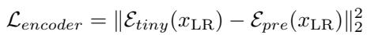
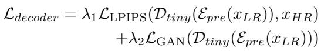

[← 返回 README](../README.md)

# A.2. VAE Training.

## 📌 预览
Method 是核心：关注输入从 LQ 到 latent/feature 的路径、训练目标、控制变量以及与 teacher/先验的交互方式。

> 💡 **与 TinySR 主线的关系**: TinySR 面向 Real-ISR 的实时落地，把已有 one-step diffusion teacher 通过深度剪枝、VAE 压缩、模块移除和缓存策略压成轻量单步模型。

---

For the standard Teacher VAE, we first reduce the number of channels in all intermediate layers to 64 and remove all attention mechanisms, following [2]. Subsequently, all standard convolutional layers are substituted with depthwise separable convolutions $( S e p C o n \nu )$ , in line with the methodology proposed by [9, 20].

> 💡 **批注**: 这是蒸馏逻辑：用 teacher 或 score regularization 把多步/大模型能力迁移给单步模型。

We train the VAE encoder $\mathcal { E } _ { t i n y }$ by aligning latent space features using MSE loss. The training objective is defined as:

> 💡 **批注**: 注意 latent diffusion 架构路径：LQ/HR 往往先被 VAE 编码，再在 latent 空间完成 denoising 或调制。

*Equation 14: Equation extracted by MinerU.*

> 💡 **Equation 14 批读**: 这类公式通常定义 forward/reverse process、loss 或 alignment 目标；建议把每个符号对应到输入、teacher/student、控制变量。

Here, $x _ { \mathrm { L R } }$ represents low-quality data, $\mathcal { E } _ { \mathrm { p r e } }$ is the pretrained encoder. Training is conducted for 100k steps using a batch size of 64 and a learning rate (AdamW optimizer) of 3e-4 for this phase.

> 💡 **批注**: 这是 flow/ODE 视角：重点是 student 是否沿 teacher 的连续采样轨迹对齐，而不只是匹配终点。

We use LPIPS loss and GAN loss to train the VAE decoder Dtiny:

*Equation 15: Equation extracted by MinerU.*

> 💡 **Equation 15 批读**: 这类公式通常定义 forward/reverse process、loss 或 alignment 目标；建议把每个符号对应到输入、teacher/student、控制变量。

Here, $x _ { \mathrm { H R } }$ represents high-quality data. We set $\lambda _ { 1 }$ to 3 and $\lambda _ { 2 }$ to 1. We employ a learning rate of 5e-4 for the decoder and 1e-5 for the discriminator during training. We train the model for $2 0 0 \mathrm { k }$ iterations using 64 batch size setting. The random seed is set to 80 throughout the training.

> 💡 **批注**: 这是 flow/ODE 视角：重点是 student 是否沿 teacher 的连续采样轨迹对齐，而不只是匹配终点。

---

## 🔖 Section 总结

### 核心洞察

1. 明确输入、输出、teacher/student 或控制变量。
2. 把每个 loss/模块对应到 fidelity、realism、speed 或 controllability。
3. 关注哪些组件是训练时使用，哪些是推理时仍有成本。

### 关键数字速查

| 指标 | 数值 |
|------|------|
| Speedup | up to 5.68× over TSD-SR teacher |
| Parameter reduction | 83% reduction claimed in abstract |
| Inference regime | one-step Real-ISR |
| Compression targets | Diffusion backbone + VAE + prompt/time modules |
