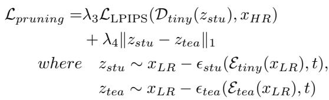

[← 返回 README](../README.md)

# A.3. Pruning Decision Training.

## 📌 预览
Method 是核心：关注输入从 LQ 到 latent/feature 的路径、训练目标、控制变量以及与 teacher/先验的交互方式。

> 💡 **与 TinySR 主线的关系**: TinySR 面向 Real-ISR 的实时落地，把已有 one-step diffusion teacher 通过深度剪枝、VAE 压缩、模块移除和缓存策略压成轻量单步模型。

---

We initialize our model using the pre-trained weights of TSD-SR [13] for pruning training. We set the pruning rate to $50 \%$ to establish our baseline model. Following the Tiny-Fusion [15] approach, we retained two out of every four layers and employed a dynamic block-wise activation mechanism between adjacent layers. Our masks are calculated via the Gumbel-Softmax operation [22]. During network propagation, calculation for a layer is bypassed if its associated mask value is 0. We optimize the network and probability parameters using SR’s task loss and distillation loss aligned with the teacher features. Specifically, task loss is defined as LPIPS loss and $\mathrm { L _ { 1 } }$ loss is utilized for the distillation loss. The total loss is expressed as follows:

> 💡 **批注**: 这是蒸馏逻辑：用 teacher 或 score regularization 把多步/大模型能力迁移给单步模型。

*Equation 16: Equation extracted by MinerU.*

> 💡 **Equation 16 批读**: 这类公式通常定义 forward/reverse process、loss 或 alignment 目标；建议把每个符号对应到输入、teacher/student、控制变量。

$\epsilon _ { s t u }$ denotes the student’s denoising network, while $\epsilon _ { t e a }$ represents the teacher’s. $t$ denotes timesteps, and $\mathcal { E } _ { t e a }$ denotes the teacher encoder. This encoder differs from the pre-trained version $\mathcal { E } _ { p r e }$ as it is fine-tuned by TSD-SR [13].

> 💡 **批注**: 这是蒸馏逻辑：用 teacher 或 score regularization 把多步/大模型能力迁移给单步模型。

Training is conducted for $1 0 0 \mathrm { k }$ iterations across 8 NVIDIA V100 GPUs, employing a learning rate of 5e-5 (AdamW optimizer) and a global batch size of 8. We use LoRA training, with LoRA rank set to 64. $\lambda _ { 3 }$ and $\lambda _ { 4 }$ are both set to 1.

---

## 🔖 Section 总结

### 核心洞察

1. 明确输入、输出、teacher/student 或控制变量。
2. 把每个 loss/模块对应到 fidelity、realism、speed 或 controllability。
3. 关注哪些组件是训练时使用，哪些是推理时仍有成本。

### 关键数字速查

| 指标 | 数值 |
|------|------|
| Speedup | up to 5.68× over TSD-SR teacher |
| Parameter reduction | 83% reduction claimed in abstract |
| Inference regime | one-step Real-ISR |
| Compression targets | Diffusion backbone + VAE + prompt/time modules |
