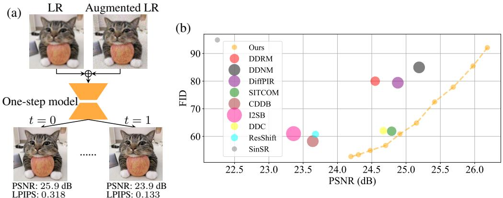

[← 返回 README](../README.md)

# 1 INTRODUCTION

## 📌 预览
Introduction 负责建立动机链：多步扩散质量高但慢，one-step 快但在保真/真实感/模型体量/可控性上仍有缺口。

> 💡 **与 OFTSR 主线的关系**: OFTSR 用 conditional flow teacher 和 ODE-trajectory alignment distillation 构建 one-step SR，并保留可调 fidelity-realism trade-off。

---

Recently, diffusion and flow-based generative models have demonstrated the ability to generate images with higher quality (Ramesh et al., 2022; Nichol & Dhariwal, 2021; Dhariwal & Nichol, 2021) than earlier generative models such as Generative Adversarial Networks (GANs) (Goodfellow et al., 2020; Karras et al., 2019), Normalizing Flows (NFs) (Dinh et al., 2016) and Variational Autoencoders (VAEs) (Kingma & Welling, 2013; Razavi et al., 2019). Beyond visual generation, diffusion models have shown remarkable success across a variety of tasks, including image editing (Hertz et al., 2022; Brooks et al., 2023; Kawar et al., 2023), 3D content generation (Poole et al., 2022; Wang et al., 2023a; Liu et al., 2023b; Wu et al., 2022; Wang et al., 2024a), and image restoration (Kawar et al., 2022; Chung et al., 2022; Wang et al., 2022b; Zhu et al., 2023; Delbracio & Milanfar, 2023; Lin et al., 2023), with particularly notable advancements in image super-resolution (SR) (Saharia et al., 2021; Chen et al., 2023; Yue et al., 2024b; Wang et al., 2024b).

> 💡 **批注**: 注意 latent diffusion 架构路径：LQ/HR 往往先被 VAE 编码，再在 latent 空间完成 denoising 或调制。

Existing diffusion and flow-based SR methods can be broadly divided into two approaches: trainingfree methods (Zhu et al., 2023; Kawar et al., 2022; Wang et al., 2022b; Chung et al., 2022; Alkhouri et al., 2024; Mardani et al., 2023; Song et al., 2023a), and training-based methods (Saharia et al., 2021; Luo et al., 2023b; Liu et al., 2023a; Yue et al., 2023; Wang et al., $2 0 2 4 \mathrm { c }$ ; Yue et al., 2024b; Liu et al., 2024; Delbracio & Milanfar, 2023). Training-free methods decompose the conditional probability into a prior term and a likelihood term, with each term associating directly to a specific subproblem (Zhu et al., 2023). During iterative sampling, the prior subproblem is naturally handled by pre-trained unconditional diffusion models, which serve as powerful regularizers to guide the solution toward realistic High Resolution (HR) images. Meanwhile, the likelihood subproblem is addressed through specialized optimization techniques or analytical approximations to ensure fidelity to the observed Low Resolution (LR) image. On the other hand, training-based methods directly model the conditional probability using paired data, either by training from scratch (Saharia et al., 2021; Delbracio & Milanfar, 2023) or by incorporating additional control modules into existing generative priors (Wang et al., 2024b; Yu et al., 2024; Lin et al., 2023; Rombach et al., 2022). Several other bridge-based methods (Luo et al., 2023b; Liu et al., 2023a; Yue et al., 2023; Chung et al., 2024) have also been proposed for general image-to-image translation tasks, sharing similarities with direct learning approaches.

> 💡 **批注**: 这里在讨论 fidelity-realism/perception-distortion 张力：SR 既要贴近 GT/LQ 结构，又要生成自然高频细节。

*Figure 1: Figure 1: (a) Our final model takes the concatenation of a low-resolution image with its noise-augmented version as input, and is able to generate high-resolution outputs with either high realism or high fidelity by adjusting the interpolation parameter $t$ . We indicate the PSNR and LPIPS value on the output images. (b) Comparison of different diffusion and flow based image super-resolution methods on the ImageNet $2 5 6 \times 2 5 6$ dataset. Bubble radius indicates the NFEs used by the methods.*

> 💡 **Figure 1 批读**: 这张图通常承担方法动机、框架或视觉对比的作用。阅读时重点看它证明的是质量、速度还是可控性，而不是只看视觉效果。

Despite the promising results of the above methods, they require many iterative sampling steps to achieve high perceptual quality, and reducing the number of iterations often results in higher fidelity but lower perceptual quality. In this sense, their fidelity-realism trade-offs are achieved at the cost of more sampling steps. In order to achieve high perceptual quality with fewer sampling steps, some attempts (Wang et al., 2024c; Lee et al., 2024; Wu et al., 2024; Xie et al., 2024; Li et al., 2024) have been made to distill the diffusion sampling process into a single step with diffusion distillation approaches (Luhman & Luhman, 2021; Salimans & Ho, 2022; Liu et al., 2022; Song et al., 2023b; Yan et al., 2024; Yin et al., 2024b;a; Sauer et al., 2025). However, while these methods improve efficiency, they sacrifice flexibility by limiting control over the fidelity-realism trade-off, reducing their applicability in domains where different tasks require varying levels of fidelity and realism, such as medical imaging, remote sensing and film upscaling (Greenspan, 2009; Li et al., 2023a; Wang et al., 2022a; Mentzer et al., 2020; Joshi et al., 2025).

> 💡 **批注**: 这里的关键词是单步推理：作者试图把原本多次 denoising 的生成先验压缩到一次前向中。

In this paper, we propose OFTSR that achieves one-step image SR and preserves the capability to produce outputs with tunable fidelity-realism trade-offs. Specifically, OFTSR uses a two-stage pipeline. In stage one we train a noise-augmented conditional rectified flow to expand the support of the initial distribution: noise-perturbed LR images form the initial distribution while the LR images are used as conditions, enabling diverse HR reconstructions from a single LR. In the second stage, a distillation strategy is proposed to restrict the student model’s predictions to match the same Ordinary Differential Equation (ODE) induced by the teacher model from the first stage.

> 💡 **批注**: 这里的关键词是单步推理：作者试图把原本多次 denoising 的生成先验压缩到一次前向中。

Our main contributions can be summarized as follows:

• Noise-augmented Conditional Rectified Flow for Image Restoration: We introduce an enhanced conditional rectified flow model for image restoration. By leveraging a noiseaugmented LR conditioning strategy, our approach enables more effective LR-conditioned diffusion restoration, serving as both a general restoration framework and the foundational stage for our proposed distillation algorithm.

> 💡 **列表批读**: 这组条目通常是在列贡献、设置或发现；建议逐条对应到论文声称解决的 gap。

• One-Step Diffusion Distillation with Flexible Fidelity-Realism Trade-off: We introduce a distillation strategy applicable to empirical probability flow ODEs of any pre-trained conditional diffusion or flow model. Unlike prior methods that limit flexibility, ours enables one-step sampling while preserving control over fidelity and perceptual realism for SR.

> 💡 **列表批读**: 这组条目通常是在列贡献、设置或发现；建议逐条对应到论文声称解决的 gap。

• State-of-the-Art (SOTA) Performance on Benchmark Datasets: Extensive experiments on DIV2K (Agustsson & Timofte, 2017), FFHQ (Karras et al., 2019), ImageNet (Deng et al., 2009) and several real world SR dataset including RealSR (Cai et al., 2019), RealSet80 (Yue et al., 2024b) and RealLQ250 (Ai et al., 2025) show that OFTSR achieves competitive one-step reconstruction, surpassing recent SOTA methods in both perceptual quality and fidelity.

> 💡 **列表批读**: 这组条目通常是在列贡献、设置或发现；建议逐条对应到论文声称解决的 gap。

---

## 🔖 Section 总结

### 核心洞察

1. 本节帮助定位论文贡献边界。
2. 读完后回到 README 的方法对比表中归纳。

### 关键数字速查

| 指标 | 数值 |
|------|------|
| Inference steps | 1 |
| Teacher type | conditional flow-based SR model |
| Distillation target | same sampling ODE trajectory alignment |
| Datasets | FFHQ 256×256, DIV2K, ImageNet 256×256 |
