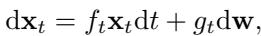
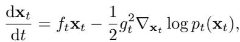
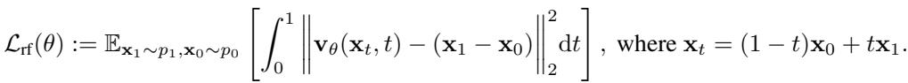

[← 返回 README](../README.md)

# 2 BACKGROUND

## 📌 预览
本节给 OFTSR 的两个理论支点：PF-ODE/rectified flow 提供“轨迹”语言，perception-distortion trade-off 解释为什么 SR 不能同时无限保真和无限真实。
---

> 💡 **Q&A 批注记录**:
> - Q: 为什么 flow 适合可调 trade-off？
> - A: flow 的时间 $t$ 不只是训练噪声等级，也对应从初态到数据分布的连续位置；OFTSR 后面把这个位置解释成 fidelity-realism 旋钮。

# 2.1 DIFFUSION AND FLOW-BASED GENERATIVE MODELS
> 💡 **小节预览**: 先读清 SDE、PF-ODE、rectified flow 三者关系：diffusion 可转成确定性 PF-ODE，rectified flow 直接学习 velocity field，OFTSR 的 teacher/student 都围绕这个 velocity field 对齐。

Drawing inspiration from non-equilibrium thermodynamics, diffusion models operate through two core processes: a forward diffusion process that gradually adds Gaussian noise to data until it becomes pure noise, and a reverse denoising process that systematically reconstructs the original data by removing noise (Sohl-Dickstein et al., 2015; Ho et al., 2020; Song et al., 2020b). Let $\mathbf { x } _ { t }$ represent the data $\mathbf { x }$ at timestep $t$ . The forward process can be formally described by the Ito Stochastic ˆ Differential Equation (SDE) (Song et al., 2020b):
> 💡 **背景批读**: 这里复习 diffusion 的随机 SDE，是为了后面引出确定性的 PF-ODE。OFTSR 的 distillation 用的是 ODE 轨迹约束，所以重点不是采样噪声，而是同一 marginal 下的确定性流。

*Equation 1: Equation extracted by MinerU.*
> 💡 **公式批读**: Eq. (1) 是随机扩散过程：drift $f_t$ 和 diffusion coefficient $g_t$ 决定噪声如何注入。对 OFTSR 来说，它主要服务于“每个 diffusion process 都可对应一个 PF-ODE”的过渡。

where w is the standard Wiener process, $f _ { t } : \mathbb { R } \to \mathbb { R }$ is the drift coefficient, and $g _ { t } : \mathbb { R }  \mathbb { R }$ is a scalar function called the diffusion coefficient.
> 💡 **概念批读**: Wiener process 表示随机性来源；后文 OFTSR 选择 deterministic flow/ODE 轨迹对齐，正是为了把 student 的训练目标写成可比较的轨迹关系。

For every diffusion process described by Eq. (1), there exists a corresponding deterministic Probability Flow Ordinary Differential Equation (PF-ODE) that maintains the same marginal probability density:
> 💡 **关键转折**: PF-ODE 是本文能谈“same ODE trajectory”的基础：即使原模型来自 diffusion，也可以在确定性 ODE 视角下定义 teacher 轨迹。

*Equation 2: Equation extracted by MinerU.*
> 💡 **公式批读**: Eq. (2) 把 score function 放进确定性动力系统；后文 teacher 的 velocity/score 给 student 提供局部方向，而不是只给终点监督。

where $p _ { t } ( \cdot )$ represents the marginal probability density at time $t$ . The term $\nabla _ { \mathbf { x } _ { t } } \log p _ { t } ( \mathbf { x } _ { t } )$ is known as the score function, which can be approximated by a neural network $\mathbf { s } _ { \theta } ( \mathbf { x } , t )$ with parameters $\theta$ . This network is typically trained using score matching techniques (Hyvarinen¨ $\&$ Dayan, 2005; Song & Ermon, 2019; Song et al., 2020a).
> 💡 **概念批读**: score network 是 diffusion 侧的对象；OFTSR 在方法中改用 rectified-flow velocity model，但二者都可以看成定义 ODE 方向场。

To generate data samples, the process begins with Gaussian noise drawn from an initial Gaussian distribution $p _ { 0 }$ and solves Eq. (2) numerically from $t = 0$ to $t = 1$ . By utilizing the learned score function $\mathbf { s } _ { \theta } ( \mathbf { x } _ { t } , t )$ , the empirical PF-ODE can be obtained as: $\begin{array} { r } { \frac { \mathrm { d } \mathbf { x } _ { t } } { \mathrm { d } t } = f _ { t } \mathbf { x } _ { t } - \frac { 1 } { 2 } g _ { t } ^ { 2 } \mathbf { s } _ { \theta } ( \mathbf { x } _ { t } , t ) } \end{array}$ .
> 💡 **效率批读**: 数值积分从 $t=0$ 到 $1$ 解释了为什么多步方法慢。OFTSR 要蒸馏的正是这个 empirical PF-ODE 的路径效果。

Rectified flow (Liu et al., 2022; Liu, 2022; Lipman et al., 2022; Esser et al., 2024) is a generative modeling framework based on ODEs. Given an initial distribution $p _ { 0 }$ and a target data distribution $p _ { 1 }$ , rectified flow trains a neural network to parameterize a velocity field using the following loss function:
> 💡 **方法铺垫**: 这里是 OFTSR teacher 的直接来源：给定初始分布和目标 HR 分布，学习从 $\mathbf{x}_0$ 指向 $\mathbf{x}_1$ 的 velocity field。

*Equation 3: Equation extracted by MinerU.*
> 💡 **公式批读**: Eq. (3) 的监督目标是 $\mathbf{x}_1-\mathbf{x}_0$ 这类速度。OFTSR 的条件版会把 $\mathbf{x}_{LR}$ 拼接进输入，让速度不只是生成 HR，还要服从 LR 观测。

raito mple generation is achieved by solving the empirical ODE . In practical implementations, this empirical ODE is sol $\begin{array} { r } { \frac { \mathrm { d } \mathbf { x } _ { t } } { \mathrm { d } t } = \mathbf { v } _ { \theta } ( \mathbf { x } _ { t } , t ) } \end{array}$ from using $t ~ = ~ 0$ $t \ = \ 1$ standard ODE solvers, ranging from the simple forward Euler method to higher-order methods such as RK2 and RK45.
> 💡 **采样批读**: teacher 可用 RK45/RK2 等多步 solver 走完整轨迹；student 的目标是把这条轨迹的可控终点估计压成一次 forward。

# 2.2 PERCEPTION-DISTORTION TRADE-OFF
> 💡 **小节预览**: 这一节解释为什么 $t$ 有意义：SR 输出不能同时极致贴近 GT 又极致自然，OFTSR 只是提供一个可调前沿，而不是消除 trade-off。

The perception-distortion (realism-fidelity) trade-off (Blau & Michaeli, 2018) is a fundamental concept in image restoration. It describes the inherent trade-off between perceptual realism and fidelity to the ground truth, and mathematically proves that it is generally not possible to achieve both good perceptual realism and high fidelity simultaneously.
> 💡 **概念批读**: 这里要避免误读：OFTSR 不是让 PSNR 和真实感同时最优，而是让用户在曲线上选点。医学/遥感更偏 fidelity，照片修复/电影增强可能更偏 realism。

To address this challenge, researchers have explored various approaches to enable tunable trade-offs between these two desirable qualities. One common technique involves interpolating between the weights of two models with the same architecture, trained with GAN loss and mean squared error loss (Wang et al., 2018). Recently, diffusion models have emerged as a promising approach for this task. The iterative sampling nature of diffusion models provides a flexible means of controlling the desired trade-offs. By adjusting the Number of Function Evaluations (NFEs), users can generate reconstructions that better match their specific requirements (Chung et al., 2024). Specifically, lower NFEs tend to result in reconstructions with reduced distortion, as the output regresses towards the mean (Delbracio & Milanfar, 2023). Conversely, higher NFEs prioritize perceptual quality, even if it comes at the expense of some distortion from the ground truth (similar to Fig. 6).
> 💡 **对比批读**: 旧方法用模型权重插值或 NFE 数调 trade-off；OFTSR 的目标更苛刻：推理仍是 1 NFE，但通过 $t$ 模拟多步轨迹上的不同重建倾向。

---

## 🔖 Section 总结

### 关键数字速查
| 指标 | 数值 |
|------|------|
| 理论工具 | diffusion PF-ODE, rectified flow, perception-distortion trade-off |
| 关键变量 | velocity field $\mathbf{v}$、time $t$、NFE、PSNR/LPIPS/FID |
| 与 OFTSR 的关系 | teacher 提供 ODE 轨迹，student 学会单步取轨迹上的可调终点 |

### 核心洞察
1. PF-ODE 让 diffusion/flow teacher 的采样过程可以被写成确定性轨迹，这是 trajectory alignment 的理论入口。
2. rectified flow 的初始分布可自由设计，所以 OFTSR 可以用 noise-augmented LR，而不是必须从纯 Gaussian 开始。
3. trade-off 是恢复任务的固有约束；本文贡献是让单步模型保留可调曲线，而不是消除这条曲线。

### 可追问点
- OFTSR 和 diffusion one-step 的差别在哪里？
- 为什么 flow 适合可调 trade-off？
- $t$ 与 NFE 控制 trade-off 的关系是等价、近似还是经验现象？
