[← 返回 README](../README.md)

# Experiments

## 📌 预览
本文件合并 Experiments/Results/Analysis/Ablation，重点看 fidelity、realism、速度和可控性证据。

---

# 4 EXPERIMENTS

In this section, we provide experimental details and empirical evaluation of OFTSR and compare it with prior works.

> 💡 **批注**: 这是实验证据：要同时看保真指标、感知指标和速度指标。

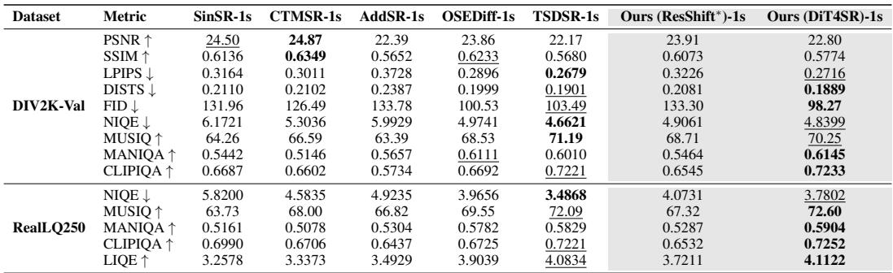
*Table extracted: Table extracted by MinerU. Dataset Metric SinSR-1s CTMSR-1s AddSR-1s OSEDiff-1s TSDSR-1s Ours (ResShift*)-1s Ours (DiT4SR)-1s DIV2K-Val PSNR ↑ 24.50 24.87 22.39 23.86 22.17 23.91 22.80 SSIM ↑ 0.6136 0.6349 0*

> 💡 **Table extracted 批读**: 表格要横向看 SOTA 排名，也要纵向看 fidelity 指标和 perceptual 指标是否相互牺牲。

Table 1: Noiseless quantitative results on DIV2K. We compute the average PSNR (dB), LPIPS and FID of different methods on $4 \times$ SR. The best and second best results are highlighted in bold and underline. The distilled model produces superior performance in terms of trade-off metrics through adjustment of the hyperparameter $t$ .   
Table 2: Noiseless (top) and noisy (bottom) quantitative results on FFHQ $\pmb { 2 5 6 } \times 2 5 6$ . We compute the average PSNR (dB), LPIPS and FID of different methods on $4 \times$ SR. The best and second best results are highlighted in bold and underline.

> 💡 **批注**: 这里在讨论 fidelity-realism/perception-distortion 张力：SR 既要贴近结构，又要生成自然高频细节。

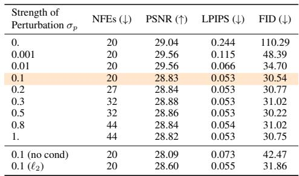
*Table 7: Table 7: Ablation on noiseless FFHQ $2 5 6 \times 2 5 6$ first stage. The default training setting is ${ \mathfrak { b s } } = 3 2$ $\mathrm { ~ k ~ } = \ 0 . 0 0 0 1$ ; loss type $\mathit { \Theta } = \mathit { \Theta } \ell _ { 1 }$ ; with condition; all experiments are trained for $1 0 0 \mathrm { k }$ steps. The final choice is highlighted to balance the performance and efficiency.*

> 💡 **Table 7 批读**: 表格要横向看 SOTA 排名，也要纵向看 fidelity 指标和 perceptual 指标是否相互牺牲。

# 4.1 EXPERIMENTAL SETUP

Datasets. We perform extensive SR experiments on the FFHQ $2 5 6 \times 2 5 6$ (Karras et al., 2019), DIV2K (Agustsson & Timofte, 2017) and ImageNet $2 5 6 \times 2 5 6$ (Russakovsky et al., 2015) datasets to assess the bicubic SR performance of OFTSR on faces and natural images. For each dataset, we evaluate on 100 hold-out validation images without cherry-picking. For evaluating real SR, we use both synthetic set and real world set. Synthetic set includes 100 images from Imagenet for $6 4  2 5 6$ SR and 100 images from DIV2K for $1 2 8 \to 5 1 2$ SR, both degraded using RealESRGAN pipeline. Real world test set includes RealSR (Cai et al., 2019), RealSet80 (Yue et al., 2024b) and RealLQ250 (Ai et al., 2025). For distilling DiT4SR, we construct the training set using a combination of images from DIV2K (Agustsson & Timofte, 2017), DIV8K (Gu et al., 2019), Flickr2K (Timofte et al., 2017), LSDIR (Li et al., 2023b) and the first 10K images from FFHQ (Karras et al., 2019).

> 💡 **批注**: 这是蒸馏逻辑：用 teacher 或 score regularization 把多步/大模型能力迁移给单步模型。

Teacher Models. We employ three types of teacher models in our experiments: (1) Self-trained teachers (2 types of backbones: Guided Diffusion (Dhariwal & Nichol, 2021) for bicubic SR (Tabs. 1 to 3) and ResShift (Yue et al., 2024b) for real SR (Tabs. 4 and 5)) using the noise-augmented conditional flow strategy in Sec. 3.1, which showcases the effectiveness of our training scheme; (2) An off-the-shelf DiT4SR teacher (built on Stable Diffusion (SD) 3.5). Since SD-based models possess significantly stronger generative priors and are prohibitively expensive for us to pre-train, we distill DiT4SR with our method to enable fair comparison with the latest SOTA approaches for realSR (Tab. 6); (3) An off-the-shelf ResShift teacher, allowing direct comparison with SinSR (which is distilled from ResShift) and fair computational cost comparison (Tabs. 9 and 10).

> 💡 **批注**: 这是蒸馏逻辑：用 teacher 或 score regularization 把多步/大模型能力迁移给单步模型。

Evaluation Metrics. The metrics we use for comparison are Peak Signal-to-Noise Ratio (PSNR), Frechet Inception Distance (FID), and Learned Perceptual Image Patch Similarity (LPIPS) (Zhang ´ et al., 2018) distance. The FID evaluates the visual quality by calculating the feature distance between two image distributions. In our experiments, we calculate the FID using the HR images and the restored images from the 100 hold-out validation set with Clean-FID (Parmar et al., 2022). LPIPS measures the average perceptual similarity between the restored images and their corresponding HR images. PSNR measures the restoration faithfulness between two images. And LPIPS and PSNR are the two main metrics we use to measure the perceptual-fidelity trade-offs. For real SR task, we also use no-reference Image Quality Assessment (IQA) including NIQE Zhang et al. (2015), CLIPIQA Wang et al. (2023b), MUSIQ Ke et al. (2021), and MANIQA Yang et al. (2022).

> 💡 **批注**: 这里在讨论 fidelity-realism/perception-distortion 张力：SR 既要贴近结构，又要生成自然高频细节。

Compared Methods. We conduct comprehensive comparisons against state-of-the-art diffusionbased image super-resolution methods, which can be categorized into two groups: (1) Training-free methods, including DPS (Chung et al., 2022), DDRM (Kawar et al., 2022), DDNM (Wang et al., 2022b), DiffPIR (Zhu et al., 2023), CDDB (Chung et al., 2024), and SITCOM (Alkhouri et al., 2024); (2) Training-based methods: GOUB (Yue et al., 2023), ECDB (Yue et al., 2024a), InDI (Delbracio & Milanfar, 2023), DAVI (Lee et al., 2024), I2SB (Liu et al., 2023a), DDC (Chen et al., 2024), ResShift (Yue et al., 2024b), SinSR (Wang et al., 2024c) and CTMSR (You et al., 2025). And large scale Stable Diffusion based methods such as OSEDiff (Wu et al., 2024), AddSR (Xie et al., 2024) and TSDSR (Dong et al., 2025). It is noteworthy that SITCOM requires K inner-iterations to evaluate and differentiate the score function at each sampling step. To further validate the effectiveness of our method, we conduct experiment on real-world image super-resolution. Following (Yue et al., 2024b; Wang et al., 2024c), we use Imagenet $2 5 6 \times 2 5 6$ as HR training data and synthesize LR images using degradation pipeline of RealESRGAN (Wang et al., 2021).

> 💡 **批注**: 注意 latent diffusion 架构路径：LQ/HR 往往先被 VAE 编码，再在 latent 空间完成 denoising 或调制。

Table 4: Quantitative results of real-world image superresolution on ImageNet $2 5 6 \times 2 5 6$ and RealSR (Cai et al., 2019). The best and second best results are highlighted in bold and underline. The number of inference steps is indicated by ‘s’, which is the same as NFE when not use CFG.

> 💡 **批注**: 这是实验证据：要同时看保真指标、感知指标和速度指标。

Table 3: Noiseless quantitative results on ImageNet $2 5 6 \times 2 5 6$ . We compute the average PSNR (dB), LPIPS and FID of different methods on $4 \times \mathrm { S R }$ . The best and second best results are highlighted in bold and underline.

> 💡 **批注**: 这是实验证据：要同时看保真指标、感知指标和速度指标。

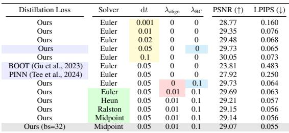
*Table 8: Solver , and $\mathrm { d } t \ $ Distillation Loss .*

> 💡 **Table 8 批读**: 表格要横向看 SOTA 排名，也要纵向看 fidelity 指标和 perceptual 指标是否相互牺牲。

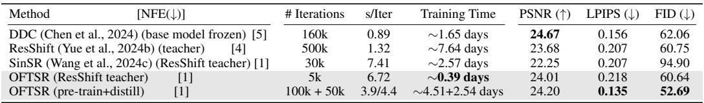
*Table 9: Table 9: Comparison of training cost on single NVIDIA A100.*

> 💡 **Table 9 批读**: 表格要横向看 SOTA 排名，也要纵向看 fidelity 指标和 perceptual 指标是否相互牺牲。

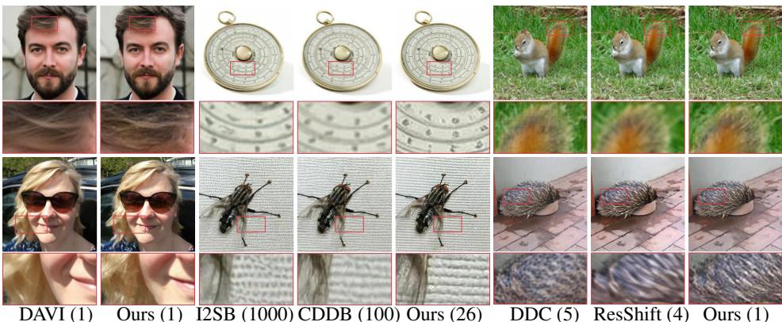
*Figure 5: Figure 5: Qualitative comparison with training-based methods. The first two columns demonstrate $4 \times \mathrm { S R }$ results on the FFHQ dataset with noise level $\sigma _ { n } = 0 . 0 5$ . The remaining columns show noiseless $4 \times \mathrm { S R }$ results on the ImageNet dataset. Numbers next to the method names represent the required NFEs.*

> 💡 **Figure 5 批读**: 这张图通常承担方法动机、框架或视觉对比作用。重点看它证明的是质量、速度还是可控性。

Training Details. We do experiments for both noisy and noiseless SR. For noiseless SR, bicubic downsampling is performed on all three datasets. For noisy SR, we conduct experiment only on FFHQ $2 5 6 \times 2 5 6$ dataset with average-pooling downsampling and Gaussian noise with a standard deviation $\sigma _ { y } = 0 . 0 5$ . All images are normalized to the range of $[ - 1 , 1 ]$ . For experiments on FFHQ $2 5 6 \times 2 5 6$ and DIV2K, we adopt the same model architecture used for FFHQ in (Chung et al., 2022); and for experiment on ImageNet $2 5 6 \times 2 5 6$ , we use the same model architecture as the pretrained unconditional model used in (Dhariwal & Nichol, 2021). We modify the input convolution layer to accept concatenated image input. The first stage models are trained from scratch and are sampled with RK45 sampler by default. The one-step model is initialized from the teacher model for distillation. We use the Adam optimizer with a linear warmup schedule over 1k training steps, followed by a learning rate of $1 e - 4$ for both stages.

> 💡 **批注**: 这里的关键词是单步推理：作者试图把原本多次 denoising 的生成先验压缩到一次前向中。

# 4.2 RESULTS

Quantitative Results. We present comprehensive quantitative evaluations on several benchmark datasets: DIV2K, FFHQ, ImageNet and real world test set and different tasks (including noiseless SR, noisy SR and real world SR) (Tabs. 1 to 6). Our analysis reveals several findings: (i) The first-stage OFTSR achieves superior performance in perceptual metrics (FID and LPIPS) while requiring fewer than 32 NFEs. (ii) Our distillation

> 💡 **批注**: 这里在讨论 fidelity-realism/perception-distortion 张力：SR 既要贴近结构，又要生成自然高频细节。

Table 5: Quantitative comparison on real world sets. The best and second best results are in bold and underline.

> 💡 **批注**: 这是实验证据：要同时看保真指标、感知指标和速度指标。

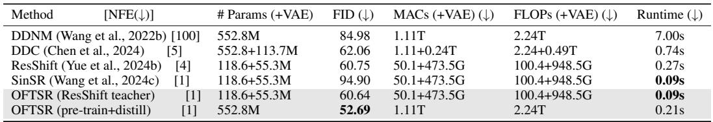
*Table 10: Table 10: Comparison of inference cost on single NVIDIA A100.*

> 💡 **Table 10 批读**: 表格要横向看 SOTA 排名，也要纵向看 fidelity 指标和 perceptual 指标是否相互牺牲。

algorithm is versatile, when applied to ResShift (Yue et al., 2024b) teacher, our distilled model achieved better one-step performance than SinSR (Wang et al., 2024c) (see Tab. 9). (iii) Our distilled version of OFTSR demonstrates remarkable versatility, achieving either the highest PSNR

> 💡 **批注**: 这里的关键词是单步推理：作者试图把原本多次 denoising 的生成先验压缩到一次前向中。

Table 6: Quantitative comparison of state-of-the-art one-step SR methods on synthetic (DIV2K-Val) and real-world (RealLQ250) benchmarks. Best results are in bold, second best are underlined. Our method is tested under $t = 1$ . ResShift∗ means we train our noise-augmented conditional flow in Sec. 3.1 using the ResShift model architecture then distillation; and DiT4SR means we use the pretrained DiT4SR model as the teacher model for distillation.

> 💡 **批注**: 这里的关键词是单步推理：作者试图把原本多次 denoising 的生成先验压缩到一次前向中。

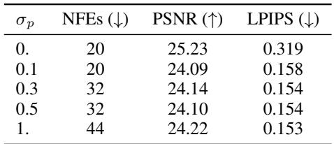
*Table 11: Table 11: Ablation on FFHQ $2 5 6 \times 2 5 6$ first stage with noisy SR; default: bs $\mathit { \Theta } = \ 3 2 $ ; $l r = 0 . 0 0 0 1$ ; $\bar { \ell } _ { 1 }$ loss; with LR condition.*

> 💡 **Table 11 批读**: 表格要横向看 SOTA 排名，也要纵向看 fidelity 指标和 perceptual 指标是否相互牺牲。

scores or ranking among the top two methods for FID and LPIPS metrics in one step. This indicates minimal performance degradation between the teacher and student models. (iv) Our experiments suggest that FID serves as a more reliable indicator of perceptual quality and better captures the performance gap between teacher and student models during distillation. (v) When applied to a powerful SD-based SR model (DiT4SR), our distillation algorithm produces a one-step generator whose performance is competitive with other leading SOTA distillation methods. This also validates the versatility of our distillation algorithm.

> 💡 **批注**: 这里的关键词是单步推理：作者试图把原本多次 denoising 的生成先验压缩到一次前向中。

Visual Results. Our experimental results demonstrate that OFTSR achieves high-quality image reconstructions. We evaluate OFTSR against leading training-free methods for $4 \times \mathrm { S R }$ , as shown in Fig. 4. While DPS can produce sharp reconstructions, it requires 1000 NFEs and often introduces significant distortions. In contrast, OFTSR successfully preserves structural information from lowresolution inputs while reconstructing fine details. Notably, our distilled version of OFTSR requires only one NFE, as other training-free methods suffer from severe error accumulation when using less than 10 NFEs. As illustrated in Fig. 5, we also compare OFTSR against state-of-the-art SR methods that require training. The results show that our approach generates patterns with rich, natural details. Furthermore, our distilled model enables flexible control over the fidelity-realism trade-offs in the generated high-resolution images. Fig. 3 demonstrates this capability through examples of noisy $4 \times$ SR with varying degrees of realism and fidelity. More qualitative comparison and visual examples can be found in Sec. K

> 💡 **批注**: 这里在讨论 fidelity-realism/perception-distortion 张力：SR 既要贴近结构，又要生成自然高频细节。

# 4.3 ABLATIONS

Perturbation Strength $\sigma _ { p }$ . In Tab. 7, we evaluate the design choices in the simple conditional flow training stage. All experiments in this ablation study are conducted under identical training conditions, with performance metrics measured using the RK45 solver. The most critical hyperparameter in this ablation is the strength of the perturbation $\sigma _ { p }$ . Consistent with previous works, we confirm that perturbation is essential for generating perceptually compelling images from LR inputs. Notably, we discover that increasing perturbation strength does not necessarily improve perceptual quality but instead leads to more curved PF-ODE, requiring additional NFEs to solve (see Tab. 7). Furthermore, our experiments demonstrate that conditioning on $\mathbf { x } _ { \mathrm { L R } }$ is crucial to compensate for information loss during perturbation. We also find that $\ell _ { 1 }$ loss outperforms $\ell _ { 2 }$ loss for our specific task. While (Kim et al., 2024) previously highlighted the significance of Gaussian perturbation, our work is the first to systematically analyze the relationship between noise perturbation and the trade-off between generation quality and efficiency in flow-based models.

> 💡 **批注**: 这里在讨论 fidelity-realism/perception-distortion 张力：SR 既要贴近结构，又要生成自然高频细节。

Distillation Design Space. In Tab. 8, we evaluate several crucial design choices for the distillation stage, including the distillation loss type, solver type, $\mathrm { d } t$ value, and the weighting of alignment and boundary losses. Since learning ${ \mathbf { v } } _ { \phi } ( \mathbf { x } _ { 0 , \mathrm { L R } } , 0 )$ is considerably easier than learning $\mathbf { v } _ { \phi } ( \mathbf { x } _ { 0 , \mathrm { L R } } , 1 )$ , we utilize metrics from the latter to decide our distillation hyperparameters. Our analysis of the step size

> 💡 **批注**: 这是蒸馏逻辑：用 teacher 或 score regularization 把多步/大模型能力迁移给单步模型。

Table 7: Ablation on noiseless FFHQ $2 5 6 \times 2 5 6$ first stage. The default training setting is ${ \mathfrak { b s } } = 3 2$ $\mathrm { ~ k ~ } = \ 0 . 0 0 0 1$ ; loss type $\mathit { \Theta } = \mathit { \Theta } \ell _ { 1 }$ ; with condition; all experiments are trained for $1 0 0 \mathrm { k }$ steps. The final choice is highlighted to balance the performance and efficiency.

> 💡 **批注**: 注意 latent diffusion 架构路径：LQ/HR 往往先被 VAE 编码，再在 latent 空间完成 denoising 或调制。

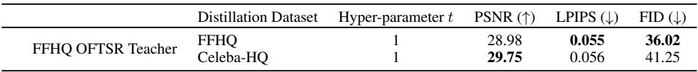
*Table 12: Table 12: Comparison of distilling FFHQ OFTSR teacher on FFHQ and Celeba-HQ dataset.*

> 💡 **Table 12 批读**: 表格要横向看 SOTA 排名，也要纵向看 fidelity 指标和 perceptual 指标是否相互牺牲。

Table 8: Ablation on noiseless FFHQ $2 5 6 \times 2 5 6$ distillation stage. The default training setting is $\ b s \ = \ 8$ ; $\sigma _ { p } = 0 . 1$ , $\mathrm { l r } = 0 . 0 0 0 1$ ; loss type $= \ell _ { 2 }$ ; with LR condition; all experiments are trained for 20k steps; And the one-step metrics are calculated with $t = 1$ . Ablations in subgroups can be ordered as $\mathrm { d } t \  \ \lambda _ { \mathrm { B C } } \  \ \lambda _ { \mathrm { a l i g n } } \ $ dt reveals that smaller values do not necessarily yield better results, leading us to select $\mathrm { d } t = 0 . 0 5$ for subsequent experiments. Our proposed loss function demonstrates substantial improvement over both the original BOOT (Gu et al., 2023) loss and PINN (Tee et al., 2024) distillation loss, achieving a significant LPIPS score improvement of more than 0.1. Further experimentation shows that both the alignment loss (Eq. (10)) and boundary loss (Eq. (11)) contribute to enhanced performance. By combining these losses with a Midpoint 2-order solver, we achieve additional improvements in our one-step model’s performance at $t = 1$ .

> 💡 **批注**: 这里的关键词是单步推理：作者试图把原本多次 denoising 的生成先验压缩到一次前向中。

Solver , and $\mathrm { d } t \ $ Distillation Loss .

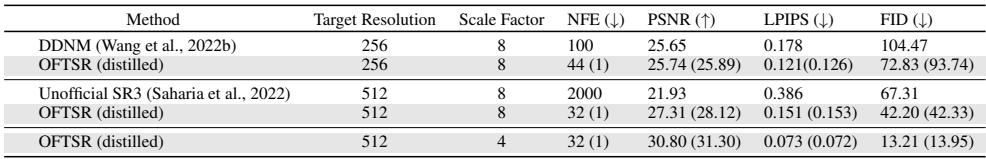
*Table 13: Table 13: A comparison of the models trained across different resolution and scale factor.*

> 💡 **Table 13 批读**: 表格要横向看 SOTA 排名，也要纵向看 fidelity 指标和 perceptual 指标是否相互牺牲。

# E MORE EXPERIMENTAL DETAILS

The training of all networks across both stages is smoothed using Exponential Moving Average (EMA) with a ratio of 0.9999. For FFHQ and ImageNet datasets, images are resized to 256 pixels with center cropping, while DIV2K training employs random crops of $2 5 6 \times 2 5 6$ patches. Data augmentation consists of horizontal flips with $50 \%$ probability and vertical flips with $6 \%$ probability throughout all experiments. For FFHQ noiseless experiment, we use default perturbation std $\sigma _ { p } =$ 0.1; for FFHQ noisy experiment, we use a higher perturbation std $\sigma _ { p } = 0 . 5$ to cover the resized noise from LR images, as suggested in Tab. 11; for both DIV2K and ImageNet we use $\sigma _ { p } = 0 . 2$ . For training, we employed three widely-used datasets: the standard ImageNet training set (1.28M images), the DIV2K training set (800 2K resolution images), and a subset of FFHQ consisting of the first 60,000 images from the dataset. All models are trained until convergence or up to $3 0 0 \mathrm { k }$ training iterations and we select the model based on best metrics. We train the model with uniform loss weight on $t$ . In the distillation stage, we sample the timestep $t$ using $t \sim \mathcal { U } \left[ t _ { \mathrm { m i n } } , t _ { \mathrm { m a x } } \right]$ with $t _ { \mathrm { m i n } } = 0 . 0 1$ and $t _ { \mathrm { m a x } } = 0 . 9 9$ in practice.

> 💡 **批注**: 这是蒸馏逻辑：用 teacher 或 score regularization 把多步/大模型能力迁移给单步模型。

For DIV2K evaluation, we first segment the large 2K resolution images into $2 5 6 \times 2 5 6$ patches for model inference, then reconstruct the final image by combining the restored patches. To ensure fair

> 💡 **批注**: 这是 flow/ODE 视角：重点是 student 是否沿 teacher 的连续采样轨迹对齐。

# F ADDITIONAL EXPERIMENTS

We evaluated our first-stage training on the FFHQ $2 5 6 \times 2 5 6$ dataset using $\sigma _ { p } = 1$ without conditioning, effectively training an unconditional generative model for human faces. For this experiment, we do not use any data augmentation. Our evaluation consists of generating 1k images from random noise using the RK45 sampler (with a ODE tolerance of 1e-3) and comparing them against the full training dataset of 70k images (we train our unconditional generative flow with the whole dataset). Initial experiments with $\ell _ { 1 }$ loss yielded a FID score of 41.042 with an average of 56 NFEs, which falls short of the previous state-of-the-art P2 model’s score of 28.139 (Choi et al., 2022). However, switching to $\ell _ { 2 }$ loss for standard rectified flow training significantly improved performance, achieving a FID of 24.577 with only 44 NFEs on average. The model architecture used in our experiment is the same as the one used in P2. We leave further investigation to this discrepancy between $\ell _ { 1 }$ and $\ell _ { 2 }$ for image generation and restoration as future works. To facilitate a direct comparison with P2’s best reported results (FID scores of 6.92 and 6.97 with 1,000 and 500 NFEs respectively (Choi et al., 2022)), we generated $5 0 \mathrm { k }$ samples using our $\ell _ { 2 }$ loss-trained model. Our approach achieved a superior FID score of 5.871 with substantially fewer NFEs (44), demonstrating the effectiveness of rectified flow. Representative non-cherry-picking samples from our model are presented in Fig. 12.

> 💡 **批注**: 注意 latent diffusion 架构路径：LQ/HR 往往先被 VAE 编码，再在 latent 空间完成 denoising 或调制。

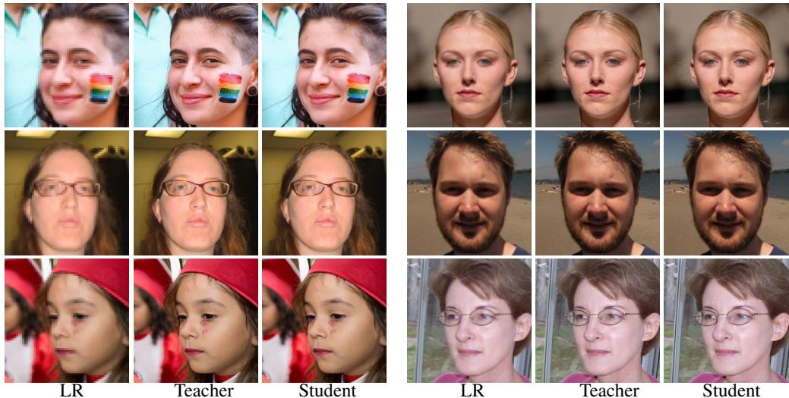
*Figure 9: Figure 9: Visual results for $8 \times$ (left) and $4 \times$ (right) SR from resolution 64 to 512 and 128 to 512 respectively.*

> 💡 **Figure 9 批读**: 这张图通常承担方法动机、框架或视觉对比作用。重点看它证明的是质量、速度还是可控性。

As our distillation technique is designed for image restoration tasks, we skip the distillation of this LR teacher unconditional generation flow.

> 💡 **批注**: 这是蒸馏逻辑：用 teacher 或 score regularization 把多步/大模型能力迁移给单步模型。

# G ADDITIONAL RESULTS

# H FAILURE CASE

We show visualization of extreme t (boundary t and out of distribution t) in Fig. 10. Results of t ranges from [0,1] do not show failure case, while (ill-defined) OOD t, especially $t < 0$ fails.

> 💡 **批注**: 这是 flow/ODE 视角：重点是 student 是否沿 teacher 的连续采样轨迹对齐。

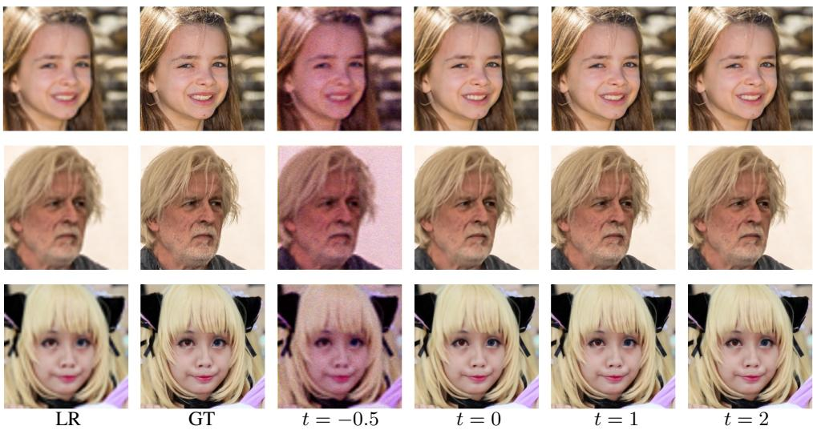
*Figure 10: Figure 10: Visual results of boundary $t$ (0 and 1) and out of distribution $t$ (-0.5 and 2*

> 💡 **Figure 10 批读**: 这张图通常承担方法动机、框架或视觉对比作用。重点看它证明的是质量、速度还是可控性。

# K ADDITIONAL VISUAL SAMPLES AND COMPARISONS

In this section, we present additional visual results that demonstrate our method’s capabilities. Fig. 13 showcases multiple examples illustrating the tunable fidelity-realism trade-offs achieved on the FFHQ dataset. Figs. 14 and 15 provide comprehensive comparisons between our method and existing approaches on FFHQ and ImageNet images, respectively. In Fig. 16, we compare real-world (without synthetic degradation) SR results, under the $1 2 8  5 1 2$ SR setting. In Fig. 17, we shows OFTSR can perform arbitrary scale SR. Here, the model is trained solely on ImageNet for $6 4  2 5 6$ SR, demonstrating strong resolution and scale generalization without any retraining. Additionally, in Fig. 18, we demonstrate our method’s performance on both real-world SR tasks and AI-generated content enhancement. In Figs. 19 and 20, we compare visually our OFTSR (DiT4SR) with other SOTA method for one-step large resolution SR. Results from Figs. 14, 15 and 18 are generated with our distilled one-step model unless otherwise specified.

> 💡 **批注**: 这里的关键词是单步推理：作者试图把原本多次 denoising 的生成先验压缩到一次前向中。

---

## 🔖 Section 总结

### 核心洞察
1. 检查 fidelity/perceptual/速度指标是否同时成立。
2. 关注消融和可控性曲线/视觉样例。
