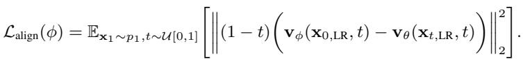
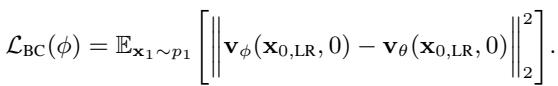
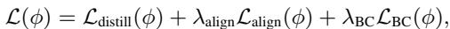
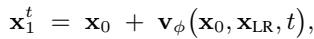

[← 返回 README](../README.md)

# 3 METHOD

## 📌 预览
本节是 OFTSR 的主体：3.1 训练 noise-augmented conditional flow teacher，3.2-3.3 用 teacher PF-ODE 约束 one-step student，3.4 与 BOOT/DAVI/SinSR 等方法划清监督信号差异。
---

> 💡 **Q&A 批注记录**:
> - Q: 为什么 flow 适合可调 trade-off？
> - A: OFTSR 把推理参数 $t$ 直接放进 student 输入，$t$ 决定从同一 noisy LR 初态出发时估计哪个风格的 HR 终点；小 $t$ 更保真，大 $t$ 更真实。

In this section, we introduce the OFTSR framework for one-step SR that can restore HR images with either high realism or high fidelity. We achieve this goal through a two-stage process: first, we train a direct flow-based model for SR, and then we distill this model into a simplified one-step variant. In Sec. 3.1, we present a simple noise-augmented conditional flow that expands the support of the initial distribution, enabling diverse reconstruction. In Sec. 3.2, we propose to distill the student model by restricting its predictions on the same ODE using teacher model from Sec. 3.1.
> 💡 **方法总览**: 先要有一条“好的多步轨迹”，再谈把轨迹蒸馏成一步。stage 1 负责 teacher 的条件生成能力，stage 2 负责 student 的速度和可调性。

*Figure 2: Figure 2: Illustration of the proposed distillation loss. Rather than directly distilling from the teacher, we leverage the teacher to align the one-step intermediate outputs, $\mathbf { x } _ { t }$ and $\mathbf { x } _ { s }$ , along teacher’s PF-ODE trajectory. For simplicity, LR conditioning is omitted in this figure.*
> 💡 **Figure 批读**: Fig. 2 是整篇最关键的图：student 从同一初态直接给出 $\mathbf{x}_t$ 和 $\mathbf{x}_s$，teacher 只在 $\mathbf{x}_t$ 处提供 ODE 方向，要求走一个小步后能到 $\mathbf{x}_s$。这比“teacher 终点监督”更像在学 flow map 的局部一致性。

# 3.1 NOISE AUGMENTED CONDITIONAL FLOW
> 💡 **小节预览**: 这里解释 teacher 怎么来：直接 LR→HR flow 会坍缩；给 LR 加噪声作为初态，同时把原 LR 拼接作 condition，才能支持同一 LR 的多种合理 HR。

Unlike diffusion models, flow-based models have the advantage that their initial distribution is not limited to Gaussian distributions. This flexibility suggests a natural approach for image restoration - directly learning a flow that maps the distribution of LR images $( p _ { \mathrm { L R } } )$ to that of HR images $( p _ { \mathrm { H R } } )$ . However, our initial experiments (see Tab. 7) showed poor performance with this direct approach, aligning with findings from several recent works (Delbracio & Milanfar, 2023; Kim et al., 2024; Lee et al., 2024). This training procedure tends to collapse the LR $\mathrm {  H R }$ mapping: during inference each LR is driven toward a single HR.
> 💡 **机制批读**: SR 是一对多逆问题，同一个 LR patch 可能对应多种高频纹理。直接把 $p_{LR}$ 流到 $p_{HR}$ 容易学成确定性回归，所以会偏平滑或塌到单一 HR。

To overcome this limitation, we propose a noise-augmented approach to process LR images. For any input image $\mathbf { x } _ { \mathrm { L R } }$ , we construct our initial distribution $p _ { 0 } ( \mathbf { \dot { x } } ) = p _ { \mathrm { L R } } ^ { \sigma _ { p } }$ by adding Gaussian noise with standard deviation $\sigma _ { p }$ . Specifically, we adopt a Variance-Preserving (VP) noising operation (Ho et al., 2020; Song et al., 2020b):
> 💡 **设计批读**: $\sigma_p$ 是 teacher 质量的核心旋钮：太小，多样性不足；太大，LR 信息被噪声破坏，ODE 也可能更弯、更难采样。

*Equation 4: Equation extracted by MinerU.*
> 💡 **公式批读**: Eq. (4) 构造 noisy initial state：$\sqrt{1-\sigma_p^2}$ 保持 VP 缩放，$\sigma_p\epsilon$ 注入随机性。它不是退化模型本身，而是 flow 初始分布的扩展。

where $\epsilon$ is a standard Gaussian noise. While this noise perturbation facilitates better generalization, it inevitably causes information loss in the LR image. To address this, we incorporate $\mathbf { x } _ { \mathrm { L R } }$ as a conditional input to our model as in Fig. 1. This VP formulation, together with the condition $\mathbf { x } _ { \mathrm { L R } }$ , makes our method particularly versatile, encompassing previous approaches as special cases. When $\sigma _ { p } = 0$ , our method reduces to the minimal augmentation case in InDI (Delbracio & Milanfar, 2023), and when $\sigma _ { p } = 1$ , it matches the training strategy of SR3 (Saharia et al., 2022).
> 💡 **边界批读**: $\sigma_p=0$ 接近直接从 LR 出发，偏保真但多样性弱；$\sigma_p=1$ 接近从噪声出发，生成自由度强但条件约束更依赖网络。OFTSR 选中间值是在保真、真实感和采样难度之间折中。

Given this noise-augmented formulation, we can now define our training objective as:
> 💡 **训练批读**: 下面的 loss 是 teacher 阶段目标，不是最终 student loss；先把条件 velocity field 学好，后面蒸馏才有可靠轨迹可对齐。

*Equation 5: Equation extracted by MinerU.*
> 💡 **公式批读**: Eq. (5) 是条件 rectified-flow matching：输入为 concat($\mathbf{x}_t,\mathbf{x}_{LR}$)，目标速度对应从 noisy LR 初态走向 HR target。这里的 condition 是干净 LR，不是噪声增强后的 $\mathbf{x}_0$。

where $\mathbb { D }$ is a discrepancy loss that measures the difference between two images (e.g., $\ell _ { 2 }$ loss or the $\ell _ { 1 }$ loss), $\mathbf { v } _ { \theta }$ is our velocity model, $\mathbf { x } _ { t , \mathrm { L R } } = \mathrm { c o n c a t } ( \mathbf { x } _ { t } , \mathbf { x } _ { \mathrm { L R } } )$ is the concatenation of $\mathbf { x } _ { t }$ and $\mathbf { x } _ { \mathrm { L R } }$ in channel dimension (see Fig. 1), The LR input of the algorithm is given by $\mathbf { x } _ { \mathrm { L R } } = \mathcal { H } ^ { T } ( \mathcal { H } ( \mathbf { x } _ { 1 } ) + \mathbf { n } )$ , where $\mathcal { H }$ is the downsampling operator, $\bar { \mathcal { H } } ^ { T }$ is its transpose and $\mathbf { n }$ is i.i.d. Gaussian noise with variance $\sigma _ { n } ^ { 2 }$ . The perturbed version of $\mathbf { x } _ { \mathrm { L R } }$ , denoted as $\mathbf { x } _ { \mathrm { 0 } }$ , is obtained using the noise augmentation strategy described in Eq. (4). Additionally, ${ \bf x } _ { t } = ( 1 - t ) { \bf x } _ { 0 } + t { \bf x } _ { 1 }$ denotes the intermediate state as in rectified flow (Liu et al., 2022; Liu, 2022).
> 💡 **数据流批读**: 这一段把变量关系说全了：HR $\mathbf{x}_1$ 经退化得到 LR，LR 经 VP noising 得到 $\mathbf{x}_0$，线性插值得到 $\mathbf{x}_t$，模型看到的是 $\mathbf{x}_t$ 与 $\mathbf{x}_{LR}$ 的拼接。

# 3.2 DISTILLATION LOSS

We introduce a distillation loss to train a one-step student that preserves the pre-trained SR flow’s fidelity–realism trade-off, allowing control at inference via a single hyperparameter $t$ . As shown in Fig. 6 and observed in prior work (Delbracio & Milanfar, 2023; Liu et al., 2023a), single-step estimates of the final state $\mathbf { x } _ { 1 } ^ { t }$ obtained from an intermediate state $\mathbf { x } _ { t }$ lie on a fidelity–realism curve: along the ODE sampling trajectory, estimates for larger $t$ (closer to 1) exhibit richer detail and lower LPIPS (better realism), whereas estimates for smaller $t$ (closer to 0) are blurrier but achieve lower MMSE and higher PSNR (better fidelity).
> 💡 **trade-off 批读**: 这里定义了 $t$ 的语义：不是简单“噪声越少越好”，而是沿轨迹估计终点时，小 $t$ 更像条件均值、大 $t$ 更像生成样本。student 必须保留这个曲线，否则只是一种固定输出风格。

To preserve the fidelity-realism trade-off, given the same input ${ \bf x } _ { \mathrm { 0 , L R } }$ , for two different timesteps $t$ and $s$ where $s > t$ , we require the student model $\mathbf { v } _ { \phi }$ to produce two corresponding intermediate states $\mathbf { x } _ { t }$ and $\mathbf { x } _ { s }$ that lie on the same ODE trajectory defined by the teacher (see Fig. 2):
> 💡 **蒸馏核心**: “same input, two timesteps” 是关键。student 不能把每个 $t$ 学成彼此无关的输出，而要让这些输出在 teacher ODE 下互相可达。

*Equation 6: Equation extracted by MinerU.*
> 💡 **公式批读**: Eq. (6) 表达 teacher ODE 的局部推进：从 $\mathbf{x}_t$ 按 teacher 速度走到 $\mathbf{x}_s$。这是轨迹一致性约束的原型。

where ${ \bf x } _ { 0 , \mathrm { L R } } = \mathrm { c o n c a t } ( { \bf x } _ { 0 } , { \bf x } _ { \mathrm { L R } } )$ is the concatenation of the input image $\mathbf { x } _ { \mathrm { 0 } }$ and the LR condition $\mathbf { x } _ { \mathrm { L R } }$ along the channel dimension. The intermediate states $\mathbf { x } _ { t }$ and $\mathbf { x } _ { s }$ can be computed using our one-step student model $\mathbf { v } _ { \phi }$ :
> 💡 **输入批读**: student 的输入始终是初态+LR condition，而不是 teacher 的中间状态；它要一次性预测“如果目标 trade-off 是 $t$，终点应该怎么偏移”。

*Equation 7: Equation extracted by MinerU.*
> 💡 **公式批读**: Eq. (7) 定义 student 生成中间状态的方式：$\mathbf{x}_0 + t\mathbf{v}_\phi(\cdot,t)$。因此同一个网络通过 $t$ 产生整条单步隐式轨迹。

Substituting the expression for the intermediate image $\mathbf { x } _ { t }$ and $\mathbf { x } _ { s }$ from Eq. (7) into Eq. (6), we have the following constraint on the student model:
> 💡 **推导批读**: 这一步把“状态要在 teacher ODE 上”转换成“student velocity 在 $t$ 和 $s$ 的输出要满足某个关系”，从几何约束变成可训练 loss。

*Equation 8: Equation extracted by MinerU.*
> 💡 **公式批读**: Eq. (8) 是 student velocity 的一致性方程；右侧 teacher velocity 起校准作用，左侧是 student 在两个 $t$ 上输出的差分关系。

Similar to BOOT, we can set $\mathrm { d } t = s - t$ and derive the final distillation loss:
> 💡 **蒸馏批读**: $dt$ 是训练中的局部步长，太大容易粗糙，太小不一定更好且数值信号弱；Tab. 8 会验证其选择。

*Equation 9: Equation extracted by MinerU.*
> 💡 **公式批读**: Eq. (9) 是核心 distillation loss：teacher 提供局部 ODE 方向，student 学会让自己在相邻时间的预测符合这个方向。stop-gradient 的位置决定谁被当作 target，影响训练稳定性。

where $\operatorname { S G } [ \cdot ]$ is the stop-gradient operator for training stability (Gu et al., 2023; Tee et al., 2024). Since $s - t = \mathrm { d } t$ and $t > 0$ , we do not have the ‘dividing by $0 ^ { \circ }$ issue in (Tee et al., 2024). Similarly to (Song et al., 2023b; Gu et al., 2023), we can use the Euler or general RK2 solver to calculate $\mathbf { v } _ { \theta }$ in Eq. (9). In our main experiments, we employ the midpoint method, while also evaluating two other RK2 solver variants, i.e., Heun’s method and Ralston’s method, for comparison in our ablations (see Tab. 8). In Sec. B.2, we show that our distillation loss is the discrete-time counterpart of the forward distillation loss (Boffi et al., 2025; Liu, 2025) by fixing the start timestep at 0, which is highly related to recent work MeanFlow (Geng et al., 2025) and AlignYourFlow (Sabour et al., 2025).
> 💡 **实现批读**: midpoint/RK2 不是细枝末节，因为 teacher velocity 的数值近似会直接影响 student 学到的轨迹；附录把它和 forward distillation/MeanFlow 系列联系起来。

# 3.3 ALIGNMENT AND BOUNDARY LOSS

In BOOT (Gu et al., 2023), a boundary condition is applied to enforce that the one-step student model and teacher model perform the same at the boundary $t = 0$ . We aim to align the teacher and student outputs in our model. The student produces $\mathbf { x } _ { 0 } + \mathbf { v } _ { \phi } ( \mathbf { x } _ { 0 , \mathrm { L R } } , t )$ , while the teacher generates $\mathbf { x } _ { t } + ( 1 - t ) \mathbf { v } _ { \theta } ( \mathbf { x } _ { t , \mathrm { L R } } , t )$ based on the student’s output $\mathbf { x } _ { t }$ using Eq. (7). By minimizing the difference between these outputs, we get the following alignment loss to align the teacher and student:
> 💡 **loss 角色**: distillation loss 对齐局部轨迹关系；alignment loss 直接对齐 teacher/student 对最终 HR 的估计，防止只有局部差分对了但终点偏移。

*Equation 10: Equation extracted by MinerU.*
> 💡 **公式批读**: Eq. (10) 比 Eq. (9) 更像“同一个 $t$ 下 teacher 与 student 的终点估计要一致”。它补的是绝对位置误差，而不是相邻时间关系。

If we consider this alignment loss only at $t = 0$ , it becomes equivalent to the boundary loss used in BOOT:
> 💡 **边界批读**: $t=0$ 是轨迹起点边界，teacher/student 在这里对齐可避免 student 从一开始就偏离 teacher 坐标系。

*Equation 11: Equation extracted by MinerU.*
> 💡 **公式批读**: Eq. (11) 是边界锚点；它不能单独保证整条 trade-off 曲线，但能稳定 student 的起点行为。

Since it is difficult to sample $t = 0$ for most training iterations, we add in addition the boundary loss Eq. (11) in our final training objective.
> 💡 **训练批读**: 这是一个实用补丁：随机采样连续 $t$ 几乎碰不到 0，所以显式加 boundary loss 保证起点不被忽略。

The overall training objective. The student network $\mathbf { v } _ { \phi }$ is trained to minimize the combination of the aforementioned three losses terms:
> 💡 **总目标批读**: 最终 student 不是单一蒸馏损失，而是“局部轨迹 + 终点估计 + 起点边界”三件事同时约束。

*Equation 12: Equation extracted by MinerU.*
> 💡 **公式批读**: Eq. (12) 的两个权重 $\lambda_{align},\lambda_{BC}$ 控制辅助约束强度；如果过大，可能压制 trajectory loss；过小，则 student 容易漂移。

where $\lambda _ { \mathrm { a l i g n } }$ and $\lambda _ { \mathrm { B C } }$ are the weights for alignment loss and boundary condition loss, respectively.   
The distillation stage of the proposed method is summarized in Algorithm 1.
> 💡 **算法批读**: Algorithm 1 要核对三点：student 是否由 teacher 初始化、teacher 是否冻结、每步是否只需 teacher 在 student 产生的 $\mathbf{x}_t$ 上查询 velocity。

*Figure 3: MinerU 原始图片*
> 💡 **Figure 批读**: 这里的图片由 MinerU 抽取不完整，结合后文 inference 段读：核心是单步 student 的输入包含 $\mathbf{x}_0,\mathbf{x}_{LR},t$，输出是指定 trade-off 的 HR 估计。

*Figure 4: GT LR DPS DDRM DDNM DiffPir SITCOM OursFigure 4: Qualitative comparison with training-free methods. The first row shows noiseless SR on the FFHQ dataset, the second row presents noisy SR $\sigma _ { n } = 0 . 0 5 )$ on FFHQ, and the bottom row demonstrates noiseless SR on the ImageNet dataset. Numbers next to the method names represent the required NFEs.*
> 💡 **Figure 批读**: 这张图实际属于实验视觉比较，被抽到了 Method 中。读法是把 Ours 的 1 NFE 与 DPS/DDRM/DDNM/DiffPIR/SITCOM 的多 NFE 对照，重点看是否少步仍保留结构、不产生明显伪纹理。

GT LR DPS DDRM DDNM DiffPir SITCOM OursFigure 4: Qualitative comparison with training-free methods. The first row shows noiseless SR on the FFHQ dataset, the second row presents noisy SR $\sigma _ { n } = 0 . 0 5 )$ on FFHQ, and the bottom row demonstrates noiseless SR on the ImageNet dataset. Numbers next to the method names represent the required NFEs.
> 💡 **排版批读**: 这是图注 OCR 重复，不是方法正文。保留原文即可，技术判断应回到 Fig. 4 和 Sec. 4 的定量表。

Inference. After training, the one-step student $\mathbf { v } _ { \phi }$ produces the final high-resolution output $\mathbf { x } _ { 1 } ^ { t }$ in a single forward pass, conditioned on the initial state $\mathbf { x } _ { \mathrm { 0 } }$ , the low-resolution input $\mathbf { x } _ { \mathrm { L R } }$ , and the trade-off parameter $t$ . Concretely,
> 💡 **推理批读**: 这句确认最终部署形态：没有 ODE solver、多步 teacher 或额外优化，只有一次 student forward；可调性全部来自输入 $t$。

*Equation 13: Equation extracted by MinerU.*
> 💡 **公式批读**: Eq. (13) 是最终 one-step SR 公式：$\mathbf{x}_0$ 加上 student residual。$t$ 改变 residual 的方向/幅度，所以同一 LR 可输出不同 fidelity-realism 档位。

where $\mathbf { v } _ { \phi } ( \cdot )$ predicts a residual that refines $\mathbf { x } _ { \mathrm { 0 } }$ toward the desired point on the fidelity–realism curve specified by $t$ .
> 💡 **输出批读**: 注意输出点是 curve 上的某个估计，不保证是真实 HR；高 realism 档可能牺牲结构保真，需要用任务指标或人工偏好选 $t$。

# 3.4 COMPARISON TO RELATED WORKS
> 💡 **小节预览**: 这里对比的是蒸馏信号和适用场景：BOOT 对齐 Signal-ODE，DAVI 依赖 fake score/VSD，SinSR 蒸馏 ResShift 轨迹；OFTSR 声称更直接约束 teacher PF-ODE。

In this section, we distinguish the proposed OFTSR from several closely related methods.
> 💡 **对比批读**: 读 related work 不要只记谁快谁慢，要问每个方法的 teacher 信号是什么、是否保留 $t$ 可控、训练是否需要额外网络。

BOOT (Gu et al., 2023). Gu et al. proposed to make the prediction of the student model fulfill the Signal-ODE. In contrast, OFTSR directly constrains the student’s implicit prediction $\mathbf { x } _ { t }$ using the PF-ODE of the teacher model, leading to more concise and intuitive derivation and distillation objective. Moreover, while BOOT was originally designed for text-to-image generation using diffusion models, our method is built on rectified flow and demonstrates a smaller distillation gap compared to BOOT loss for SR task, and empirically achieves markedly better fidelity–realism trade-offs.
> 💡 **BOOT 对比**: 关键差异是约束对象：BOOT 让 student 满足 Signal-ODE，OFTSR 直接用 teacher PF-ODE 约束 student 的隐式 $\mathbf{x}_t$。是否更好要看 Tab. 8 的 BOOT loss 消融。

DAVI (Lee et al., 2024). Lee et al. introduced DAVI, which combines Variational Score Distillation (VSD) loss (Wang et al., 2024d; Luo et al., $2 0 2 3 \mathrm { a }$ ; Yin et al., 2024b) with data consistency loss to train a one-step SR model and utilizes the perturbation trick to present robust restoration ability. However, DAVI needs to train a fake score to track the denoising score of the one-step generator, resulting in reduced training efficiency.
> 💡 **VSD 批注**: VSD 相当于用 frozen diffusion teacher 给 student 输出提供“真实图像分布”的梯度；它提升感知质量，也带来 hallucination 风险。

SinSR (Wang et al., 2024c). Wang et al. proposed SinSR, which achieves near-teacher performance by distilling ResShift (Yue et al., 2024b) without adversarial training. However, SinSR requires simulation of the teacher model’s ODE trajectory, leading to computational overhead during training.
> 💡 **SinSR 对比**: SinSR 也是单步 SR 强基线，但主要目标是 near-teacher one-step；OFTSR 的额外卖点是不用牺牲 fidelity-realism 可调性，并声称训练成本更低。

Our OFTSR stands out from other diffusion and flow-based SR methods due to its unique ability to restore images with either high perceptual quality or low distortion. This capability is novel among diffusion and flow-based approaches.
> 💡 **claim 批读**: 这句话的强度很高：不是只要有一个高质量档，而是同一 one-step 模型能覆盖高 perceptual 与低 distortion 两端。后面必须用 $t$ 曲线和视觉序列支撑。

---

## 🔖 Section 总结

### 关键数字速查
| 指标 | 数值 |
|------|------|
| Stage 1 | noise-augmented conditional rectified-flow teacher |
| Stage 2 | ODE trajectory distillation + alignment + boundary |
| Inference | $\mathbf{x}_1^t=\mathbf{x}_0+\mathbf{v}_\phi(\mathbf{x}_{0,LR},t)$, one forward |

### 核心洞察
1. noise-augmented LR 不是 trick，而是为了把 SR 的一对多不确定性放进初始分布。
2. trajectory alignment 的本质是让 student 的 $t$ 维输出互相一致，并与 teacher ODE 局部方向一致。
3. alignment loss 和 boundary loss 是防漂移的辅助锚点；只靠 distillation 差分可能不够稳定。
4. 推理公式很简单，但训练依赖强 teacher 和数值 ODE 近似，这是成本与风险来源。

### 可追问点
- OFTSR 和 diffusion one-step 的差别在哪里？
- 为什么 flow 适合可调 trade-off？
- $dt$、$\sigma_p$、$\lambda_{align}$、$\lambda_{BC}$ 哪个对可调性最敏感？
