[← 返回 README](../README.md)

# Appendix

## 📌 预览
附录是 OFTSR 批读的“证据仓库”：B 节解释 distillation loss 与 forward distillation/BOOT 的关系，C-D 给出 teacher 上限和 $t$ shift，E-G 补复现细节与超参，H-J 说明失败边界、多样性和 $t$ 选择。
---

> 💡 **Q&A 批注记录**:
> - Q: OFTSR 和 diffusion one-step 的差别在哪里？
> - A: 附录 B 更精确地说：OFTSR loss 可看作 forward distillation 的离散形式，student 学的是同一 teacher ODE 上相邻时间预测的关系。

# ACKNOWLEDGEMENTS

Acknowledgments: This work was supported by the National Natural Science Foundation of China (Grant No. 62572234), the Gusu Innovation and Entrepreneurship Leading Talent Program (Grant No. ZXL20254324), and the Suzhou Key Technologies Project (Grant No. SGY2023136).

# REFERENCES

Eirikur Agustsson and Radu Timofte. Ntire 2017 challenge on single image super-resolution: Dataset and study. In Proceedings of the IEEE conference on computer vision and pattern recognition workshops, pp. 126–135, 2017.

Yuang Ai, Xiaoqiang Zhou, Huaibo Huang, Xiaotian Han, Zhengyu Chen, Quanzeng You, and Hongxia Yang. Dreamclear: High-capacity real-world image restoration with privacy-safe dataset curation. In NeurIPS, 2025.

Ismail Alkhouri, Shijun Liang, Cheng-Han Huang, Jimmy Dai, Qing Qu, Saiprasad Ravishankar, and Rongrong Wang. Sitcom: Step-wise triple-consistent diffusion sampling for inverse problems. arXiv preprint arXiv:2410.04479, 2024.

Yochai Blau and Tomer Michaeli. The perception-distortion tradeoff. In Proceedings of the IEEE conference on computer vision and pattern recognition, pp. 6228–6237, 2018.

Nicholas M Boffi, Michael S Albergo, and Eric Vanden-Eijnden. How to build a consistency model: Learning flow maps via self-distillation. arXiv preprint arXiv:2505.18825, 2025.

Tim Brooks, Aleksander Holynski, and Alexei A Efros. Instructpix2pix: Learning to follow image editing instructions. In Proceedings of the IEEE/CVF Conference on Computer Vision and Pattern Recognition, pp. 18392–18402, 2023.

Jianrui Cai, Hui Zeng, Hongwei Yong, Zisheng Cao, and Lei Zhang. Toward real-world single image superresolution: A new benchmark and a new model. In Proceedings of the IEEE/CVF international conference on computer vision, pp. 3086–3095, 2019.

Hanyu Chen, Zhixiu Hao, and Liying Xiao. Deep data consistency: a fast and robust diffusion model-based solver for inverse problems. arXiv preprint arXiv:2405.10748, 2024.

Liangyu Chen, Xiaojie Chu, Xiangyu Zhang, and Jian Sun. Simple baselines for image restoration. In European conference on computer vision, pp. 17–33. Springer, 2022.

Zheng Chen, Yulun Zhang, Jinjin Gu, Xin Yuan, Linghe Kong, Guihai Chen, and Xiaokang Yang. Image super-resolution with text prompt diffusion. arXiv preprint arXiv:2311.14282, 2023.

Jooyoung Choi, Jungbeom Lee, Chaehun Shin, Sungwon Kim, Hyunwoo Kim, and Sungroh Yoon. Perception prioritized training of diffusion models. In Proceedings of the IEEE/CVF Conference on Computer Vision and Pattern Recognition, pp. 11472–11481, 2022.

Hyungjin Chung, Jeongsol Kim, Michael T Mccann, Marc L Klasky, and Jong Chul Ye. Diffusion posterior sampling for general noisy inverse problems. arXiv preprint arXiv:2209.14687, 2022.

Hyungjin Chung, Jeongsol Kim, and Jong Chul Ye. Direct diffusion bridge using data consistency for inverse problems. Advances in Neural Information Processing Systems, 36, 2024.

Mauricio Delbracio and Peyman Milanfar. Inversion by direct iteration: An alternative to denoising diffusion for image restoration. arXiv preprint arXiv:2303.11435, 2023.

Jia Deng, Wei Dong, Richard Socher, Li-Jia Li, Kai Li, and Li Fei-Fei. Imagenet: A large-scale hierarchical image database. In 2009 IEEE conference on computer vision and pattern recognition, pp. 248–255. Ieee, 2009.

Prafulla Dhariwal and Alexander Nichol. Diffusion models beat gans on image synthesis. Advances in Neural Information Processing Systems, 34:8780–8794, 2021.

Laurent Dinh, Jascha Sohl-Dickstein, and Samy Bengio. Density estimation using real nvp. arXiv preprint arXiv:1605.08803, 2016.

Linwei Dong, Qingnan Fan, Yihong Guo, Zhonghao Wang, Qi Zhang, Jinwei Chen, Yawei Luo, and Changqing Zou. Tsd-sr: One-step diffusion with target score distillation for real-world image super-resolution. In CVPR, 2025.

Patrick Esser, Sumith Kulal, Andreas Blattmann, Rahim Entezari, Jonas Muller, Harry Saini, Yam Levi, Do- ¨ minik Lorenz, Axel Sauer, Frederic Boesel, et al. Scaling rectified flow transformers for high-resolution image synthesis. In Forty-first International Conference on Machine Learning, 2024.

Zhengyang Geng, Mingyang Deng, Xingjian Bai, J Zico Kolter, and Kaiming He. Mean flows for one-step generative modeling. arXiv preprint arXiv:2505.13447, 2025.

Ian Goodfellow, Jean Pouget-Abadie, Mehdi Mirza, Bing Xu, David Warde-Farley, Sherjil Ozair, Aaron Courville, and Yoshua Bengio. Generative adversarial networks. Communications of the ACM, 63(11): 139–144, 2020.

Hayit Greenspan. Super-resolution in medical imaging. The computer journal, 52(1):43–63, 2009.

Jiatao Gu, Shuangfei Zhai, Yizhe Zhang, Lingjie Liu, and Joshua M Susskind. Boot: Data-free distillation of denoising diffusion models with bootstrapping. In ICML 2023 Workshop on Structured Probabilistic Inference $\{ \backslash \& \}$ Generative Modeling, 2023.

Shuhang Gu, Andreas Lugmayr, Martin Danelljan, Manuel Fritsche, Julien Lamour, and Radu Timofte. Div8k: Diverse 8k resolution image dataset. 2019.

Nikita Gushchin, David Li, Daniil Selikhanovych, Evgeny Burnaev, Dmitry Baranchuk, and Alexander Korotin. Inverse bridge matching distillation. arXiv preprint arXiv:2502.01362, 2025.

Guande He, Kaiwen Zheng, Jianfei Chen, Fan Bao, and Jun Zhu. Consistency diffusion bridge models. Advances in Neural Information Processing Systems, 37:23516–23548, 2024.

Amir Hertz, Ron Mokady, Jay Tenenbaum, Kfir Aberman, Yael Pritch, and Daniel Cohen-Or. Prompt-to-prompt image editing with cross attention control. arXiv preprint arXiv:2208.01626, 2022.

Jonathan Ho, Ajay Jain, and Pieter Abbeel. Denoising diffusion probabilistic models. Advances in Neural Information Processing Systems, 33:6840–6851, 2020.

Aapo Hyvarinen and Peter Dayan. Estimation of non-normalized statistical models by score matching. ¨ Journal of Machine Learning Research, 6(4), 2005.

Dipali Joshi, Amit Jana, Harsh Lone, Vijay Taru, and Siddharth Thorat. Image and video upscaling using realesrgan. Journal Publication of International Research for Engineering and Management (JOIREM), 5(04), 2025.

Tero Karras, Samuli Laine, and Timo Aila. A style-based generator architecture for generative adversarial networks. In Proceedings of the IEEE/CVF conference on computer vision and pattern recognition, pp. 4401–4410, 2019.

Bahjat Kawar, Michael Elad, Stefano Ermon, and Jiaming Song. Denoising diffusion restoration models. arXiv preprint arXiv:2201.11793, 2022.

Bahjat Kawar, Shiran Zada, Oran Lang, Omer Tov, Huiwen Chang, Tali Dekel, Inbar Mosseri, and Michal Irani. Imagic: Text-based real image editing with diffusion models. In Proceedings of the IEEE/CVF Conference on Computer Vision and Pattern Recognition, pp. 6007–6017, 2023.

Junjie Ke, Qifei Wang, Yilin Wang, Peyman Milanfar, and Feng Yang. Musiq: Multi-scale image quality transformer. In Proceedings of the IEEE/CVF international conference on computer vision, pp. 5148–5157, 2021.
> 💡 **指标解读**: PSNR/SSIM 偏结构保真，LPIPS/DISTS/NIQE/MUSIQ/CLIPIQA 偏感知质量；one-step SR 的 claim 通常要看两类指标是否同步成立。

Beomsu Kim, Jaemin Kim, Jeongsol Kim, and Jong Chul Ye. Generalized consistency trajectory models for image manipulation. arXiv preprint arXiv:2403.12510, 2024.

Diederik P Kingma and Max Welling. Auto-encoding variational bayes. arXiv preprint arXiv:1312.6114, 2013.

Sojin Lee, Dogyun Park, Inho Kong, and Hyunwoo J Kim. Diffusion prior-based amortized variational inference for noisy inverse problems. arXiv preprint arXiv:2407.16125, 2024.

Jianze Li, Jiezhang Cao, Zichen Zou, Xiongfei Su, Xin Yuan, Yulun Zhang, Yong Guo, and Xiaokang Yang. Distillation-free one-step diffusion for real-world image super-resolution. arXiv preprint arXiv:2410.04224, 2024.

Xin Li, Yulin Ren, Xin Jin, Cuiling Lan, Xingrui Wang, Wenjun Zeng, Xinchao Wang, and Zhibo Chen. Diffusion models for image restoration and enhancement–a comprehensive survey. arXiv preprint arXiv:2308.09388, 2023a.   
Yawei Li, Kai Zhang, Jingyun Liang, Jiezhang Cao, Ce Liu, Rui Gong, Yulun Zhang, Hao Tang, Yun Liu, Denis Demandolx, et al. Lsdir: A large scale dataset for image restoration. In Proceedings of the IEEE/CVF Conference on Computer Vision and Pattern Recognition, pp. 1775–1787, 2023b.   
Jingyun Liang, Jiezhang Cao, Guolei Sun, Kai Zhang, Luc Van Gool, and Radu Timofte. Swinir: Image restoration using swin transformer. In Proceedings of the IEEE/CVF International Conference on Computer Vision, pp. 1833–1844, 2021.   
Xinqi Lin, Jingwen He, Ziyan Chen, Zhaoyang Lyu, Bo Dai, Fanghua Yu, Wanli Ouyang, Yu Qiao, and Chao Dong. Diffbir: Towards blind image restoration with generative diffusion prior. arXiv preprint arXiv:2308.15070, 2023.   
Yaron Lipman, Ricky TQ Chen, Heli Ben-Hamu, Maximilian Nickel, and Matt Le. Flow matching for generative modeling. arXiv preprint arXiv:2210.02747, 2022.   
Guan-Horng Liu, Arash Vahdat, De-An Huang, Evangelos A Theodorou, Weili Nie, and Anima Anandkumar. I 2 sb: Image-to-image schr\” odinger bridge. arXiv preprint arXiv:2302.05872, 2023a.   
Jiawei Liu, Qiang Wang, Huijie Fan, Yinong Wang, Yandong Tang, and Liangqiong Qu. Residual denoising diffusion models. In Proceedings of the IEEE/CVF Conference on Computer Vision and Pattern Recognition, pp. 2773–2783, 2024.   
Qiang Liu. Rectified flow: A marginal preserving approach to optimal transport. arXiv preprint arXiv:2209.14577, 2022.   
Qiang Liu. Icml tutorial on the blessing of flow. International conference on machine learning, 2025.   
Ruoshi Liu, Rundi Wu, Basile Van Hoorick, Pavel Tokmakov, Sergey Zakharov, and Carl Vondrick. Zero-1-to-3: Zero-shot one image to 3d object. In Proceedings of the IEEE/CVF International Conference on Computer Vision, pp. 9298–9309, 2023b.   
Xingchao Liu, Chengyue Gong, and Qiang Liu. Flow straight and fast: Learning to generate and transfer data with rectified flow. arXiv preprint arXiv:2209.03003, 2022.   
Eric Luhman and Troy Luhman. Knowledge distillation in iterative generative models for improved sampling speed. arXiv preprint arXiv:2101.02388, 2021.   
Weijian Luo, Tianyang Hu, Shifeng Zhang, Jiacheng Sun, Zhenguo Li, and Zhihua Zhang. Diff-instruct: A universal approach for transferring knowledge from pre-trained diffusion models. arXiv preprint arXiv:2305.18455, 2023a.   
Ziwei Luo, Fredrik K Gustafsson, Zheng Zhao, Jens Sjolund, and Thomas B Sch ¨ on. Image restoration with ¨ mean-reverting stochastic differential equations. arXiv preprint arXiv:2301.11699, 2023b.   
Morteza Mardani, Jiaming Song, Jan Kautz, and Arash Vahdat. A variational perspective on solving inverse problems with diffusion models. arXiv preprint arXiv:2305.04391, 2023.   
Fabian Mentzer, George D Toderici, Michael Tschannen, and Eirikur Agustsson. High-fidelity generative image compression. Advances in Neural Information Processing Systems, 33:11913–11924, 2020.   
Alexander Quinn Nichol and Prafulla Dhariwal. Improved denoising diffusion probabilistic models. In International Conference on Machine Learning, pp. 8162–8171. PMLR, 2021.   
Gaurav Parmar, Richard Zhang, and Jun-Yan Zhu. On aliased resizing and surprising subtleties in gan evaluation. In Proceedings of the IEEE/CVF Conference on Computer Vision and Pattern Recognition, pp. 11410–11420, 2022.   
Ben Poole, Ajay Jain, Jonathan T Barron, and Ben Mildenhall. Dreamfusion: Text-to-3d using 2d diffusion. arXiv preprint arXiv:2209.14988, 2022.   
Aditya Ramesh, Prafulla Dhariwal, Alex Nichol, Casey Chu, and Mark Chen. Hierarchical text-conditional image generation with clip latents. arXiv preprint arXiv:2204.06125, 2022.   
Ali Razavi, Aaron Van den Oord, and Oriol Vinyals. Generating diverse high-fidelity images with vq-vae-2. Advances in neural information processing systems, 32, 2019.   
Robin Rombach, Andreas Blattmann, Dominik Lorenz, Patrick Esser, and Bjorn Ommer. High-resolution ¨ image synthesis with latent diffusion models. In Proceedings of the IEEE/CVF Conference on Computer Vision and Pattern Recognition, pp. 10684–10695, 2022.   
Olga Russakovsky, Jia Deng, Hao Su, Jonathan Krause, Sanjeev Satheesh, Sean Ma, Zhiheng Huang, Andrej Karpathy, Aditya Khosla, Michael Bernstein, et al. Imagenet large scale visual recognition challenge. International journal of computer vision, 115(3):211–252, 2015.   
Amirmojtaba Sabour, Sanja Fidler, and Karsten Kreis. Align your flow: Scaling continuous-time flow map distillation. arXiv preprint arXiv:2506.14603, 2025.   
Chitwan Saharia, Jonathan Ho, William Chan, Tim Salimans, David J Fleet, and Mohammad Norouzi. Image super-resolution via iterative refinement. arXiv preprint arXiv:2104.07636, 2021.   
Chitwan Saharia, Jonathan Ho, William Chan, Tim Salimans, David J Fleet, and Mohammad Norouzi. Image super-resolution via iterative refinement. IEEE transactions on pattern analysis and machine intelligence, 45(4):4713–4726, 2022.   
Tim Salimans and Jonathan Ho. Progressive distillation for fast sampling of diffusion models. arXiv preprint arXiv:2202.00512, 2022.   
Axel Sauer, Dominik Lorenz, Andreas Blattmann, and Robin Rombach. Adversarial diffusion distillation. In European Conference on Computer Vision, pp. 87–103. Springer, 2025.   
Jascha Sohl-Dickstein, Eric Weiss, Niru Maheswaranathan, and Surya Ganguli. Deep unsupervised learning using nonequilibrium thermodynamics. In International Conference on Machine Learning, pp. 2256–2265. PMLR, 2015.   
Jiaming Song, Arash Vahdat, Morteza Mardani, and Jan Kautz. Pseudoinverse-guided diffusion models for inverse problems. In International Conference on Learning Representations, 2023a.   
Yang Song and Stefano Ermon. Generative modeling by estimating gradients of the data distribution. Advances in Neural Information Processing Systems, 32, 2019.   
Yang Song, Sahaj Garg, Jiaxin Shi, and Stefano Ermon. Sliced score matching: A scalable approach to density and score estimation. In Uncertainty in Artificial Intelligence, pp. 574–584. PMLR, 2020a.   
Yang Song, Jascha Sohl-Dickstein, Diederik P Kingma, Abhishek Kumar, Stefano Ermon, and Ben Poole. Score-based generative modeling through stochastic differential equations. arXiv preprint arXiv:2011.13456, 2020b.   
Yang Song, Prafulla Dhariwal, Mark Chen, and Ilya Sutskever. Consistency models. arXiv preprint arXiv:2303.01469, 2023b.   
Joshua Tian Jin Tee, Kang Zhang, Hee Suk Yoon, Dhananjaya Nagaraja Gowda, Chanwoo Kim, and Chang D Yoo. Physics informed distillation for diffusion models. Transactions on Machine Learning Research, 2024.   
Radu Timofte, Eirikur Agustsson, Luc Van Gool, Ming-Hsuan Yang, and Lei Zhang. Ntire 2017 challenge on single image super-resolution: Methods and results. In Proceedings of the IEEE conference on computer vision and pattern recognition workshops, pp. 114–125, 2017.   
Chen Wang, Jiatao Gu, Xiaoxiao Long, Yuan Liu, and Lingjie Liu. Geco: Generative image-to-3d within a second. arXiv preprint arXiv:2405.20327, 2024a.   
Haochen Wang, Xiaodan Du, Jiahao Li, Raymond A Yeh, and Greg Shakhnarovich. Score jacobian chaining: Lifting pretrained 2d diffusion models for 3d generation. In Proceedings of the IEEE/CVF Conference on Computer Vision and Pattern Recognition, pp. 12619–12629, 2023a.   
Jianyi Wang, Kelvin CK Chan, and Chen Change Loy. Exploring clip for assessing the look and feel of images. In Proceedings of the AAAI Conference on Artificial Intelligence, volume 37, pp. 2555–2563, 2023b.   
Jianyi Wang, Zongsheng Yue, Shangchen Zhou, Kelvin CK Chan, and Chen Change Loy. Exploiting diffusion prior for real-world image super-resolution. International Journal of Computer Vision, pp. 1–21, 2024b.   
Peijuan Wang, Bulent Bayram, and Elif Sertel. A comprehensive review on deep learning based remote sensing image super-resolution methods. Earth-Science Reviews, 232:104110, 2022a.   
Xintao Wang, Ke Yu, Shixiang Wu, Jinjin Gu, Yihao Liu, Chao Dong, Yu Qiao, and Chen Change Loy. Esrgan: Enhanced super-resolution generative adversarial networks. In Proceedings of the European conference on computer vision (ECCV) workshops, pp. 0–0, 2018.   
Xintao Wang, Liangbin Xie, Chao Dong, and Ying Shan. Real-esrgan: Training real-world blind superresolution with pure synthetic data. In Proceedings of the IEEE/CVF international conference on computer vision, pp. 1905–1914, 2021.   
Yinhuai Wang, Jiwen Yu, and Jian Zhang. Zero-shot image restoration using denoising diffusion null-space model. arXiv preprint arXiv:2212.00490, 2022b.   
Yuang Wang, Siyeop Yoon, Pengfei Jin, Matthew Tivnan, Sifan Song, Zhennong Chen, Rui Hu, Li Zhang, Quanzheng Li, Zhiqiang Chen, et al. Implicit image-to-image schrodinger bridge for image restoration. ¨ Pattern Recognition, 165:111627, 2025.   
Yufei Wang, Wenhan Yang, Xinyuan Chen, Yaohui Wang, Lanqing Guo, Lap-Pui Chau, Ziwei Liu, Yu Qiao, Alex C Kot, and Bihan Wen. Sinsr: diffusion-based image super-resolution in a single step. In Proceedings of the IEEE/CVF Conference on Computer Vision and Pattern Recognition, pp. 25796–25805, 2024c.   
Zhengyi Wang, Cheng Lu, Yikai Wang, Fan Bao, Chongxuan Li, Hang Su, and Jun Zhu. Prolificdreamer: Highfidelity and diverse text-to-3d generation with variational score distillation. Advances in Neural Information Processing Systems, 36, 2024d.   
Lemeng Wu, Chengyue Gong, Xingchao Liu, Mao Ye, and Qiang Liu. Diffusion-based molecule generation with informative prior bridges. Advances in Neural Information Processing Systems, 35:36533–36545, 2022.   
Rongyuan Wu, Lingchen Sun, Zhiyuan Ma, and Lei Zhang. One-step effective diffusion network for real-world image super-resolution. arXiv preprint arXiv:2406.08177, 2024.   
Rui Xie, Ying Tai, Chen Zhao, Kai Zhang, Zhenyu Zhang, Jun Zhou, Xiaoqian Ye, Qian Wang, and Jian Yang. Addsr: Accelerating diffusion-based blind super-resolution with adversarial diffusion distillation. arXiv preprint arXiv:2404.01717, 2024.   
Hanshu Yan, Xingchao Liu, Jiachun Pan, Jun Hao Liew, Qiang Liu, and Jiashi Feng. Perflow: Piecewise rectified flow as universal plug-and-play accelerator. arXiv preprint arXiv:2405.07510, 2024.   
Sidi Yang, Tianhe Wu, Shuwei Shi, Shanshan Lao, Yuan Gong, Mingdeng Cao, Jiahao Wang, and Yujiu Yang. Maniqa: Multi-dimension attention network for no-reference image quality assessment. In Proceedings of the IEEE/CVF Conference on Computer Vision and Pattern Recognition, pp. 1191–1200, 2022.   
Tianwei Yin, Michael Gharbi, Taesung Park, Richard Zhang, Eli Shechtman, Fredo Durand, and William T ¨ Freeman. Improved distribution matching distillation for fast image synthesis. arXiv preprint arXiv:2405.14867, 2024a.   
Tianwei Yin, Michael Gharbi, Richard Zhang, Eli Shechtman, Fredo Durand, William T Freeman, and Taesung ¨ Park. One-step diffusion with distribution matching distillation. In Proceedings of the IEEE/CVF Conference on Computer Vision and Pattern Recognition, pp. 6613–6623, 2024b.   
Weiyi You, Mingyang Zhang, Leheng Zhang, Xingyu Zhou, Kexuan Shi, and Shuhang Gu. Consistency trajectory matching for one-step generative super-resolution. arXiv preprint arXiv:2503.20349, 2025.   
Fanghua Yu, Jinjin Gu, Zheyuan Li, Jinfan Hu, Xiangtao Kong, Xintao Wang, Jingwen He, Yu Qiao, and Chao Dong. Scaling up to excellence: Practicing model scaling for photo-realistic image restoration in the wild. In Proceedings of the IEEE/CVF Conference on Computer Vision and Pattern Recognition, pp. 25669–25680, 2024.   
Conghan Yue, Zhengwei Peng, Junlong Ma, Shiyan Du, Pengxu Wei, and Dongyu Zhang. Image restoration through generalized ornstein-uhlenbeck bridge. arXiv preprint arXiv:2312.10299, 2023.   
Conghan Yue, Zhengwei Peng, Junlong Ma, and Dongyu Zhang. Enhanced control for diffusion bridge in image restoration. arXiv preprint arXiv:2408.16303, 2024a.   
Zongsheng Yue, Jianyi Wang, and Chen Change Loy. Resshift: Efficient diffusion model for image superresolution by residual shifting. Advances in Neural Information Processing Systems, 36, 2024b.   
Lin Zhang, Lei Zhang, and Alan C Bovik. A feature-enriched completely blind image quality evaluator. IEEE Transactions on Image Processing, 24(8):2579–2591, 2015.   
Richard Zhang, Phillip Isola, Alexei A Efros, Eli Shechtman, and Oliver Wang. The unreasonable effectiveness of deep features as a perceptual metric. In Proceedings of the IEEE conference on computer vision and pattern recognition, pp. 586–595, 2018.   
Yuanzhi Zhu, Kai Zhang, Jingyun Liang, Jiezhang Cao, Bihan Wen, Radu Timofte, and Luc Van Gool. Denoising diffusion models for plug-and-play image restoration. In Proceedings of the IEEE/CVF Conference on Computer Vision and Pattern Recognition, pp. 1219–1229, 2023.

# Appendix for OFTSR

# A USE OF LARGE LANGUAGE MODELS
> 💡 **小节预览**: 这节只说明 LLM 用于文字润色，不影响技术批读；真正的方法证据从 B 节开始。

We used large language models solely for text polishing and grammar correction during manuscript preparation. No LLMs were involved in the conception or design of the method, experiments, or analysis. All technical content, results, and conclusions have been independently verified and validated by the authors.

# B RELEVANT DERIVATIONS TO OUR DISTILLATION LOSS
> 💡 **小节预览**: B 节把正文 Eq. (9)/(12) 放到更一般的 flow-map distillation 框架里，重点看 stop-gradient 选择、BOOT/PINN 变体和 forward distillation 关系。

# B.1 CONTINUOUS VERSION OF THE FINAL LOSS

We provide detailed derivation to our distillation loss used in the paper. By substitute intermediate results $\mathbf { x } _ { s }$ and $\mathbf { x } _ { t }$ from student model Eq. (7) into the ODE induced by teacher model Eq. (8), we have:
> 💡 **推导批读**: 这一步是从几何约束转为 loss 的核心：student 自己给出 $\mathbf{x}_t,\mathbf{x}_s$，teacher 只检查这两个点是否符合它的 ODE 局部推进。

*Equation 14: Equation extracted by MinerU.*
> 💡 **公式批读**: Eq. (14) 是未整理前的轨迹一致性方程；读它时抓住三类量：student 在 $t/s$ 的 velocity、teacher 在 $\mathbf{x}_t$ 的 velocity、时间间隔 $s-t$。

Start from this constraint that applies to the student model, we can construct distillation loss in different forms. (i) In the same spirit as BOOT (Gu et al., 2023), we make only ${ \bf v } _ { \phi } ( { \bf x } _ { 0 , \mathrm { L R } } , s )$ and this will lead to loss Eq. (12). (ii) If we only detach the teacher output, we will end up with loss similar to PINN based distillation PID proposed in (Tee et al., 2024):
> 💡 **stop-gradient 批读**: 不同 detach 方式会改变优化对象：只把某些 student 分支当 target，还是把 teacher output detach。Tab. 8 的 BOOT/PINN 对比本质上是在比较这些训练稳定性与监督强度。

*Equation 15: Equation extracted by MinerU.*
> 💡 **公式批读**: Eq. (15) 是 PINN/PID 风格变体；它不是本文最终选择，主要用于说明同一 ODE constraint 可以派生多种 loss。

Both Eqs. (12) and (15) are loss variants from Eq. (8), and we did not try other variant given the already-good performance of Eq. (12).
> 💡 **风险批读**: 作者没有系统枚举所有 detach/loss 变体，所以“最优 loss”是相对已测试基线成立，不是理论上穷尽。

In addition, by considering the intermediate interpolation ${ \bf x } _ { t } = ( 1 - t ) { \bf x } _ { 0 } + t { \bf x } _ { 1 }$ as a special case of ${ \bf x } _ { t } = \sigma _ { t } { \bf x } _ { 0 } + \alpha _ { t } { \bf x } _ { 1 }$ in BOOT (Gu et al., 2023), we can derive the following distillation loss:
> 💡 **BOOT 关系**: 这里把 rectified-flow 的线性 schedule 嵌入 BOOT 的一般 schedule，说明 OFTSR 与 BOOT 不是完全无关，而是在 flow schedule 下更直接地写 teacher PF-ODE。

*Equation 16: Equation extracted by MinerU.*
> 💡 **公式批读**: Eq. (16) 是 BOOT 形式的等价/近似表达；真正要记的是它在 Tab. 8 中不如本文 Eq. (12)。

where $\begin{array} { r } { \lambda = 1 - \frac { t ( 1 - s ) } { s ( 1 - t ) } } \end{array}$ , ${ \bf x } _ { \phi } ( { \bf x } _ { 0 , \mathrm { L R } } , t ) = { \bf x } _ { 0 } + { \bf v } _ { \phi } ( { \bf x } _ { 0 , \mathrm { L R } } , t )$ , ${ \bf x } _ { \phi } ( { \bf x } _ { 0 , \mathrm { L R } } , s ) = { \bf x } _ { 0 } + { \bf v } _ { \phi } ( { \bf x } _ { 0 , \mathrm { L R } } , s )$ , and $\mathbf { x } _ { \theta } ( \mathbf { x } _ { t , \mathrm { L R } } , t ) = \mathbf { x } _ { t } + ( 1 - t ) \mathbf { v } _ { \theta } ( \mathbf { x } _ { t , \mathrm { L R } } , t )$ with $\mathbf { x } _ { t } = \mathbf { x } _ { 0 } + t \mathbf { v } _ { \phi } ( \mathbf { x } _ { 0 , \mathrm { L R } } , t )$ . We compared our proposed loss Eq. (12) with its variant Eq. (15) and Eq. (16) in Tab. 8 and our ablation shows that Eq. (12) works best for SR task.
> 💡 **实验连接**: 这段要和正文 Tab. 8 一起读：理论上可写多种形式，但 SR 任务中最终选择由 LPIPS/FID/PSNR 的 one-step 结果决定。

# B.2 OFTSR AS FORWARD DISTILLATION
> 💡 **小节预览**: 这一节回答“这是不是孤立 trick”：OFTSR loss 可视作 forward distillation 的离散化，与 MeanFlow/AlignYourFlow 在 flow-map 学习上有共同语言。

The general form of our OFTSR loss or BOOT (Gu et al., 2023) loss can be seen as a special case of forward distillation (Boffi et al., 2025; Sabour et al., 2025; Liu, 2025). Start from general relation:
> 💡 **定位批读**: 这给 OFTSR 一个更宽的理论背景：它不是只为 SR 手工拼 loss，而是在学习从一个时间到另一个时间的 flow map。

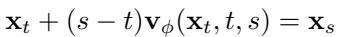
*Equation 17: Equation extracted by MinerU.*
> 💡 **公式批读**: Eq. (17) 的 mean velocity 是区间级别的速度；one-step student 可以理解成直接学某个区间的平均推进效果。

where ${ \bf v } _ { \phi } ( { \bf x } _ { t } , t , s )$ is the mean velocity defined on the time interval $[ t , s ]$ as defined in MeanFlow (Geng et al., 2025).
> 💡 **概念批读**: MeanFlow 的“mean velocity”有助于理解 OFTSR：student 不是复刻每个微分小步，而是学会用单步预测覆盖一段轨迹的效果。

The MeanFlow loss can be derived directly by taking derivative w.r.t. $t$ of Eq. (17), which is also named as backward distillation loss. Similarly, when taking derivative w.r.t. $s$ , the end timestep of the interval, of Eq. (17), we get the forward distillation loss.
> 💡 **方向批读**: backward/forward 的差异是对区间起点还是终点求导；OFTSR 采用的视角更贴近固定起点、对齐后续轨迹点。

For our OFTSR loss, if we consider mapping from arbitrary start timestep $t$ to two close end timestep $s _ { 1 }$ and $s _ { 2 }$ , and connecting the corresponding two state $\mathbf { x } _ { s _ { 1 } }$ and $\mathbf { x } _ { s _ { 2 } }$ , we have:

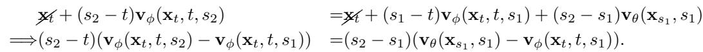
*Equation 18: Equation extracted by MinerU.*

For $s _ { 2 } - s _ { 1 } = \mathrm { d } s$ and $\operatorname* { l i m } _ { \mathrm { d } s \to 0 }$ , we have $s _ { 1 } = s _ { 2 } = s$ and:

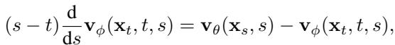
*Equation 19: Equation extracted by MinerU.*

which recovers the forward distillation loss as the time derivative w.r.t. $s$ of Eq. (17). Thus we can view the OFTSR loss and BOOT (Gu et al., 2023) loss as a discretization of the forward distillation loss. And it is easy to verify that the signal ODE in BOOT is equivalent to our distillation loss in the flow schedule.
> 💡 **理论总结**: 这段降低了 novelty 的“神秘感”：OFTSR 的强处不在发明全新微分方程，而在把 forward distillation 形式用于 conditional SR，并保留 $t$ 的 fidelity-realism 语义。

# C LIMITATIONS
> 💡 **小节预览**: 这是 README 局限分析的主要依据：student 的上限由 teacher 决定，后续需要额外 GT 或 adversarial supervision。

While our method advances one-step image super-resolution, limitations include performance constrained by teacher model capabilities. Future work will incorporate ground-truth supervision through regression loss or adversarial training.
> 💡 **局限批读**: 这句话很关键：trajectory alignment 不能凭空创造 teacher 没有的先验，也不能自动修正 teacher 的 hallucination。加入 GT regression 可能提升 fidelity，adversarial loss 可能提升 realism，但也会改变当前清晰的 ODE 蒸馏解释。

# D DIFFUSION AND PERCEPTION-DISTORTION TRADE-OFF
> 💡 **小节预览**: D 节验证 $t$ 真的对应 perception-distortion 曲线，同时承认 student 曲线相对 teacher 有轻微偏移。

In practice, we found that our distilled model is slightly off the perception-distortion frontier of the teacher model, as displayed in Fig. 7. To be specific, the corresponding timestep $t$ shifts a bit but for the same MMSE value the first-stage model and distilled model have very close LPIPS value. This might be caused by the error from large step size dt used in practice and we leave this for future investigation.
> 💡 **关键局限**: “同一个 $t$”在 teacher 和 student 上不完全等价。部署时应按验证集重新校准 $t$，不要假设论文中的 $t=1/0$ 语义能直接迁移到所有 teacher 和退化。

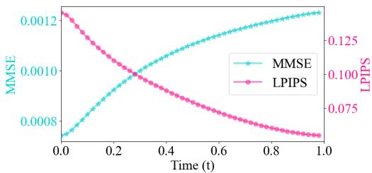
*Figure 6: Figure 6: Metrics evaluation of estimated $\mathbf { x } _ { 1 } ^ { t }$ across different timesteps $t$ . During sampling, at each timestep $t$ , we estimate the final image $\mathbf { x } _ { 1 } ^ { t }$ using the current model prediction $\mathbf { v } _ { \theta } ( \mathbf { x } _ { t , \mathrm { L R } } , t )$ and state $\mathbf { x } _ { t }$ via $\mathbf { x } _ { 1 } ^ { t } = \mathbf { x } _ { t } + ( \bar { 1 } - t ) \mathbf { v } _ { \theta } ( \mathbf { x } _ { t , \mathrm { L R } } , t )$ . Both MMSE and LPIPS metrics are averaged over 100 sampling processes. We present MMSE instead of PSNR for better visual effect.*
> 💡 **Figure 批读**: Fig. 6 展示 teacher 上的曲线：$t$ 越靠后，估计终点越偏生成样本，LPIPS 更好但 MMSE/PSNR 可能变差。这里用 MMSE 而非 PSNR，读法仍是 fidelity vs realism。

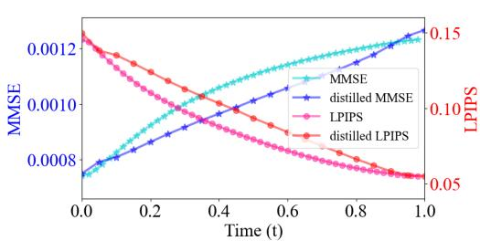
*Figure 7: Figure 7: Metrics evaluation of estimated $\mathbf { x } _ { 1 } ^ { t }$ across different timesteps $t$ for both teacher model and distilled one-step model. The teacher model is the same as the one in Fig. 6. We present MMSE instead of PSNR for better visual effect.*
> 💡 **Figure 批读**: Fig. 7 是可调性是否被蒸馏保留的证据：student 曲线接近 teacher，但存在 $t$ shift。好消息是同 MMSE 下 LPIPS 接近；坏消息是 $t$ 需要校准。

# E MORE EXPERIMENTAL DETAILS
> 💡 **小节预览**: 复现重点：EMA=0.9999、不同数据集的 $\sigma_p$、$t\sim U[0.01,0.99]$、patch evaluation、4 H800 硬件。

The training of all networks across both stages is smoothed using Exponential Moving Average (EMA) with a ratio of 0.9999. For FFHQ and ImageNet datasets, images are resized to 256 pixels with center cropping, while DIV2K training employs random crops of $2 5 6 \times 2 5 6$ patches. Data augmentation consists of horizontal flips with $50 \%$ probability and vertical flips with $6 \%$ probability throughout all experiments. For FFHQ noiseless experiment, we use default perturbation std $\sigma _ { p } =$ 0.1; for FFHQ noisy experiment, we use a higher perturbation std $\sigma _ { p } = 0 . 5$ to cover the resized noise from LR images, as suggested in Tab. 11; for both DIV2K and ImageNet we use $\sigma _ { p } = 0 . 2$ . For training, we employed three widely-used datasets: the standard ImageNet training set (1.28M images), the DIV2K training set (800 2K resolution images), and a subset of FFHQ consisting of the first 60,000 images from the dataset. All models are trained until convergence or up to $3 0 0 \mathrm { k }$ training iterations and we select the model based on best metrics. We train the model with uniform loss weight on $t$ . In the distillation stage, we sample the timestep $t$ using $t \sim \mathcal { U } \left[ t _ { \mathrm { m i n } } , t _ { \mathrm { m a x } } \right]$ with $t _ { \mathrm { m i n } } = 0 . 0 1$ and $t _ { \mathrm { m a x } } = 0 . 9 9$ in practice.
> 💡 **复现批读**: $\sigma_p$ 按数据集/噪声设置调整，说明 noise augmentation 不是一个固定常数；$t$ 训练避开 0/1 边界，所以 boundary loss 对 $t=0$ 行为更重要。

For DIV2K evaluation, we first segment the large 2K resolution images into $2 5 6 \times 2 5 6$ patches for model inference, then reconstruct the final image by combining the restored patches. To ensure fair

# Algorithm 1 OFTSR Distillation
> 💡 **算法批读**: Algorithm 1 明确 student 初始化自 teacher，训练时先构造 LR condition 和 noisy $\mathbf{x}_0$，再让 student 产生 $\mathbf{x}_t$ 给 teacher 查询 velocity；teacher 是轨迹裁判，不是最终图标签。

Require: teacher flow $\mathbf { v } _ { \theta }$ , dataset $\mathcal { D } _ { \mathrm { H R } }$ , $\sigma _ { n }$ , $\sigma _ { p }$ , dt, $w ( t )$   
1: Initialize the one-step student $\mathbf { v } _ { \phi }$ with the weights of $\mathbf { v } _ { \theta }$   
2: repeat   
3: Randomly sample $\mathbf { x } _ { 1 } \sim \mathcal { D } _ { \mathrm { H R } }$   
4: Randomly sample $\mathbf { n } \sim { \mathcal { N } } ( \mathbf { 0 } , \sigma _ { n } \mathbf { I } )$ ; $\mathbf { n } _ { p } \sim \mathcal { N } ( \mathbf { 0 } , \sigma _ { p } \mathbf { I } )$   
5: Compute $\mathbf { x } _ { \mathrm { L R } } = \mathcal { H } ^ { T } ( \mathcal { H } ( \mathbf { x } _ { 1 } ) + \mathbf { n } )$ // LR condition   
6: Compute ${ \bf x } _ { 0 } = \sqrt { 1 - \sigma _ { p } ^ { 2 } } { \bf x } _ { \mathrm { L R } } + \sigma _ { p } { \bf n } _ { p }$   
7: Sample $t \in \mathcal { U } [ 0 , 1 ]$ and $s = t + \mathrm { d } t$   
8: Generate velocities ${ \bf v } _ { \phi } ( { \bf x } _ { 0 , \mathrm { L R } } , t )$ and ${ \bf v } _ { \phi } \big ( { \bf x } _ { 0 , \mathrm { L R } } , s \big )$   
9: Calculate $\mathbf { x } _ { t , \mathrm { L R } } = \mathbf { x } _ { 0 } + t \mathbf { v } _ { \phi } ( \mathbf { x } _ { 0 , \mathrm { L R } } , t )$ and generate velocity $\mathbf { v } _ { \theta } ( \mathbf { x } _ { t , \mathrm { L R } } , t )$ by teacher model   
10: Compute ${ \mathcal { L } } _ { \mathrm { d i s t i l l } }$ with Eq. (9) and $\mathcal { L } _ { \mathrm { a l i g n } }$ with Eq. (10)   
11: Generate velocities ${ \mathbf { v } } _ { \phi } \big ( \mathbf { x } _ { 0 , \mathrm { L R } } , 0 \big )$ and ${ \bf v } _ { \theta } ( { \bf x } _ { 0 , \mathrm { L R } } , 0 )$ and compute $\mathcal { L } _ { \mathrm { B C } }$ with Eq. (11)   
12: Compute $\mathcal { L } ( \phi ) = \mathcal { L } _ { \mathrm { d i s t i l l } } ( \phi ) + \lambda _ { \mathrm { a l i g n } } \mathcal { L } _ { \mathrm { a l i g n } } ( \phi ) + \lambda _ { \mathrm { B C } } \mathcal { L } _ { \mathrm { B C } } ( \phi )$   
13: Optimize $\phi$ with a gradient-based optimizer using $\nabla _ { \phi } \mathcal { L }$

Table 11: Ablation on FFHQ $2 5 6 \times 2 5 6$ first stage with noisy SR; default: bs $\mathit { \Theta } = \ 3 2 $ ; $l r = 0 . 0 0 0 1$ ; $\bar { \ell } _ { 1 }$ loss; with LR condition.
> 💡 **表格批读**: Tab. 11 专门看 noisy SR 下 $\sigma_p$ 等 first-stage 设置，补充 Tab. 7：噪声退化越强，初始扰动也要覆盖观测噪声，否则 teacher 轨迹会偏窄。

*Table 11: Table 11: Ablation on FFHQ $2 5 6 \times 2 5 6$ first stage with noisy SR; default: bs $\mathit { \Theta } = \ 3 2 $ ; $l r = 0 . 0 0 0 1$ ; $\bar { \ell } _ { 1 }$ loss; with LR condition.*

14: until ${ \mathcal { L } } ( \phi )$ converges 15: Return one-step flow $\mathbf { v } _ { \phi }$

*Figure 8: Figure 8: Straightness of conditional flows with different perturbation strength $\sigma _ { p }$ .*
> 💡 **Figure 批读**: straightness 不是越大越好。SR 需要在条件约束和生成自由度之间折中，过度追求直线 flow 可能损害 perceptual quality。

comparison, all generated SR images are stored in a dedicated separated folder with consistent file names across all evaluated methods, followed by metric calculation against the HR folder using our evaluation script. LPIPS scores are computed using the ‘alex’ model architecture. All experiments are conducted using 4 NVIDIA H800 GPUs.

The straightness of the learned flow v can be calculated with:

*Equation 20: Equation extracted by MinerU.*
> 💡 **公式批读**: Eq. (20) 用来量化 flow straightness，作用是解释为什么 $\sigma_p$ 影响 NFE/采样难度；它不是 student 蒸馏 loss。

We also measured the FID among 50k imagenet validation set and the result FID is 2.458 comparing to 2.8 from I2SB.
> 💡 **指标批读**: 50k ImageNet FID 补充了更大样本数下的分布质量证据，但仍不能替代配对 SR 的结构保真评价。

# F ADDITIONAL EXPERIMENTS
> 💡 **小节预览**: F 节验证 rectified flow 本身的生成能力，但无条件 FFHQ 生成不是 SR 主任务；它更多支撑 flow teacher 的合理性。

We evaluated our first-stage training on the FFHQ $2 5 6 \times 2 5 6$ dataset using $\sigma _ { p } = 1$ without conditioning, effectively training an unconditional generative model for human faces. For this experiment, we do not use any data augmentation. Our evaluation consists of generating 1k images from random noise using the RK45 sampler (with a ODE tolerance of 1e-3) and comparing them against the full training dataset of 70k images (we train our unconditional generative flow with the whole dataset). Initial experiments with $\ell _ { 1 }$ loss yielded a FID score of 41.042 with an average of 56 NFEs, which falls short of the previous state-of-the-art P2 model’s score of 28.139 (Choi et al., 2022). However, switching to $\ell _ { 2 }$ loss for standard rectified flow training significantly improved performance, achieving a FID of 24.577 with only 44 NFEs on average. The model architecture used in our experiment is the same as the one used in P2. We leave further investigation to this discrepancy between $\ell _ { 1 }$ and $\ell _ { 2 }$ for image generation and restoration as future works. To facilitate a direct comparison with P2’s best reported results (FID scores of 6.92 and 6.97 with 1,000 and 500 NFEs respectively (Choi et al., 2022)), we generated $5 0 \mathrm { k }$ samples using our $\ell _ { 2 }$ loss-trained model. Our approach achieved a superior FID score of 5.871 with substantially fewer NFEs (44), demonstrating the effectiveness of rectified flow. Representative non-cherry-picking samples from our model are presented in Fig. 12.
> 💡 **额外实验批读**: 这里出现一个有意思的反差：SR first-stage 中 $\ell_1$ 更好，而无条件生成中 $\ell_2$ 更好。说明 restoration 与 pure generation 的 loss 偏好不同，不能把无条件生成结论直接迁移到 SR。

*Figure 9: Figure 9: Visual results for $8 \times$ (left) and $4 \times$ (right) SR from resolution 64 to 512 and 128 to 512 respectively.*
> 💡 **Figure 批读**: Fig. 9 看尺度泛化：$8\times$ 比 $4\times$ 更容易 hallucinate，高频纹理和身份/结构一致性是主要风险点。

As our distillation technique is designed for image restoration tasks, we skip the distillation of this LR teacher unconditional generation flow.
> 💡 **边界批读**: 作者明确不蒸馏无条件生成 flow，说明 OFTSR distillation 的目标场景是 conditional restoration，不应泛化成“任意 flow 都可直接用”。

# G ADDITIONAL RESULTS
> 💡 **小节预览**: G 节补三个边界：flow straightness 与质量并非单调，distillation 对训练数据有一定鲁棒性，尺度/分辨率泛化仍需单独验证。

# G.1 STRAIGHTNESS VS PERTURBATION STRENGTH

In Fig. 8, we validate the observation in Sec. 4.3 by also measuring the straightness of conditional flows. We observe that for SR task, the straightness is related to the noise perturbation added to the initial distribution, and a straighter flow does not lead to better performance.
> 💡 **straightness 批读**: 这点很重要：rectified flow 常强调 straight/fast，但 SR 的条件约束会改变目标。更直可能意味着更像回归，不一定更真实。

# G.2 TRAINING DATASETS

In both stages of our approach, we utilize the same dataset. The following table shows comparable performance across different datasets for distillation with FFHQ teacher.
> 💡 **数据批读**: 用 FFHQ teacher 蒸馏到 FFHQ/Celeba-HQ 的比较主要检验人脸域内迁移；它不能证明跨自然图像或真实退化无损迁移。

Table 12: Comparison of distilling FFHQ OFTSR teacher on FFHQ and Celeba-HQ dataset.

*Table 12: Table 12: Comparison of distilling FFHQ OFTSR teacher on FFHQ and Celeba-HQ dataset.*
> 💡 **表格批读**: 如果 Celeba-HQ 与 FFHQ 接近，说明 student 蒸馏对同域训练集选择不太敏感；但 teacher domain 仍是人脸，开放域结论要看 ImageNet/real-world 表。

# G.3 DIFFERENT RESOLUTION AND SCALE FACTOR (SF)

In this work, by default we follow previous works to use the setup of $4 \times \mathrm { S R }$ at $2 5 6 \times 2 5 6$ . We also test $\mathrm { S F } = 8$ on $2 5 6 \times 2 5 6$ and $\mathrm { S F } = 4 \& 8$ on 512-resolution FFHQ, the results are shown in Tab. 13. All models are trained for $3 0 \mathrm { k }$ iterations $\mathrm { { b s } = 3 2 }$ ) and distilled for $1 0 \mathrm { k }$ iterations $\mathrm { { b s } = 1 6 }$ ). We visualize $8 \times$ and $4 \times$ reconstruction of teacher and student in Fig. 9.
> 💡 **尺度批读**: $8\times$ 和 512 分辨率实验是对应用边界的补充，但训练迭代数较短；读作“可行性证据”比读作完整 SOTA 更稳妥。

Table 13: A comparison of the models trained across different resolution and scale factor.

*Table 13: Table 13: A comparison of the models trained across different resolution and scale factor.*
> 💡 **表格批读**: Tab. 13 要看 student 与 teacher gap 是否随 scale factor 放大；如果 gap 变大，说明 trajectory alignment 在高倍率更难。

# H FAILURE CASE
> 💡 **小节预览**: H 节给 $t$ 的有效域：论文主张的是 $t\in[0,1]$ 内可调，不是任意外推。

We show visualization of extreme t (boundary t and out of distribution t) in Fig. 10. Results of t ranges from [0,1] do not show failure case, while (ill-defined) OOD t, especially $t < 0$ fails.
> 💡 **失败批读**: 这说明 $t$ 是训练分布内的控制变量，越界没有物理/概率语义。实际 UI slider 应限制在 [0,1]，并按任务校准默认值。

*Figure 10: Figure 10: Visual results of boundary $t$ (0 and 1) and out of distribution $t$ (-0.5 and 2*
> 💡 **Figure 批读**: Fig. 10 的重点不是美观，而是边界行为：$t=0/1$ 尚可，$t<0$ 明显失效。它为 README 中“可调但需限制范围”提供证据。

# I RECONSTRUCTION DIVERSITY
> 💡 **小节预览**: I 节验证 noise-augmented initialization 的另一面：同一 LR 在不同随机种子下能产生多种合理 HR。

The noise-augmented initialization (Sec. 3.1) introduces stochasticity that enables multiple diverse HR reconstructions for the same LR input. Both the teacher and student model can give different restorations of a LR image under different random seeds, and the visualization is shown in Fig. 11.
> 💡 **多样性批读**: 多样性是 SR 一对多建模的优点，但在高风险场景也是风险：不同 seed 产生不同细节，说明输出不是唯一“事实”，需要任务侧决定是否允许随机生成。

# J THE CHOICE OF $t$
> 💡 **小节预览**: J 节把 $t$ 从论文变量转成用户/指标选择问题：可以人工选，也可以在小验证集上自动优化。

The parameter $t$ controls the fidelity–realism trade-off and is inherently guided by user preference: $t \approx 0$ favors maximal fidelity, while $t \approx 1$ emphasizes realism. In our experiments, the fidelity–realism parameter $t$ is not highly sensitive to the dataset or degradation type: its effective range stays consistent. When a target domain or evaluation metric is specified, $t$ can also be chosen automatically by optimizing it on a small validation set to best satisfy the desired objective or target. This enables both user-driven and metric-driven control of the fidelity–realism balance.
> 💡 **控制批读**: 这段是部署建议的核心：$t$ 不应只凭肉眼默认设 1。医学/遥感应偏小并设结构约束，社交照片/影视增强可偏大但要接受 hallucination。

# K ADDITIONAL VISUAL SAMPLES AND COMPARISONS
> 💡 **小节预览**: K 节提供视觉证据，读图时按任务分组：FFHQ/ImageNet 证明常规 SR，real-world/AI-generated content 证明退化泛化，DiT4SR 证明强 teacher 蒸馏。

In this section, we present additional visual results that demonstrate our method’s capabilities. Fig. 13 showcases multiple examples illustrating the tunable fidelity-realism trade-offs achieved on the FFHQ dataset. Figs. 14 and 15 provide comprehensive comparisons between our method and existing approaches on FFHQ and ImageNet images, respectively. In Fig. 16, we compare real-world (without synthetic degradation) SR results, under the $1 2 8  5 1 2$ SR setting. In Fig. 17, we shows OFTSR can perform arbitrary scale SR. Here, the model is trained solely on ImageNet for $6 4  2 5 6$ SR, demonstrating strong resolution and scale generalization without any retraining. Additionally, in Fig. 18, we demonstrate our method’s performance on both real-world SR tasks and AI-generated content enhancement. In Figs. 19 and 20, we compare visually our OFTSR (DiT4SR) with other SOTA method for one-step large resolution SR. Results from Figs. 14, 15 and 18 are generated with our distilled one-step model unless otherwise specified.
> 💡 **视觉批读**: 这里要特别区分 OFTSR 自训模型和 OFTSR(DiT4SR)：后者视觉更强可能主要来自 SD 3.5/DiT4SR teacher prior，不能简单归因于 flow teacher training。

# L DISCUSSION OF ACCELERATED I2SB METHODS
> 💡 **小节预览**: L 节回应相近 bridge/consistency 方法：它们也加速采样，但多数不同时解决 one-step realism 与可调 trade-off。

We provide here a detailed discussion of recent accelerated variants of I2SB and clarify their relationship to our approach.
> 💡 **对比批读**: 这一节属于 rebuttal 风格补充，目的是说明 OFTSR 与 I2SB 家族不是同一个实验范围，尤其是 SR 与可调性设置不同。

I3SB (Wang et al., 2025). I3SB introduces an improved sampling algorithm for pretrained I2SB models, analogous to DDIM for DDPM. While it yields faster sampling and moderately better results, it retains the fundamental behavior of the original I2SB: multi-step sampling is required to achieve high perceptual realism, whereas a single step primarily preserves fidelity. In contrast, our distillation framework produces a one-step model that attains much stronger realism while also enabling a controllable fidelity–realism trade-off.
> 💡 **I3SB 对比**: I3SB 是加速 sampler，OFTSR 是训练 one-step student；前者单步仍偏 fidelity，后者主张单步可到 realism 端。

CDBM (He et al., 2024). CDBM proposes consistency bridge training and consistency bridge distillation for diffusion bridge models, mirroring the consistency-training paradigm used in consistency models. However, its experimental scope is limited to relatively small image-to-image translation tasks (e.g., Edges Handbags, DIODE-Outdoor) and ImageNet inpainting. Since no SR evaluation or open-source implementation is provided, direct comparison in our setting is not feasible.
> 💡 **CDBM 对比**: 这里的核心不是说 CDBM 弱，而是实验任务不可直接比较；没有 SR 结果和代码时，只能定位为相关思路。

IBMD (Gushchin et al., 2025). IBMD introduces a distributional matching algorithm for conditional bridge models, conceptually related to DMD (Yin et al., 2024b) for continuous diffusion models. The method requires learning an additional auxiliary network, which increases computational overhead and can introduce training instability. Moreover, reported results show that the one-step performance of IBMD is comparable to I2SB with 1000 NFEs, suggesting limited advantages for efficient one-step SR. Therefore, our distilled model remains competitive or superior in the one-step regime.
> 💡 **IBMD 对比**: IBMD 走 distributional matching，需要辅助网络；OFTSR 的卖点是直接利用 teacher ODE 约束，训练结构相对简洁。

Overall, while these works explore acceleration or distillation within the I2SB family, they differ substantially in objectives, model scope, and applicability to super-resolution. Our approach provides a reproducible and effective one-step SR framework with controllable fidelity–realism behavior not addressed in prior I2SB variants.
> 💡 **对比总结**: L 节给 README 的“还能做什么”一个方向：未来可以把 OFTSR 的 $t$ 控制与 bridge/consistency family 结合，做更系统的相同 teacher、相同退化对比。

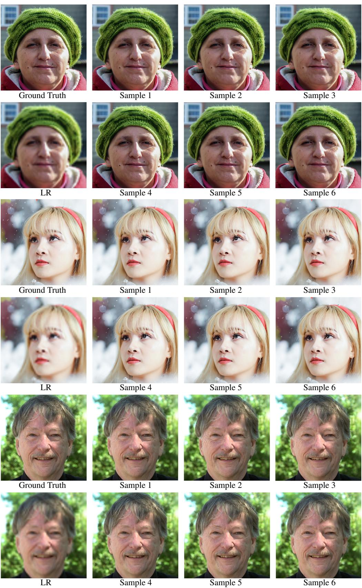
*Figure 11: Figure 11: Our method can maintain diversity in outputs. The resolution of ground truth image is $5 1 2 \times 5 1 2$ and the LR is $6 4 \times 6 4$ . The first group is generated by the teacher model, while the remaining two groups are produced by the student model.*

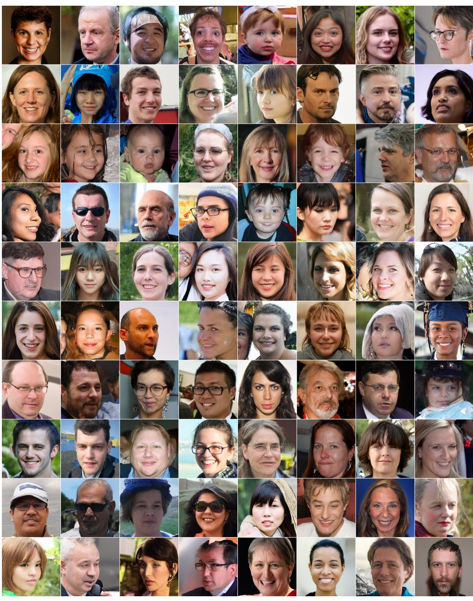
*Figure 12: Figure 12: Random generated samples from unconditional model trained on FFHQ dataset.*

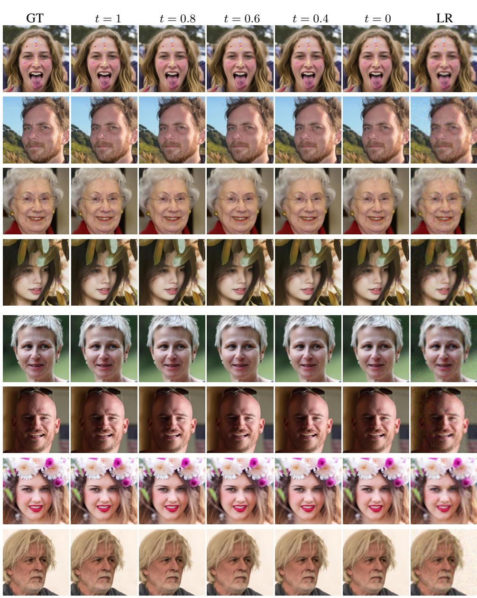
*Figure 13: Figure 13: Qualitative results of one-step model with different tunable t.*
> 💡 **Figure 批读**: Fig. 13 是 $t$ 控制的视觉证据：同一 LR 下应看到从保守/平滑到更锐利/真实的连续变化，而不是突然换身份或换结构。

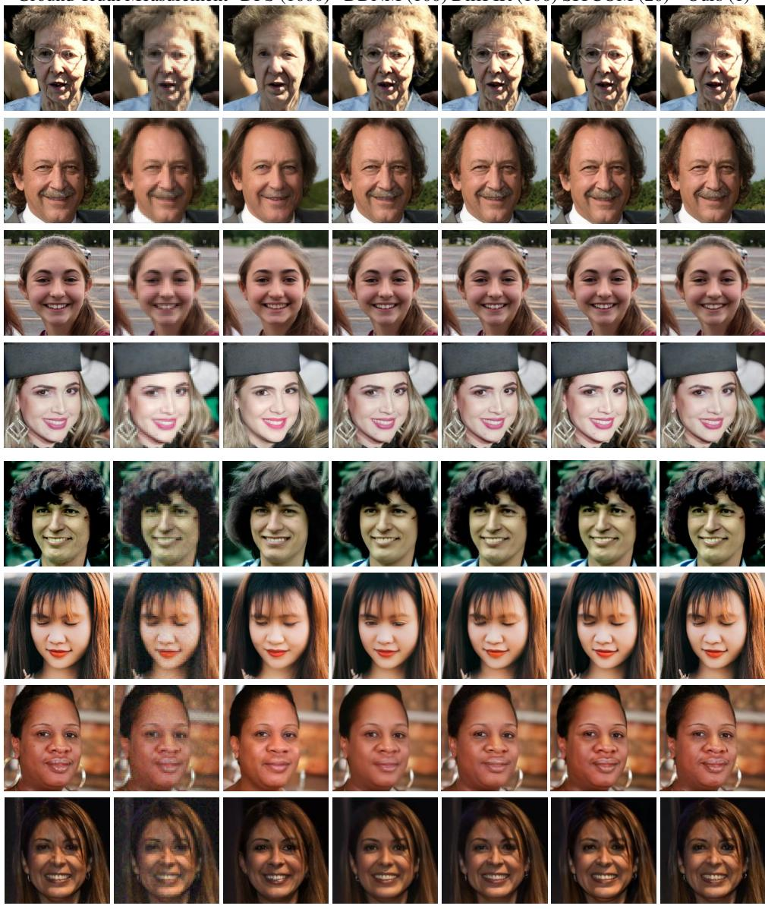
*Figure 14: Figure 14: Qualitative comparisons on FFHQ dataset for $4 \times \mathrm { S R }$ with $\sigma _ { n } = 0$ (first four rows) and $\sigma _ { n } = 0 . 0 5$ (last four rows).*
> 💡 **Figure 批读**: Fig. 14 要分 noiseless/noisy 两部分看；noisy FFHQ 下如果仍能保住人脸身份和五官结构，才说明 LR condition 抵消了 perturbation 的信息损失。

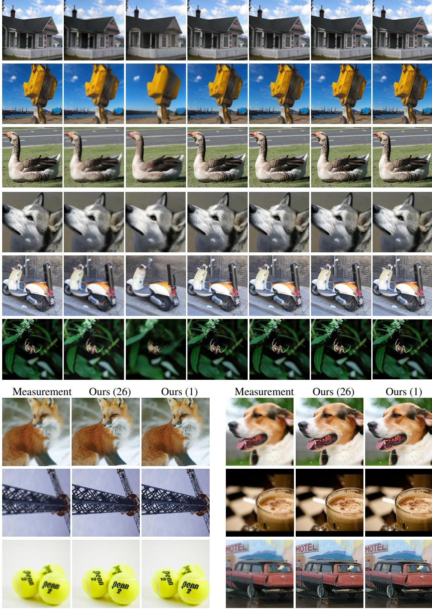
*Figure 15: Figure 15: Qualitative comparisons on ImageNet dataset for noiseless $4 \times$ SR.*
> 💡 **Figure 批读**: Fig. 15 检验开放类别自然图像：注意动物毛发、建筑边缘、重复纹理等位置是否被高 realism 档过度编造。

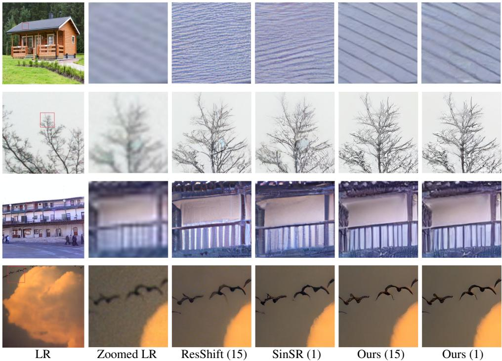
*Figure 16: Figure 16: Qualitative comparisons for real-world $4 \times$ SR*
> 💡 **Figure 批读**: Fig. 16 是真实退化视觉例子，重点看压缩块、模糊和未知噪声是否被清掉，同时原始语义是否被改写。

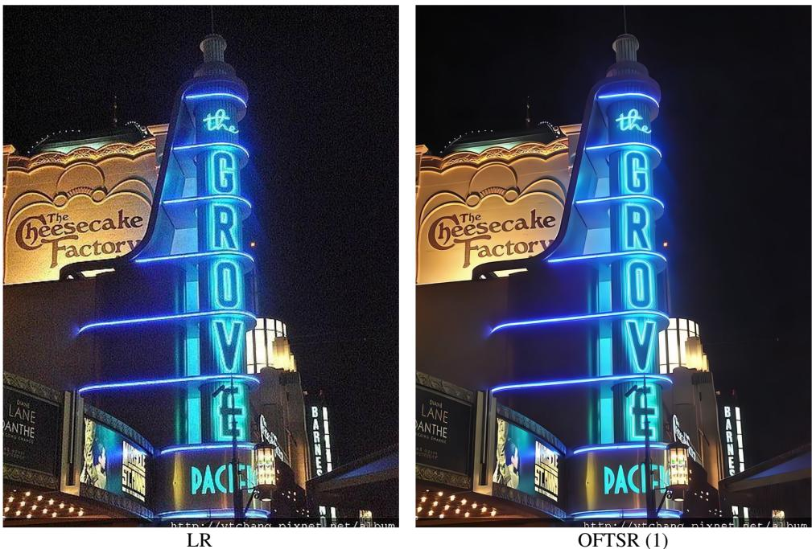
*Figure 17: Figure 17: Visual result of restoring arbitrary scale LR image.*
> 💡 **Figure 批读**: Fig. 17 支撑任意尺度泛化，但它是视觉展示；真正要确认泛化，还需要不同 scale factor 的定量表和失败案例。

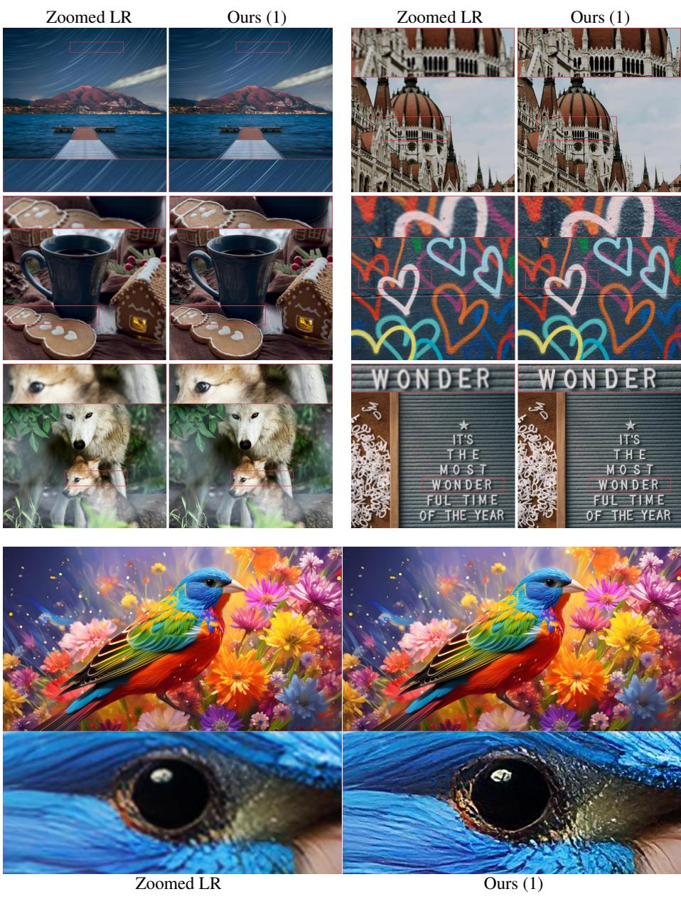
*Figure 18: Figure 18: Qualitative results on real data and AI generated content using our $4 \times$ SR model trained on DIV2K.*
> 💡 **Figure 批读**: Fig. 18 把 real data 与 AI-generated content 放在一起，说明模型可做增强，但 AIGC 图像本身可能已有伪纹理，SR 后更要警惕二次幻觉。

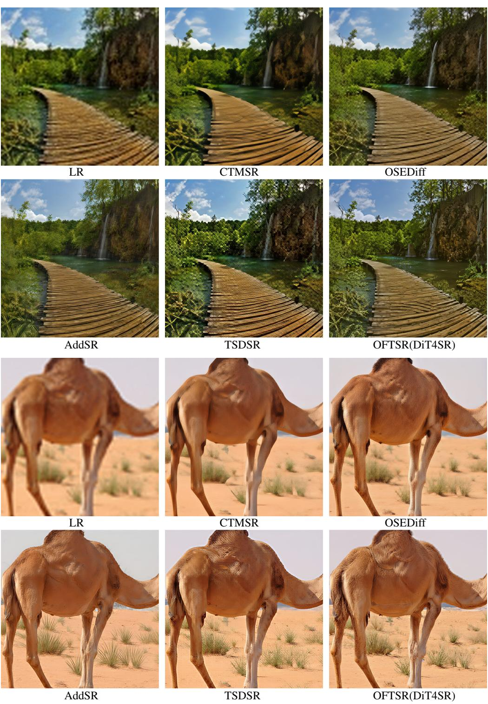
*Figure 19: Figure 19: Qualitative comparisons for real-world $4 \times$ SR. OFTSR is distilled from DiT4SR. All methods perform 1 step inference.*
> 💡 **Figure 批读**: Fig. 19 是 OFTSR(DiT4SR) 与其他 one-step 方法的真实世界比较；这里的强纹理能力很可能部分来自 DiT4SR/SD teacher。

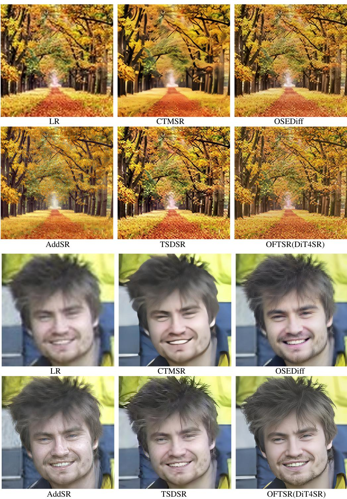
*Figure 20: Figure 20: Qualitative comparisons for real-world $4 \times$ SR. OFTSR is distilled from DiT4SR. All methods perform 1 step inference.*
> 💡 **Figure 批读**: Fig. 20 继续补充 one-step real-world 对比；读图时把“更清晰”和“更忠实”分开判断，尤其看文字、边缘和小物体。

---

## 🔖 Section 总结

### 关键数字速查
| 指标 | 数值 |
|------|------|
| 本节作用 | 推导、复现细节、失败边界、额外视觉证据 |
| 主线 | ODE trajectory alignment 是 forward distillation 的离散形式，$t$ 控制有效但需要校准 |
| 后续关注 | teacher 上限、$t$ shift、$\sigma_p/dt$ 敏感性、真实退化与幻觉风险 |

### 核心洞察
1. 附录 B 说明 OFTSR loss 与 BOOT/MeanFlow/forward distillation 的关系，增强了方法解释性。
2. 附录 C-D 明确了两个限制：student 受 teacher 限制，distilled $t$ 曲线相对 teacher 有偏移。
3. 附录 H-J 给部署启发：$t$ 要限制在 [0,1] 并按任务/指标选择，不能无约束外推。

### 可追问点
- OFTSR 和 diffusion one-step 的差别在哪里？
- 为什么 flow 适合可调 trade-off？
- 为什么 $\sigma_p$ 更大不一定更好？
- 同一个 $t$ 在 teacher 和 student 上是否需要重新标定？
