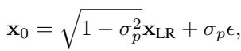
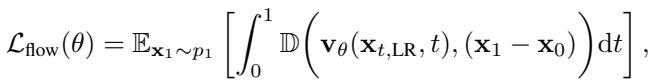

[← 返回 README](../README.md)

# 3.1 NOISE AUGMENTED CONDITIONAL FLOW

## 📌 预览
Method 是核心：关注输入从 LQ 到 latent/feature 的路径、训练目标、控制变量以及与 teacher/先验的交互方式。

> 💡 **与 OFTSR 主线的关系**: OFTSR 用 conditional flow teacher 和 ODE-trajectory alignment distillation 构建 one-step SR，并保留可调 fidelity-realism trade-off。

---

Unlike diffusion models, flow-based models have the advantage that their initial distribution is not limited to Gaussian distributions. This flexibility suggests a natural approach for image restoration - directly learning a flow that maps the distribution of LR images $( p _ { \mathrm { L R } } )$ to that of HR images $( p _ { \mathrm { H R } } )$ . However, our initial experiments (see Tab. 7) showed poor performance with this direct approach, aligning with findings from several recent works (Delbracio & Milanfar, 2023; Kim et al., 2024; Lee et al., 2024). This training procedure tends to collapse the LR $\mathrm {  H R }$ mapping: during inference each LR is driven toward a single HR.

> 💡 **批注**: 这是 flow/ODE 视角：重点是 student 是否沿 teacher 的连续采样轨迹对齐，而不只是匹配终点。

To overcome this limitation, we propose a noise-augmented approach to process LR images. For any input image $\mathbf { x } _ { \mathrm { L R } }$ , we construct our initial distribution $p _ { 0 } ( \mathbf { \dot { x } } ) = p _ { \mathrm { L R } } ^ { \sigma _ { p } }$ by adding Gaussian noise with standard deviation $\sigma _ { p }$ . Specifically, we adopt a Variance-Preserving (VP) noising operation (Ho et al., 2020; Song et al., 2020b):

*Equation 4: Equation extracted by MinerU.*

> 💡 **Equation 4 批读**: 这类公式通常定义 forward/reverse process、loss 或 alignment 目标；建议把每个符号对应到输入、teacher/student、控制变量。

where $\epsilon$ is a standard Gaussian noise. While this noise perturbation facilitates better generalization, it inevitably causes information loss in the LR image. To address this, we incorporate $\mathbf { x } _ { \mathrm { L R } }$ as a conditional input to our model as in Fig. 1. This VP formulation, together with the condition $\mathbf { x } _ { \mathrm { L R } }$ , makes our method particularly versatile, encompassing previous approaches as special cases. When $\sigma _ { p } = 0$ , our method reduces to the minimal augmentation case in InDI (Delbracio & Milanfar, 2023), and when $\sigma _ { p } = 1$ , it matches the training strategy of SR3 (Saharia et al., 2022).

> 💡 **批注**: 注意 latent diffusion 架构路径：LQ/HR 往往先被 VAE 编码，再在 latent 空间完成 denoising 或调制。

Given this noise-augmented formulation, we can now define our training objective as:

*Equation 5: Equation extracted by MinerU.*

> 💡 **Equation 5 批读**: 这类公式通常定义 forward/reverse process、loss 或 alignment 目标；建议把每个符号对应到输入、teacher/student、控制变量。

where $\mathbb { D }$ is a discrepancy loss that measures the difference between two images (e.g., $\ell _ { 2 }$ loss or the $\ell _ { 1 }$ loss), $\mathbf { v } _ { \theta }$ is our velocity model, $\mathbf { x } _ { t , \mathrm { L R } } = \mathrm { c o n c a t } ( \mathbf { x } _ { t } , \mathbf { x } _ { \mathrm { L R } } )$ is the concatenation of $\mathbf { x } _ { t }$ and $\mathbf { x } _ { \mathrm { L R } }$ in channel dimension (see Fig. 1), The LR input of the algorithm is given by $\mathbf { x } _ { \mathrm { L R } } = \mathcal { H } ^ { T } ( \mathcal { H } ( \mathbf { x } _ { 1 } ) + \mathbf { n } )$ , where $\mathcal { H }$ is the downsampling operator, $\bar { \mathcal { H } } ^ { T }$ is its transpose and $\mathbf { n }$ is i.i.d. Gaussian noise with variance $\sigma _ { n } ^ { 2 }$ . The perturbed version of $\mathbf { x } _ { \mathrm { L R } }$ , denoted as $\mathbf { x } _ { \mathrm { 0 } }$ , is obtained using the noise augmentation strategy described in Eq. (4). Additionally, ${ \bf x } _ { t } = ( 1 - t ) { \bf x } _ { 0 } + t { \bf x } _ { 1 }$ denotes the intermediate state as in rectified flow (Liu et al., 2022; Liu, 2022).

> 💡 **批注**: 注意 latent diffusion 架构路径：LQ/HR 往往先被 VAE 编码，再在 latent 空间完成 denoising 或调制。

---

## 🔖 Section 总结

### 核心洞察

1. 明确输入、输出、teacher/student 或控制变量。
2. 把每个 loss/模块对应到 fidelity、realism、speed 或 controllability。
3. 关注哪些组件是训练时使用，哪些是推理时仍有成本。

### 关键数字速查

| 指标 | 数值 |
|------|------|
| Inference steps | 1 |
| Teacher type | conditional flow-based SR model |
| Distillation target | same sampling ODE trajectory alignment |
| Datasets | FFHQ 256×256, DIV2K, ImageNet 256×256 |
