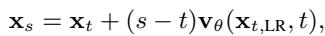
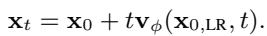
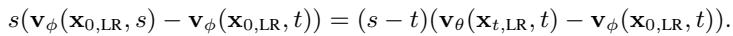
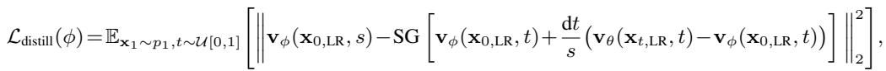

[← 返回 README](../README.md)

# 3.2 DISTILLATION LOSS

## 📌 预览
Method 是核心：关注输入从 LQ 到 latent/feature 的路径、训练目标、控制变量以及与 teacher/先验的交互方式。

> 💡 **与 OFTSR 主线的关系**: OFTSR 用 conditional flow teacher 和 ODE-trajectory alignment distillation 构建 one-step SR，并保留可调 fidelity-realism trade-off。

---

We introduce a distillation loss to train a one-step student that preserves the pre-trained SR flow’s fidelity–realism trade-off, allowing control at inference via a single hyperparameter $t$ . As shown in Fig. 6 and observed in prior work (Delbracio & Milanfar, 2023; Liu et al., 2023a), single-step estimates of the final state $\mathbf { x } _ { 1 } ^ { t }$ obtained from an intermediate state $\mathbf { x } _ { t }$ lie on a fidelity–realism curve: along the ODE sampling trajectory, estimates for larger $t$ (closer to 1) exhibit richer detail and lower LPIPS (better realism), whereas estimates for smaller $t$ (closer to 0) are blurrier but achieve lower MMSE and higher PSNR (better fidelity).

> 💡 **批注**: 这里的关键词是单步推理：作者试图把原本多次 denoising 的生成先验压缩到一次前向中。

To preserve the fidelity-realism trade-off, given the same input ${ \bf x } _ { \mathrm { 0 , L R } }$ , for two different timesteps $t$ and $s$ where $s > t$ , we require the student model $\mathbf { v } _ { \phi }$ to produce two corresponding intermediate states $\mathbf { x } _ { t }$ and $\mathbf { x } _ { s }$ that lie on the same ODE trajectory defined by the teacher (see Fig. 2):

> 💡 **批注**: 这里在讨论 fidelity-realism/perception-distortion 张力：SR 既要贴近 GT/LQ 结构，又要生成自然高频细节。

*Equation 6: Equation extracted by MinerU.*

> 💡 **Equation 6 批读**: 这类公式通常定义 forward/reverse process、loss 或 alignment 目标；建议把每个符号对应到输入、teacher/student、控制变量。

where ${ \bf x } _ { 0 , \mathrm { L R } } = \mathrm { c o n c a t } ( { \bf x } _ { 0 } , { \bf x } _ { \mathrm { L R } } )$ is the concatenation of the input image $\mathbf { x } _ { \mathrm { 0 } }$ and the LR condition $\mathbf { x } _ { \mathrm { L R } }$ along the channel dimension. The intermediate states $\mathbf { x } _ { t }$ and $\mathbf { x } _ { s }$ can be computed using our one-step student model $\mathbf { v } _ { \phi }$ :

> 💡 **批注**: 这里的关键词是单步推理：作者试图把原本多次 denoising 的生成先验压缩到一次前向中。

*Equation 7: Equation extracted by MinerU.*

> 💡 **Equation 7 批读**: 这类公式通常定义 forward/reverse process、loss 或 alignment 目标；建议把每个符号对应到输入、teacher/student、控制变量。

Substituting the expression for the intermediate image $\mathbf { x } _ { t }$ and $\mathbf { x } _ { s }$ from Eq. (7) into Eq. (6), we have the following constraint on the student model:

> 💡 **批注**: 这是蒸馏逻辑：用 teacher 或 score regularization 把多步/大模型能力迁移给单步模型。

*Equation 8: Equation extracted by MinerU.*

> 💡 **Equation 8 批读**: 这类公式通常定义 forward/reverse process、loss 或 alignment 目标；建议把每个符号对应到输入、teacher/student、控制变量。

Similar to BOOT, we can set $\mathrm { d } t = s - t$ and derive the final distillation loss:

> 💡 **批注**: 这是蒸馏逻辑：用 teacher 或 score regularization 把多步/大模型能力迁移给单步模型。

*Equation 9: Equation extracted by MinerU.*

> 💡 **Equation 9 批读**: 这类公式通常定义 forward/reverse process、loss 或 alignment 目标；建议把每个符号对应到输入、teacher/student、控制变量。

where $\operatorname { S G } [ \cdot ]$ is the stop-gradient operator for training stability (Gu et al., 2023; Tee et al., 2024). Since $s - t = \mathrm { d } t$ and $t > 0$ , we do not have the ‘dividing by $0 ^ { \circ }$ issue in (Tee et al., 2024). Similarly to (Song et al., 2023b; Gu et al., 2023), we can use the Euler or general RK2 solver to calculate $\mathbf { v } _ { \theta }$ in Eq. (9). In our main experiments, we employ the midpoint method, while also evaluating two other RK2 solver variants, i.e., Heun’s method and Ralston’s method, for comparison in our ablations (see Tab. 8). In Sec. B.2, we show that our distillation loss is the discrete-time counterpart of the forward distillation loss (Boffi et al., 2025; Liu, 2025) by fixing the start timestep at 0, which is highly related to recent work MeanFlow (Geng et al., 2025) and AlignYourFlow (Sabour et al., 2025).

> 💡 **批注**: 这是蒸馏逻辑：用 teacher 或 score regularization 把多步/大模型能力迁移给单步模型。

---

## 🔖 Section 总结

### 核心洞察

1. 明确输入、输出、teacher/student 或控制变量。
2. 把每个 loss/模块对应到 fidelity、realism、speed 或 controllability。
3. 关注哪些组件是训练时使用，哪些是推理时仍有成本。

### 关键数字速查

| 指标 | 数值 |
|------|------|
| Inference steps | 1 |
| Teacher type | conditional flow-based SR model |
| Distillation target | same sampling ODE trajectory alignment |
| Datasets | FFHQ 256×256, DIV2K, ImageNet 256×256 |
