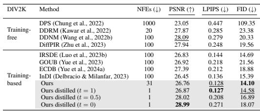
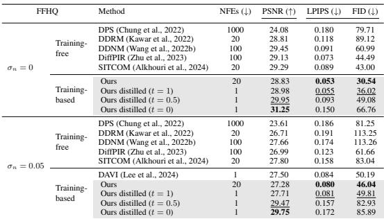

[← 返回 README](../README.md)

# 4 EXPERIMENTS

## 📌 预览
Experiments 验证方法是否真的改善质量、速度和可控性；注意 full-reference/no-reference 指标之间的张力。

> 💡 **与 OFTSR 主线的关系**: OFTSR 用 conditional flow teacher 和 ODE-trajectory alignment distillation 构建 one-step SR，并保留可调 fidelity-realism trade-off。

---

In this section, we provide experimental details and empirical evaluation of OFTSR and compare it with prior works.

> 💡 **批注**: 这是实验证据：要同时看保真指标、感知指标和速度指标，避免被单一数字误导。

*Table extracted: Table extracted by MinerU. DIV2K Method NFEs (↓) PSNR (↑) LPIPS (↓) FID (↓) Training- free DPS (Chung et al., 2022) 1000 23.05 0.447 109.35 DDRM (Kawar et al., 2022) 20 27.87 0.285 23.38*

> 💡 **Table extracted 批读**: 表格要横向看 SOTA 排名，也要纵向看 fidelity 指标和 perceptual 指标是否相互牺牲。

Table 1: Noiseless quantitative results on DIV2K. We compute the average PSNR (dB), LPIPS and FID of different methods on $4 \times$ SR. The best and second best results are highlighted in bold and underline. The distilled model produces superior performance in terms of trade-off metrics through adjustment of the hyperparameter $t$ .   
Table 2: Noiseless (top) and noisy (bottom) quantitative results on FFHQ $\pmb { 2 5 6 } \times 2 5 6$ . We compute the average PSNR (dB), LPIPS and FID of different methods on $4 \times$ SR. The best and second best results are highlighted in bold and underline.

> 💡 **批注**: 这里在讨论 fidelity-realism/perception-distortion 张力：SR 既要贴近 GT/LQ 结构，又要生成自然高频细节。

*Table 1: Table 1: Noiseless quantitative results on DIV2K. We compute the average PSNR (dB), LPIPS and FID of different methods on $4 \times$ SR. The best and second best results are highlighted in bold and underline. The distilled model produces superior performance in terms of trade-off metrics through adjustment of the hyperparameter $t$ . Table 2: Noiseless (top) and noisy (bottom) quantitative results on FFHQ $\pmb { 2 5 6 } \times 2 5 6$ . We compute the average PSNR (dB), LPIPS and FID of different methods on $4 \times$ SR. The best and second best results are highlighted in bold and underline.*

> 💡 **Table 1 批读**: 表格要横向看 SOTA 排名，也要纵向看 fidelity 指标和 perceptual 指标是否相互牺牲。

---

## 🔖 Section 总结

### 核心洞察

1. 同时看 PSNR/SSIM 与 LPIPS/FID/NIQE/MUSIQ 等指标。
2. 检查 one-step 是否真的在 latency/参数量上有优势。
3. 优先关注 ablation 是否支持论文的主模块设计。

### 关键数字速查

| 指标 | 数值 |
|------|------|
| Inference steps | 1 |
| Teacher type | conditional flow-based SR model |
| Distillation target | same sampling ODE trajectory alignment |
| Datasets | FFHQ 256×256, DIV2K, ImageNet 256×256 |
