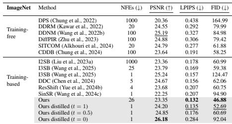
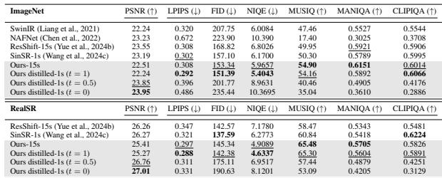

[← 返回 README](../README.md)

# 4.1 EXPERIMENTAL SETUP

## 📌 预览
Experiments 验证方法是否真的改善质量、速度和可控性；注意 full-reference/no-reference 指标之间的张力。

> 💡 **与 OFTSR 主线的关系**: OFTSR 用 conditional flow teacher 和 ODE-trajectory alignment distillation 构建 one-step SR，并保留可调 fidelity-realism trade-off。

---

Datasets. We perform extensive SR experiments on the FFHQ $2 5 6 \times 2 5 6$ (Karras et al., 2019), DIV2K (Agustsson & Timofte, 2017) and ImageNet $2 5 6 \times 2 5 6$ (Russakovsky et al., 2015) datasets to assess the bicubic SR performance of OFTSR on faces and natural images. For each dataset, we evaluate on 100 hold-out validation images without cherry-picking. For evaluating real SR, we use both synthetic set and real world set. Synthetic set includes 100 images from Imagenet for $6 4  2 5 6$ SR and 100 images from DIV2K for $1 2 8 \to 5 1 2$ SR, both degraded using RealESRGAN pipeline. Real world test set includes RealSR (Cai et al., 2019), RealSet80 (Yue et al., 2024b) and RealLQ250 (Ai et al., 2025). For distilling DiT4SR, we construct the training set using a combination of images from DIV2K (Agustsson & Timofte, 2017), DIV8K (Gu et al., 2019), Flickr2K (Timofte et al., 2017), LSDIR (Li et al., 2023b) and the first 10K images from FFHQ (Karras et al., 2019).

> 💡 **批注**: 这是蒸馏逻辑：用 teacher 或 score regularization 把多步/大模型能力迁移给单步模型。

Teacher Models. We employ three types of teacher models in our experiments: (1) Self-trained teachers (2 types of backbones: Guided Diffusion (Dhariwal & Nichol, 2021) for bicubic SR (Tabs. 1 to 3) and ResShift (Yue et al., 2024b) for real SR (Tabs. 4 and 5)) using the noise-augmented conditional flow strategy in Sec. 3.1, which showcases the effectiveness of our training scheme; (2) An off-the-shelf DiT4SR teacher (built on Stable Diffusion (SD) 3.5). Since SD-based models possess significantly stronger generative priors and are prohibitively expensive for us to pre-train, we distill DiT4SR with our method to enable fair comparison with the latest SOTA approaches for realSR (Tab. 6); (3) An off-the-shelf ResShift teacher, allowing direct comparison with SinSR (which is distilled from ResShift) and fair computational cost comparison (Tabs. 9 and 10).

> 💡 **批注**: 这是蒸馏逻辑：用 teacher 或 score regularization 把多步/大模型能力迁移给单步模型。

Evaluation Metrics. The metrics we use for comparison are Peak Signal-to-Noise Ratio (PSNR), Frechet Inception Distance (FID), and Learned Perceptual Image Patch Similarity (LPIPS) (Zhang ´ et al., 2018) distance. The FID evaluates the visual quality by calculating the feature distance between two image distributions. In our experiments, we calculate the FID using the HR images and the restored images from the 100 hold-out validation set with Clean-FID (Parmar et al., 2022). LPIPS measures the average perceptual similarity between the restored images and their corresponding HR images. PSNR measures the restoration faithfulness between two images. And LPIPS and PSNR are the two main metrics we use to measure the perceptual-fidelity trade-offs. For real SR task, we also use no-reference Image Quality Assessment (IQA) including NIQE Zhang et al. (2015), CLIPIQA Wang et al. (2023b), MUSIQ Ke et al. (2021), and MANIQA Yang et al. (2022).

> 💡 **批注**: 这里在讨论 fidelity-realism/perception-distortion 张力：SR 既要贴近 GT/LQ 结构，又要生成自然高频细节。

Compared Methods. We conduct comprehensive comparisons against state-of-the-art diffusionbased image super-resolution methods, which can be categorized into two groups: (1) Training-free methods, including DPS (Chung et al., 2022), DDRM (Kawar et al., 2022), DDNM (Wang et al., 2022b), DiffPIR (Zhu et al., 2023), CDDB (Chung et al., 2024), and SITCOM (Alkhouri et al., 2024); (2) Training-based methods: GOUB (Yue et al., 2023), ECDB (Yue et al., 2024a), InDI (Delbracio & Milanfar, 2023), DAVI (Lee et al., 2024), I2SB (Liu et al., 2023a), DDC (Chen et al., 2024), ResShift (Yue et al., 2024b), SinSR (Wang et al., 2024c) and CTMSR (You et al., 2025). And large scale Stable Diffusion based methods such as OSEDiff (Wu et al., 2024), AddSR (Xie et al., 2024) and TSDSR (Dong et al., 2025). It is noteworthy that SITCOM requires K inner-iterations to evaluate and differentiate the score function at each sampling step. To further validate the effectiveness of our method, we conduct experiment on real-world image super-resolution. Following (Yue et al., 2024b; Wang et al., 2024c), we use Imagenet $2 5 6 \times 2 5 6$ as HR training data and synthesize LR images using degradation pipeline of RealESRGAN (Wang et al., 2021).

> 💡 **批注**: 注意 latent diffusion 架构路径：LQ/HR 往往先被 VAE 编码，再在 latent 空间完成 denoising 或调制。

Table 4: Quantitative results of real-world image superresolution on ImageNet $2 5 6 \times 2 5 6$ and RealSR (Cai et al., 2019). The best and second best results are highlighted in bold and underline. The number of inference steps is indicated by ‘s’, which is the same as NFE when not use CFG.

> 💡 **批注**: 这是实验证据：要同时看保真指标、感知指标和速度指标，避免被单一数字误导。

Table 3: Noiseless quantitative results on ImageNet $2 5 6 \times 2 5 6$ . We compute the average PSNR (dB), LPIPS and FID of different methods on $4 \times \mathrm { S R }$ . The best and second best results are highlighted in bold and underline.

> 💡 **批注**: 这是实验证据：要同时看保真指标、感知指标和速度指标，避免被单一数字误导。

*Table 3: Table 3: Noiseless quantitative results on ImageNet $2 5 6 \times 2 5 6$ . We compute the average PSNR (dB), LPIPS and FID of different methods on $4 \times \mathrm { S R }$ . The best and second best results are highlighted in bold and underline.*

> 💡 **Table 3 批读**: 表格要横向看 SOTA 排名，也要纵向看 fidelity 指标和 perceptual 指标是否相互牺牲。

*Table extracted: Table extracted by MinerU. ImageNet PSNR (↑) LPIPS (↓) FID (↓) NIQE (↓) MUSIQ (↑) MANIQA (↑) CLIPIQA (↑) SwinIR (Liang et al., 2021) 22.24 0.320 207.75 6.0084 47.46 0.5527 0.5544 NAFNet (*

> 💡 **Table extracted 批读**: 表格要横向看 SOTA 排名，也要纵向看 fidelity 指标和 perceptual 指标是否相互牺牲。

*Figure 5: Figure 5: Qualitative comparison with training-based methods. The first two columns demonstrate $4 \times \mathrm { S R }$ results on the FFHQ dataset with noise level $\sigma _ { n } = 0 . 0 5$ . The remaining columns show noiseless $4 \times \mathrm { S R }$ results on the ImageNet dataset. Numbers next to the method names represent the required NFEs.*

> 💡 **Figure 5 批读**: 这张图通常承担方法动机、框架或视觉对比的作用。阅读时重点看它证明的是质量、速度还是可控性，而不是只看视觉效果。

Training Details. We do experiments for both noisy and noiseless SR. For noiseless SR, bicubic downsampling is performed on all three datasets. For noisy SR, we conduct experiment only on FFHQ $2 5 6 \times 2 5 6$ dataset with average-pooling downsampling and Gaussian noise with a standard deviation $\sigma _ { y } = 0 . 0 5$ . All images are normalized to the range of $[ - 1 , 1 ]$ . For experiments on FFHQ $2 5 6 \times 2 5 6$ and DIV2K, we adopt the same model architecture used for FFHQ in (Chung et al., 2022); and for experiment on ImageNet $2 5 6 \times 2 5 6$ , we use the same model architecture as the pretrained unconditional model used in (Dhariwal & Nichol, 2021). We modify the input convolution layer to accept concatenated image input. The first stage models are trained from scratch and are sampled with RK45 sampler by default. The one-step model is initialized from the teacher model for distillation. We use the Adam optimizer with a linear warmup schedule over 1k training steps, followed by a learning rate of $1 e - 4$ for both stages.

> 💡 **批注**: 这里的关键词是单步推理：作者试图把原本多次 denoising 的生成先验压缩到一次前向中。

---

## 🔖 Section 总结

### 核心洞察

1. 同时看 PSNR/SSIM 与 LPIPS/FID/NIQE/MUSIQ 等指标。
2. 检查 one-step 是否真的在 latency/参数量上有优势。
3. 优先关注 ablation 是否支持论文的主模块设计。

### 关键数字速查

| 指标 | 数值 |
|------|------|
| Inference steps | 1 |
| Teacher type | conditional flow-based SR model |
| Distillation target | same sampling ODE trajectory alignment |
| Datasets | FFHQ 256×256, DIV2K, ImageNet 256×256 |
