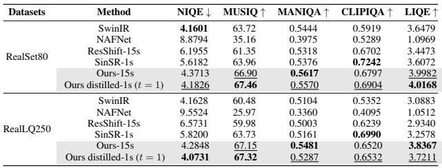

[← 返回 README](../README.md)

# 4.2 RESULTS

## 📌 预览
Experiments 验证方法是否真的改善质量、速度和可控性；注意 full-reference/no-reference 指标之间的张力。

> 💡 **与 OFTSR 主线的关系**: OFTSR 用 conditional flow teacher 和 ODE-trajectory alignment distillation 构建 one-step SR，并保留可调 fidelity-realism trade-off。

---

Quantitative Results. We present comprehensive quantitative evaluations on several benchmark datasets: DIV2K, FFHQ, ImageNet and real world test set and different tasks (including noiseless SR, noisy SR and real world SR) (Tabs. 1 to 6). Our analysis reveals several findings: (i) The first-stage OFTSR achieves superior performance in perceptual metrics (FID and LPIPS) while requiring fewer than 32 NFEs. (ii) Our distillation

> 💡 **批注**: 这里在讨论 fidelity-realism/perception-distortion 张力：SR 既要贴近 GT/LQ 结构，又要生成自然高频细节。

Table 5: Quantitative comparison on real world sets. The best and second best results are in bold and underline.

> 💡 **批注**: 这是实验证据：要同时看保真指标、感知指标和速度指标，避免被单一数字误导。

*Table 5: Table 5: Quantitative comparison on real world sets. The best and second best results are in bold and underline.*

> 💡 **Table 5 批读**: 表格要横向看 SOTA 排名，也要纵向看 fidelity 指标和 perceptual 指标是否相互牺牲。

algorithm is versatile, when applied to ResShift (Yue et al., 2024b) teacher, our distilled model achieved better one-step performance than SinSR (Wang et al., 2024c) (see Tab. 9). (iii) Our distilled version of OFTSR demonstrates remarkable versatility, achieving either the highest PSNR

> 💡 **批注**: 这里的关键词是单步推理：作者试图把原本多次 denoising 的生成先验压缩到一次前向中。

Table 6: Quantitative comparison of state-of-the-art one-step SR methods on synthetic (DIV2K-Val) and real-world (RealLQ250) benchmarks. Best results are in bold, second best are underlined. Our method is tested under $t = 1$ . ResShift∗ means we train our noise-augmented conditional flow in Sec. 3.1 using the ResShift model architecture then distillation; and DiT4SR means we use the pretrained DiT4SR model as the teacher model for distillation.

> 💡 **批注**: 这里的关键词是单步推理：作者试图把原本多次 denoising 的生成先验压缩到一次前向中。

*Table extracted: Table extracted by MinerU. Dataset Metric SinSR-1s CTMSR-1s AddSR-1s OSEDiff-1s TSDSR-1s Ours (ResShift*)-1s Ours (DiT4SR)-1s DIV2K-Val PSNR ↑ 24.50 24.87 22.39 23.86 22.17 23.91 22.80 SS*

> 💡 **Table extracted 批读**: 表格要横向看 SOTA 排名，也要纵向看 fidelity 指标和 perceptual 指标是否相互牺牲。

scores or ranking among the top two methods for FID and LPIPS metrics in one step. This indicates minimal performance degradation between the teacher and student models. (iv) Our experiments suggest that FID serves as a more reliable indicator of perceptual quality and better captures the performance gap between teacher and student models during distillation. (v) When applied to a powerful SD-based SR model (DiT4SR), our distillation algorithm produces a one-step generator whose performance is competitive with other leading SOTA distillation methods. This also validates the versatility of our distillation algorithm.

> 💡 **批注**: 这里的关键词是单步推理：作者试图把原本多次 denoising 的生成先验压缩到一次前向中。

Visual Results. Our experimental results demonstrate that OFTSR achieves high-quality image reconstructions. We evaluate OFTSR against leading training-free methods for $4 \times \mathrm { S R }$ , as shown in Fig. 4. While DPS can produce sharp reconstructions, it requires 1000 NFEs and often introduces significant distortions. In contrast, OFTSR successfully preserves structural information from lowresolution inputs while reconstructing fine details. Notably, our distilled version of OFTSR requires only one NFE, as other training-free methods suffer from severe error accumulation when using less than 10 NFEs. As illustrated in Fig. 5, we also compare OFTSR against state-of-the-art SR methods that require training. The results show that our approach generates patterns with rich, natural details. Furthermore, our distilled model enables flexible control over the fidelity-realism trade-offs in the generated high-resolution images. Fig. 3 demonstrates this capability through examples of noisy $4 \times$ SR with varying degrees of realism and fidelity. More qualitative comparison and visual examples can be found in Sec. K

> 💡 **批注**: 这里在讨论 fidelity-realism/perception-distortion 张力：SR 既要贴近 GT/LQ 结构，又要生成自然高频细节。

---

## 🔖 Section 总结

### 核心洞察

1. 同时看 PSNR/SSIM 与 LPIPS/FID/NIQE/MUSIQ 等指标。
2. 检查 one-step 是否真的在 latency/参数量上有优势。
3. 优先关注 ablation 是否支持论文的主模块设计。

### 关键数字速查

| 指标 | 数值 |
|------|------|
| Inference steps | 1 |
| Teacher type | conditional flow-based SR model |
| Distillation target | same sampling ODE trajectory alignment |
| Datasets | FFHQ 256×256, DIV2K, ImageNet 256×256 |
