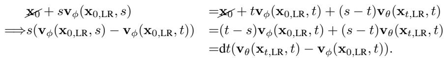
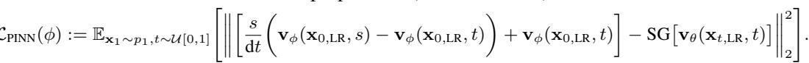
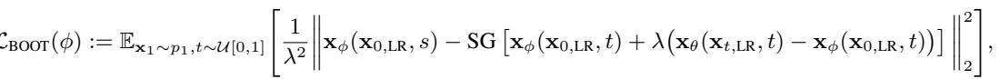

[← 返回 README](../README.md)

# B.1 CONTINUOUS VERSION OF THE FINAL LOSS

## 📌 预览
Method 是核心：关注输入从 LQ 到 latent/feature 的路径、训练目标、控制变量以及与 teacher/先验的交互方式。

> 💡 **与 OFTSR 主线的关系**: OFTSR 用 conditional flow teacher 和 ODE-trajectory alignment distillation 构建 one-step SR，并保留可调 fidelity-realism trade-off。

---

We provide detailed derivation to our distillation loss used in the paper. By substitute intermediate results $\mathbf { x } _ { s }$ and $\mathbf { x } _ { t }$ from student model Eq. (7) into the ODE induced by teacher model Eq. (8), we have:

> 💡 **批注**: 这是蒸馏逻辑：用 teacher 或 score regularization 把多步/大模型能力迁移给单步模型。

*Equation 14: Equation extracted by MinerU.*

> 💡 **Equation 14 批读**: 这类公式通常定义 forward/reverse process、loss 或 alignment 目标；建议把每个符号对应到输入、teacher/student、控制变量。

Start from this constraint that applies to the student model, we can construct distillation loss in different forms. (i) In the same spirit as BOOT (Gu et al., 2023), we make only ${ \bf v } _ { \phi } ( { \bf x } _ { 0 , \mathrm { L R } } , s )$ and this will lead to loss Eq. (12). (ii) If we only detach the teacher output, we will end up with loss similar to PINN based distillation PID proposed in (Tee et al., 2024):

> 💡 **批注**: 这是蒸馏逻辑：用 teacher 或 score regularization 把多步/大模型能力迁移给单步模型。

*Equation 15: Equation extracted by MinerU.*

> 💡 **Equation 15 批读**: 这类公式通常定义 forward/reverse process、loss 或 alignment 目标；建议把每个符号对应到输入、teacher/student、控制变量。

Both Eqs. (12) and (15) are loss variants from Eq. (8), and we did not try other variant given the already-good performance of Eq. (12).

In addition, by considering the intermediate interpolation ${ \bf x } _ { t } = ( 1 - t ) { \bf x } _ { 0 } + t { \bf x } _ { 1 }$ as a special case of ${ \bf x } _ { t } = \sigma _ { t } { \bf x } _ { 0 } + \alpha _ { t } { \bf x } _ { 1 }$ in BOOT (Gu et al., 2023), we can derive the following distillation loss:

> 💡 **批注**: 这是蒸馏逻辑：用 teacher 或 score regularization 把多步/大模型能力迁移给单步模型。

*Equation 16: Equation extracted by MinerU.*

> 💡 **Equation 16 批读**: 这类公式通常定义 forward/reverse process、loss 或 alignment 目标；建议把每个符号对应到输入、teacher/student、控制变量。

where $\begin{array} { r } { \lambda = 1 - \frac { t ( 1 - s ) } { s ( 1 - t ) } } \end{array}$ , ${ \bf x } _ { \phi } ( { \bf x } _ { 0 , \mathrm { L R } } , t ) = { \bf x } _ { 0 } + { \bf v } _ { \phi } ( { \bf x } _ { 0 , \mathrm { L R } } , t )$ , ${ \bf x } _ { \phi } ( { \bf x } _ { 0 , \mathrm { L R } } , s ) = { \bf x } _ { 0 } + { \bf v } _ { \phi } ( { \bf x } _ { 0 , \mathrm { L R } } , s )$ , and $\mathbf { x } _ { \theta } ( \mathbf { x } _ { t , \mathrm { L R } } , t ) = \mathbf { x } _ { t } + ( 1 - t ) \mathbf { v } _ { \theta } ( \mathbf { x } _ { t , \mathrm { L R } } , t )$ with $\mathbf { x } _ { t } = \mathbf { x } _ { 0 } + t \mathbf { v } _ { \phi } ( \mathbf { x } _ { 0 , \mathrm { L R } } , t )$ . We compared our proposed loss Eq. (12) with its variant Eq. (15) and Eq. (16) in Tab. 8 and our ablation shows that Eq. (12) works best for SR task.

> 💡 **批注**: 这是实验证据：要同时看保真指标、感知指标和速度指标，避免被单一数字误导。

---

## 🔖 Section 总结

### 核心洞察

1. 明确输入、输出、teacher/student 或控制变量。
2. 把每个 loss/模块对应到 fidelity、realism、speed 或 controllability。
3. 关注哪些组件是训练时使用，哪些是推理时仍有成本。

### 关键数字速查

| 指标 | 数值 |
|------|------|
| Inference steps | 1 |
| Teacher type | conditional flow-based SR model |
| Distillation target | same sampling ODE trajectory alignment |
| Datasets | FFHQ 256×256, DIV2K, ImageNet 256×256 |
