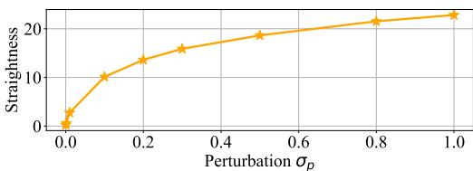
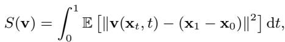

[← 返回 README](../README.md)

# Algorithm 1 OFTSR Distillation

## 📌 预览
Method 是核心：关注输入从 LQ 到 latent/feature 的路径、训练目标、控制变量以及与 teacher/先验的交互方式。

> 💡 **与 OFTSR 主线的关系**: OFTSR 用 conditional flow teacher 和 ODE-trajectory alignment distillation 构建 one-step SR，并保留可调 fidelity-realism trade-off。

---

Require: teacher flow $\mathbf { v } _ { \theta }$ , dataset $\mathcal { D } _ { \mathrm { H R } }$ , $\sigma _ { n }$ , $\sigma _ { p }$ , dt, $w ( t )$   
1: Initialize the one-step student $\mathbf { v } _ { \phi }$ with the weights of $\mathbf { v } _ { \theta }$   
2: repeat   
3: Randomly sample $\mathbf { x } _ { 1 } \sim \mathcal { D } _ { \mathrm { H R } }$   
4: Randomly sample $\mathbf { n } \sim { \mathcal { N } } ( \mathbf { 0 } , \sigma _ { n } \mathbf { I } )$ ; $\mathbf { n } _ { p } \sim \mathcal { N } ( \mathbf { 0 } , \sigma _ { p } \mathbf { I } )$   
5: Compute $\mathbf { x } _ { \mathrm { L R } } = \mathcal { H } ^ { T } ( \mathcal { H } ( \mathbf { x } _ { 1 } ) + \mathbf { n } )$ // LR condition   
6: Compute ${ \bf x } _ { 0 } = \sqrt { 1 - \sigma _ { p } ^ { 2 } } { \bf x } _ { \mathrm { L R } } + \sigma _ { p } { \bf n } _ { p }$   
7: Sample $t \in \mathcal { U } [ 0 , 1 ]$ and $s = t + \mathrm { d } t$   
8: Generate velocities ${ \bf v } _ { \phi } ( { \bf x } _ { 0 , \mathrm { L R } } , t )$ and ${ \bf v } _ { \phi } \big ( { \bf x } _ { 0 , \mathrm { L R } } , s \big )$   
9: Calculate $\mathbf { x } _ { t , \mathrm { L R } } = \mathbf { x } _ { 0 } + t \mathbf { v } _ { \phi } ( \mathbf { x } _ { 0 , \mathrm { L R } } , t )$ and generate velocity $\mathbf { v } _ { \theta } ( \mathbf { x } _ { t , \mathrm { L R } } , t )$ by teacher model   
10: Compute ${ \mathcal { L } } _ { \mathrm { d i s t i l l } }$ with Eq. (9) and $\mathcal { L } _ { \mathrm { a l i g n } }$ with Eq. (10)   
11: Generate velocities ${ \mathbf { v } } _ { \phi } \big ( \mathbf { x } _ { 0 , \mathrm { L R } } , 0 \big )$ and ${ \bf v } _ { \theta } ( { \bf x } _ { 0 , \mathrm { L R } } , 0 )$ and compute $\mathcal { L } _ { \mathrm { B C } }$ with Eq. (11)   
12: Compute $\mathcal { L } ( \phi ) = \mathcal { L } _ { \mathrm { d i s t i l l } } ( \phi ) + \lambda _ { \mathrm { a l i g n } } \mathcal { L } _ { \mathrm { a l i g n } } ( \phi ) + \lambda _ { \mathrm { B C } } \mathcal { L } _ { \mathrm { B C } } ( \phi )$   
13: Optimize $\phi$ with a gradient-based optimizer using $\nabla _ { \phi } \mathcal { L }$

> 💡 **批注**: 这里的关键词是单步推理：作者试图把原本多次 denoising 的生成先验压缩到一次前向中。

Table 11: Ablation on FFHQ $2 5 6 \times 2 5 6$ first stage with noisy SR; default: bs $\mathit { \Theta } = \ 3 2 $ ; $l r = 0 . 0 0 0 1$ ; $\bar { \ell } _ { 1 }$ loss; with LR condition.

> 💡 **批注**: 注意 latent diffusion 架构路径：LQ/HR 往往先被 VAE 编码，再在 latent 空间完成 denoising 或调制。

*Table 11: Table 11: Ablation on FFHQ $2 5 6 \times 2 5 6$ first stage with noisy SR; default: bs $\mathit { \Theta } = \ 3 2 $ ; $l r = 0 . 0 0 0 1$ ; $\bar { \ell } _ { 1 }$ loss; with LR condition.*

> 💡 **Table 11 批读**: 表格要横向看 SOTA 排名，也要纵向看 fidelity 指标和 perceptual 指标是否相互牺牲。

14: until ${ \mathcal { L } } ( \phi )$ converges 15: Return one-step flow $\mathbf { v } _ { \phi }$

> 💡 **批注**: 这里的关键词是单步推理：作者试图把原本多次 denoising 的生成先验压缩到一次前向中。

*Figure 8: Figure 8: Straightness of conditional flows with different perturbation strength $\sigma _ { p }$ .*

> 💡 **Figure 8 批读**: 这张图通常承担方法动机、框架或视觉对比的作用。阅读时重点看它证明的是质量、速度还是可控性，而不是只看视觉效果。

comparison, all generated SR images are stored in a dedicated separated folder with consistent file names across all evaluated methods, followed by metric calculation against the HR folder using our evaluation script. LPIPS scores are computed using the ‘alex’ model architecture. All experiments are conducted using 4 NVIDIA H800 GPUs.

> 💡 **批注**: 这是实验证据：要同时看保真指标、感知指标和速度指标，避免被单一数字误导。

The straightness of the learned flow v can be calculated with:

*Equation 20: Equation extracted by MinerU.*

> 💡 **Equation 20 批读**: 这类公式通常定义 forward/reverse process、loss 或 alignment 目标；建议把每个符号对应到输入、teacher/student、控制变量。

We also measured the FID among 50k imagenet validation set and the result FID is 2.458 comparing to 2.8 from I2SB.

> 💡 **批注**: 这是实验证据：要同时看保真指标、感知指标和速度指标，避免被单一数字误导。

---

## 🔖 Section 总结

### 核心洞察

1. 明确输入、输出、teacher/student 或控制变量。
2. 把每个 loss/模块对应到 fidelity、realism、speed 或 controllability。
3. 关注哪些组件是训练时使用，哪些是推理时仍有成本。

### 关键数字速查

| 指标 | 数值 |
|------|------|
| Inference steps | 1 |
| Teacher type | conditional flow-based SR model |
| Distillation target | same sampling ODE trajectory alignment |
| Datasets | FFHQ 256×256, DIV2K, ImageNet 256×256 |
