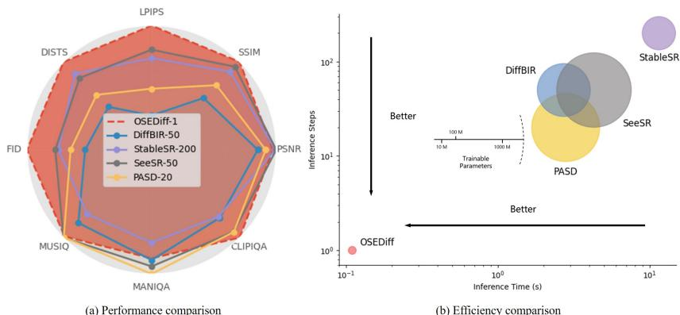

[← 返回 README](../README.md)

# 1 Introduction

## 📌 预览
本节建立研究动机、现有方法缺口和贡献列表，是理解论文叙事的入口。

---

Image super-resolution (ISR) [13, 66, 29, 65, 6, 24, 46, 27, 61] is a classical yet still active research problem, which aims to restore a high-quality (HQ) image from its low-quality (LQ) observation suffering from degradations of noise, blur and low-resolution, etc. While one line of ISR research [13, 66, 29, 65, 6] simplifies the degradation process from HQ to LQ images as bicubic downsampling (or downsampling after Gaussian blur) and focus on the study on network architecture design, the trained models can hardly be generalized to real-world LQ images, whose degradations are often unknown and much more complex. Therefore, another increasingly popular line of ISR research is the so-called real-world ISR (Real-ISR) [61, 45] problem, which aims to reproduce perceptually realistic HQ images from the LQ images captured in real-world applications.

> 💡 **批注**: 这段是 one-step SR 主线：关注效率、保真-真实感权衡、扩散/flow 先验或单步生成路径。

There are two major issues in training a Real-ISR model. One is how to build the LQ-HQ training image pairs, and another is how to ensure the naturalness of restored images, i.e., how to ensure that the restored images follow the distribution of HQ natural images. For the first issue, some researchers have proposed to collect real-world LQ-HQ image pairs using long-short camera focal lenses [3, 51]. However, this is very costly and can only cover certain types of real-world image degradations. Another more economical way is to simulate the real-world LQ-HQ image pairs by using complex image degradation pipelines. The representative works include BSRGAN [61] and Real-ESRGAN [45], where a random shuffling of basic degradation operators and a high-order degradation model are respectively used to generate LQ-HQ image pairs.

> 💡 **批注**: 这段是 one-step SR 主线：关注效率、保真-真实感权衡、扩散/flow 先验或单步生成路径。

*Figure 1: Figure 1: Performance and efficiency comparison among SD-based Real-ISR methods. (a). Performance comparison on the DrealSR benchmark [51]. Metrics like LPIPS and NIQE, where smaller scores indicate better image quality, are inverted and normalized for display. OSEDiff achieves leading scores on most metrics with only one diffusion step. (b). Model efficiency comparison. The inference time is tested on an A100 GPU with $5 1 2 \times 5 1 2$ input image size. OSEDiff has the fewest trainable parameters and is over 100 times faster than StableSR [42].*

> 💡 **Figure 1 批读**: 这张图通常承担方法框架、动机或视觉对比作用；重点看它支撑的是机制、效果还是局限。

With the given training data, how to train a robust Real-ISR model to output perceptually natural images with high quality becomes a key issue. Simply learning a mapping network between LQ-HQ paired data with pixel-wise losses can lead to over-smoothed results [24, 46]. It is crucial to integrate natural image priors into the learning process to reproduce HQ images. A few methods have been proposed to this end. The perceptual loss [18] explores the texture, color, and structural priors in a pre-trained model such as VGG-16 [38] and AlexNet [23]. The generative adversarial networks (GANs) [14] alternatively train a generator and a discriminator, and they have been adopted for Real-ISR tasks [24, 46, 45, 61, 27, 53]. The generator network aims to synthesize HQ images, while the discriminator network aims to distinguish whether the synthesized image is realistic or not. While great successes have been achieved, especially in the restoration of specific classes of images such as face images [56, 44], GAN-based Real-ISR tends to generate unpleasant details due to the unstable adversarial training and the difficulties in discriminating the image space of diverse natural scenes.

> 💡 **批注**: 这段是 one-step SR 主线：关注效率、保真-真实感权衡、扩散/flow 先验或单步生成路径。

The recently developed generative diffusion models (DM) [39, 16], especially the large-scale pretrained text-to-image (T2I) models [37, 36], have demonstrated remarkable performance in various downstream tasks. Having been trained on billions of image-text pairs, the pre-trained T2I models possess powerful natural image priors, which can be well exploited to improve the naturalness and perceptual quality of Real-ISR outputs. Some methods [42, 57, 31, 52, 40, 59] have been developed to employ the pre-trained T2I model for solving the Real-ISR problem. While having shown impressive results in generating richer and more realistic image details than GAN-based methods, the existing SD-based methods have several problems to be further addressed. First, these methods typically take random Gaussian noise as the start point of the diffusion process. Though the LQ images are used as the control signal with a ControlNet module [63], these methods introduce unwanted randomness in the output HQ images [40]. Second, the restored HQ images are usually obtained by tens or even hundreds of diffusion steps, making the Real-ISR process computationally expensive. Though some one-step diffusion based Real-ISR methods [48] have been recently proposed, they fail in achieving high-quality details compared to multi-step methods.

> 💡 **批注**: 这段是 one-step SR 主线：关注效率、保真-真实感权衡、扩散/flow 先验或单步生成路径。

To address the aforementioned issues, we propose a One-Step Effective Diffusion network, OSEDiff in short, for the Real-ISR problem. The UNet backbone in pre-trained SD models has strong capability to transfer the input data into another domain, while the given LQ image actually has rich information to restore its HQ counterpart. Therefore, we propose to directly feed the LQ images into the pre-trained SD model without introducing any random noise. Meanwhile, we integrate trainable

> 💡 **批注**: 这段是 one-step SR 主线：关注效率、保真-真实感权衡、扩散/flow 先验或单步生成路径。

LoRA layers [17] into the pre-trained UNet, and finetune the SD model to adapt it to the Real-ISR task. On the other hand, to ensure that the one-step model can still produce HQ natural images as the multi-step models, we utilize variational score distillation (VSD) [49, 58, 10] for KL-divergence regularization. This operation effectively leverages the powerful natural image priors of pre-trained SD models and aligns the distribution of generated images with natural image priors. As illustrated in Fig. 1, our extensive experiments demonstrate that OSEDiff achieves comparable or superior performance measures to state-of-the-art SD-based Real-ISR models, while it significantly reduces the number of inference steps from $N$ to 1 and has the fewest trainable parameters, leading to more than $\times 1 0 0$ speedup in inference time over previous methods such as StableSR [42].

> 💡 **批注**: 这段是 one-step SR 主线：关注效率、保真-真实感权衡、扩散/flow 先验或单步生成路径。

---

## 🔖 Section 总结

### 核心洞察
1. 本节对应论文原始大分节，原文已完整保留。
2. 阅读重点是把本节的机制/证据映射到论文主 claim。
3. 后续如有疑问，可在本 section 继续补充更细批注。
