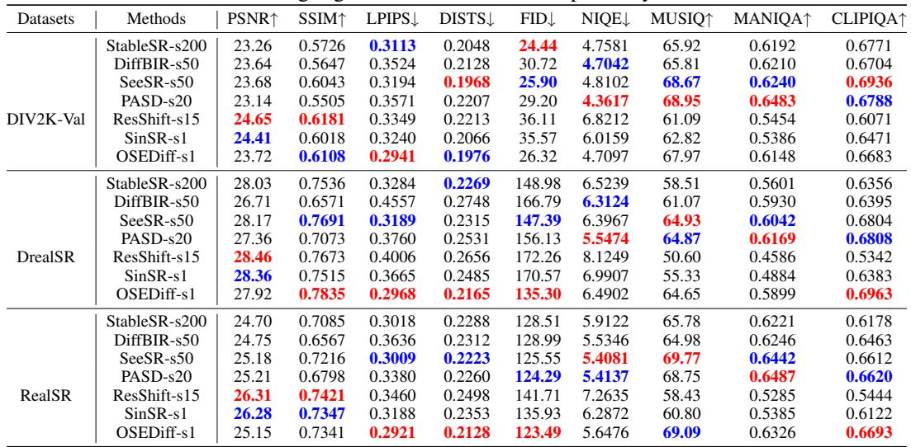
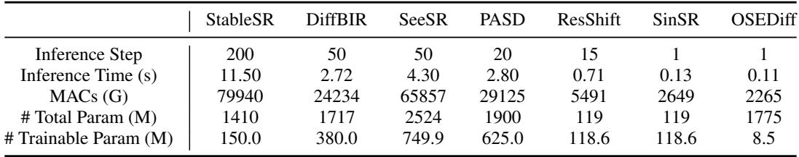
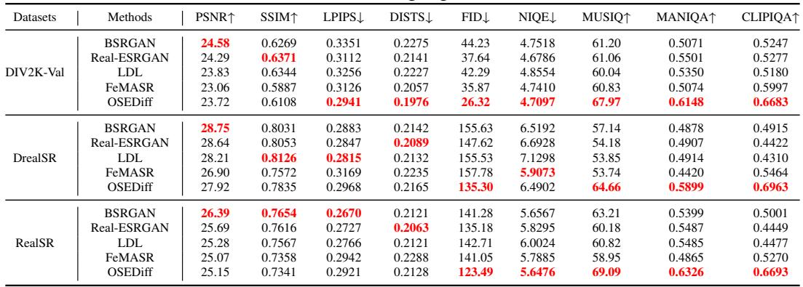

[← 返回 README](../README.md)

# Experiments

## 📌 预览
本文件合并 Experiments/Results/Analysis/Ablation，重点看 fidelity、realism、速度和可控性证据。

---

# 4 Experiments

# 4.1 Experimental Settings

Training and Testing Datasets. Prior works [42, 57, 31, 52] employed different training datasets, making unified training standards for Real-ISR difficult to establish. For simplicity, we adopt SeeSR’s setup [52] and train OSEDiff using the LSDIR [26] dataset and the first 10K face images from FFHQ [19]. The degradation pipeline of Real-ESRGAN [45] is used to synthesize LQ-HQ training pairs. We evaluate OSEDiff and compare it with competing methods using the test set provided by StableSR [42], including both synthetic and real-world data. The synthetic data includes 3000 images of size $5 1 2 \times 5 1 2$ , whose GT are randomly cropped from DIV2K-Val [2] and degraded using the Real-ESRGAN pipeline [45]. The real-world data include LQ-HQ pairs from RealSR [3] and DRealSR [51], with sizes of $1 2 8 \times 1 2 8$ and $5 1 2 \times 5 1 2$ , respectively.

> 💡 **批注**: 注意 latent diffusion 架构路径：LQ/HR 往往先被 VAE 编码，再在 latent 空间完成 denoising 或调制。

Compared Methods. We compare OSEDiff with state-of-the-art DM-based Real-ISR methods, including StableSR [42], ResShift [60], PASD [57], DiffBIR [31], SeeSR [52] and SinSR [48]. Among them, StableSR, PASD, DiffBIR, and SeeSR are all based on the pre-trained SD model. ResShift trains a DM from scratch in the pixel domain, while SinSR is a one-step model distilled from ResShift. Note that we do not compare with the recent method SUPIR [59] because it tends to generate rich yet excessive details, which are however unfaithful to the input image.

> 💡 **批注**: 这里的关键词是单步推理：作者试图把原本多次 denoising 的生成先验压缩到一次前向中。

Table 1: Quantitative comparison with state-of-the-art methods on both synthetic and real-world benchmarks. ‘s’ denotes the number of diffusion reverse steps in the method. The best and second best results of each metric are highlighted in red and blue, respectively.

> 💡 **批注**: 这是实验证据：要同时看保真指标、感知指标和速度指标。

*Table 1: Table 1: Quantitative comparison with state-of-the-art methods on both synthetic and real-world benchmarks. ‘s’ denotes the number of diffusion reverse steps in the method. The best and second best results of each metric are highlighted in red and blue, respectively.*

> 💡 **Table 1 批读**: 表格要横向看 SOTA 排名，也要纵向看 fidelity 指标和 perceptual 指标是否相互牺牲。

Table 2: Complexity comparison among different methods. All methods are tested with an input image of size $5 1 2 \times 5 1 2$ , and the inference time is measured on an A100 GPU.

> 💡 **批注**: 这是实验证据：要同时看保真指标、感知指标和速度指标。

*Table 2: Table 2: Complexity comparison among different methods. All methods are tested with an input image of size $5 1 2 \times 5 1 2$ , and the inference time is measured on an A100 GPU.*

> 💡 **Table 2 批读**: 表格要横向看 SOTA 排名，也要纵向看 fidelity 指标和 perceptual 指标是否相互牺牲。

For those GAN-based Real-ISR methods, including BSRGAN [61], Real-ESRGAN [45], LDL [27], and FeMaSR [4], we put their results into the Appendix.

Evaluation Metrics. To provide a comprehensive and holistic assessment on the performance of different methods, we employ a range of full-reference and no-reference metrics. PSNR and SSIM [50] (calculated on the Y channel in YCbCr space) are reference-based fidelity measures, while LPIPS [64], DISTS [12] are reference-based perceptual quality measures. FID [15] evaluates the distance of distributions between GT and restored images. NIQE [62], MANIQA-pipal [55], MUSIQ [22], and CLIPIQA [41] are no-reference image quality measures. We also conduct a user study, which is presented in the Appendix.

> 💡 **批注**: 这里在讨论 fidelity-realism/perception-distortion 张力：SR 既要贴近结构，又要生成自然高频细节。

Implementation Details. We train OSEDiff with the AdamW optimizer [33] at a learning rate of 5e-5. The entire training process took approximately 1 day on 4 NVIDIA A100 GPUs with a batch size of 16. The rank of LoRA in the VAE Encoder, diffusion network, and finetuned regularizer is set to 4. For the text prompt extractor, although advanced multimodal language models [32] can provide detailed text descriptions, they come at a high inference cost. We adopt the degradation-aware prompt extraction (DAPE) module in SeeSR [52] to extract text prompts. The SD 2.1-base is used as the pre-trained T2I model. The weighting scalars $\lambda _ { 1 }$ and $\lambda _ { 2 }$ are set to 2 and 1, respectively.

> 💡 **批注**: 注意 latent diffusion 架构路径：LQ/HR 往往先被 VAE 编码，再在 latent 空间完成 denoising 或调制。

# 4.2 Comparison with State-of-the-Arts

Quantitative Comparisons. The quantitative comparisons among the competing methods on the three datasets are presented in Table 1. We can have the following observations. (1) First, OSEDiff exhibits clear advantages over competing methods in full-reference perceptual quality metrics LPIPS and DISTS, distribution alignment metric FID, and semantic quality metric CLIPIQA, especially on the two real-world datasets DrealSR and RealSR. (2) Second, SeeSR and PASD show better no-reference metrics like NIQE, MUSIQ and MANIQA. This is because these multi-step methods can produce rich image details in the diffusion process, which are preferred by no-reference metrics. (3) Third, ResShift and its distilled version SinSR show better full-reference fidelity metrics such as PSNR. This is mainly because they train a DM from scratch specifically for the restoration purpose, instead of exploring the pre-trained T2I model such as SD. However, ResShift and SinSR show poor perceptual quality metrics than other methods.

> 💡 **批注**: 这里在讨论 fidelity-realism/perception-distortion 张力：SR 既要贴近结构，又要生成自然高频细节。

*Figure 3: Figure 3: Qualitative comparisons of different Real-ISR methods. Please zoom in for a better view.*

> 💡 **Figure 3 批读**: 这张图通常承担方法动机、框架或视觉对比作用。重点看它证明的是质量、速度还是可控性。

Qualitative Comparisons. Fig. 3 presents visual comparisons of different Real-ISR methods. As illustrated in the first example, ResShift and SinSR severely blur the facial details due to the lack of pre-trained image priors. StableSR, DiffBIR and SeeSR reconstruct more facial details by exploring the image prior in pre-trained SD model. PASD generates excessive yet unnatural details. Though OSEDiff performs only one step forward propagation, it reproduces realistic and superior facial details to other methods. Similar conclusion can be drawn from the second example. StableSR and DiffBIR are limited in generating rich textures due to the lack of text prompts. PASD suffers from incorrect semantic generation because its prompt extraction module is not robust to degradation. While SeeSR utilizes degradation-aware semantic cues to stimulate image generation priors, the generated leaf veins are unnatural, which may be influenced by its random noise sampling. In contrast, OSEDiff can generate detailed and natural leaf veins. More visualization comparisons and the results of subjective user study can be found in the Appendix.

> 💡 **批注**: 这里的关键词是单步推理：作者试图把原本多次 denoising 的生成先验压缩到一次前向中。

Complexity Comparisons. We further compare the complexity of competing DM-based Real-ISR models in Table 2, including the number of inference steps, inference time, and trainable parameters. All methods are tested on an A100 GPU with an input image of size $5 1 2 \times 5 1 2$ . OSEDiff has the fewest trainable parameters, and the trained LoRA layers can be merged into the original SD to further reduce the computational cost. By using only one forward pass, OSEDiff has significant advantage in inference time over multi-step methods. Specifically, OSEDiff demonstrates a substantial speed advantage, being approximately 105 times faster than StableSR, 39 times faster than SeeSR, and 6 times faster than ResShift. When compared to the single-step method SinSR, OSEDiff not only achieves faster inference but also delivers significantly higher output quality. In terms of complexity, OSEDiff requires the lowest MACs at just 2265G, as it operates with only a single diffusion step. In contrast, methods like StableSR, which require 200 steps, incur substantially higher MACs (e.g., 79940G). Regarding trainable parameters, OSEDiff is highly parameter-efficient, requiring only 8.5M parameters (LoRA layers), compared to models such as SeeSR, which necessitates 749.9M parameters. This highlights the efficiency of OSEDiff during the training process.

> 💡 **批注**: 这里的关键词是单步推理：作者试图把原本多次 denoising 的生成先验压缩到一次前向中。

Table 3: Comparison of different losses on the RealSR benchmark.

*Table 3: Table 3: Comparison of different losses on the RealSR benchmark.*

> 💡 **Table 3 批读**: 表格要横向看 SOTA 排名，也要纵向看 fidelity 指标和 perceptual 指标是否相互牺牲。

Table 4: Comparison of different text prompt extractors on the DrealSR benchmark.

> 💡 **批注**: 这里涉及条件信号：prompt 是否准确、是否退化感知，会影响生成细节与语义一致性。

*Table 4: Table 4: Comparison of different text prompt extractors on the DrealSR benchmark.*

> 💡 **Table 4 批读**: 表格要横向看 SOTA 排名，也要纵向看 fidelity 指标和 perceptual 指标是否相互牺牲。

Table 5: Comparison of LoRA in VAE encoder with different ranks.

*Table 5: Table 5: Comparison of LoRA in VAE encoder with different ranks.*

> 💡 **Table 5 批读**: 表格要横向看 SOTA 排名，也要纵向看 fidelity 指标和 perceptual 指标是否相互牺牲。

Table 6: Comparison of LoRA in UNet with different ranks.

*Table 6: Table 6: Comparison of LoRA in UNet with different ranks.*

> 💡 **Table 6 批读**: 表格要横向看 SOTA 排名，也要纵向看 fidelity 指标和 perceptual 指标是否相互牺牲。

Table 7: Ablation studies on finetuning the VAE encoder and decoder on the RealSR benchmark.

> 💡 **批注**: 注意 latent diffusion 架构路径：LQ/HR 往往先被 VAE 编码，再在 latent 空间完成 denoising 或调制。

*Table 7: Table 7: Ablation studies on finetuning the VAE encoder and decoder on the RealSR benchmark.*

> 💡 **Table 7 批读**: 表格要横向看 SOTA 排名，也要纵向看 fidelity 指标和 perceptual 指标是否相互牺牲。

# 4.3 Ablation Study

Effectiveness of VSD Loss. To validate the effectiveness of our VSD loss in latent space, we perform ablation studies by removing the VSD loss, replacing it with the GAN loss used in [35], and applying VSD loss in the image domain. The results on the RealSR test set are shown in Table 3. We can see that without using the VSD loss, the perceptual quality metrics are significantly degraded because it is hard to ensure good visual quality using only MSE loss and even LPIPS loss [64]. Using GAN loss and VSD loss in the image domain can improve the performance, but the results are not as good as applying VSD loss in the latent domain. Our proposed OSEDiff can effectively align the distribution of Real-ISR outputs by performing VSD regularization in the latent domain.

> 💡 **批注**: 这里在讨论 fidelity-realism/perception-distortion 张力：SR 既要贴近结构，又要生成自然高频细节。

Comparison on Text Prompt Extractors. We then conduct experiments to evaluate the effect of different text prompt extractors on the Real-ISR results. We test three options. The first option does not employ text prompts. The second option uses the DAPE module in SeeSR [52] to extract degradation-aware tag-style prompts, as we used in our main experiments. The third option uses LLaVA-v1.5 [32] to extract long text descriptions after removing the degradation of input LQ images, as used in SUPIR [59]. We retrain the models based on different prompt extraction methods. The ablation results are shown in Table 4.

> 💡 **批注**: 这里涉及条件信号：prompt 是否准确、是否退化感知，会影响生成细节与语义一致性。

One can see that without using text prompts as inputs, those full-reference metrics such PSNR, SSIM, LPIPS, DISTS and even FID can improve, while those no-reference metrics such as MUSIQ, MANIQA and CLIPIQA become worse. By using DAPE and LLaVA to extract text prompts, the generation capability of the pre-trained T2I SD model can be triggered, resulting in richer synthesized details, which however can reduce the full-reference indices. A visual example is shown in Figure 4. We see that while LLaVA extracts significantly longer text prompts than DAPE, they produce a similar amount of visual details. However, it is worth mentioning that the MLLM model LLaVA is very costly, increasing the inference time of DAPE by 170 times. Considering the cost-effectiveness, we ultimately choose DAPE as the text prompt extractor in OSEDiff.

> 💡 **批注**: 注意 latent diffusion 架构路径：LQ/HR 往往先被 VAE 编码，再在 latent 空间完成 denoising 或调制。

*Figure 4: Figure 4: The impact of different prompt extraction methods. Please zoom in for a better view.*

> 💡 **Figure 4 批读**: 这张图通常承担方法动机、框架或视觉对比作用。重点看它证明的是质量、速度还是可控性。

Setting of LoRA Rank. When finetuning the VAE encoder and the UNet, we need to set the rank of LoRA layers. Here we evaluate the effect of different LoRA ranks on the Real-ISR performance by using the RealSR benchmark [3]. The results are shown in Tables 5 and 6, respectively. As shown in Table 5, if a too small LoRA rank, such as 2, is set for the VAE encoder, the training will be unstable and cannot converge. On the other hand, if a higher LoRA rank, such as 8, is used for the VAE encoder, it may overfit in estimating image degradation, losing some image details in the output, as evidenced by the PSNR, DISTS, MUSIQ and NIQE indices. We find that setting the rank to 4 can achieve a balanced result for the VAE encoder. Similar conclusions can be made for the setting of LoRA rank on UNet. As can be seen from Table 6, a rank of 4 strikes a good balance. Therefore, we set the rank as 4 for both the VAE encoder and UNet LoRA layers.

> 💡 **批注**: 注意 latent diffusion 架构路径：LQ/HR 往往先被 VAE 编码，再在 latent 空间完成 denoising 或调制。

The Finetuning on the VAE Encoder and Decoder. We conducted ablation studies to examine the impact of finetuning the VAE encoder and decoder, as shown Table 7. In the first row, where neither the VAE encoder nor decoder is finetuned, the results show poor perception performance. Comparing with OSEDiff, where only the VAE encoder is finetuned, we observe significant improvements in perceptual quality (e.g., MUSIQ improves from 58.99 to 69.09). This demonstrates that finetuning the VAE encoder is important for removing degradation and enhancing overall performance. When comparing the third row, where both the VAE encoder and decoder are finetuned, with OSEDiff, where only the encoder is trained and the decoder is fixed, we note that OSEDiff also achieves better perceptual quality (CLIPIQ improves from 0.5778 to 0.6693). This indicates that fixing the VAE decoder is important to ensure that the UNet output remains in the original VAE latent space, which helps minimizing the VSD loss more effectively. Thus, finetuning the VAE encoder is important to remove degradation, while fixing the VAE decoder helps maintaining stability in the latent space, leading to better perceptual quality.

> 💡 **批注**: 这里在讨论 fidelity-realism/perception-distortion 张力：SR 既要贴近结构，又要生成自然高频细节。

# A.1 Comparison with GAN-based Methods

We compare OSEDiff with four representative GAN-based Real-ISR methods, including BSRGAN [61], Real-ESRGAN [45], LDL [27] and FeMaSR [4]. The results are shown in Table 8. It is not a surprise that GAN-based methods have better fidelity measures such as PSNR and SSIM than OSEDiff. However, OSEDiff has much better perceptual qualify metrics. We also provide visual comparisons in Figure 5. Compared to GAN-based methods, OSEDiff is able to generate realistic and reasonable details, such as squirrel hair, textures of petals, buildings, and leaves.

> 💡 **批注**: 这里在讨论 fidelity-realism/perception-distortion 张力：SR 既要贴近结构，又要生成自然高频细节。

# A.2 User Study

To further validate the effectiveness of our proposed OSEDiff method, we conducted a user study by using 20 real-world LQ images. An LQ image and its HQ counterparts generated by different Real-ISR methods were presented to volunteers, who were asked to select the best HQ result. The volunteers were instructed to consider two factors when making their decisions: the image perceptual quality and and its content (including structure and texture) consistency with the LQ input, with each factor contributing equally to the final selection.

> 💡 **批注**: 这里在讨论 fidelity-realism/perception-distortion 张力：SR 既要贴近结构，又要生成自然高频细节。

We randomly selected 20 real-world LQ images from the RealLR200 dataset [52]. Figure 6(a) shows the thumbnails used in the user study, cropped into squares for a convenient layout. We generated the HQ outputs of them by using the DM-based Real-ISR methods StableSR [42], DiffBIR [31], SeeSR [52], PASD [57], ResShift [60], SinSR [48], and OSEDiff. A number of 15 volunteers were invited to participate in the evaluation. The results are shown in Figure 6(b). We see that OSEDiff ranks the second, just lagging slightly behind SeeSR. However, it should be noted that OSEDiff runs over 10 times faster than SeeSR by performing only one-step diffusion.

> 💡 **批注**: 这里的关键词是单步推理：作者试图把原本多次 denoising 的生成先验压缩到一次前向中。

# A.3 More Visual Comparisons

Figure 7 provides more visual comparisons between OSEDiff and other DM-based methods. One can see that OSEDiff achieves comparable to or even better results than the multi-step diffusion methods in scenarios such as portraits, flower patterns, buildings, animal fur, and letters.

> 💡 **批注**: 这是实验证据：要同时看保真指标、感知指标和速度指标。

Table 8: Quantitative comparison with GAN-based methods on both synthetic and real-world benchmarks. The best results of each metric are highlighted in red.

> 💡 **批注**: 这是实验证据：要同时看保真指标、感知指标和速度指标。

*Table 8: Table 8: Quantitative comparison with GAN-based methods on both synthetic and real-world benchmarks. The best results of each metric are highlighted in red.*

> 💡 **Table 8 批读**: 表格要横向看 SOTA 排名，也要纵向看 fidelity 指标和 perceptual 指标是否相互牺牲。

---

## 🔖 Section 总结

### 核心洞察
1. 检查 fidelity/perceptual/速度指标是否同时成立。
2. 关注消融和可控性曲线/视觉样例。
