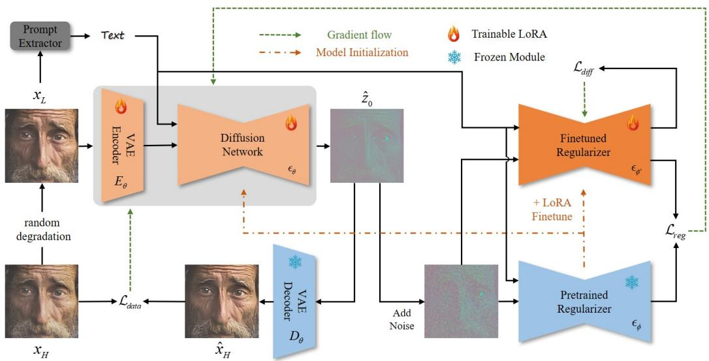
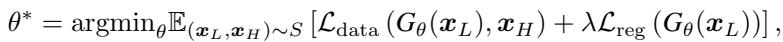
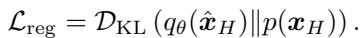

[← 返回 README](../README.md)

# 3.1 Problem Modeling

## 📌 预览
Method 是核心：关注输入从 LQ 到 latent/feature 的路径、训练目标、控制变量以及与 teacher/先验的交互方式。

> 💡 **与 OSEDiff 主线的关系**: OSEDiff 将低质量图像直接作为扩散起点，用少量 LoRA/可训练层和 latent-space VSD 正则把 Stable Diffusion 的生成先验压缩到单步 Real-ISR 推理中。

---

Real-ISR is to estimate an HQ image $\scriptstyle { \hat { \mathbf { x } } } _ { H }$ from the given LQ image $\scriptstyle { \mathbf { \mathcal { x } } } _ { L }$ . This task can be conventionally modeled as an optimization problem: $\begin{array} { r } { \hat { \pmb x } _ { H } = \mathrm { a r g m i n } _ { \pmb x _ { H } } \big ( \mathcal L _ { d a t a } \left( \Phi ( \pmb x _ { H } ) , \pmb x _ { L } \right) + \lambda \mathcal L _ { r e g } \left( \pmb x _ { H } \right) \big ) } \end{array}$ , where $\Phi$ is the degradation function, $\mathcal { L } _ { d a t a }$ is the data term to measure the fidelity of the optimization output, $\mathcal { L } _ { \boldsymbol { r } e g }$ is the regularization term to exploit the prior information of natural images, and scalar $\lambda$ is the balance parameter. Many conventional ISR methods [13, 29, 65] restore the desired HQ image by assuming simple and known degradation models and employing hand-crafted natural image prior models (i.e., image sparsity based prior [54]).

> 💡 **批注**: 这里在讨论 fidelity-realism/perception-distortion 张力：SR 既要贴近 GT/LQ 结构，又要生成自然高频细节。

*Figure 2: Figure 2: The training framework of OSEDiff. The LQ image is passed through a trainable encoder $E _ { \theta }$ , a LoRA finetuned diffusion network $\epsilon _ { \theta }$ and a frozen decoder $D _ { \theta }$ to obtain the desired HQ image. In addition, text prompts are extracted from the LQ image and input to the diffusion network to stimulate its generation capacity. Meanwhile, the output of the diffusion network $\epsilon _ { \theta }$ will be sent to two regularizer networks (a frozen pre-trained one and a fine-tuned one), where variational score distillation is performed in latent space to ensure that the output of $\epsilon _ { \theta }$ follows HQ natural image distribution. The regularization loss will be back-propagated to update $E _ { \theta }$ and $\epsilon _ { \theta }$ . Once training is finished, only $E _ { \theta }$ , $\epsilon _ { \theta }$ and $D _ { \theta }$ will be used in inference.*

> 💡 **Figure 2 批读**: 这张图通常承担方法动机、框架或视觉对比的作用。阅读时重点看它证明的是质量、速度还是可控性，而不是只看视觉效果。

However, the performance of such optimization-based methods is largely hindered by two factors. First, the degradation function $\Phi$ is often unknown and hard to model in real-world scenarios. Second, the hand-crafted regularization terms $\mathcal { L } _ { \mathrm { r e g } }$ are hard to effectively model the complex natural image priors. With the development of deep-learning techniques, it has become prevalent to learn a neural network $G _ { \theta }$ , which is parameterized by $\theta$ , from a training dataset $S$ of $( { \pmb x } _ { L } , { \pmb x } _ { H } )$ pairs to map the LQ image to an HQ image. The network training can be described as the following learning problem:

> 💡 **批注**: 这是效率相关段落：单步只是减少采样次数，模型结构和 VAE 仍可能是主要延迟来源。

*Equation 1: Equation extracted by MinerU.*

> 💡 **Equation 1 批读**: 这类公式通常定义 forward/reverse process、loss 或 alignment 目标；建议把每个符号对应到输入、teacher/student、控制变量。

where ${ \mathcal { L } } _ { \mathrm { d a t a } }$ and $\mathcal { L } _ { \mathrm { r e g } }$ are the loss functions. ${ \mathcal { L } } _ { \mathrm { d a t a } }$ enforces that the network output $\hat { \pmb x } _ { H } = G _ { \theta } ( { \pmb x } _ { L } )$ can approach to the ground-truth $\mathbf { \mathcal { x } } _ { H }$ as much as possible, which can be quantified by metrics such as $L _ { 1 }$ norm, $L _ { 2 }$ norm and LPIPS [64]. Using only the ${ \mathcal { L } } _ { \mathrm { d a t a } }$ loss to train the network $G _ { \theta }$ from scratch may over-fit the training dataset. In this work, we propose to finetune a pre-trained generative network, more specifically the SD [36] network, to improve the generalization capability of $G _ { \theta }$ . In addition, the regularization loss $\mathcal { L } _ { \mathrm { r e g } }$ is critical to improve the generalization capability of $G _ { \theta }$ , as well as enhance the naturalness of output HQ images $\scriptstyle { \hat { \mathbf { x } } } _ { H }$ . Suppose that we have the distribution of real-world HQ images, denoted by $p ( { \pmb x } _ { H } )$ , the KL divergence [8] is an ideal choice to serve as the loss function of $\mathcal { L } _ { \mathrm { r e g } }$ ; that is, the distribution of restored HQ images, denoted by $q _ { \theta } ( \hat { \pmb x } _ { H } )$ , should be identical to $p ( { \pmb x } _ { H } )$ as much as possible. The regularization loss can be defined as:

> 💡 **批注**: 注意 latent diffusion 架构路径：LQ/HR 往往先被 VAE 编码，再在 latent 空间完成 denoising 或调制。

*Equation 2: Equation extracted by MinerU.*

> 💡 **Equation 2 批读**: 这类公式通常定义 forward/reverse process、loss 或 alignment 目标；建议把每个符号对应到输入、teacher/student、控制变量。

Existing works [24, 46] mostly instantiate the above objective via adversarial training [14], which involves learning a discriminator to differentiate between the generated HQ image $\scriptstyle { \hat { \mathbf { x } } } _ { H }$ and the real HQ image $\mathbf { \mathcal { x } } _ { H }$ , and updating the generator $G _ { \theta }$ to make $\scriptstyle { \hat { \mathbf { x } } } _ { H }$ and $\scriptstyle { \mathbf { x } } _ { H }$ indistinguishable. However, the discriminators are often trained from scratch alongside the generator. They may not be able to acquire the full distribution of HQ images and lack enough discriminative power, resulting in sub-optimal Real-ISR performance.

> 💡 **批注**: 这是一段信息密度较高的论述：建议拆成“问题 → 方法 → 证据/结论”三层来读，避免被细节淹没。

The recently developed T2I diffusion models such as SD [36] offer new options for us to formulate the loss $\mathcal { L } _ { \mathrm { r e g } }$ . These models, trained on billions of image-text pairs, can effectively depict the natural image distribution in latent space. Some score distillation methods have been reported to employ SD to optimize images by using the KL-divergence as the objective [49, 25, 43]. In particular, variational score distillation (VSD) [49, 58, 10] induces such a KL-divergence based objective from particlebased variational optimization to align the distributions represented by two diffusion models. Based on the above discussions, we propose to instantiate the learning objective in Eq. (1) by designing an efficient and effective one-step diffusion network. In specific, we finetune the pre-trained SD with LoRA [17] as our Real-ISR backbone network and employ VSD as our regularizer to align the distribution of network outputs with natural HQ images. The details are provided in the next section.

> 💡 **批注**: 这里的关键词是单步推理：作者试图把原本多次 denoising 的生成先验压缩到一次前向中。

---

## 🔖 Section 总结

### 核心洞察

1. 明确输入、输出、teacher/student 或控制变量。
2. 把每个 loss/模块对应到 fidelity、realism、speed 或 controllability。
3. 关注哪些组件是训练时使用，哪些是推理时仍有成本。

### 关键数字速查

| 指标 | 数值 |
|------|------|
| Inference steps | 1 |
| Inference time | 0.11s on A100 for 512×512 input |
| Trainable parameters | 8.5M |
| Speedup claim | over 100× faster than StableSR in paper comparison |
