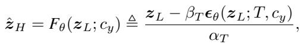
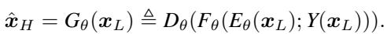
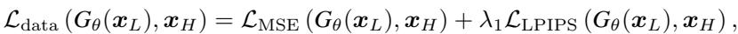
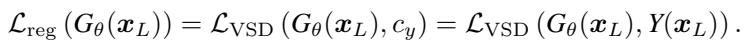
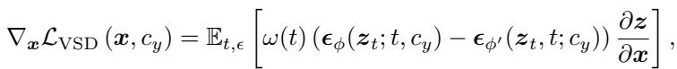
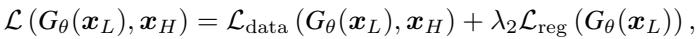
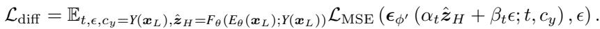
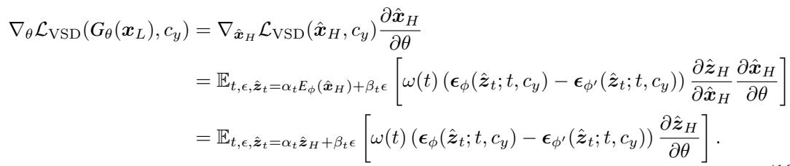

[← 返回 README](../README.md)

# 3.2 One-Step Effective Diffusion Network

## 📌 预览
Method 是核心：关注输入从 LQ 到 latent/feature 的路径、训练目标、控制变量以及与 teacher/先验的交互方式。

> 💡 **与 OSEDiff 主线的关系**: OSEDiff 将低质量图像直接作为扩散起点，用少量 LoRA/可训练层和 latent-space VSD 正则把 Stable Diffusion 的生成先验压缩到单步 Real-ISR 推理中。

---

Framework Overview. As discussed in Sec. 1, the existing SD-based Real-ISR methods [42, 57, 31, 52, 40] perform multiple timesteps to estimate the HQ image with random noise as the starting point and the LQ image as control signal. These approaches are resource-intensive and will inherently introduce randomness. Based on our formulation in Sec. 3.1, we propose a one-step effective diffusion (OSEDiff) network for Real-ISR, whose training framework is shown in Fig. 2. Our generator $G _ { \theta }$ to be trained is composed of a trainable encoder $E _ { \theta }$ , a finetuned diffusion network $\epsilon _ { \theta }$ and a frozen decoder $D _ { \theta }$ . To ensure the generalization capability of $G _ { \theta }$ , the output of the diffusion network $\epsilon _ { \theta }$ will be sent to two regularizer networks, where VSD loss is performed in latent space. The regularization loss are back-propagated to update $E _ { \theta }$ and $\epsilon _ { \theta }$ . Once training is finished, only the generator $G _ { \theta }$ will be used in inference. In the following, we will delve into the detailed architecture design of OSEDiff, as well as its associated training losses.

> 💡 **批注**: 这里的关键词是单步推理：作者试图把原本多次 denoising 的生成先验压缩到一次前向中。

Network Architecture Design. Let’s denote by $E _ { \phi }$ , $\epsilon _ { \phi }$ and $D _ { \phi }$ the VAE encoder, latent diffusion network and VAE decoder of a pretrained SD model, where $\phi$ denotes the model parameters. Inspired by the recent success of LoRA [17] in finetuning SD to downstream tasks [34, 35], we adopt LoRA to fine-tune the pre-trained SD in the Real-ISR task to obtain the desired generator $G _ { \theta }$ .

> 💡 **批注**: 注意 latent diffusion 架构路径：LQ/HR 往往先被 VAE 编码，再在 latent 空间完成 denoising 或调制。

As shown in the left part of Fig. 2, to maintain SD’s original generation capacity, we introduce trainable LoRA [17] layers to the encoder $E _ { \phi }$ and the diffusion network $\epsilon _ { \phi }$ , finetuning them into $E _ { \theta }$ and $\epsilon _ { \theta }$ with our training data. For the decoder, we fix its parameters and directly set $D _ { \theta } = D _ { \phi }$ . This is to ensure that the output space of the diffusion network remains consistent with the regularizers.

> 💡 **批注**: 注意 latent diffusion 架构路径：LQ/HR 往往先被 VAE 编码，再在 latent 空间完成 denoising 或调制。

Recall that the diffusion model diffuses the input latent feature $_ z$ through $z _ { t } = \alpha _ { t } z + \beta _ { t } \epsilon$ , where $\alpha _ { t } , \beta _ { t }$ are scalars that are dependent to diffusion timestep $t \in \{ 1 , \cdots , T \}$ [16]. With a neural network that can predict the noise in ${ \boldsymbol { z } } _ { t }$ , denoted as $\hat { \epsilon }$ , the denoised latent can be obtained as $\begin{array} { r } { \hat { z } _ { 0 } = \frac { z _ { t } - \beta _ { t } \hat { \epsilon } } { \alpha _ { t } } } \end{array}$ , which is expected to be cleaner and more photo-realistic than ${ \boldsymbol { z } } _ { t }$ . Moreover, SD is a text-conditioned generation model. By extracting the text embeddings [36], denoted by $c _ { y }$ , from the given text description $y$ , the noise prediction can be performed as $\hat { \pmb { \epsilon } } = \pmb { \epsilon } _ { \theta } ( z _ { t } ; t , c _ { y } )$ .

> 💡 **批注**: 注意 latent diffusion 架构路径：LQ/HR 往往先被 VAE 编码，再在 latent 空间完成 denoising 或调制。

We adapt the above text-to-image denoising process to the Real-ISR task, and formulate the LQ-to-HQ latent transformation $F _ { \theta }$ as a text-conditioned image-to-image denoising process as:

> 💡 **批注**: 注意 latent diffusion 架构路径：LQ/HR 往往先被 VAE 编码，再在 latent 空间完成 denoising 或调制。

*Equation 3: Equation extracted by MinerU.*

> 💡 **Equation 3 批读**: 这类公式通常定义 forward/reverse process、loss 或 alignment 目标；建议把每个符号对应到输入、teacher/student、控制变量。

where we conduct only one-step denoising on the LQ latent $z _ { L }$ , without introducing any noise, at the $T$ -th diffusion timestep. The denoising output $\hat { z } _ { H }$ is expected be more photo-realistic than $z _ { L }$ . As for the text embeddings, we apply some text prompt extractor, such as the DAPE [52], to LQ input $\scriptstyle { \pmb { x } } _ { L }$ , and obtain $c _ { y } = Y ( \pmb { x } _ { L } )$ . Finally, the whole LQ-to-HQ image synthesis can be written as:

> 💡 **批注**: 这里的关键词是单步推理：作者试图把原本多次 denoising 的生成先验压缩到一次前向中。

*Equation 4: Equation extracted by MinerU.*

> 💡 **Equation 4 批读**: 这类公式通常定义 forward/reverse process、loss 或 alignment 目标；建议把每个符号对应到输入、teacher/student、控制变量。

As mentioned in Sec. 3.1, to improve the performance for a Real-ISR model, it is required to supervise the generator training with both the data term ${ \mathcal { L } } _ { \mathrm { d a t a } }$ and regularization term $\mathcal { L } _ { \mathrm { r e g } }$ . As shown in the right part of Fig. 2, we propose to adapt VSD [49] as the regularization term. Apart from utilizing the SD model as the pre-trained regularizer $\epsilon _ { \phi }$ , VSD also introduces a finetuned regularizer, i.e., a latent diffusion module finetuned on the distribution $q _ { \theta } \left( \hat { \pmb x } _ { H } \right)$ of generated images with LoRA. We denote this finetuned diffusion module as $\epsilon _ { \phi ^ { \prime } }$ .

> 💡 **批注**: 这是蒸馏逻辑：用 teacher 或 score regularization 把多步/大模型能力迁移给单步模型。

Training Loss. We train the generator $G _ { \theta }$ with the data loss ${ \mathcal { L } } _ { \mathrm { d a t a } }$ and regularization loss $\mathcal { L } _ { \mathrm { r e g } }$ . We set ${ \mathcal { L } } _ { \mathrm { d a t a } }$ as the weighted sum of MSE loss and LPIPS loss:

> 💡 **批注**: 这是实验证据：要同时看保真指标、感知指标和速度指标，避免被单一数字误导。

*Equation 5: Equation extracted by MinerU.*

> 💡 **Equation 5 批读**: 这类公式通常定义 forward/reverse process、loss 或 alignment 目标；建议把每个符号对应到输入、teacher/student、控制变量。

where $\lambda _ { 1 }$ is a weighting scalar. As for $\mathcal { L } _ { \mathrm { r e g } }$ , we adopt the VSD loss via:

> 💡 **批注**: 这是蒸馏逻辑：用 teacher 或 score regularization 把多步/大模型能力迁移给单步模型。

*Equation 6: Equation extracted by MinerU.*

> 💡 **Equation 6 批读**: 这类公式通常定义 forward/reverse process、loss 或 alignment 目标；建议把每个符号对应到输入、teacher/student、控制变量。

Given any trainable image-shape feature $_ { \textbf { \em x } }$ , its latent code $z = E _ { \phi } ( { \pmb x } )$ and encoded text prompt condition $c _ { y }$ , VSD optimizes $_ { \textbf { \em x } }$ to make it consistent with the text prompt $y$ via:

> 💡 **批注**: 这是蒸馏逻辑：用 teacher 或 score regularization 把多步/大模型能力迁移给单步模型。

*Equation 7: Equation extracted by MinerU.*

> 💡 **Equation 7 批读**: 这类公式通常定义 forward/reverse process、loss 或 alignment 目标；建议把每个符号对应到输入、teacher/student、控制变量。

where the expectation of the gradient is conducted over all diffusion timesteps $t \in \{ 1 , \cdots , T \}$ and $\epsilon \sim \mathcal { N } ( 0 , I )$ . Therefore, the overall training objective for the generator $G _ { \theta }$ is:

> 💡 **批注**: 这是控制机制：作者试图把退化强度、区域差异或 timestep 映射成可操作的生成强度。

*Equation 8: Equation extracted by MinerU.*

> 💡 **Equation 8 批读**: 这类公式通常定义 forward/reverse process、loss 或 alignment 目标；建议把每个符号对应到输入、teacher/student、控制变量。

where $\lambda _ { 2 }$ is a weighting scalar. Besides, as required by VSD, the finetuned regularizer $\epsilon _ { \phi ^ { ' } }$ should also be trainable, and its training objective is:

> 💡 **批注**: 这是蒸馏逻辑：用 teacher 或 score regularization 把多步/大模型能力迁移给单步模型。

*Equation 9: Equation extracted by MinerU.*

> 💡 **Equation 9 批读**: 这类公式通常定义 forward/reverse process、loss 或 alignment 目标；建议把每个符号对应到输入、teacher/student、控制变量。

Note that the above ${ \mathcal { L } } _ { \mathrm { d i f f } }$ loss is only applied to update $\epsilon _ { \phi ^ { ' } }$ . The whole algorithm to illustrate the training pipeline can be found in the Appendix.

VSD in Latent Space. The original VSD computes the gradients in the image space. When it is used to train an SD-based generator network, there will be repetitive latent decoding/encoding in computing $\mathcal { L } _ { \mathrm { r e g } }$ . This is costly and makes the regularization less effective. Considering the fact that a well-trained VAE should satisfy $E _ { \phi } ( \pmb { x } ) = E _ { \phi } ( \bar { D _ { \phi } } ( z ) ) \approx z$ , we can approximately let $\bar { \cal E } _ { \phi } ( \hat { \pmb x } _ { H } ) = \hat { \pmb z } _ { H }$ . In this case, we can eliminate the redundant latent encoding/decoding in computing the regularization loss, as we follow DMD [58] to optimize the distribution loss in the latent state space rather than in the noise space. The gradient of the regularization loss w.r.t. the network parameter $\theta$ in the latent space is:

> 💡 **批注**: 这是蒸馏逻辑：用 teacher 或 score regularization 把多步/大模型能力迁移给单步模型。

*Equation 10: Equation extracted by MinerU.*

> 💡 **Equation 10 批读**: 这类公式通常定义 forward/reverse process、loss 或 alignment 目标；建议把每个符号对应到输入、teacher/student、控制变量。

---

## 🔖 Section 总结

### 核心洞察

1. 明确输入、输出、teacher/student 或控制变量。
2. 把每个 loss/模块对应到 fidelity、realism、speed 或 controllability。
3. 关注哪些组件是训练时使用，哪些是推理时仍有成本。

### 关键数字速查

| 指标 | 数值 |
|------|------|
| Inference steps | 1 |
| Inference time | 0.11s on A100 for 512×512 input |
| Trainable parameters | 8.5M |
| Speedup claim | over 100× faster than StableSR in paper comparison |
