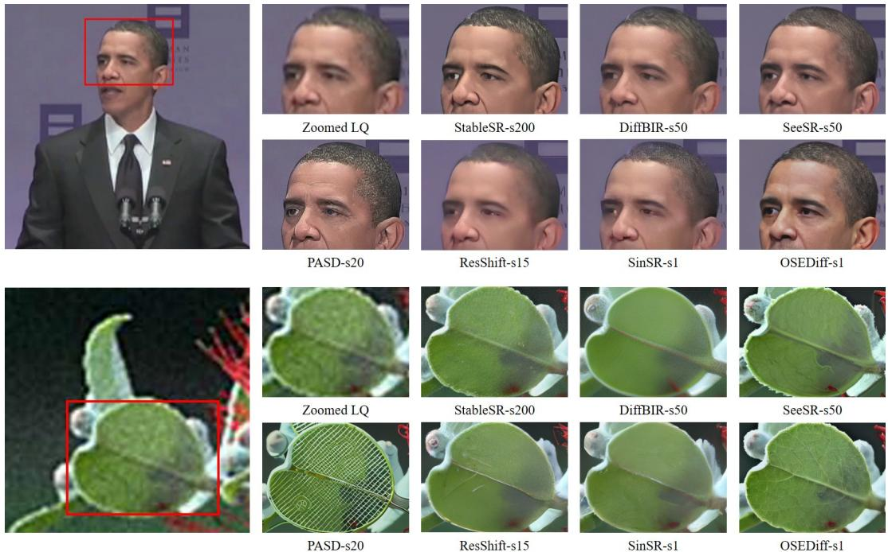
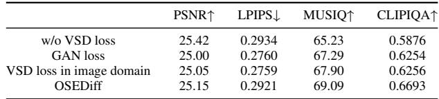
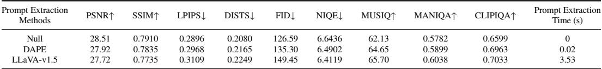
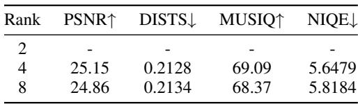
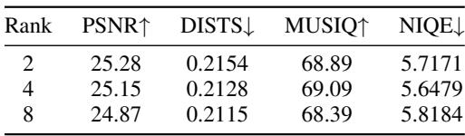
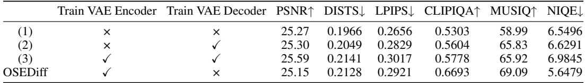

[← 返回 README](../README.md)

# 4.2 Comparison with State-of-the-Arts

## 📌 预览
Experiments 验证方法是否真的改善质量、速度和可控性；注意 full-reference/no-reference 指标之间的张力。

> 💡 **与 OSEDiff 主线的关系**: OSEDiff 将低质量图像直接作为扩散起点，用少量 LoRA/可训练层和 latent-space VSD 正则把 Stable Diffusion 的生成先验压缩到单步 Real-ISR 推理中。

---

Quantitative Comparisons. The quantitative comparisons among the competing methods on the three datasets are presented in Table 1. We can have the following observations. (1) First, OSEDiff exhibits clear advantages over competing methods in full-reference perceptual quality metrics LPIPS and DISTS, distribution alignment metric FID, and semantic quality metric CLIPIQA, especially on the two real-world datasets DrealSR and RealSR. (2) Second, SeeSR and PASD show better no-reference metrics like NIQE, MUSIQ and MANIQA. This is because these multi-step methods can produce rich image details in the diffusion process, which are preferred by no-reference metrics. (3) Third, ResShift and its distilled version SinSR show better full-reference fidelity metrics such as PSNR. This is mainly because they train a DM from scratch specifically for the restoration purpose, instead of exploring the pre-trained T2I model such as SD. However, ResShift and SinSR show poor perceptual quality metrics than other methods.

> 💡 **批注**: 这里在讨论 fidelity-realism/perception-distortion 张力：SR 既要贴近 GT/LQ 结构，又要生成自然高频细节。

*Figure 3: Figure 3: Qualitative comparisons of different Real-ISR methods. Please zoom in for a better view.*

> 💡 **Figure 3 批读**: 这张图通常承担方法动机、框架或视觉对比的作用。阅读时重点看它证明的是质量、速度还是可控性，而不是只看视觉效果。

Qualitative Comparisons. Fig. 3 presents visual comparisons of different Real-ISR methods. As illustrated in the first example, ResShift and SinSR severely blur the facial details due to the lack of pre-trained image priors. StableSR, DiffBIR and SeeSR reconstruct more facial details by exploring the image prior in pre-trained SD model. PASD generates excessive yet unnatural details. Though OSEDiff performs only one step forward propagation, it reproduces realistic and superior facial details to other methods. Similar conclusion can be drawn from the second example. StableSR and DiffBIR are limited in generating rich textures due to the lack of text prompts. PASD suffers from incorrect semantic generation because its prompt extraction module is not robust to degradation. While SeeSR utilizes degradation-aware semantic cues to stimulate image generation priors, the generated leaf veins are unnatural, which may be influenced by its random noise sampling. In contrast, OSEDiff can generate detailed and natural leaf veins. More visualization comparisons and the results of subjective user study can be found in the Appendix.

> 💡 **批注**: 这里的关键词是单步推理：作者试图把原本多次 denoising 的生成先验压缩到一次前向中。

Complexity Comparisons. We further compare the complexity of competing DM-based Real-ISR models in Table 2, including the number of inference steps, inference time, and trainable parameters. All methods are tested on an A100 GPU with an input image of size $5 1 2 \times 5 1 2$ . OSEDiff has the fewest trainable parameters, and the trained LoRA layers can be merged into the original SD to further reduce the computational cost. By using only one forward pass, OSEDiff has significant advantage in inference time over multi-step methods. Specifically, OSEDiff demonstrates a substantial speed advantage, being approximately 105 times faster than StableSR, 39 times faster than SeeSR, and 6 times faster than ResShift. When compared to the single-step method SinSR, OSEDiff not only achieves faster inference but also delivers significantly higher output quality. In terms of complexity, OSEDiff requires the lowest MACs at just 2265G, as it operates with only a single diffusion step. In contrast, methods like StableSR, which require 200 steps, incur substantially higher MACs (e.g., 79940G). Regarding trainable parameters, OSEDiff is highly parameter-efficient, requiring only 8.5M parameters (LoRA layers), compared to models such as SeeSR, which necessitates 749.9M parameters. This highlights the efficiency of OSEDiff during the training process.

> 💡 **批注**: 这里的关键词是单步推理：作者试图把原本多次 denoising 的生成先验压缩到一次前向中。

Table 3: Comparison of different losses on the RealSR benchmark.

*Table 3: Table 3: Comparison of different losses on the RealSR benchmark.*

> 💡 **Table 3 批读**: 表格要横向看 SOTA 排名，也要纵向看 fidelity 指标和 perceptual 指标是否相互牺牲。

Table 4: Comparison of different text prompt extractors on the DrealSR benchmark.

> 💡 **批注**: 这里涉及条件信号：prompt 是否准确、是否退化感知，会直接影响生成细节与语义一致性。

*Table 4: Table 4: Comparison of different text prompt extractors on the DrealSR benchmark.*

> 💡 **Table 4 批读**: 表格要横向看 SOTA 排名，也要纵向看 fidelity 指标和 perceptual 指标是否相互牺牲。

Table 5: Comparison of LoRA in VAE encoder with different ranks.

*Table 5: Table 5: Comparison of LoRA in VAE encoder with different ranks.*

> 💡 **Table 5 批读**: 表格要横向看 SOTA 排名，也要纵向看 fidelity 指标和 perceptual 指标是否相互牺牲。

Table 6: Comparison of LoRA in UNet with different ranks.

*Table 6: Table 6: Comparison of LoRA in UNet with different ranks.*

> 💡 **Table 6 批读**: 表格要横向看 SOTA 排名，也要纵向看 fidelity 指标和 perceptual 指标是否相互牺牲。

Table 7: Ablation studies on finetuning the VAE encoder and decoder on the RealSR benchmark.

> 💡 **批注**: 注意 latent diffusion 架构路径：LQ/HR 往往先被 VAE 编码，再在 latent 空间完成 denoising 或调制。

*Table 7: Table 7: Ablation studies on finetuning the VAE encoder and decoder on the RealSR benchmark.*

> 💡 **Table 7 批读**: 表格要横向看 SOTA 排名，也要纵向看 fidelity 指标和 perceptual 指标是否相互牺牲。

---

## 🔖 Section 总结

### 核心洞察

1. 同时看 PSNR/SSIM 与 LPIPS/FID/NIQE/MUSIQ 等指标。
2. 检查 one-step 是否真的在 latency/参数量上有优势。
3. 优先关注 ablation 是否支持论文的主模块设计。

### 关键数字速查

| 指标 | 数值 |
|------|------|
| Inference steps | 1 |
| Inference time | 0.11s on A100 for 512×512 input |
| Trainable parameters | 8.5M |
| Speedup claim | over 100× faster than StableSR in paper comparison |
