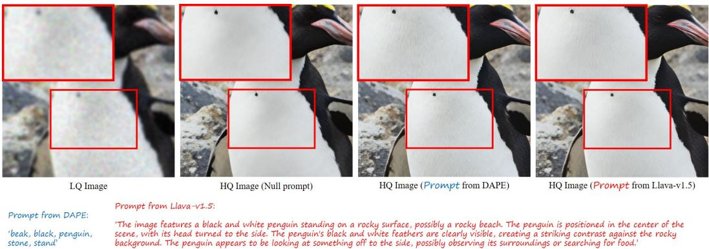

[← 返回 README](../README.md)

# 4.3 Ablation Study

## 📌 预览
Analysis/Ablation 用来判断每个模块是否必要，特别要看控制变量、loss 和轻量化组件是否各自贡献明确。

---

Effectiveness of VSD Loss. To validate the effectiveness of our VSD loss in latent space, we perform ablation studies by removing the VSD loss, replacing it with the GAN loss used in [35], and applying VSD loss in the image domain. The results on the RealSR test set are shown in Table 3. We can see that without using the VSD loss, the perceptual quality metrics are significantly degraded because it is hard to ensure good visual quality using only MSE loss and even LPIPS loss [64]. Using GAN loss and VSD loss in the image domain can improve the performance, but the results are not as good as applying VSD loss in the latent domain. Our proposed OSEDiff can effectively align the distribution of Real-ISR outputs by performing VSD regularization in the latent domain.

> 💡 **批注**: 这里在讨论 fidelity-realism/perception-distortion 张力：SR 既要贴近 GT/LQ 结构，又要生成自然高频细节。

Comparison on Text Prompt Extractors. We then conduct experiments to evaluate the effect of different text prompt extractors on the Real-ISR results. We test three options. The first option does not employ text prompts. The second option uses the DAPE module in SeeSR [52] to extract degradation-aware tag-style prompts, as we used in our main experiments. The third option uses LLaVA-v1.5 [32] to extract long text descriptions after removing the degradation of input LQ images, as used in SUPIR [59]. We retrain the models based on different prompt extraction methods. The ablation results are shown in Table 4.

> 💡 **批注**: 这里涉及条件信号：prompt 是否准确、是否退化感知，会直接影响生成细节与语义一致性。

One can see that without using text prompts as inputs, those full-reference metrics such PSNR, SSIM, LPIPS, DISTS and even FID can improve, while those no-reference metrics such as MUSIQ, MANIQA and CLIPIQA become worse. By using DAPE and LLaVA to extract text prompts, the generation capability of the pre-trained T2I SD model can be triggered, resulting in richer synthesized details, which however can reduce the full-reference indices. A visual example is shown in Figure 4. We see that while LLaVA extracts significantly longer text prompts than DAPE, they produce a similar amount of visual details. However, it is worth mentioning that the MLLM model LLaVA is very costly, increasing the inference time of DAPE by 170 times. Considering the cost-effectiveness, we ultimately choose DAPE as the text prompt extractor in OSEDiff.

> 💡 **批注**: 注意 latent diffusion 架构路径：LQ/HR 往往先被 VAE 编码，再在 latent 空间完成 denoising 或调制。

*Figure 4: Figure 4: The impact of different prompt extraction methods. Please zoom in for a better view.*

> 💡 **Figure 4 批读**: 这张图通常承担方法动机、框架或视觉对比的作用。阅读时重点看它证明的是质量、速度还是可控性，而不是只看视觉效果。

Setting of LoRA Rank. When finetuning the VAE encoder and the UNet, we need to set the rank of LoRA layers. Here we evaluate the effect of different LoRA ranks on the Real-ISR performance by using the RealSR benchmark [3]. The results are shown in Tables 5 and 6, respectively. As shown in Table 5, if a too small LoRA rank, such as 2, is set for the VAE encoder, the training will be unstable and cannot converge. On the other hand, if a higher LoRA rank, such as 8, is used for the VAE encoder, it may overfit in estimating image degradation, losing some image details in the output, as evidenced by the PSNR, DISTS, MUSIQ and NIQE indices. We find that setting the rank to 4 can achieve a balanced result for the VAE encoder. Similar conclusions can be made for the setting of LoRA rank on UNet. As can be seen from Table 6, a rank of 4 strikes a good balance. Therefore, we set the rank as 4 for both the VAE encoder and UNet LoRA layers.

> 💡 **批注**: 注意 latent diffusion 架构路径：LQ/HR 往往先被 VAE 编码，再在 latent 空间完成 denoising 或调制。

The Finetuning on the VAE Encoder and Decoder. We conducted ablation studies to examine the impact of finetuning the VAE encoder and decoder, as shown Table 7. In the first row, where neither the VAE encoder nor decoder is finetuned, the results show poor perception performance. Comparing with OSEDiff, where only the VAE encoder is finetuned, we observe significant improvements in perceptual quality (e.g., MUSIQ improves from 58.99 to 69.09). This demonstrates that finetuning the VAE encoder is important for removing degradation and enhancing overall performance. When comparing the third row, where both the VAE encoder and decoder are finetuned, with OSEDiff, where only the encoder is trained and the decoder is fixed, we note that OSEDiff also achieves better perceptual quality (CLIPIQ improves from 0.5778 to 0.6693). This indicates that fixing the VAE decoder is important to ensure that the UNet output remains in the original VAE latent space, which helps minimizing the VSD loss more effectively. Thus, finetuning the VAE encoder is important to remove degradation, while fixing the VAE decoder helps maintaining stability in the latent space, leading to better perceptual quality.

> 💡 **批注**: 这里在讨论 fidelity-realism/perception-distortion 张力：SR 既要贴近 GT/LQ 结构，又要生成自然高频细节。

---

## 🔖 Section 总结

### 核心洞察

1. 本节帮助定位论文贡献边界。
2. 读完后回到 README 的方法对比表中归纳。

### 关键数字速查

| 指标 | 数值 |
|------|------|
| Inference steps | 1 |
| Inference time | 0.11s on A100 for 512×512 input |
| Trainable parameters | 8.5M |
| Speedup claim | over 100× faster than StableSR in paper comparison |
