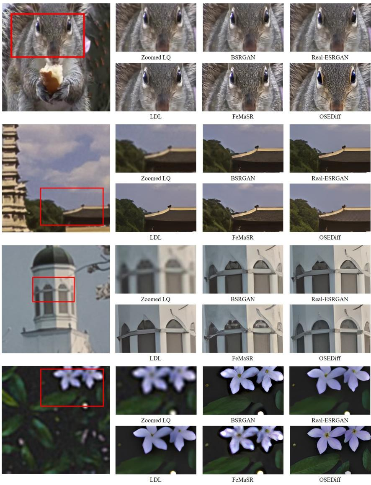
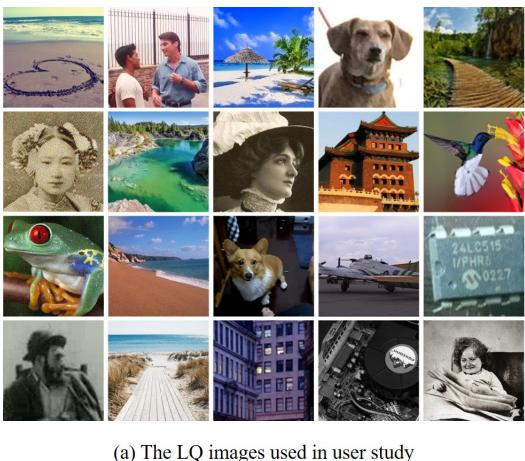
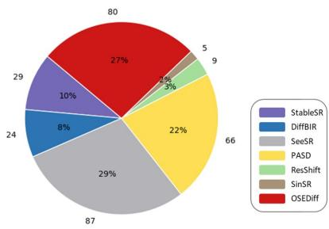
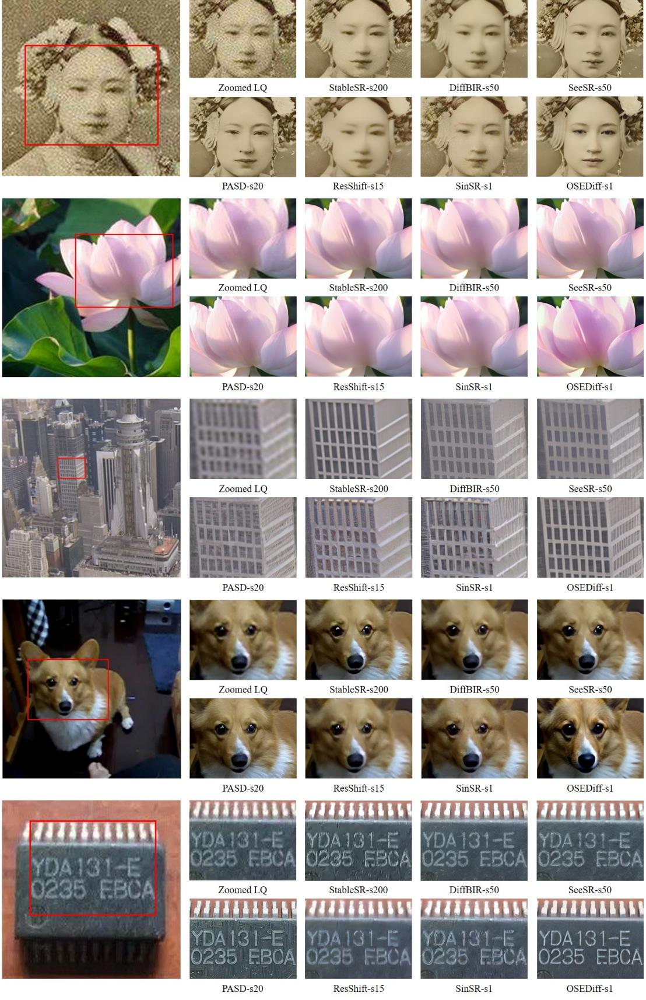

[← 返回 README](../README.md)

# Algorithm 1 Training Scheme of OSEDiff

## 📌 预览
Method 是核心：关注输入从 LQ 到 latent/feature 的路径、训练目标、控制变量以及与 teacher/先验的交互方式。

> 💡 **与 OSEDiff 主线的关系**: OSEDiff 将低质量图像直接作为扩散起点，用少量 LoRA/可训练层和 latent-space VSD 正则把 Stable Diffusion 的生成先验压缩到单步 Real-ISR 推理中。

---

Input: Training dataset $s$ , pretrained SD parameterized by $\phi$ including VAE encoder $E _ { \phi }$ , latent diffusion network $E _ { \phi }$ and VAE decoder $\epsilon _ { \phi }$ , prompt extractor $Y _ { \ l }$ , training iteration $N$   
1 Initialize $G _ { \theta }$ parameterized by $\theta$ , including $E _ { \theta }  E _ { \phi }$ with trainable LoRA $\epsilon _ { \theta } \gets \epsilon _ { \phi }$ with trainable LoRA $D _ { \theta }  D _ { \phi }$ b   
2 Initialize $\epsilon _ { \phi }  \epsilon _ { \theta }$ with trainable LoRA   
3 for $i \gets 1$ to $N$ do 4 Sample $\mathbf { \mathcal { x } } _ { L } , \mathbf { \mathcal { x } } _ { H }$ from $s$ $^ { \prime * }$ Network forward \*/ 5 $c _ { y } \gets Y ( { \pmb x } _ { L } )$ 6 $\pmb { z } _ { L } \gets E _ { \theta } ( \pmb { x } _ { L } )$ 7 $\hat { z } _ { H } \gets F _ { \theta } ( z _ { L } ; c _ { y } )$ 8 $\hat { \pmb { x } } _ { H } \gets D _ { \theta } ( \hat { \pmb { z } } _ { H } )$ $^ { \prime * }$ Compute data term objective \*/ 9 $\begin{array} { r } { \nabla _ { \theta } \mathcal { L } _ { \mathrm { d a t a } } \gets [ \mathcal { L } _ { \mathrm { M S E } } ( \hat { \pmb x } _ { H } , \pmb x _ { H } ) + \lambda _ { 1 } \mathcal { L } _ { \mathrm { L P I P S } } ( \hat { \pmb x } _ { H } , \pmb x _ { H } ) ] \frac { \partial \hat { \pmb x } _ { H } } { \partial \theta } } \end{array}$ $^ { \prime * }$ Compute regularization objective, following DMD[58] \*/   
10 Sample $\epsilon$ from $\sqrt { ( 0 , I ) }$   
11 Sample $t$ from $\{ 2 0 , \cdots , 9 8 0 \}$   
12 zˆt ← αtzˆH + σtϵ   
13 $z _ { \phi } \gets \mathrm { s t o p g r a d } ( F _ { \phi } \left( \hat { z } _ { t } ; c _ { y } \right) )$   
14 $z _ { \phi ^ { \prime } } \gets \mathrm { s t o p g r a d } ( F _ { \phi ^ { \prime } } \left( \hat { z } _ { t } ; c _ { y } \right) )$   
15 $\omega  1 / \mathrm { m e a n } ( \| z _ { \phi } - \hat { z } _ { H } \| )$   
16 $\begin{array} { r } { \nabla _ { \theta } \mathcal { L } _ { \mathrm { r e g } }  [ \omega ( { z } _ { \phi ^ { \prime } } - { z } _ { \phi } ) ] \frac { \partial \hat { { z } } _ { H } } { \partial \theta } } \end{array}$ $^ { \prime * }$ Compute regularizer funetuning objective \*/   
17 Sample $\epsilon$ from $\sqrt { ( 0 , I ) }$   
18 Sample $t$ from $\{ 1 , \cdots , T \}$   
19 $\boldsymbol { z } _ { t } \gets \boldsymbol { \alpha } _ { t }$ st $\mathrm { { o p g r a d } } ( \widehat { \pmb { z } } _ { H } ) + \sigma _ { t } \epsilon$   
20 $\mathcal { L } _ { \mathrm { d i f f } }  \mathcal { L } _ { \mathrm { M S E } } ( \epsilon _ { \phi ^ { \prime } } ( z _ { t } ; t , c _ { y } ) , \epsilon )$ $^ { \prime * }$ Network Parameter Update \*/   
21 Update $\theta$ with $\mathcal { L } _ { \mathrm { d a t a } } + \lambda _ { 2 } \mathcal { L } _ { \mathrm { r e g } }$   
22 Update $\phi ^ { \prime }$ with ${ \mathcal { L } } _ { \mathrm { d i f f } }$   
23 end Output: Generator $G _ { \theta }$ including VAE encoder $E _ { \theta }$ , latent diffusion network $E _ { \theta }$ and VAE decoder $\epsilon _ { \theta }$   
References   
[1] Stability.ai. https://stability.ai/stable-diffusion.   
[2] Eirikur Agustsson and Radu Timofte. Ntire 2017 challenge on single image super-resolution: Dataset and study. In Proceedings of the IEEE conference on computer vision and pattern recognition workshops, pages 126–135, 2017.   
[3] Jianrui Cai, Hui Zeng, Hongwei Yong, Zisheng Cao, and Lei Zhang. Toward real-world single image super-resolution: A new benchmark and a new model. In Proceedings of the IEEE/CVF International Conference on Computer Vision, pages 3086–3095, 2019.   
[4] Chaofeng Chen, Xinyu Shi, Yipeng Qin, Xiaoming Li, Xiaoguang Han, Tao Yang, and Shihui Guo. Real-world blind super-resolution via feature matching with implicit high-resolution priors. In Proceedings of the 30th ACM International Conference on Multimedia, pages 1329–1338, 2022.   
[5] Hanting Chen, Yunhe Wang, Tianyu Guo, Chang Xu, Yiping Deng, Zhenhua Liu, Siwei Ma, Chunjing Xu, Chao Xu, and Wen Gao. Pre-trained image processing transformer. In Proceedings of the IEEE/CVF conference on computer vision and pattern recognition, pages 12299–12310, 2021.   
[6] Xiangyu Chen, Xintao Wang, Jiantao Zhou, Yu Qiao, and Chao Dong. Activating more pixels in image super-resolution transformer. In Proceedings of the IEEE/CVF Conference on Computer Vision and Pattern Recognition, pages 22367–22377, 2023.   
[7] Zheng Chen, Yulun Zhang, Jinjin Gu, Linghe Kong, Xiaokang Yang, and Fisher Yu. Dual aggregation transformer for image super-resolution. In Proceedings of the IEEE/CVF International Conference on Computer Vision, pages 12312–12321, 2023.   
[8] Imre Csiszár. I-divergence geometry of probability distributions and minimization problems. The annals of probability, pages 146–158, 1975.   
[9] Tao Dai, Jianrui Cai, Yongbing Zhang, Shu-Tao Xia, and Lei Zhang. Second-order attention network for single image super-resolution. In Proceedings of the IEEE/CVF conference on computer vision and pattern recognition, pages 11065–11074, 2019.   
[10] Trung Dao, Thuan Hoang Nguyen, Thanh Le, Duc Vu, Khoi Nguyen, Cuong Pham, and Anh Tran. Swiftbrush v2: Make your one-step diffusion model better than its teacher. arXiv preprint arXiv:2408.14176, 2024.   
[11] Prafulla Dhariwal and Alexander Nichol. Diffusion models beat gans on image synthesis. Advances in neural information processing systems, 34:8780–8794, 2021.   
[12] Keyan Ding, Kede Ma, Shiqi Wang, and Eero P Simoncelli. Image quality assessment: Unifying structure and texture similarity. IEEE transactions on pattern analysis and machine intelligence, 44(5):2567–2581, 2020.   
[13] Chao Dong, Chen Change Loy, Kaiming He, and Xiaoou Tang. Learning a deep convolutional network for image super-resolution. In Computer Vision–ECCV 2014: 13th European Conference, Zurich, Switzerland, September 6-12, 2014, Proceedings, Part IV 13, pages 184–199. Springer, 2014.   
[14] Ian Goodfellow, Jean Pouget-Abadie, Mehdi Mirza, Bing Xu, David Warde-Farley, Sherjil Ozair, Aaron Courville, and Yoshua Bengio. Generative adversarial nets. Advances in neural information processing systems, 27, 2014.   
[15] Martin Heusel, Hubert Ramsauer, Thomas Unterthiner, Bernhard Nessler, and Sepp Hochreiter. Gans trained by a two time-scale update rule converge to a local nash equilibrium. Advances in neural information processing systems, 30, 2017.   
[16] Jonathan Ho, Ajay Jain, and Pieter Abbeel. Denoising diffusion probabilistic models. Advances in neural information processing systems, 33:6840–6851, 2020.   
[17] Edward J Hu, Yelong Shen, Phillip Wallis, Zeyuan Allen-Zhu, Yuanzhi Li, Shean Wang, Lu Wang, and Weizhu Chen. Lora: Low-rank adaptation of large language models. arXiv preprint arXiv:2106.09685, 2021.   
[18] Justin Johnson, Alexandre Alahi, and Li Fei-Fei. Perceptual losses for real-time style transfer and superresolution. In Computer Vision–ECCV 2016: 14th European Conference, Amsterdam, The Netherlands, October 11-14, 2016, Proceedings, Part II 14, pages 694–711. Springer, 2016.   
[19] Tero Karras, Samuli Laine, and Timo Aila. A style-based generator architecture for generative adversarial networks. In Proceedings of the IEEE/CVF conference on computer vision and pattern recognition, pages 4401–4410, 2019.   
[20] Bahjat Kawar, Michael Elad, Stefano Ermon, and Jiaming Song. Denoising diffusion restoration models. Advances in Neural Information Processing Systems, 35:23593–23606, 2022.   
[21] Bahjat Kawar, Gregory Vaksman, and Michael Elad. Snips: Solving noisy inverse problems stochastically. Advances in Neural Information Processing Systems, 34:21757–21769, 2021.   
[22] Junjie Ke, Qifei Wang, Yilin Wang, Peyman Milanfar, and Feng Yang. Musiq: Multi-scale image quality transformer. In Proceedings of the IEEE/CVF International Conference on Computer Vision, pages 5148–5157, 2021.   
[23] Alex Krizhevsky, Ilya Sutskever, and Geoffrey E Hinton. Imagenet classification with deep convolutional neural networks. Advances in neural information processing systems, 25, 2012.   
[24] Christian Ledig, Lucas Theis, Ferenc Huszár, Jose Caballero, Andrew Cunningham, Alejandro Acosta, Andrew Aitken, Alykhan Tejani, Johannes Totz, Zehan Wang, et al. Photo-realistic single image superresolution using a generative adversarial network. In Proceedings of the IEEE conference on computer vision and pattern recognition, pages 4681–4690, 2017.   
[25] Kyungmin Lee, Kihyuk Sohn, and Jinwoo Shin. Dreamflow: High-quality text-to-3d generation by approximating probability flow. arXiv preprint arXiv:2403.14966, 2024.   
[26] Yawei Li, Kai Zhang, Jingyun Liang, Jiezhang Cao, Ce Liu, Rui Gong, Yulun Zhang, Hao Tang, Yun Liu, Denis Demandolx, et al. Lsdir: A large scale dataset for image restoration. In Proceedings of the IEEE/CVF Conference on Computer Vision and Pattern Recognition, pages 1775–1787, 2023.   
[27] Jie Liang, Hui Zeng, and Lei Zhang. Details or artifacts: A locally discriminative learning approach to realistic image super-resolution. In Proceedings of the IEEE/CVF Conference on Computer Vision and Pattern Recognition, pages 5657–5666, 2022.   
[28] Jie Liang, Hui Zeng, and Lei Zhang. Efficient and degradation-adaptive network for real-world image super-resolution. In European Conference on Computer Vision, pages 574–591. Springer, 2022.   
[29] Jingyun Liang, Jiezhang Cao, Guolei Sun, Kai Zhang, Luc Van Gool, and Radu Timofte. Swinir: Image restoration using swin transformer. In Proceedings of the IEEE/CVF international conference on computer vision, pages 1833–1844, 2021.   
[30] Bee Lim, Sanghyun Son, Heewon Kim, Seungjun Nah, and Kyoung Mu Lee. Enhanced deep residual networks for single image super-resolution. In Proceedings of the IEEE conference on computer vision and pattern recognition workshops, pages 136–144, 2017.   
[31] Xinqi Lin, Jingwen He, Ziyan Chen, Zhaoyang Lyu, Ben Fei, Bo Dai, Wanli Ouyang, Yu Qiao, and Chao Dong. Diffbir: Towards blind image restoration with generative diffusion prior. arXiv preprint arXiv:2308.15070, 2023.   
[32] Haotian Liu, Chunyuan Li, Qingyang Wu, and Yong Jae Lee. Visual instruction tuning. Advances in neural information processing systems, 36, 2024.   
[33] Ilya Loshchilov and Frank Hutter. Decoupled weight decay regularization. arXiv preprint arXiv:1711.05101, 2017.   
[34] Simian Luo, Yiqin Tan, Suraj Patil, Daniel Gu, Patrick von Platen, Apolinário Passos, Longbo Huang, Jian Li, and Hang Zhao. Lcm-lora: A universal stable-diffusion acceleration module. arXiv preprint arXiv:2311.05556, 2023.   
[35] Gaurav Parmar, Taesung Park, Srinivasa Narasimhan, and Jun-Yan Zhu. One-step image translation with text-to-image models. arXiv preprint arXiv:2403.12036, 2024.   
[36] Robin Rombach, Andreas Blattmann, Dominik Lorenz, Patrick Esser, and Björn Ommer. High-resolution image synthesis with latent diffusion models. In Proceedings of the IEEE/CVF conference on computer vision and pattern recognition, pages 10684–10695, 2022.   
[37] Chitwan Saharia, William Chan, Saurabh Saxena, Lala Li, Jay Whang, Emily L Denton, Kamyar Ghasemipour, Raphael Gontijo Lopes, Burcu Karagol Ayan, Tim Salimans, et al. Photorealistic text-toimage diffusion models with deep language understanding. Advances in Neural Information Processing Systems, 35:36479–36494, 2022.   
[38] Karen Simonyan and Andrew Zisserman. Very deep convolutional networks for large-scale image recognition. arXiv preprint arXiv:1409.1556, 2014.   
[39] Yang Song, Jascha Sohl-Dickstein, Diederik P Kingma, Abhishek Kumar, Stefano Ermon, and Ben Poole. Score-based generative modeling through stochastic differential equations. arXiv preprint arXiv:2011.13456, 2020.   
[40] Lingchen Sun, Rongyuan Wu, Zhengqiang Zhang, Hongwei Yong, and Lei Zhang. Improving the stability of diffusion models for content consistent super-resolution. arXiv preprint arXiv:2401.00877, 2023.   
[41] Jianyi Wang, Kelvin CK Chan, and Chen Change Loy. Exploring clip for assessing the look and feel of images. In Proceedings of the AAAI Conference on Artificial Intelligence, volume 37, pages 2555–2563, 2023.   
[42] Jianyi Wang, Zongsheng Yue, Shangchen Zhou, Kelvin CK Chan, and Chen Change Loy. Exploiting diffusion prior for real-world image super-resolution. International Journal of Computer Vision, pages 1–21, 2024.   
[43] Peihao Wang, Dejia Xu, Zhiwen Fan, Dilin Wang, Sreyas Mohan, Forrest Iandola, Rakesh Ranjan, Yilei Li, Qiang Liu, Zhangyang Wang, et al. Taming mode collapse in score distillation for text-to-3d generation. arXiv preprint arXiv:2401.00909, 2023.   
[44] Xintao Wang, Yu Li, Honglun Zhang, and Ying Shan. Towards real-world blind face restoration with generative facial prior. In Proceedings of the IEEE/CVF conference on computer vision and pattern recognition, pages 9168–9178, 2021.   
[45] Xintao Wang, Liangbin Xie, Chao Dong, and Ying Shan. Real-esrgan: Training real-world blind superresolution with pure synthetic data. In Proceedings of the IEEE/CVF international conference on computer vision, pages 1905–1914, 2021.   
[46] Xintao Wang, Ke Yu, Shixiang Wu, Jinjin Gu, Yihao Liu, Chao Dong, Yu Qiao, and Chen Change Loy. Esrgan: Enhanced super-resolution generative adversarial networks. In Proceedings of the European conference on computer vision (ECCV) workshops, pages 0–0, 2018.   
[47] Yinhuai Wang, Jiwen Yu, and Jian Zhang. Zero-shot image restoration using denoising diffusion null-space model. arXiv preprint arXiv:2212.00490, 2022.   
[48] Yufei Wang, Wenhan Yang, Xinyuan Chen, Yaohui Wang, Lanqing Guo, Lap-Pui Chau, Ziwei Liu, Yu Qiao, Alex C Kot, and Bihan Wen. Sinsr: Diffusion-based image super-resolution in a single step. arXiv preprint arXiv:2311.14760, 2023.   
[49] Zhengyi Wang, Cheng Lu, Yikai Wang, Fan Bao, Chongxuan Li, Hang Su, and Jun Zhu. Prolificdreamer: High-fidelity and diverse text-to-3d generation with variational score distillation. Advances in Neural Information Processing Systems, 36, 2024.   
[50] Zhou Wang, Alan C Bovik, Hamid R Sheikh, and Eero P Simoncelli. Image quality assessment: from error visibility to structural similarity. IEEE transactions on image processing, 13(4):600–612, 2004.   
[51] Pengxu Wei, Ziwei Xie, Hannan Lu, Zongyuan Zhan, Qixiang Ye, Wangmeng Zuo, and Liang Lin. Component divide-and-conquer for real-world image super-resolution. In Computer Vision–ECCV 2020: 16th European Conference, Glasgow, UK, August 23–28, 2020, Proceedings, Part VIII 16, pages 101–117. Springer, 2020.   
[52] Rongyuan Wu, Tao Yang, Lingchen Sun, Zhengqiang Zhang, Shuai Li, and Lei Zhang. Seesr: Towards semantics-aware real-world image super-resolution. arXiv preprint arXiv:2311.16518, 2023.   
[53] Liangbin Xie, Xintao Wang, Xiangyu Chen, Gen Li, Ying Shan, Jiantao Zhou, and Chao Dong. Desra: Detect and delete the artifacts of gan-based real-world super-resolution models. 2023.   
[54] Jianchao Yang, John Wright, Thomas S Huang, and Yi Ma. Image super-resolution via sparse representation. IEEE transactions on image processing, 19(11):2861–2873, 2010.   
[55] Sidi Yang, Tianhe Wu, Shuwei Shi, Shanshan Lao, Yuan Gong, Mingdeng Cao, Jiahao Wang, and Yujiu Yang. Maniqa: Multi-dimension attention network for no-reference image quality assessment. In Proceedings of the IEEE/CVF Conference on Computer Vision and Pattern Recognition, pages 1191–1200, 2022.   
[56] Tao Yang, Peiran Ren, Xuansong Xie, and Lei Zhang. Gan prior embedded network for blind face restoration in the wild. In Proceedings of the IEEE/CVF conference on computer vision and pattern recognition, pages 672–681, 2021.   
[57] Tao Yang, Peiran Ren, Xuansong Xie, and Lei Zhang. Pixel-aware stable diffusion for realistic image super-resolution and personalized stylization. arXiv preprint arXiv:2308.14469, 2023.   
[58] Tianwei Yin, Michaël Gharbi, Richard Zhang, Eli Shechtman, Fredo Durand, William T Freeman, and Taesung Park. One-step diffusion with distribution matching distillation. In Proceedings of the IEEE/CVF Conference on Computer Vision and Pattern Recognition, pages 6613–6623, 2024.   
[59] Fanghua Yu, Jinjin Gu, Zheyuan Li, Jinfan Hu, Xiangtao Kong, Xintao Wang, Jingwen He, Yu Qiao, and Chao Dong. Scaling up to excellence: Practicing model scaling for photo-realistic image restoration in the wild. arXiv preprint arXiv:2401.13627, 2024.   
[60] Zongsheng Yue, Jianyi Wang, and Chen Change Loy. Resshift: Efficient diffusion model for image super-resolution by residual shifting. arXiv preprint arXiv:2307.12348, 2023.   
[61] Kai Zhang, Jingyun Liang, Luc Van Gool, and Radu Timofte. Designing a practical degradation model for deep blind image super-resolution. In Proceedings of the IEEE/CVF International Conference on Computer Vision, pages 4791–4800, 2021.   
[62] Lin Zhang, Lei Zhang, and Alan C Bovik. A feature-enriched completely blind image quality evaluator. IEEE Transactions on Image Processing, 24(8):2579–2591, 2015.   
[63] Lvmin Zhang, Anyi Rao, and Maneesh Agrawala. Adding conditional control to text-to-image diffusion models. In Proceedings of the IEEE/CVF International Conference on Computer Vision, pages 3836–3847, 2023.   
[64] Richard Zhang, Phillip Isola, Alexei A Efros, Eli Shechtman, and Oliver Wang. The unreasonable effectiveness of deep features as a perceptual metric. In Proceedings of the IEEE conference on computer vision and pattern recognition, pages 586–595, 2018.   
[65] Xindong Zhang, Hui Zeng, Shi Guo, and Lei Zhang. Efficient long-range attention network for image super-resolution. In European Conference on Computer Vision, pages 649–667. Springer, 2022.   
[66] Yulun Zhang, Kunpeng Li, Kai Li, Lichen Wang, Bineng Zhong, and Yun Fu. Image super-resolution using very deep residual channel attention networks. In Proceedings of the European conference on computer vision (ECCV), pages 286–301, 2018.   
[67] Yulun Zhang, Yapeng Tian, Yu Kong, Bineng Zhong, and Yun Fu. Residual dense network for image super-resolution. In Proceedings of the IEEE conference on computer vision and pattern recognition, pages 2472–2481, 2018.

> 💡 **批注**: 这里的关键词是单步推理：作者试图把原本多次 denoising 的生成先验压缩到一次前向中。

*Figure 5: Figure 5: Qualitative comparisons between OSEDiff and GAN-based Real-ISR methods. Please zoom in for a better view.*

> 💡 **Figure 5 批读**: 这张图通常承担方法动机、框架或视觉对比的作用。阅读时重点看它证明的是质量、速度还是可控性，而不是只看视觉效果。

*Figure 6: Figure 6: The LQ images used in user study and the voting results.*

> 💡 **Figure 6 批读**: 这张图通常承担方法动机、框架或视觉对比的作用。阅读时重点看它证明的是质量、速度还是可控性，而不是只看视觉效果。

*Figure 7: (b) The voting results are from 15 volunteers. The corresponding percentages and numerical counts are displayed with the pie chart.*

> 💡 **Figure 7 批读**: 这张图通常承担方法动机、框架或视觉对比的作用。阅读时重点看它证明的是质量、速度还是可控性，而不是只看视觉效果。

(b) The voting results are from 15 volunteers. The corresponding percentages and numerical counts are displayed with the pie chart.

*Figure 7: Figure 7: More visulization comparisons of different DM-based Real-ISR methods. Please zoom in for a better view.*

> 💡 **Figure 7 批读**: 这张图通常承担方法动机、框架或视觉对比的作用。阅读时重点看它证明的是质量、速度还是可控性，而不是只看视觉效果。

---

## 🔖 Section 总结

### 核心洞察

1. 明确输入、输出、teacher/student 或控制变量。
2. 把每个 loss/模块对应到 fidelity、realism、speed 或 controllability。
3. 关注哪些组件是训练时使用，哪些是推理时仍有成本。

### 关键数字速查

| 指标 | 数值 |
|------|------|
| Inference steps | 1 |
| Inference time | 0.11s on A100 for 512×512 input |
| Trainable parameters | 8.5M |
| Speedup claim | over 100× faster than StableSR in paper comparison |
