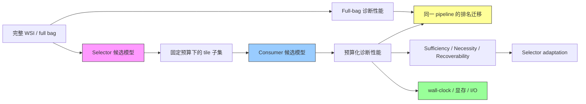

# ReadySlideBenchmark

病理基础模型的 **Selector–Consumer–Budget 角色解耦 benchmark**。本主题不再只问“哪个 pathology FM 的 full-bag 诊断分数最高”，而是系统追问：哪个模型更会选、选出的证据给谁消费、预算改变时排序是否翻转，以及选择收益能否转化为真实计算节省。

## 一句话定位

这五篇论文分别提供五块拼图：**From Patches to Patients** 提供排行榜迁移的 benchmark 叙事，**EAGLE** 提供 CHIEF→Virchow2 跨模型系统实例，**FOCI** 界定 frozen-consumer selection headroom，**ReaMIL** 提供同模型轻量 selector adaptation，**GCE-MIL** 把 evidence failure 拆成 Sufficiency、Necessity、Recoverability 并据此设计修复组件。

## 论文清单

| 论文 | 状态 | 在本主题中的角色 | 对 ReadySlide 的直接约束 |
|---|---|---|---|
| [From Patches to Patients](./%5BMICCAI%202026%5D%20From-Patches-to-Patients/) | MICCAI 2026 | benchmark-first：低成本榜能否预测高成本榜 | 排名迁移必须保持同一候选对象，并报告 Pearson、Spearman、Kendall 与 top-k overlap |
| [EAGLE](./%5BNat%20Commun%202026%5D%20EAGLE/) | Nature Communications 2026 | CHIEF selector→Virchow2 consumer 的固定跨-FM 配对 | “不同 FM 分别选择与诊断”已有直接前作，但角色互换与全交叉矩阵未做 |
| [FOCI](./%5BArxiv%202026%5D%20FOCI/) | arXiv 2026 | frozen consumer 上的 selection headroom 与 SRP | “冻结 WSI-MIL + 轻量 selector + keep/drop + MSK/AUKC”不再是安全首创点 |
| [ReaMIL](./%5BWACV%20Workshop%202026%5D%20ReaMIL/) | WACV 2026 LFMBio Workshop Oral | evidence-aware selector adaptation | sufficiency/exclusion/contiguity/budget 提供直接训练路线，但只测单 FM+consumer |
| [GCE-MIL](./%5BArxiv%202026%5D%20GCE-MIL/) | arXiv 2026 | S/N/R evidence failure taxonomy 与可恢复证据 | attention 不等于可干预证据已有系统诊断；跨 consumer selector transfer 仍未覆盖 |

## 推荐阅读顺序

### 先确定文章定位

1. **From Patches to Patients**：先学会把“排行榜能否迁移”写成独立 benchmark 问题。
2. **EAGLE**：看一个成功的跨模型 selector→consumer 系统，以及端到端效率口径。
3. **FOCI**：识别最接近的 scientific claim 与 selection-headroom 边界。
4. **ReaMIL**：理解同模型 selector repair 的最直接实现。
5. **GCE-MIL**：学习如何从失败分类自然推导目标与模块。

### 快速 novelty 审计

FOCI → GCE-MIL → ReaMIL → EAGLE → From Patches to Patients。

## 五篇论文如何拼成同一个问题

| 拼图 | 已提供的工具 | 尚未回答的问题 |
|---|---|---|
| 排名迁移 | tile→slide 的相关、敏感性与 shortlist overlap | full-bag→budgeted 时，同一组 encoder–consumer pipeline 是否保序？ |
| 跨模型实例 | CHIEF→Virchow2，固定 25 tile | 哪个 FM 更适合 selector？角色互换会怎样？ |
| 选择余量 | frozen consumer、SRP、MSK/Reach/AUKC/SHI | Oracle 上界、learned gap 与跨 consumer 迁移 |
| selector 修复 | full/keep/drop、Gumbel gate、预算与空间约束 | consumer 严格冻结时的纯 selector repair 是否稳定？ |
| evidence 机制 | Sufficiency、Necessity、Recoverability | 多个等价充分集合、consumer/预算依赖与临床因果性 |

## ReadySlideBenchmark 的核心实验设计

### 1. 原始角色交叉矩阵

对每个任务、数据集和预算 $b$，完整评估 `Selector s × Consumer c × Budget b`。

- Selector：FM 原生 attention/score、外部 FM、轻量 learned head、随机、启发式和可行的 Oracle 上界。
- Consumer：MeanPool/ABMIL 等控制项，以及 UNI2、Virchow2、CONCH 等病理 FM 管线。
- Budget：绝对 tile 数、保留比例、昂贵 consumer 编码 FLOPs、wall-clock 和 I/O；不能只报单一 $K$。

### 2. 两类排名问题必须分开

**A. Full-bag → budgeted pipeline 排名迁移**  
固定 selector 规则和预算，比较**同一组 encoder–consumer pipelines**在 full-bag 与 budgeted 条件下的排名；报告 Pearson、Spearman、Kendall、top-k overlap、leave-one-model-out 与患者级 paired bootstrap。

**B. Selector 的预算稳定性**  
固定 encoder 与 consumer，在不同**非退化预算**之间比较同一组 selector 的排名；同时报告相对 full-bag 的 performance retention 或 regret。不能把 full-bag 端称为“selector 排名”，因为 $K=|bag|$ 时不同 selector 会退化为同一选择并产生大量并列。

### 3. 证据干预指标

| 目标 | 最低报告集 | 来源 |
|---|---|---|
| Sufficiency | keep-only performance、MSK、Reach、partial/full AUKC | FOCI、ReaMIL、GCE-MIL |
| Necessity | drop/deletion 后真类性能或置信度下降 | FOCI、ReaMIL、GCE-MIL |
| Recoverability | 连续 gate→离散 top-K 后性能是否保留 | GCE-MIL |
| Headroom | native/proxy→learned 与 learned→Oracle 两段 gap | FOCI 提供前段，ReadySlide 补后段 |
| 选择质量 | 随机负对照、固定预算性能、置信区间 | EAGLE |
| 机制边界 | 多灶/弥漫/长程任务、域偏移、混杂分层 | 五篇共同未充分覆盖 |

### 4. 真实部署收益

至少拆分并统一计入：tile 生成、粗特征提取、selector、昂贵 consumer 编码、聚合、缓存/磁盘 I/O、峰值显存和总 wall-clock。EAGLE 的 2.27 s/slide 是当前最可复用的成本分解范例；只报告“保留了多少 tile”不足以证明部署收益。

## Novelty 审计

### 已不安全的说法

- “首次发现强诊断模型不一定拥有可靠 attention/evidence selection”。
- “首次冻结已有 WSI-MIL 并额外训练轻量 selector head”。
- “首次用最小充分 patch 数、keep/drop 或 deletion intervention 衡量选择质量”。
- “首次使用不同病理模型分别完成选择和诊断”。
- “首次把 evidence failure 拆成充分性、必要性和离散可恢复性”。

### 仍有区分度的空白

1. **跨 FM 角色全交叉**：完整 selector×consumer×budget 矩阵，而不是一个固定配对或每个 consumer 重训一个 selector。
2. **排名错配机制**：同一 pipeline 的 full-bag diagnostic ranking 是否迁移到固定 selector/预算下的 budgeted ranking。
3. **consumer 与预算依赖**：同一 selector 是否跨 consumer 可用，以及预算变化何时引发排名翻转。
4. **严格 frozen-consumer repair**：保持 full-bag diagnostic boundary 不变，只修 selector，并区分专用 selector 与可迁移 selector。
5. **部署闭环**：把 selection utility 转换为统一口径的真实计算、存储与延迟节省。

## 建议的文章贡献顺序

1. 跨病理 FM 的 Selector–Consumer–Budget 角色交叉 benchmark。
2. full-bag→budgeted 排名错配、consumer 依赖和失败来源的机制分析。
3. 由 benchmark 发现驱动、严格保持诊断能力的同模型 selector adaptation。
4. 将 selection utility 转化为端到端计算节省的部署验证。

## 统一阅读问题

1. 每篇论文究竟冻结了什么：tile encoder、MIL consumer、分类头，还是全部诊断管线？
2. selector 的监督来自真标签、consumer logit、外部 FM、语义原型还是 Oracle？
3. 预算定义在原始 tiles、候选池、昂贵 FM 调用、存储还是人工审阅哪一层？
4. keep-only 足够是否同时伴随 drop/deletion 的必要性？
5. 软 gate 的收益在 hard top-K 部署时是否可恢复？
6. 排名相关是否建立在同一候选对象上，是否能支持 shortlist 决策而非只看全局相关？
7. 选择收益是否跨 consumer、任务、中心、scanner、病灶稀疏度和预算保持？

---

*本主题核验日期：2026-08-19。批读以 arXiv/Nature 原文、MinerU 解析和 Semantic Scholar 可取得数据为依据。*
