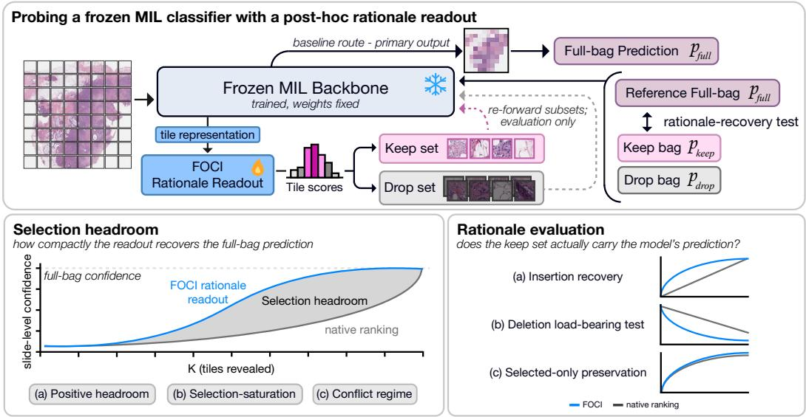
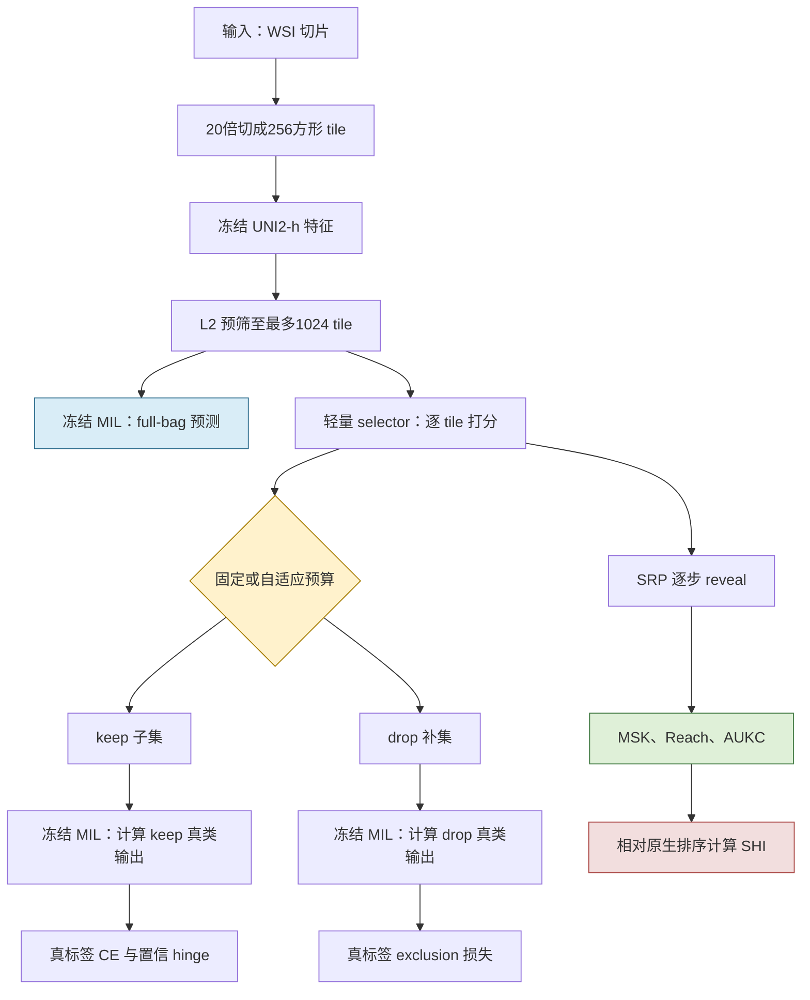

# FOCI：冻结 WSI-MIL 的 Tile Selection Headroom 审计

**论文原题**：Are Compact Rationales Free? Measuring Tile Selection Headroom in Frozen WSI-MIL 
**作者**：Hyun Do Jung、Jungwon Choi、Soojung Choi、Yujin Oh、Hwiyoung Kim 
**发表状态**：arXiv 预印本（v1）｜**年份**：2026 
**arXiv**：[2605.12575](https://arxiv.org/abs/2605.12575)｜[PDF](https://arxiv.org/pdf/2605.12575) 
**任务**：冻结 WSI-MIL 的事后 tile rationale 选择与审计 
**代码**：论文与 arXiv 页面未提供可核验代码链接 

*Figure 1：冻结 MIL 保持原有 full-bag 诊断路径；FOCI 的主协议寻找能让同一 consumer 正确且高置信支持真标签 $y$ 的紧凑 tile 子集。*

> 💡 **claude 批注｜总览图的关键信息**：主诊断路径不经过 FOCI，full-bag CE 也是无 selector 梯度的监控项；selector 的主训练用真标签 $y$ 定义 keep CE/hinge 与 drop exclusion，主 SRP/MSK 同样要求预测为 $y$ 且 $p_y\ge\kappa$。因此它不是 full-bag prediction-fidelity 训练：即使 full bag 误分类，某个子集仍可能在主协议下支持真类。Appendix N 才把评估目标改为 frozen full-bag 的 predicted class $\hat y$，但 selector 训练仍然使用真标签。

## 一句话总结

FOCI 用约 13 万参数的轻量 selector 在完全冻结的 WSI-MIL 上学习真标签导向的 keep/drop 排序，并用 SRP 证明紧凑 rationale 并非“免费”；ReadySlide 若沿用该范式，应分别测 native→learned、learned→consumer-optimal combinatorial Oracle，以及与临床区域标注的对齐，三者不得合并成单一指标。

## 核心贡献

1. 把 WSI rationale 从“attention 看起来集中吗”改写为真标签导向的干预问题：前 K 个 tile 能否让同一个冻结 MIL 预测为 $y$ 且 $p_y\ge\kappa$，补集的真类概率能否被压到 exclusion 阈值以下；full-bag 输出只作冻结路径监控。
2. 提出 FOCI-Soft 与 FOCI-STE 两种读出参数化；FOCI-STE 在前向严格 top-K、反向走 sigmoid surrogate，缩小连续 gate 训练与 hard reveal 测试的预算错位。
3. 提出插入式 Sequential Reveal Protocol（SRP），联合报告 MSK、Reach、AUKC；再以 SHI 表示 learned selector 相对 backbone 原生/代理排序的压缩比例。
4. 在 3 个 WSI 二分类数据集、7 个 MIL backbone 上识别三类区间：正 headroom、近最小排序饱和、与 hard selection 的架构冲突。
5. 用 deletion 与 selected-only AUC 做互补干预，明确区分“少量 tile 足够”“删除后影响大”和“仅看所选 tile 仍保持下游 AUC”三种问题。

## 📖 批读导航

| 分节 | 内容 |
|---|---|
| [00｜摘要](sections/00-abstract.md) | 问题、方法、主要数字与模型充分/临床充分边界 |
| [01｜引言](sections/01-introduction.md) | selection headroom、SRP 动机与对 ReadySlide 首创性的约束 |
| [02｜相关工作](sections/02-related-work.md) | WSI-MIL、解释忠实性、rationalization 与 ReaMIL 的边界 |
| [03｜方法](sections/03-method.md) | 冻结 consumer、keep/drop 三视图、损失、MSK/Reach/AUKC/SHI |
| [04｜实验](sections/04-experiments.md) | 3 数据集×7 backbone、headroom/saturation/conflict 与三种干预 |
| [05｜结论](sections/05-conclusion.md) | 模型审计结论、临床外推限制与 ReadySlide 启示 |
| [06｜参考文献与附录](sections/06-appendix.md) | References、A–N 全部附录、预算敏感性、完整表格、STE 与设置 |

## 关键数字

| 项目 | 数值 | 如何解读 |
|---|---:|---|
| 数据集 | 3 | TCGA-NSCLC 1,043；TCGA-BRCA 1,126；PANDA 10,615 张 slide |
| MIL backbone | 7 | TransMIL、ABMIL、CLAM-SB、AttriMIL、ACMIL、ASMIL、MHIM-MIL |
| tile 特征 | UNI2-h，1,536 维 | 20×、256×256 patch；encoder 全程冻结 |
| FOCI-STE selector | 132,609 参数 | 约 13 万，低于主 TransMIL pipeline 的 1% |
| 候选池上限 | 1,024 tile | 先按 feature L2 范数预筛；这是被正文 headline 容易隐藏的第一层选择 |
| 训练选择预算 | K=32 | FOCI-STE 每次前向严格选 32 个 tile |
| 主 SRP 上限与阈值 | $K_{max}=256$；κ=0.9 | MSK 只在达到阈值的 slide 上定义，必须与 Reach 同报 |
| TransMIL MSK 降幅 | 32–56% | 只相对其 CLS-dot-product proxy，不是相对 consumer-optimal combinatorial Oracle |
| TransMIL 配对检验 | p=0.008 | 9 个 dataset×seed 观测的 MSK；AUKC p=0.13，未显著 |
| 最高平均 SHI | ACMIL +0.465 | TransMIL +0.412；SHI 正负强依赖 backbone 与数据集 |
| BRCA selected-only AUC | full 0.907；adaptive FOCI 0.907；随机 K=32 为 0.881 | 唯一呈现清楚 learned-over-random operating margin 的主表案例 |
| 联合训练 pilot | 两轮内验证 AUC 下降超过 15 点 | 仅 NSCLC/TransMIL pilot，支持本文冻结选择，不足以否定所有 joint 方法 |

## 数据流：输入 → 中间表示 → 输出

> 💡 **claude 批注｜预算不能只写一个 K**：流程中至少有三层预算：原始 WSI 的 tile 总数、L2 预筛后的候选池 $n_{cap}$、selector/SRP 的 reveal K。FOCI 的主 MSK 是候选池内、相对于真标签 $y$ 与指定 frozen consumer 的充分 K；它不是从整张 WSI 原始 tile 空间求得的全局最小集，也不是 full-bag predicted-class fidelity 指标。

## 优缺点与还能做什么

### 优点

- 冻结同一个 consumer 后用真标签 $y$ 计算 keep/drop 损失，锁定被干预函数并避免 selector 训练同时改写诊断边界；这测的是 label-directed sufficiency，与 full-bag decision fidelity 是不同目标。
- MSK、Reach、AUKC 联合暴露阈值达不到、条件均值偏差和整条曲线差异；比只报 top-K AUC 更完整。
- 结果不回避失败：ABMIL/CLAM-SB 在 BRCA 饱和，ASMIL/MHIM-MIL 常与外部 selector 冲突。
- 把标准 full-bag 推理成本与离线 SRP 重复前向成本分开报告，部署与审计口径清楚。

### 局限与风险

- **没有 consumer-optimal combinatorial Oracle**：SHI 只比较 learned FOCI 与 native/proxy ranking，没有在固定 consumer、候选池、目标类、阈值和可行子集空间下求最小 K，因而无法量化 learned→consumer-optimal gap。
- **没有 clinical/annotation reference 评估**：tumor mask、region annotation 或 reader 标注只应用于衡量定位对齐与临床覆盖；它们不必保存 consumer 的判别证据，不能充当 selector performance upper bound。
- **consumer 依赖未测试**：selector 的训练目标由真标签 $y$ 与特定 frozen MIL 对 keep/drop bag 的响应共同构成；论文没有训练于 consumer A、评估于 consumer B 的交叉矩阵。
- **TransMIL 基线是 proxy**：CLS-dot-product 不是 native attention，因而 TransMIL 的正 SHI 不能当作排名无关的架构属性。
- **预算有预筛混杂**：先按 L2 范数保留最多 1,024 tile，可能已丢掉 consumer-optimal 可行子集或临床参考区域；论文只做 $n_{cap}$ 敏感性，没有候选 recall。
- **临床充分性没有建立**：只有 2 张 slide 的非盲定性展示，无 tumor annotation、外部队列或多 reader 研究。
- **任务范围较窄**：同一 UNI2-h、三个二分类任务；尚无 multiclass、跨 encoder 或跨医院验证。

### ReadySlide 可直接复用的协议

| 协议组件 | FOCI 已做 | ReadySlide 应如何扩展 |
|---|---|---|
| 冻结 consumer | selector 训练时 encoder 与 MIL 均冻结 | 保留 frozen track，并单列 joint-adaptation track |
| selection headroom | native/proxy vs learned 的 SHI | 报告 native→learned gap；另增 learned→consumer-optimal gap，二者不要混写 |
| 最小充分 tile | κ=0.9 的 $\mathrm{MSK}_{cond}$ + Reach | 报分位数、未达阈值惩罚值、绝对 K 与相对覆盖率 |
| keep/drop intervention | keep 预测真类并达到阈值，drop 压低真类 | 增加 keep-only、drop-only、随机等预算对照与多次采样置信区间 |
| 预算定义 | $n_{cap}=1024$；训练 K=32；SRP $K_{max}=256$ | 同时核算候选生成、存储、传输、consumer 前向与人工审阅成本 |
| consumer 依赖 | 在同一冻结 backbone 内计算真标签导向损失 | 做 selector×consumer 全交叉矩阵，区分专用与可迁移 selector |
| consumer-optimal combinatorial Oracle | 未测试 | 固定 consumer、候选池、目标类、阈值与可行子集空间，组合搜索最小 K；这是同 consumer selector 的性能上界、MSK 下界 |
| clinical/annotation reference | 未测试 | 用 tumor mask、区域/reader 标注评估定位 recall、precision、IoU 或临床覆盖；它不是 consumer selection 的性能上界 |

### 三条不可混合的评估轴

- **native→learned gap**：固定主协议的真标签目标、consumer、候选池、$\kappa$ 与 $K_{max}$，比较 native/proxy ranking 与 learned selector 的 MSK；FOCI 的 SHI 只覆盖这一条。
- **learned→consumer-optimal gap**：定义 $K^*_{cons}=\min_{S\subseteq X_{cand}}|S|$，约束同一 frozen consumer 在 $S$ 上预测 $y$ 且 $p_y(S)\ge\kappa$；还必须声明允许的子集空间及不可达处理。$K^*_{cons}$ 是同 consumer、同 true-label 协议下 selection performance 的上界（MSK 的下界），不是临床标注。
- **clinical alignment**：以 tumor mask、region annotation 或 reader 标注衡量 selector 的定位 precision/recall、IoU、组织学覆盖或审阅价值。标注区域不必让 consumer 保持真类/预测类输出，因此只是临床参考轴，不是 learned selector 的 performance upper bound。

> 💡 **claude 批注｜首创性判断**：FOCI 已在 2026 年明确提出“冻结 WSI-MIL + 轻量 selector head + 真标签导向 keep/drop 训练 + insertion SRP + 相对原生排序的 headroom”。ReadySlide 的可信新意应是同时补齐 learned→consumer-optimal gap、跨 consumer 可移植性、真实多层预算与 clinical alignment，而不是重复诊断—选择解耦本身。

## 阅读 Q&A 记录

- **Q：FOCI 的“sufficient”是否等于 pathologist 看这些 tile 就足以诊断？** 
  **A**：不是。主协议定义的是相对于 frozen consumer 与真标签 $y$ 的 label-directed sufficiency；Appendix N 另报 predicted-class view。两者都不是临床充分性，Appendix A/M 也明确没有系统 reader study 或标注验证。

- **Q：full-bag AUC 为什么能保持？** 
  **A**：主推理绕过 selector，encoder 与 MIL 都冻结。Appendix B 在 7×3×3 配置上验证 logits/AUC 到四位小数等价；这不能替代 selected-only 评估。

- **Q：最小充分 tile 数到底怎么求？** 
  **A**：主协议按 selector 分数逐步 reveal，在 K≤256 内首次同时满足预测类别为真标签 $y$ 且 $p_y\ge0.9$ 的 K；$\mathrm{MSK}_{cond}$ 只对达到阈值的 slide 求均值，所以必须同时看 Reach。判定条件不包含 full-bag predicted class，误分类 full bag 也可能存在支持 $y$ 的子集。

- **Q：SHI 是否包含 learned→consumer-optimal gap？** 
  **A**：不是。它是 $(\mathrm{MSK}_{base}-\mathrm{MSK}_{FOCI})/\mathrm{MSK}_{base}$，只给 native→learned gap。consumer-optimal combinatorial Oracle 必须在固定 consumer、候选池、目标 $y$、阈值和可行子集空间内最小化 K，才能给 learned→consumer-optimal gap；tumor/region annotation 则只给 clinical alignment，不能与此前两项合并。

- **Q：为什么 FOCI 在 attention pooling 或 hard-selection backbone 上会变差？** 
  **A**：BRCA 的 ABMIL/CLAM-SB 原生 MSK 已约 1.1，几乎无压缩空间；ASMIL/MHIM-MIL 自带 hard selection，外部 selector 改变实例组合后会与内生机制冲突。Table 1 与 Appendix H 给出正、饱和、负三类区间。

- **Q：keep/drop 是否足以保证因果忠实？** 
  **A**：不足。它验证相对于一个 frozen consumer 的干预充分/排除，但冗余证据可产生多个充分子集，masking 也可能造成分布移位；因此论文再用 deletion 与 selected-only AUC 三角验证，但三者没有统一赢家。

- **Q：FOCI 的 selector 能否换一个 MIL consumer 继续用？** 
  **A**：正文没有测试。训练标签是 $y$，但 keep CE/hinge 与 drop exclusion 的梯度要通过当前 frozen consumer 的响应传回 selector，因此排序仍可能高度 consumer-dependent；这是 ReadySlide 最值得单独设榜的缺口。

- **Q：主协议的 target 是真标签 $y$ 还是 full-bag predicted class $\hat y$？** 
  **A**：不是。主训练和主 SRP/MSK 都是 true-label-directed；full-bag CE/输出只作无梯度保持监控。Appendix N 才在评估时把目标换成 full-bag predicted class $\hat y$，且没有用 $\hat y$ 重新训练 selector。

- **Q：为什么 FOCI-STE 比 FOCI-Soft 好？** 
  **A**：Appendix G.4/J 表明 Soft 训练用连续非零 gate、SRP 测 hard top-K，存在 cardinality mismatch；STE 前向严格 K=32，MSK 从 8.03 降到 3.21，但 Reach 仍有小幅代价。

## 📊 Citation Landscape

**官方 API 查询时间**：2026-08-19 09:31:26–09:39:14 UTC。

- Graph detail 以 `ArXiv:2605.12575` 查询返回 429；随后用 bulk search 取得 paperId `cee2c41e822ebf0e99faefd1a0bd7444afd1b413`，再以 paperId 重试 detail，仍返回 429；09:39:14 UTC 通过标准 search 端点再次请求 TLDR，仍为 429。
- references 端点于 09:31:36 UTC 成功返回 40 条记录；recommendations 端点于 09:31:46 UTC 成功返回推荐序列。
- bulk search 于 09:36:14 UTC 成功返回本文三项计数。下列数字均直接来自 Semantic Scholar 官方 API；未用正文编号或第三方缓存补数。

| Semantic Scholar 字段 | API 返回值 |
|---|---:|
| paperId | `cee2c41e822ebf0e99faefd1a0bd7444afd1b413` |
| referenceCount | 40 |
| citationCount | 0 |
| influentialCitationCount | 0 |
| TLDR | detail 端点以 ArXiv ID 与 paperId 查询均为 429，未取得；不以论文摘要冒充 Semantic Scholar TLDR |

### 参考文献主题分组

以下各组均按 references API 的 `citationCount` 降序列出 Top 5；计数是 2026-08-19 查询时快照。

#### WSI-MIL 与弱监督病理

| 论文 | 年份 | citationCount |
|---|---:|---:|
| [Attention-based Deep Multiple Instance Learning](https://www.semanticscholar.org/paper/57fbd1841a7cf8582682da399d2811655f020c0a) | 2018 | 2,764 |
| [Clinical-grade computational pathology using weakly supervised deep learning on whole slide images](https://www.semanticscholar.org/paper/addae423490bbe82da4fb2fc265237178686b4e8) | 2019 | 2,654 |
| [Data-efficient and weakly supervised computational pathology on whole-slide images](https://www.semanticscholar.org/paper/3e358c3033908a9506e7f1e3cf29283e359f43d6) | 2020 | 2,269 |
| [TransMIL: Transformer based Correlated Multiple Instance Learning for Whole Slide Image Classication](https://www.semanticscholar.org/paper/2153963d19b21e64e55295b69de81d99aadac465) | 2021 | 1,377 |
| [Scaling Vision Transformers to Gigapixel Images via Hierarchical Self-Supervised Learning](https://www.semanticscholar.org/paper/68cda2cfefe8c21dc64fee55deab87672a517d39) | 2022 | 737 |

#### 病理基础模型与基准数据

| 论文 | 年份 | citationCount |
|---|---:|---:|
| [The Cancer Genome Atlas Pan-Cancer Analysis Project](https://www.semanticscholar.org/paper/263d8ef6980f7a3d80df3bbda522a8758867c10f) | 2013 | 8,467 |
| [Towards a General-Purpose Foundation Model for Computational Pathology](https://www.semanticscholar.org/paper/cac496ddebbff6bbba78242780cde01bd962bfc9) | 2024 | 1,743 |
| [A visual-language foundation model for computational pathology](https://www.semanticscholar.org/paper/0746410e1250576cc1b9621ef602e4bceb1c07ca) | 2024 | 1,122 |
| [A whole-slide foundation model for digital pathology from real-world data](https://www.semanticscholar.org/paper/5b3969e0404b96524e03ddbbae6ac10e3357dc75) | 2024 | 1,036 |
| [Artificial intelligence for diagnosis and Gleason grading of prostate cancer: the PANDA challenge](https://www.semanticscholar.org/paper/551a32d6bb196127b75d256e8547b81ef67a7ad3) | 2022 | 609 |

#### 解释与忠实性评估

| 论文 | 年份 | citationCount |
|---|---:|---:|
| [Grad-CAM: Visual Explanations from Deep Networks via Gradient-Based Localization](https://www.semanticscholar.org/paper/5582bebed97947a41e3ddd9bd1f284b73f1648c2) | 2016 | 28,834 |
| [Evaluating the Visualization of What a Deep Neural Network Has Learned](https://www.semanticscholar.org/paper/6df11b0bb0244d4d36e8955436067cc5d19734fa) | 2015 | 1,403 |
| [Is Attention Interpretable?](https://www.semanticscholar.org/paper/135112c7ba1762d65f39b1a61777f26ae4dfd8ad) | 2019 | 863 |
| [Interpretability of deep learning models: A survey of results](https://www.semanticscholar.org/paper/ce10676634b0c8299a27c3303049c60d6ecbf87d) | 2017 | 470 |
| [Interpretable Neural Predictions with Differentiable Binary Variables](https://www.semanticscholar.org/paper/64ffb253d20ee12114a8d15d01404bd17ae99220) | 2019 | 239 |

#### 稀疏选择与可微离散化

| 论文 | 年份 | citationCount |
|---|---:|---:|
| [Categorical Reparameterization with Gumbel-Softmax](https://www.semanticscholar.org/paper/29e944711a354c396fad71936f536e83025b6ce0) | 2016 | 6,613 |
| [Estimating or Propagating Gradients Through Stochastic Neurons for Conditional Computation](https://www.semanticscholar.org/paper/62c76ca0b2790c34e85ba1cce09d47be317c7235) | 2013 | 4,127 |
| [The Concrete Distribution: A Continuous Relaxation of Discrete Random Variables](https://www.semanticscholar.org/paper/515a21e90117941150923e559729c59f5fdade1c) | 2016 | 2,981 |
| [BranchyNet: Fast inference via early exiting from deep neural networks](https://www.semanticscholar.org/paper/896de8418884f4aab1ae4a60027500c9e8baffc3) | 2016 | 1,582 |
| [Selective Classification for Deep Neural Networks](https://www.semanticscholar.org/paper/2ed7cc027367295b1a7d7cd49406acfa5c580138) | 2017 | 1,073 |

### 推荐论文

以下保留 Recommendations API 返回顺序的前 10 篇；citationCount 同样是查询时快照。

| # | 推荐论文 | 年份 | citationCount |
|---:|---|---:|---:|
| 1 | [REDI: Corpus Aware Patch Ranking for DINOv3 Token Reduction](https://www.semanticscholar.org/paper/98f53baac8a30d17216c236df6d1e48828e48302) | 2026 | 0 |
| 2 | [Allocation Before Ranking: Decoupled Token Compression for OmniLLMs](https://www.semanticscholar.org/paper/fb4863fd660b1bda468a813d006a2a2119c6a95b) | 2026 | 0 |
| 3 | [Putting Registers to Work: Task Registers for Token Pruning in Vision Transformers](https://www.semanticscholar.org/paper/a8e3510787bd6820721a78a4b3c53f68401b39ea) | 2026 | 0 |
| 4 | [Uncertainty-gated selection for block-sparse attention](https://www.semanticscholar.org/paper/e160d63ad098ca82680e4af816c822cba8e70a0a) | 2026 | 0 |
| 5 | [Messages, Not Tokens: Grounded Coresets for Faithful VLM Compression](https://www.semanticscholar.org/paper/fb535f4eb54f579ff0de8567829c8f644201bcac) | 2026 | 0 |
| 6 | [DiffPrune: differentiable information throttling for token pruning in vision-language models](https://www.semanticscholar.org/paper/555fc95afae8fd3f1ebe2f9da6cb06c7648884f6) | 2026 | 0 |
| 7 | [AnchorPrune: Relevance-Anchored Contextual Expansion for Visual Token Pruning](https://www.semanticscholar.org/paper/9534e9cd24b7947051e995eaa4555532b8bd0eaf) | 2026 | 1 |
| 8 | [Rethinking Layer-Wise Information Allocation for Vision Foundation Model Adaptation](https://www.semanticscholar.org/paper/b1f709db27b322e993f01004344434556e7a2711) | 2026 | 1 |
| 9 | [Look Less, Think Faster: Joint Token-Compute Adaptation for Multimodal LLMs](https://www.semanticscholar.org/paper/0200816dc463d534f3f2f60daed4051b4ead2822) | 2026 | 0 |
| 10 | [SpotAttention: Plug-In Block-Sparse Routing for Pretrained Long-Context Transformers](https://www.semanticscholar.org/paper/8f819ee9e04f9aeae6618ce26a520073c6731648) | 2026 | 2 |

外部入口：[Semantic Scholar 论文页](https://www.semanticscholar.org/paper/cee2c41e822ebf0e99faefd1a0bd7444afd1b413)｜[Connected Papers](https://www.connectedpapers.com/main/2605.12575)｜[arXiv](https://arxiv.org/abs/2605.12575)
