[← 返回 README](../README.md)

## 📌 批读预览

本节按“冻结特征与 consumer → tile 打分 → keep/drop 三视图 → selector 损失 → SRP/SHI”梳理完整数据流。

## 3 Method

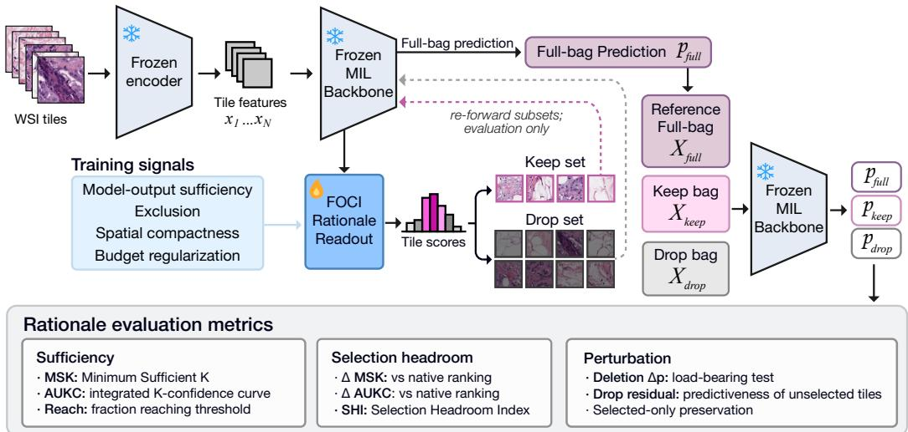

*Figure 2: FOCI as a frozen rationale-readout probe. The frozen encoder maps WSI tiles to features $x _ { 1 } , \ldots , x _ { N }$ , and the frozen MIL backbone produces the primary full-bag prediction. Only the lightweight FOCI selector trains; keep/drop subsets are re-forwarded through the same frozen backbone for training and evaluation.*

> 💡 **claude 批注｜Figure 2 批读**: 输入是 UNI2-h tile 特征、坐标和 slide 真标签 $y$；冻结 MIL 充当 keep/drop 损失中的 consumer，唯一可学习部分是逐 tile 打分 MLP。keep CE/hinge 与 drop exclusion 都针对 $y$，full-bag CE 无 selector 梯度，所以这里学到的是 consumer-dependent、true-label-directed 的充分集，而不是 full-bag prediction mimicry，也不是可迁移的独立组织学重要性。

## 3.1 Frozen WSI-MIL setup

Following standard weakly supervised MIL, each slide s is a bag of patch features $X _ { s } = \{ x _ { s , i } \} _ { i = 1 } ^ { N _ { s } }$ extracted by a frozen encoder, together with spatial coordinates $C _ { s } ~ = ~ \{ c _ { s , i } \} _ { i = 1 } ^ { N _ { s } }$ where $c _ { s , i } =$ $( u _ { s , i } , v _ { s , i } )$ is the pixel location of patch i. We use UNI2-h [4] to extract d=1536-dimensional features. The slide has a single label $y _ { s } \in \{ 1 , \ldots , C \}$ with no patch-level supervision.

Patch features are projected into a shared token space and processed by the MIL backbone (e.g., TransMIL with a learned [CLS] token through L transformer layers); the final representation maps to class logits $\boldsymbol { \ell _ { s } } \in \mathbb { R } ^ { C }$ . Full implementation and backbone details are provided in Appendix L.

Frozen backbone. The backbone remains fully frozen during FOCI training; rationale losses update only the lightweight selection head (∼130K parameters, under 1% of the primary TransMIL pipeline). Joint training conflicts with the classification objective and collapses validation AUC by more than 15 points within two epochs (see Appendix G.4).

> 💡 **claude 批注｜冻结的作用**: 冻结不仅节省参数，更锁定了被解释函数，因而 full-bag logits 按构造不变。联合训练两轮内 AUC 跌 15 个点说明 rationale loss 会改写诊断决策边界；但这只是单个 NSCLC/TransMIL pilot，不能外推成所有 joint selector 都必然失败。ReadySlide 可把 frozen 与 jointly-adapted consumer 分成两条赛道。

## 3.2 Output-consistent rationale selection

Given the frozen slide classifier $f$ above, mapping a bag of tile features $X = \{ x _ { i } \} _ { i = 1 } ^ { N }$ to a class probability p for target class y, we seek a binary mask $z \in \{ 0 , 1 \} ^ { N }$ with $\| z \| _ { 0 } = K$ satisfying two output-consistency conditions:

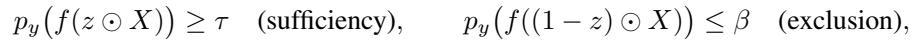

where $\tau , \beta$ are confidence thresholds. We call any such K-tile subset a model-sufficient rationale.

> 💡 **claude 批注｜keep/drop 定义**: 二元 mask 的 keep 侧要求真类概率至少为 τ，drop 侧要求不超过 β。前者防止 selector 只找相关但不足的 tile，后者防止把同样强的证据留在补集。它仍不是唯一/因果解释：可能存在多个互换的充分子集，也可能因冗余导致 drop 条件很难满足。

Pipeline preservation. The frozen backbone f continues to produce the primary slide-level prediction unchanged. FOCI does not replace the full-bag forward pass, retrain the backbone, or require pathologist annotation; it learns a per-tile scoring head that partitions each slide into a keep set (candidate rationale) and a drop set (complement). During training, the keep, drop, and full-bag views pass through the same frozen backbone with separate loss terms; at test time, tiles are ranked by the selector score and evaluated under SRP. Figure 2 shows the architecture.

## 3.3 Rationale selection module

Given the token representations from Section 3.1, a small MLP computes a scalar selection logit $a _ { s , i } = \mathbf { M L P _ { s e l } } ( t _ { s , i } ) \in$ R for each token $t _ { s , i }$ . We consider two variants for turning these logits into selection decisions.

Soft gate (FOCI-Soft). The first variant applies the Concrete (Gumbel–sigmoid) relaxation [39, 40]. Sampling $\epsilon _ { s , i } \sim$ Uniform(0, 1):

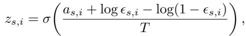

where $T \gt 0$ is temperature. The scores $z _ { s , i } \in ( 0 , 1 )$ approach binary values as $T \to 0$

Hard top-K with straight-through (FOCI-STE). FOCI-STE replaces the soft Concrete gate with an exactly K-sparse binary mask in the forward pass while routing the backward gradient through a sigmoid surrogate [36], eliminating the soft-vs-hard cardinality mismatch between training and SRP evaluation. Although hard top-K fixes the forward-pass cardinality, we retain a small per-bag budget/scale regularizer $\mathsf { \bar { ( } } \lambda _ { \mathrm { b u d g e t } } = 5 \times 1 0 ^ { - 3 } )$ to stabilize selector scores near the rank-K boundary. FOCI-STE is one of two parameterizations of the same audit framework (the other being FOCI-Soft); the central object of study is whether the frozen classifier exhibits selection headroom under a consistent ranking, not the choice of gate parameterization. Full STE derivation, surrogate-gradient mechanics, and forward/backward analysis are in Appendix J.

> 💡 **claude 批注｜hard cardinality 对齐**: FOCI-Soft 训练时每个 tile 都有非零连续权重，而 SRP 测试时是真正 top-K；FOCI-STE 在前向直接固定 K=32，反向借 sigmoid surrogate 传梯度，缩小训练/评估预算错位。ReadySlide 若比较选择器，必须声明预算是在打分后截断、训练前向 hard mask，还是连续 gate 的期望质量。

Three-view inference. Both variants produce the same three views of the slide, namely the original bag $X _ { \mathrm { f u l l } } = X _ { s }$ , the keep bag $X _ { \mathrm { k e e p } } = z _ { s } \odot X _ { s }$ s (or $m _ { s } \odot X _ { s }$ s for FOCI-STE), and the drop bag $X _ { \mathrm { d r o p } } = ( 1 - z _ { s } ) \odot X _ { s }$ . In FOCI-Soft, all tokens stay in the sequence but non-selected patches are down-weighted by $z _ { s } ,$ , whereas in FOCI-STE the mask is binary. Each view passes through the frozen backbone to produce logits $\ell _ { \mathrm { f u l l } } , \ell _ { \mathrm { k e e p } } ,$ , and $\ell _ { \mathrm { d r o p } }$

> 💡 **claude 批注｜consumer 依赖**: selector 的 target 来自真标签 $y$，梯度则通过 frozen consumer 对 keep/drop bag 的响应形成 CE、hinge 与 exclusion；full-bag logits 只作无梯度监控。因此同一排序换到另一个 MIL aggregator 上未必仍对 $y$ 充分。本文没有做 selector A→consumer B 的交叉矩阵，ReadySlide 可把跨 consumer 可复用性单独设榜。

## 3.4 Rationale-aware training objectives

In addition to slide-level accuracy, we design a training objective that explicitly shapes how the selector partitions tiles into a rationale subset within each bag. We compute the full-bag cross-entropy only as a preservation monitor since the full-bag forward pass bypasses the selector and the backbone is frozen. The selector itself is optimized only through losses on the keep/drop views, each enforcing a distinct property of the selection: (i) sufficiency, where the selected tiles alone support a high-confidence prediction; (ii) exclusion, where the remaining tiles do not support the true class; (iii) spatial compactness, where selected tiles form a coherent region on the slide rather than scattering across it; and (iv) a small budget/scale regularizer that controls selection mass in FOCI-Soft and stabilizes selector scores in FOCI-STE.

Let $p _ { y } ( \ell ) = \mathrm { s o f t m a x } ( \ell ) [ y _ { s } ]$ denote the true-class probability. We first define one full-bag preservation monitor and four keep/drop selector losses:

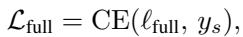

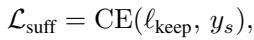

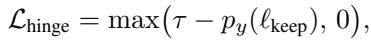

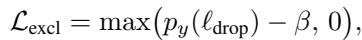

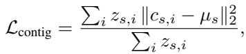

where $\begin{array} { r } { \mu _ { s } = \sum _ { i } z _ { s , i } c _ { s , i } / \sum _ { i } z _ { s , i } } \end{array}$ is the selection-weighted centroid, $\tau \in ( 0 , 1 )$ ) is the target confidence for the keep bag, and $\beta \in ( \bar { 0 } , 1 )$ is the tolerance for the drop bag. We separate the keep-bag CE term $( \mathcal { L } _ { \mathrm { s u f f } } )$ from the confidence hinge $( \mathcal { L } _ { \mathrm { h i n g e } } )$ because they receive different weights in the total loss.

Because the full-bag forward pass bypasses the selector and the backbone is frozen, ${ \mathcal { L } } _ { \mathrm { f u l l } }$ contributes no gradient to the selector parameters; we monitor it as a preservation check rather than as a selector training term. The selector objective excludes ${ \mathcal { L } } _ { \mathrm { f u l l } }$ and uses the keep/drop terms plus the budget regularizer:

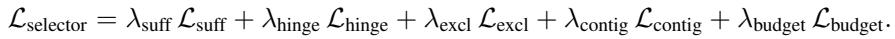

where $\mathcal { L } _ { \mathrm { b u d g e t } }$ is a small per-bag budget/scale regularizer $( \lambda _ { \mathrm { b u d g e t } } = 5 \times 1 0 ^ { - 3 } )$ . Full details for $\mathcal { L } _ { \mathrm { b u d g e t } }$ , the FOCI-Soft entropy term, and the “sufficiency objective” shorthand are provided in Appendix K.

Contiguity caveat. $\mathcal { L } _ { \mathrm { { c o n t i g } } }$ is a small-weighted optimization stabilizer against scattered masks, not a clinical or morphological prior. Its ablation reduces training stability (Appendix G.4), so we interpret it as part of the selector parameterization rather than evidence that diagnostic tissue must be spatially contiguous.

> 💡 **claude 批注｜损失证据链**: selector loss 由 keep CE、置信 hinge、drop exclusion、空间紧致和小预算正则组成；full-bag CE 无 selector 梯度，只是监控项。contiguity 会把空间集中写进排序偏好，因此任何视觉上更紧凑的结果都不能单独归功于模型发现了真实病灶边界。

## 3.5 Sequential Reveal Protocol and rationale metrics

Standard metrics such as AUC, accuracy, and F1 evaluate whether a model predicts the correct slide label, but they do not capture how much of the slide the model needed to see. Two models with identical AUC may differ in rationale compactness if one requires hundreds of tiles while the other needs only a handful.

To quantify this gap, the Sequential Reveal Protocol (SRP) ranks tiles by a per-tile score $( a _ { s , i }$ for FOCI, or the method-specific native/proxy ranking score in Appendix C) and reveals them in descending order; after each tile is added we record the true-class probability $p _ { y } ( K )$ to trace a confidence–count K-curve. SRP is an insertion-style adaptation of perturbation-curve evaluation [41] for WSI-MIL, with three complementary operating-point summaries (MSK, Reach, AUKC) reported per slide. Cross-method SRP reveal curves are shown in Appendix G.1.

SRP metrics. For each slide s, we summarize the K-curve $p _ { y _ { s } } ^ { ( s ) } ( K )$ with three metrics at operating confidence κ. MSK and Reach use the threshold κ:

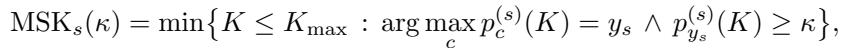

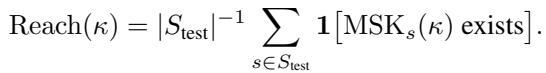

AUKC is unthresholded. Let $K _ { s , j }$ denote the j-th reveal count evaluated for slide $s ,$ let $m _ { s }$ be the number of reveal steps, and let $\rho _ { s , j } = K _ { s , j } / N _ { s } ^ { \mathrm { r e a l } }$ be the normalized reveal fraction, where Nreal is the unpadded number of candidate tiles. We compute AUKC as the trapezoidal area under the confidence curve, normalized by the maximum reveal fraction:

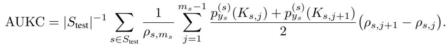

$\mathrm { M S K } _ { \mathrm { c o n d } }$ denotes the conditional mean over slides reaching κ. Thus, AUKC summarizes the full reveal curve, while MSK and Reach depend on the operating threshold. The three metrics expose different failure modes: AUKC can be high while Reach is low (failure on hard slides) or MSK is high (inefficient compression). We report all three at $\kappa = 0 . 9$ unless stated otherwise.

> 💡 **claude 批注｜最小充分 tile 数的条件性**: $\mathrm{MSK}_{cond}$ 只在 Reach 成功的 slide 上求均值；若更难的 slide 在高阈值下掉出，$\mathrm{MSK}_{cond}$ 甚至可能下降。因此 benchmark 至少要同时给 Reach，并最好报告分位数或把未达阈值按 $K_{max}+1$ 计入，以免“选择更少”来自失败样本被排除。

Selection Headroom Index (SHI). A frozen MIL classifier already produces a tile ranking through its internal attention or aggregation weights, which itself induces a K-curve. To quantify how much further FOCI compresses the sufficient set relative to that internal ranking, we define the Selection Headroom Index:

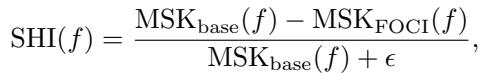

where $\operatorname { M S K } _ { \mathrm { b a s e } } ( f )$ is computed by ranking tiles with the frozen backbone’s own attention or aggregation weights, $\operatorname { M S K } _ { \operatorname { F O C I } } ( f )$ uses a FOCI-trained selector attached to the same frozen $f ,$ and ϵ is a small stabilizing constant. We read the sign directly: positive SHI indicates that FOCI compresses the rationale beyond what the backbone’s internal ranking already provides, near-zero SHI indicates a selection-saturation regime where the backbone ranking is already near-minimal, and negative SHI indicates that the external selector conflicts with the backbone’s internal ranking enough to inflate the sufficient set. Unlike AUC, which measures slide-level discrimination, SHI measures whether the frozen decision can be compressed into a smaller sufficient subset, and is therefore a property of the trained model and feature encoder rather than of classification performance. We report SHI alongside MSK and AUKC in §4. For backbones without an explicit native tile score, SHI is computed relative to a documented proxy ranking (Appendix C) and measures improvement over the available backbone ranking, not a ranking-independent property. Our main SRP uses the ground-truth class to jointly assess confidence recovery and correctness on labeled test sets; an audit-time variant tracks the predicted class $\hat { y } = \arg \operatorname* { m a x } _ { c } f _ { c } ( X )$ instead of y, reported in Appendix N.

> 💡 **claude 批注｜SHI 的可比性条件**: SHI 的分母是同一 backbone 原生/代理排序在主 true-label SRP 下的 MSK，只量化 native/proxy→learned gap。consumer-optimal combinatorial Oracle 还要固定 consumer、候选池、$y$、$\kappa$ 与可行子集空间后最小化 K，才能定义 learned→consumer-optimal gap；clinical annotation alignment 是另一条轴。TransMIL 使用 CLS proxy，因此其 SHI 更不能解释成任何一种 Oracle gap。

## 🔖 本节总结

- FOCI 只有约 13 万参数，训练时冻结 encoder 与 MIL consumer。
- keep/drop 是 consumer-specific、true-label-directed intervention；full-bag 输出只作保持监控，未测试跨 consumer 迁移。
- 默认训练预算固定 K=32，评估 SRP 上限 $K_{max}=256$，候选池上限 $n_{cap}=1024$。
- SHI 只给 native/proxy→learned 压缩率；consumer-optimal gap 与 clinical alignment 均未测。
