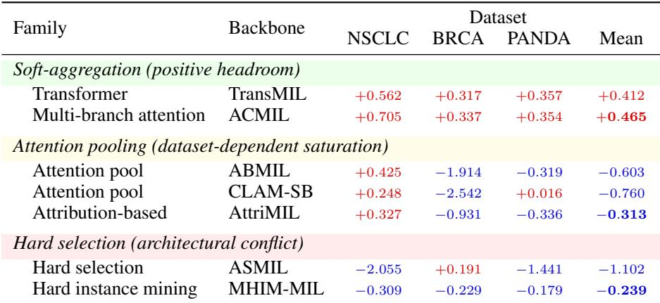
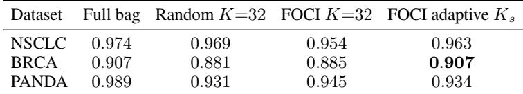

[← 返回 README](../README.md)

## 📌 批读预览

本节检查四条证据链：冻结预测保持、MSK 压缩、不同架构的 headroom/saturation/conflict，以及 insertion、deletion、selected-only 三种干预是否一致。

## 4 Experiments

We evaluate FOCI on three public benchmarks along three axes: compact rationale recovery while preserving the frozen full-bag classifier, consistency across backbone architectures and failure modes, and the contribution of each loss component (with FOCI-Soft vs FOCI-STE in Appendix G.4). Primary compactness results use the SRP metrics defined in Section 3.5; deletion-based perturbation and selected-only AUC provide complementary checks.

Hypotheses tested. We test four linked hypotheses: (H1) slide-level AUC decouples from selection headroom; (H2) non-minimal baseline MSK leaves room for FOCI compression; (H3) deletion and selected-only AUC provide complementary checks rather than interchangeable explanation metrics; and (H4) FOCI-STE mainly improves hard-cardinality alignment rather than serving as the central contribution. The corresponding evidence is reported in §4.3, Table 1, §4.5, and Appendix G.4.

## 4.1 Setup

Datasets. TCGA-NSCLC (LUAD vs. LUSC, 1,043 slides) and TCGA-BRCA (IDC vs. other subtypes, 1,126 slides) from TCGA/GDC [12], and PANDA (benign vs. malignant, ISUP grade ≥ 1, 10,615 slides) [13]. We use 70/15/15 train/val/test splits matching the appendix counts; full split details and per-class counts are in Appendix L.

> 💡 **claude 批注｜数据集范围**: 三项任务全是二分类、同一 UNI2-h 特征管线，PANDA 规模远大于两个 TCGA 队列。结论能支持多 backbone/多数据集，但尚未覆盖多分类、外部临床队列、不同 patch encoder 或病灶标注，ReadySlide 若做 benchmark 应把这些作为外推轴而非附带消融。

Features and backbones. Patches are extracted at 20×, embedded with frozen UNI2-h [4] (d=1536). The primary FOCI-STE backbone is a 4-layer TransMIL (d=512, 8 heads) pretrained for 20 epochs with cross-entropy. For cross-backbone experiments, FOCI is additionally applied to ABMIL, CLAM-SB, AttriMIL, ACMIL, ASMIL, and MHIM-MIL, each pretrained independently with its original objective; in all cases the backbone is frozen during FOCI training. Full architecture, optimizer, and hyperparameter settings are in Appendix L.

Baselines and SRP scores. For each backbone, SRP uses its native attention or aggregation logits as the ranking score; FOCI ranks tiles by its own selector head. TransMIL has no native attention head, so we use the post-encoder CLS-dot-product score as a documented proxy ranking (Appendix C); SHI for TransMIL therefore measures improvement over this proxy.

> 💡 **claude 批注｜基线公平性**: 不同 backbone 的 baseline ranking 来源并不等价：attention logit、attribute score、hard-mining attention 与 CLS proxy 混在同一矩阵。协议对 reveal 操作是统一的，但“原生排序质量”本身是方法组件。ReadySlide 应同时提供统一 model-agnostic baseline（随机、L2、k-center 等）和 consumer-native baseline。

## 4.2 Main results

Per-dataset SRP results for all seven backbones with and without FOCI are reported in Appendix H (Tables 12–14). Across these tables, FOCI reduces MSK when the frozen backbone has rationale-compression headroom and inflates MSK when the native ranking is already near-minimal or conflicts with an external selector. A paired Wilcoxon test on the nine TransMIL (dataset, seed) observations confirms a significant MSK reduction (p=0.008, median ∆MSK=−4.14) but no significant AUKC change (p=0.13); per-dataset tests are underpowered (n=3), so we use the appendix tables as direction-of-effect summaries.

> 💡 **claude 批注｜统计证据**: 显著性只在 3 数据集×3 seed 的九个 TransMIL 配对观测上成立；AUKC 不显著，说明改善主要集中在达到阈值所需的前缀长度，而非整条 reveal 曲线的总体面积。把 dataset 与 seed 混合作为九个观测也不等于九个独立数据集。

## 4.3 Selection headroom analysis

To quantify the per-backbone effect of attaching FOCI to a frozen MIL classifier, we compute the Selection Headroom Index (SHI, defined in §3.5) for every (backbone, dataset) pair. Table 1 summarizes per-dataset and mean SHI for each backbone family. The raw baseline MSK, FOCI MSK, ∆MSK, Reach, and AUKC values are reported in Appendix H (Tables 12–14). All values are 3-seed means at $\kappa = 0 . 9$ . SHI should be read as a signed normalized effect size rather than an absolute ranking of rationale quality: when the baseline MSK is already near one tile, small absolute MSK changes can produce large negative ratios. We therefore interpret SHI together with the raw MSK and ∆MSK values in Appendix H, using it to identify headroom, saturation, and conflict regimes rather than to rank backbones in isolation.

*Table 1: Selection Headroom Index (SHI) per backbone and its per-dataset breakdown. SHI is normalized by the baseline Minimum Sufficient K (MSK) tile count, so extreme values may occur when the baseline MSK is small; see Appendix H for raw MSK.*

> 💡 **claude 批注｜Table 1 批读**: ACMIL 平均 SHI 最高（+0.465），TransMIL 为 +0.412；attention-pooling 三类平均为负，hard-selection 尤其 ASMIL 为 −1.102。极端负值常因 baseline MSK 接近 1，分母很小而被放大，所以表应与 Appendix H 的绝对 ΔMSK 同读。

Note. SHI > 0: FOCI compresses beyond the baseline ranking, SHI ≈ 0: little room to compress, SHI < 0: FOCI conflicts with the backbone’s native selection; bold: best mean SHI within family.

*Figure 3: Slide-level AUC and SHI are decoupled. Each point is a (backbone, dataset) pair; color denotes backbone and marker shape denotes dataset. High-AUC backbones can have near-zero or negative SHI when their native ranking saturates or conflicts with an external readout, while TransMIL and ACMIL maintain positive SHI without necessarily being the best full-bag classifiers.*

> 💡 **claude 批注｜Figure 3 批读**: 散点图把 full-bag 诊断性能与主 true-label SRP 的 native→learned 压缩拆成两个轴：高 AUC 点仍可能是负 SHI。ReadySlide 还需另做 consumer-optimal 组合搜索以测 learned gap，并以 tumor/region annotation 单独测 clinical alignment；后者不是 selection performance 上界。

Three patterns emerge: (1) TransMIL and ACMIL show consistently positive SHI across all three datasets $( + 0 . 3 2 \mathrm { t o } + 0 . 7 1 ) ;$ (2) attention-pooling backbones (ABMIL, CLAM-SB, AttriMIL) show a dataset-dependent saturation regime, improving NSCLC baselines but inflating the sufficient set on BRCA, on which baseline MSK is already near-minimal (≈ 1.1 for ABMIL/CLAM-SB); and (3) hard-selection backbones (ASMIL, MHIM-MIL) mostly inflate under FOCI, which reflects architectural conflict between native instance selection and an external selector.

Figure 3 visualizes this decoupling: selection headroom is not predicted by slide-level AUC alone. Predicted-class SRP (Appendix N) follows the same qualitative MSK-compression pattern on TransMIL±FOCI, which supports the interpretation that the readout recovers the frozen model’s own decision rather than exploiting label-specific evaluation.

> 💡 **claude 批注｜true-label 与 predicted-class 的证据边界**: 上句只能说明同一个、以真标签 $y$ 训练的 ranking 在 Appendix N 改用 $\hat y$ 评估时也呈现较小 MSK；它没有证明 selector 的训练目标是匹配 full-bag 决定。主结果仍是 true-label-directed，Appendix N 才是 predicted-class recovery view。

## 4.4 Selected-only downstream triangulation

A complementary check asks whether the compact rationale preserves the downstream TransMIL prediction. Table 2 reports full-bag AUC and selected-only test AUC for random K=32, FOCI fixed-K=32, and FOCI adaptive-K within the same TransMIL pipeline; full per-seed, per-K, and ABMIL-pipeline reference results are in Appendix G.3.

*Table 2: Selected-only downstream AUC within the TransMIL predictor pipeline (3-seed mean). Random and fixed-FOCI rows use K=32; FOCI adaptive uses $\begin{array} { r } { \dot { K _ { s } } = \operatorname* { m a x } ( \dot { 1 } \dot { 6 } , \lfloor 0 . 0 3 N _ { s } \rfloor ) } \end{array}$ . ABMIL native top-K comparison and full per-seed / per-K results are in Appendix G.3.*

> 💡 **claude 批注｜Table 2 批读**: BRCA 的 adaptive FOCI 在约 30 tile 下把 selected-only AUC 保持到 full-bag 的 0.907，而随机 K=32 为 0.881；但 NSCLC 上随机 0.969 高于 FOCI fixed 0.954，PANDA 上 FOCI adaptive 0.934 仅略高随机 0.931。learned selector 的优势明显依赖 dataset×consumer，不能以单一平均数宣称普适。

This mini-table is a preservation check rather than a universal dominance claim. It tests whether compact FOCI-selected subsets preserve the frozen TransMIL decision and supports the headroom framing: BRCA shows a clear adaptive-K preservation signal (matching the full-bag AUC 0.907), whereas NSCLC and PANDA expose selection-saturation regimes where random subsets already preserve much of the prediction, which leaves little operating margin for any external selector. Thus, selected-only AUC serves as a triangulation check rather than the primary evidence of FOCI superiority: it reveals when a dataset/backbone pair has enough operating margin for a learned selector to improve over random compact subsets.

## 4.5 Deletion-based perturbation faithfulness

Deletion-based perturbation [41, 27] complements SRP by asking whether top-ranked tiles are load-bearing for the model output when removed, rather than how quickly confidence is recovered when they are inserted. Attention-pooling methods often score strongly on this metric because their ranking is part of the aggregation mechanism itself. On TransMIL, where the native ranking is only a CLS-dot-product proxy, FOCI increases NSCLC deletion-AUC from 0.0003 to 0.0274, indicating that the readout extracts a more load-bearing ranking than the frozen proxy. Cross-dataset deletion-AUC results are reported in Appendix I.

> 💡 **claude 批注｜删除干预解读**: TransMIL CLS proxy 的 NSCLC deletion-AUC 仅 0.0003，FOCI 为 0.0274，说明 FOCI 排序的 top tile 对该 consumer 更“load-bearing”。但 attention pooling 的内生排序天然参与聚合，删除指标可能偏爱这类模型；因此 deletion 不能替代 insertion/MSK。

We therefore treat SRP, deletion, and selected-only AUC as complementary rather than interchangeable rationale-quality axes: SRP measures insertion sufficiency, deletion measures load-bearing removal, and selected-only AUC measures downstream prediction preservation under masked input. No single ranking dominates all three, which is why we use deletion as a faithfulness check rather than as the sole explanation metric.

## 🔖 本节总结

- TransMIL 的 9 个 dataset×seed 配对显示 MSK 显著下降（p=0.008），AUKC 未显著（p=0.13）。
- headroom、saturation、conflict 三种区间都真实存在。
- selected-only 与 deletion 只作三角验证，均未证明 FOCI 在所有 dataset×consumer 上优于随机或原生排序。
