[← 返回 README](../README.md)

## 📌 批读预览

附录给出可复用协议、预算敏感性、完整跨 backbone 结果、STE 细节、损失、数据划分与 predicted-class 审计。References 也完整保留在本文件中。

## References

[1] Gabriele Campanella, Matthew G. Hanna, Luke Geneslaw, Allen Miraflor, Vitor Werneck Krauss Silva, Klaus J. Busam, Edi Brogi, Victor E. Reuter, David S. Klimstra, and Thomas J. Fuchs. Clinical-grade computational pathology using weakly supervised deep learning on whole slide images. Nature Medicine, 25(8):1301–1309, 2019.

[2] Maximilian Ilse, Jakub Tomczak, and Max Welling. Attention-based deep multiple instance learning. In Proceedings of the 35th International Conference on Machine Learning, pages 2127–2136. PMLR, 2018.

[3] Ming Y Lu, Drew FK Williamson, Tiffany Y Chen, Richard J Chen, Matteo Barbieri, and Faisal Mahmood. Data-efficient and weakly supervised computational pathology on whole-slide images. Nature biomedical engineering, 5(6):555–570, 2021.

[4] Richard J Chen, Tong Ding, Ming Y Lu, Drew FK Williamson, Guillaume Jaume, Andrew H Song, Bowen Chen, Andrew Zhang, Daniel Shao, Muhammad Shaban, et al. Towards a general-purpose foundation model for computational pathology. Nature medicine, 30(3):850–862, 2024.

[5] Neofytos Dimitriou, Ognjen Arandjelovic, and Peter D Caie. Deep learning for whole slide image analysis:´ an overview. Frontiers in medicine, 6:264, 2019.

[6] Michael Gadermayr and Maximilian Tschuchnig. Multiple instance learning for digital pathology: A review of the state-of-the-art, limitations & future potential. Computerized Medical Imaging and Graphics, 112:102337, 2024.

[7] Sofia Serrano and Noah A. Smith. Is attention interpretable? In Proceedings of the 57th Annual Meeting of the Association for Computational Linguistics, pages 2931–2951, Florence, Italy, July 2019. Association for Computational Linguistics.

[8] Danish Pruthi, Mansi Gupta, Bhuwan Dhingra, Graham Neubig, and Zachary C. Lipton. Learning to deceive with attention-based explanations. In Proceedings ofthe 58th Annual Meeting ofthe Association for Computational Linguistics, pages 4782–4793. Association for Computational Linguistics, July 2020.

[9] Martim Afonso, Praphulla MS Bhawsar, Monjoy Saha, Jonas S Almeida, and Arlindo L Oliveira. Multiple instance learning for wsi: A comparative analysis of attention-based approaches. Journal of Pathology Informatics, 15:100403, 2024.

[10] Supriyo Chakraborty, Richard Tomsett, Ramya Raghavendra, Daniel Harborne, Moustafa Alzantot, Federico Cerutti, Mani Srivastava, Alun Preece, Simon Julier, Raghuveer M Rao, et al. Interpretability of deep learning models: A survey of results. In 2017 IEEE smartworld, ubiquitous intelligence & computing, advanced & trusted computed, scalable computing & communications, cloud & big data computing, Internet of people and smart city innovation (smartworld/SCALCOM/UIC/ATC/CBDcom/IOP/SCI), pages 1–6. IEEE, 2017.

[11] Wenhui Zhu, Peijie Qiu, Xiwen Chen, Zhangsihao Yang, Aristeidis Sotiras, Abolfazl Razi, and Yalin Wang. How effective can dropout be in multiple instance learning ? In Forty-second International Conference on Machine Learning, 2025.

[12] John N Weinstein, Eric A Collisson, Gordon B Mills, Kenna R Shaw, Brad A Ozenberger, Kyle Ellrott, Ilya Shmulevich, Chris Sander, and Joshua M Stuart. The cancer genome atlas pan-cancer analysis project. Nature genetics, 45(10):1113–1120, 2013.

[13] Wouter Bulten, Kimmo Kartasalo, Po-Hsuan Cameron Chen, Peter Ström, Hans Pinckaers, Kunal Nagpal, Yuannan Cai, David F Steiner, Hester Van Boven, Robert Vink, et al. Artificial intelligence for diagnosis and gleason grading of prostate cancer: the panda challenge. Nature medicine, 28(1):154–163, 2022.

[14] Thomas G. Dietterich, Richard H. Lathrop, and Tomás Lozano-Pérez. Solving the multiple instance problem with axis-parallel rectangles. Artificial Intelligence, 89(1):31–71, 1997.

[15] Zhuchen Shao, Hao Bian, Yang Chen, Yifeng Wang, Jian Zhang, Xiangyang Ji, and Yongbing Zhang. Transmil: Transformer based correlated multiple instance learning for whole slide image classification. In M. Ranzato, A. Beygelzimer, Y. Dauphin, P.S. Liang, and J. Wortman Vaughan, editors, Advances in Neural Information Processing Systems, volume 34, pages 2136–2147. Curran Associates, Inc., 2021.

[16] Richard J. Chen, Chengkuan Chen, Yicong Li, Tiffany Y. Chen, Andrew D. Trister, Rahul G. Krishnan, and Faisal Mahmood. Scaling vision transformers to gigapixel images via hierarchical self-supervised learning. In Proceedings ofthe IEEE/CVF Conference on Computer Vision and Pattern Recognition (CVPR), pages 16144–16155, June 2022.

[17] Wenhao Tang, Sheng Huang, Xiaoxian Zhang, Fengtao Zhou, Yi Zhang, and Bo Liu. Multiple instance learning framework with masked hard instance mining for whole slide image classification. In Proceedings of the IEEE/CVF International Conference on Computer Vision (ICCV), pages 4078–4087, October 2023.

[18] Linghan Cai, Shenjin Huang, Ye Zhang, Jinpeng Lu, and Yongbing Zhang. Attrimil: Revisiting attention based multiple instance learning for whole-slide pathological image classification from a perspective of instance attributes. Medical Image Analysis, 103:103631, 2025.

[19] Yunlong Zhang, Honglin Li, Yunxuan Sun, Sunyi Zheng, Chenglu Zhu, and Lin Yang. Attentionchallenging multiple instance learning for whole slide image classification. In European conference on computer vision, pages 125–143. Springer, 2024.

[20] Ming Y. Lu, Bowen Chen, Drew F. K. Williamson, Richard J. Chen, Ivy Liang, Tong Ding, Guillaume Jaume, Igor Odintsov, Long Phi Le, Georg Gerber, Anil V. Parwani, Andrew Zhang, and Faisal Mahmood. A visual-language foundation model for computational pathology. Nature Medicine, 30(3):863–874, 2024.

[21] Hanwen Xu, Naoto Usuyama, Jaspreet Bagga, Sheng Zhang, Rajesh Rao, Tristan Naumann, Cliff Wong, Zelalem Gero, Javier González, Yu Gu, Yanbo Xu, Mu Wei, Wenhui Wang, Shuming Ma, Furu Wei, Jianwei Yang, Chunyuan Li, Jianfeng Gao, Jaylen Rosemon, Tucker Bower, Soohee Lee, Roshanthi Weerasinghe, Bill J. Wright, Ari Robicsek, Brian Piening, Carlo Bifulco, Sheng Wang, and Hoifung Poon. A whole-slide foundation model for digital pathology from real-world data. Nature, 630(8015):181–188, 2024.

[22] Hongyi Wang, Luyang Luo, Fang Wang, Ruofeng Tong, Yen-Wei Chen, Hongjie Hu, Lanfen Lin, and Hao Chen. Rethinking multiple instance learning for whole slide image classification: A bag-level classifier is a good instance-level teacher. IEEE Transactions on Medical Imaging, 43(11):3964–3976, 2024.

[23] Pang Wei Koh, Thao Nguyen, Yew Siang Tang, Stephen Mussmann, Emma Pierson, Been Kim, and Percy Liang. Concept bottleneck models. In Proceedings of the 37th International Conference on Machine Learning, volume 119 of Proceedings ofMachine Learning Research, pages 5338–5348. PMLR, 2020.

[24] Ramprasaath R Selvaraju, Michael Cogswell, Abhishek Das, Ramakrishna Vedantam, Devi Parikh, and Dhruv Batra. Grad-cam: Visual explanations from deep networks via gradient-based localization. In Proceedings ofthe IEEE international conference on computer vision, pages 618–626, 2017.

[25] Syed Ashar Javed, Dinkar Juyal, Harshith Padigela, Amaro Taylor-Weiner, Limin Yu, and aaditya prakash. Additive MIL: Intrinsically interpretable multiple instance learning for pathology. In Alice H. Oh, Alekh Agarwal, Danielle Belgrave, and Kyunghyun Cho, editors, Advances in Neural Information Processing Systems, 2022.

[26] Saarthak Kapse, Pushpak Pati, Srijan Das, Jingwei Zhang, Chao Chen, Maria Vakalopoulou, Joel Saltz, Dimitris Samaras, Rajarsi R. Gupta, and Prateek Prasanna. SI-MIL: Taming deep MIL for selfinterpretability in gigapixel histopathology. In Proceedings ofthe IEEE/CVF Conference on Computer Vision and Pattern Recognition (CVPR), pages 11226–11237, 2024.

[27] Wojciech Samek, Alexander Binder, Grégoire Montavon, Sebastian Lapuschkin, and Klaus-Robert Müller. Evaluating the visualization of what a deep neural network has learned. IEEE Transactions on Neural Networks and Learning Systems, 28(11):2660–2673, 2017.

[28] Julius Hense, Mina Jamshidi Idaji, Oliver Eberle, Thomas Schnake, Jonas Dippel, Laure Ciernik, Oliver Buchstab, Andreas Mock, Frederick Klauschen, and Klaus Robert Müller. xMIL: Insightful explanations for multiple instance learning in histopathology. In The Thirty-eighth Annual Conference on Neural Information Processing Systems, 2024.

[29] Sai Gurrapu, Ajay Kulkarni, Lifu Huang, Ismini Lourentzou, and Feras A. Batarseh. Rationalization for explainable nlp: a survey. Frontiers in Artificial Intelligence, Volume 6 - 2023, 2023.

[30] Tao Lei, Regina Barzilay, and Tommi Jaakkola. Rationalizing neural predictions. In Proceedings of the 2016 Conference on Empirical Methods in Natural Language Processing, pages 107–117, Austin, Texas, November 2016. Association for Computational Linguistics.

[31] Jasmijn Bastings, Wilker Aziz, and Ivan Titov. Interpretable neural predictions with differentiable binary variables. In Proceedings ofthe 57th Annual Meeting ofthe Associationfor Computational Linguistics, pages 2963–2977, Florence, Italy, July 2019. Association for Computational Linguistics.

[32] Libing Yuan, Shuaibo Hu, Kui Yu, and Le Wu. Boosting explainability through selective rationalization in pre-trained language models. In Proceedings of the 31st ACM SIGKDD Conference on Knowledge Discovery and Data Mining V.1, page 1867–1878, 2025.

[33] Yonatan Geifman and Ran El-Yaniv. Selective classification for deep neural networks. In Advances in Neural Information Processing Systems, volume 30. Curran Associates, Inc., 2017.

[34] Surat Teerapittayanon, Bradley McDanel, and H. T. Kung. BranchyNet: Fast inference via early exiting from deep neural networks. In 2016 23rd International Conference on Pattern Recognition (ICPR), pages 2464–2469. IEEE, 2016.

[35] Mo Yu, Shiyu Chang, Yang Zhang, and Tommi Jaakkola. Rethinking cooperative rationalization: Introspective extraction and complement control. In Proceedings ofthe 2019 Conference on Empirical Methods in Natural Language Processing and the 9th International Joint Conference on Natural Language Processing (EMNLP-IJCNLP), pages 4094–4103, Hong Kong, China, November 2019. Association for Computational Linguistics.

[36] Yoshua Bengio, Nicholas Léonard, and Aaron Courville. Estimating or propagating gradients through stochastic neurons for conditional computation, 2013.

[37] Linfeng Ye, Shayan Mohajer Hamidi, Zhixiang Chi, Guang Li, Mert Pilanci, Takahiro Ogawa, Miki Haseyama, and Konstantinos N. Plataniotis. ASMIL: Attention-stabilized multiple instance learning for whole-slide imaging. In The Fourteenth International Conference on Learning Representations, 2026.

[38] Hyun Do Jung, Jungwon Choi, and Hwiyoung Kim. Reamil: Reasoning- and evidence-aware multiple instance learning for whole-slide histopathology. In Proceedings ofthe IEEE/CVF Winter Conference on Applications of Computer Vision (WACV) Workshops, pages 40–45, March 2026.

[39] Chris J. Maddison, Andriy Mnih, and Yee Whye Teh. The concrete distribution: A continuous relaxation of discrete random variables. In International Conference on Learning Representations, 2017.

[40] Eric Jang, Shixiang Gu, and Ben Poole. Categorical reparameterization with gumbel-softmax. In International Conference on Learning Representations, 2017.

[41] Vitali Petsiuk, Abir Das, and Kate Saenko. RISE: Randomized input sampling for explanation of black-box models. In British Machine Vision Conference (BMVC), 2018.

## A Qualitative Illustration

This appendix shows where FOCI-selected tiles appear, in WSI context, relative to two attention/selection baselines on the same input bag. The figure is illustrative and not a claim of clinical sufficiency. Informal pathologist feedback suggested that isolated patch-only review is not aligned with clinical slide review; we therefore present selected tiles only in WSI context. Figure 4 compares FOCI against the TransMIL CLS-proxy ranking and ASMIL hard-selection ranking on two LUSC slides from the TCGA-NSCLC test set; each ranking uses its own scoring source, with FOCI and the TransMIL proxy sharing the frozen TransMIL backbone and ASMIL using its native model.

TCGA-33-4582 (compact case, MSK=1): a single patch is enough to cross 90% confidence. The top row shows FOCI’s top-32 selections concentrated in a small densely cellular region, with three highlighted zoom-ins. The bottom row contrasts FOCI’s selection against the TransMIL CLS-proxy ranking and ASMIL hard selection on the same bag; all three methods cluster in similar regions, consistent with NSCLC’s selection-saturation regime where many tile subsets recover the model’s confidence.

TCGA-NK-A5D1 (multi-fragment case, MSK=103): the tissue spans multiple fragments with considerable morphological variation, and the model requires 103 patches before crossing the confidence threshold. Here the three methods diverge: FOCI concentrates on a single tissue fragment while attention and hard-selection rankings spread across multiple fragments. The high MSK reflects the slide’s genuine complexity rather than a failure of any single ranker.

Informal visual inspection note. On informal visual inspection with WSI context, a subset of highlighted FOCI regions appeared plausibly compatible with squamous histology in WSI context. This qualitative review was not blinded, was not systematic, was performed on n=2 slides for illustration only, and is reported as informal feedback rather than a reader study.

These two cases illustrate that compact low-MSK selections and diffuse high-MSK selections can correspond to visibly different tissue patterns, and that FOCI’s selections can differ from attention-based or hard-selection baselines on the same input. They do not establish clinical sufficiency.

Top of each pair: WSI thumbnail with FOCI's top-32 selected tiles (yellow) and the top-3 highlighted (orange) shown as zoom-in crops at 20× magnification. Bottom: same WSI rendered three times with each method's top-32 ranked tiles outlined.

*Figure 4: Qualitative illustration of FOCI selections on two LUSC slides. Each slide is shown twice. Top row of each pair: WSI thumbnail with FOCI’s top-32 selected tiles outlined in yellow and the top-3 highlighted in orange (#1, #2, #3), plus three zoom-in crops at 20× magnification. Bottom row of each pair: same WSI rendered three times with each method’s top-32 ranked tiles outlined; cyan = TransMIL CLS-proxy ranking, lime = ASMIL hard selection, yellow = FOCI selector. Top slide (TCGA-33-4582, MSK=1, compact): all three methods cluster in similar regions, consistent with NSCLC’s selection-saturation regime. Bottom slide (TCGA-NK-A5D1, MSK=103, multifragment): FOCI concentrates on a single tissue fragment while attention/hard-selection rankings spread across fragments. These examples are illustrative and do not establish clinical sufficiency.*

> 💡 **claude 批注｜Figure 4 批读**: 两例刻意展示 MSK=1 与 MSK=103 的两端：前者多个排名都能锁定相似区域，说明 selector 区分空间小；后者跨组织碎片、形态异质，FOCI 集中于单一 fragment，而其他排序更分散。n=2、非盲评且无标注，视觉案例只能说明机制行为，不能证明病理正确性。

## B Classification Preservation

FOCI freezes the encoder and MIL backbone and trains only the lightweight selector. Therefore, under standard full-bag inference without masking, the FOCI-augmented model produces the same logits as the standalone backbone. Slide-level AUC is preserved by construction for the primary full-bag prediction; FOCI changes only the post-hoc tile ranking and masked keep/drop evaluations. We verified this empirically across all configurations, which confirms full-bag AUC equivalence to four decimal places in every case (7 backbones × 3 datasets × 3 seeds).

> 💡 **claude 批注｜冻结保持 QA**: 7×3×3 的 full-bag AUC 四位小数完全一致，是“readout 不改诊断器”的直接 QA；但 selected-only 走 masked forward，是另一条分布，不能用 full-bag 等价代替选择质量验证。

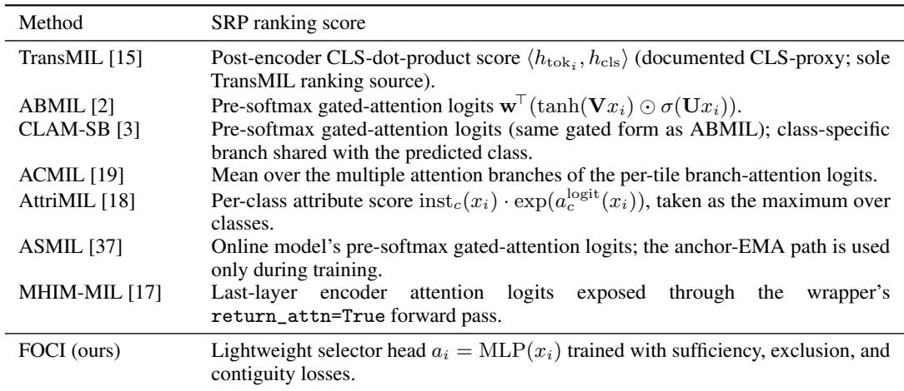

*Table 3: Per-tile ranking scores used by each method under SRP. All scores are extracted from the trained model on the same pre-filtered bag and produce a per-tile real number; higher scores are revealed earlier.*

> 💡 **claude 批注｜Table 3 批读**: 表中每个 consumer 的 native score 来源不同，且所有方法先经过 L2 范数筛到最多 1024 tile。这个 pre-filter 本身是第一阶段 selector，后续 SHI/MSK 都只在候选池内成立。ReadySlide 应把候选生成与二次选择拆开计预算。

## C Per-method SRP ranking-score extraction

Each baseline contributes a per-tile ranking score to SRP. Table 3 lists the score used for every method in the 7-backbone matrix. All scores are computed from the trained model on the same pre-filtered bag (top $n _ { \mathrm { c a p } } { = } 1 0 2 4$ tokens by feature L2 norm; see Appendix E.2); a higher score means earlier reveal. TransMIL does not expose a native attention head, so we use a post-encoder CLS-dot-product score $\langle h _ { \mathrm { t o k } _ { i } } , h _ { \mathrm { c l s } } \rangle$ as a documented CLS-proxy ranking. For the other six backbones, the ranking score is the model’s own pre-softmax attention logit or attribute-attention aggregate, exposed through an attn\_logits interface. FOCI ranks tiles by its selector head, $a _ { i } = \mathrm { M L P } ( x _ { i } )$

This table is intentionally explicit because SRP is sensitive to ranking quality. The same masking and reveal procedure is applied regardless of how each score is obtained. Methods that perform hard instance selection during training, such as ASMIL and MHIM-MIL, still expose continuous attention logits through this interface; these logits are what we rank for side-by-side SRP comparison in Tables 12–14.

## D Equal-Budget Comparison

Table 4 evaluates all methods under a fixed reveal budget of $K _ { \mathrm { m a x } } = 3 2$ , which matches the FOCI-STE training target. This equal-budget setting provides a complementary view to the main SRP results at $K _ { \operatorname* { m a x } } = 2 5 6$ (Tables 12–14) by isolating early-ranking quality under a small tile budget. The same headroom-vs-saturation pattern remains visible: FOCI helps when the baseline ranking has room to compress, while near-minimal attention-pooling baselines leave little margin for further reduction.

## E Sensitivity Analysis

We analyze the sensitivity of FOCI-STE to hyperparameters that govern the SRP evaluation protocol and the selector budget.

## E.1 Operating confidence threshold κ

The operating confidence threshold κ determines when a classifier is deemed sufficiently confident during sequential reveal. Table 5 reports MSK, Reach, and AUKC for FOCI-STE at $\kappa \in \{ 0 . 7 , 0 . 8 , 0 . 9 , 0 . 9 5 \}$ across all three datasets. AUKC is invariant to κ by construction: it is computed from the full reveal-probability curve, so the threshold affects only which slides reach the operating point and how many tiles are counted toward MSK. Reach generally decreases as κ rises. $\mathrm { M S K } _ { \mathrm { c o n d } }$ can shift non-monotonically because it is averaged only over reachable slides: higher thresholds require more tiles for reachable slides, while the hardest slides may drop out of the conditional set. The default κ=0.9 provides a conservative operating point for the main results.

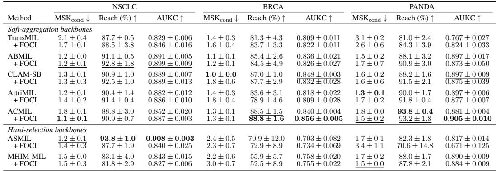

*Table 4: Equal K-budget comparison at $K _ { \mathrm { m a x } } = 3 2 ( \kappa = 0 . 9 , n _ { \mathrm { c a p } } = 1 0 2 4 _ { \mathrm { \ell } }$ , 3-seed mean±std). Paired rows show each backbone before and after attaching the FOCI selector. All methods are evaluated under SRP with the same reveal budget, which matches FOCI-STE’s training target. Bold: best per column. Underline: second best.*

> 💡 **claude 批注｜Table 4 批读**: 把所有方法的 reveal 上限固定到 32 后，比较的是低预算区早期排序质量，而主表 $K_{max}=256$ 更关注能否最终达到 0.9。两种预算回答不同问题；ReadySlide 最好报告 budget-performance frontier，而非只选一个 K。

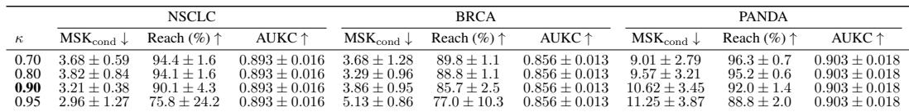

*Table 5: Sensitivity to operating confidence threshold κ on FOCI-STE. All results use $K _ { \operatorname* { m a x } } = 2 5 6$ and $n _ { \mathrm { c a p } } = 1 0 2 4$ . Bold κ: default used in all main results. AUKC is unthresholded and therefore invariant to κ for a fixed reveal curve.*

> 💡 **claude 批注｜Table 5 批读**: κ 从 0.70 提到 0.95 时 Reach 下降，而 AUKC 对 κ 不变；$\mathrm{MSK}_{cond}$ 可能因不可达样本退出而非单调。阈值必须预注册，并同时公开 reveal 曲线，避免对 κ 调参得到更好表观 compactness。

## E.2 Pre-filter budget $n _ { \mathrm { c a p } }$

The pre-filter budget $n _ { \mathrm { c a p } }$ controls how many patches are retained by L2-norm pre-filtering before FOCI re-ranks them. Table 6 varies $n _ { \mathrm { c a p } } \in \{ 2 5 6 , 5 1 2 , 1 0 2 4 , 2 0 4 8 \}$ while keeping the SRP threshold fixed at $\kappa = 0 . 9$ . AUKC varies by less than 0.006 across all settings and datasets, which indicates that the FOCI-STE ranking is not sharply sensitive to this pre-filter budget. $\mathrm { M S K } _ { \mathrm { c o n d } }$ can shift, especially on BRCA, because changing the candidate pool alters the marginal patch distribution even when the overall ranking signal remains stable.

## E.3 Adaptive K training schedule $( \alpha , K _ { \operatorname* { m i n } } )$

Section G.3 evaluates a separate adaptive-K training schedule, $K _ { s } = \operatorname* { m a x } ( K _ { \mathrm { m i n } } , \lfloor \alpha N _ { s } ^ { \mathrm { r e a l } } \rfloor )$ , for the selected-only downstream analysis. This schedule is separate from the fixed- $K { = } 3 2$ FOCI-STE configuration used in the main SRP experiments; $N _ { s } ^ { \mathrm { r e a l } }$ is the unpadded token count of slide s. The default setting $( \alpha = 0 . 0 3 ,$ $K _ { \operatorname* { m i n } } = 1 6 )$ corresponds to approximately $K \approx 3 0$ at the pre-filter cap $n _ { \mathrm { c a p } } = 1 0 2 4$ and uses $K = 1 6$ for short slides.

Table 7 reports validation AUKC for the default adaptive schedule on all three datasets, averaged over three seeds, and a single-seed α sweep on NSCLC. The sweep is intended as a sensitivity check rather than a separate model-selection procedure. AUKC varies by roughly 0.01–0.02 across $\alpha \in \left. 0 . 0 1 , 0 . 0 3 , 0 . 0 5 \right.$ , comparable to seed variation, which suggests that the adaptive rule is not sharply sensitive to the budget coefficient. Eval-time K-sensitivity at the default-trained selector is reported in §G.3.

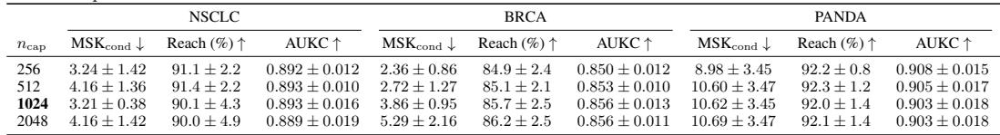

*Table 6: Sensitivity to pre-filter budget $n _ { \mathrm { c a p } }$ on FOCI-STE. All results use $\kappa = 0 . 9$ and $K _ { \operatorname* { m a x } } = 2 5 6$ Bold $n _ { \mathrm { c a p } } { \mathrm { : } }$ default.*

> 💡 **claude 批注｜Table 6 批读**: $n_{cap}$ 在 256–2048 变化时 AUKC 波动小于 0.006，但 BRCA 的 $\mathrm{MSK}_{cond}$ 从 2.36 増至 5.29。完整曲线稳定不等于最小充分 K 稳定；候选池规模必须作为正式预算变量。

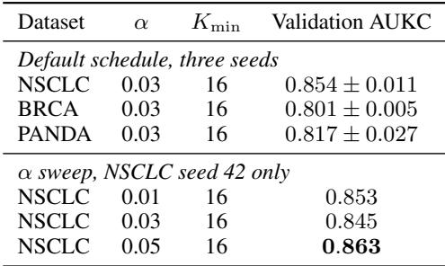

*Table 7: Adaptive K training schedule sensitivity. Top block: default $\alpha = 0 . 0 3$ with $K _ { \mathrm { m i n } } = 1 6 .$ mean±std over three seeds. Bottom block: single-seed (seed 42) α sweep on NSCLC for sensitivity characterization.*

> 💡 **claude 批注｜Table 7 批读**: adaptive K 使用 max(16, floor(0.03N))，在 $n_{cap}=1024$ 时均值约 30；α sweep 只在 NSCLC 单 seed，0.01–0.05 的 AUKC 差约 0.01–0.02。该结果只能说明局部不敏感，不能证明跨数据集预算鲁棒。

## F Extended SRP Curves

*Figure 5: Extended SRP reveal curves for seven backbones ± FOCI across NSCLC, BRCA, and PANDA. Curves show the full confidence–K trajectories behind Tables 12–14; blue solid = standalone backbone, red dashed = FOCI-augmented, shaded = ±1 std over three seeds, dotted line = κ = 0.9.*

> 💡 **claude 批注｜Figure 5 批读**: 完整曲线能区分“早期上升快但最终 Reach 低”和“起步慢但后程追回”的方法；这正是单点 MSK/AUKC 会隐藏的差异。ReadySlide 可直接复用按 K 或相对覆盖率归一化的 reveal frontier。

## G Additional analyses

## G.1 Cross-method SRP reveal curves

Figure 6 shows cross-method SRP confidence curves on TCGA-NSCLC, TCGA-BRCA, and PANDA. True-class probability $p _ { y } ( K )$ is averaged over test slides and three seeds as tiles are revealed in descending score order. SRP applies uniformly to any method’s tile ranking. ASMIL ranks strongly on NSCLC but collapses on BRCA, a failure mode not visible from slide-level AUC alone. FOCI-STE improves the TransMIL SRP footprint across datasets without the cross-dataset collapse observed in some hard-selection backbones.

*Figure 6: Cross-method SRP confidence curves on TCGA-NSCLC, TCGA-BRCA, and PANDA. True-class probability $p _ { y } ( K )$ is averaged over test slides and three seeds as tiles are revealed in descending score order.*

> 💡 **claude 批注｜Figure 6 批读**: ASMIL 在 NSCLC 的曲线强、BRCA 却崩溃，说明 hard-selection 归纳偏置与数据分布存在交互；同一 selector 在单数据集胜出不能证明可迁移。跨数据集曲线是比平均 SHI 更重要的稳健性证据。

## G.2 Inference efficiency

FOCI adds only a lightweight selector on top of the frozen backbone. Table 8 reports standard full-bag inference latency and memory, together with the offline SRP evaluation cost. Adding FOCI introduces negligible measured overhead for standard inference at the reported precision; SRP is a separate offline analysis which requires repeated masked forward passes.

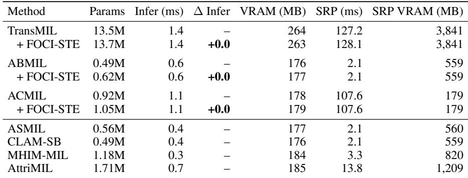

*Table 8: Inference efficiency on NSCLC (mean over 20 slides, RTX 6000 Ada). Paired rows show each backbone before and after attaching FOCI. Standard inference uses the full bag once; SRP columns report the one-time offline cost of sequential reveal evaluation.*

> 💡 **claude 批注｜Table 8 批读**: 标准 full-bag 推理里 FOCI 的测量延迟增量约 0.0 ms，但 SRP 是离线重复 masked forward：TransMIL 约 128.1 ms、3841 MB。论文把部署读出成本与审计评估成本分开，这是 ReadySlide 应复用的成本口径。

## G.3 Selected-only downstream performance

SRP and deletion-based faithfulness characterize rationale ranking quality, but they do not directly answer an audit-relevant question: if the model only sees the top-K selected tiles, does the slide-level prediction still hold? Because the backbone is frozen, the primary full-bag prediction is preserved by construction; the meaningful test is whether the selected K-tile subset alone preserves the prediction. Table 9 reports top-K classification metrics in which each (predictor, ranking) pipeline is restricted to its top-K tiles via key\_padding\_mask exclusion of the rest.

Table 9 supports the headroom interpretation rather than a universal dominance claim. On BRCA, adaptive-K FOCI preserves the full-bag TransMIL AUC (0.907), which outperforms fixed-K=32 FOCI and random K=32. On NSCLC and PANDA, random top-32 subsets already retain much of the full-bag prediction, which indicates selection-saturation regimes with limited operating margin for any external selector. ABMIL is reported as a native-pipeline reference only, since its backbone and full-bag baseline differ from TransMIL. Adaptive-K robustness on BRCA was further checked by an eval-time sweep over $K \in \{ 8 , 1 6 , 3 2 , 6 4 , 1 2 8 \}$ : selected-only AUC reaches 0.906 ± 0.015 even at K=16, which supports the $K _ { \mathrm { m i n } } \mathrm { = } 1 6$ floor used in the adaptive rule.

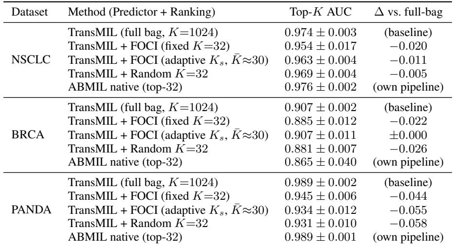

*Table 9: Selected-only downstream performance. Each row is a (predictor, ranking) pipeline restricted to top-K tiles. Adaptive K uses $K _ { s } ^ { ' } = \operatorname* { m a x } ( K _ { \mathrm { m i n } } { = } 1 6 , \lfloor \alpha N _ { s } ^ { \mathrm { r e a l } } \rfloor )$ with $\alpha = 0 . 0 3$ (average K ≈ 30 at $n _ { \mathrm { c a p } } { = } 1 0 2 4 )$ . Random $K { = } 3 2$ uses TransMIL as the predictor for a random-control baseline. ABMIL is reported under its own native backbone and attention ranking.*

> 💡 **claude 批注｜Table 9 批读**: selected-only AUC 的公平单位应是 predictor+ranking pipeline。ABMIL native 行不能和 TransMIL+FOCI 当作只换 selector 的对照；BRCA 才呈现清楚 learned-over-random gap，NSCLC/PANDA 的随机控制暴露选择饱和。

## G.4 Ablation study

STE vs. soft gate. Table 10 compares FOCI-STE and FOCI-Soft on NSCLC under the same frozen backbone, losses, and hyperparameters. FOCI-Soft uses a Gumbel-sigmoid relaxation $( T { = } 0 . 5 )$ with an entropy regularizer $( \lambda _ { \mathrm { { e n t } } } \mathrm { { = } } 0 . 1 )$ , whereas FOCI-STE uses a hard top-K forward mask with a sigmoid surrogate gradient. FOCI-Soft underperforms the freeze-only control on MSK, consistent with a soft-vs-hard cardinality gap: training uses continuous nonzero gates, whereas SRP evaluates hard top-K subsets. FOCI-STE narrows this mismatch, reduces MSK from 8.03 to 3.21, and preserves the same frozen classifier.

Frozen vs. joint training. In a pilot NSCLC/TransMIL run, unfreezing the backbone and training jointly with the rationale losses reduced validation AUC by more than 15 percentage points within two epochs. We therefore freeze the trained MIL backbone and use FOCI as a readout head over a stable feature space rather than as a jointly trained classifier component.

Loss components. Table 11 ablates each loss term by setting it to zero. The main failure mode is Reach collapse: full FOCI-STE reaches κ=0.9 on 90.1% of slides, whereas removing any single term reduces Reach to 20–34%. The sufficiency and exclusion terms are both needed to define the keep/drop contrast, and the contiguity term improves stability. Compared with the freeze-only selector, full FOCI-STE trades a small decrease in Reach/AUKC for a large MSK reduction, consistent with optimizing compact rationale recovery rather than uniformly improving every SRP metric.

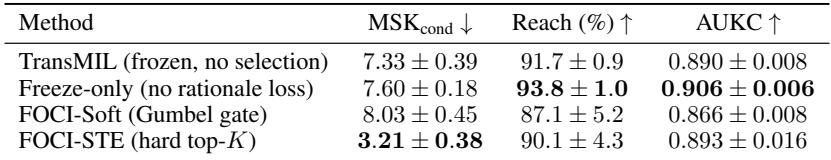

*Table 10: Gate formulation ablation on NSCLC (κ=0.9). Values are 3-seed mean except the freeze-only diagnostic control, which uses two seeds.*

> 💡 **claude 批注｜Table 10 批读**: 同一冻结 TransMIL 上，FOCI-STE 把 MSK 从 7.33 降到 3.21，而 FOCI-Soft 为 8.03；收益主要来自 hard cardinality 与 SRP top-K 对齐。FOCI-STE 的 Reach 90.1% 略低于 freeze-only 93.8%，所以压缩伴随小幅可达率代价。

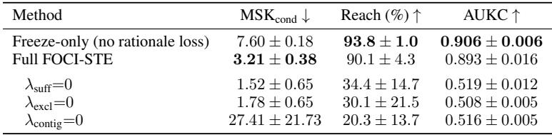

*Table 11: Loss component ablation on NSCLC (κ=0.9, 3-seed mean±std). Each row zeroes one loss while keeping the others at their tuned values.*

> 💡 **claude 批注｜Table 11 批读**: 去掉 sufficiency、exclusion 或 contiguity 任一项，Reach 都降到约 20–34%。特别是无 contiguity 时 MSK 反而升到 27.41，说明空间项不仅改变视觉形状，也显著稳定优化；它不是可有可无的展示正则。

## H Per-dataset SRP main result tables

Tables 12–14 report per-dataset SRP results at κ=0.9 for each frozen backbone and its FOCI-augmented counterpart. The Selection Headroom Index summary in Table 1 is computed from the same per-seed runs. These tables provide the raw per-dataset breakdown behind the family-wise SHI analysis in the main text.

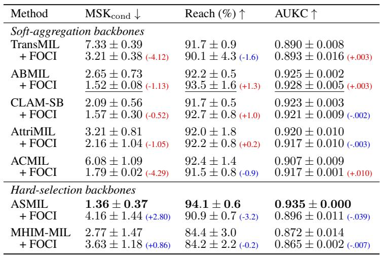

*Table 12: SRP results on NSCLC comparing each backbone with and without FOCI (3-seed mean±std). Bold/underline: best/second best. Deltas show change from baseline (improved, degraded).*

> 💡 **claude 批注｜Table 12 批读**: NSCLC 上五个 soft-aggregation backbone 的 MSK 都因 FOCI 下降，但 ASMIL 从 1.36 增至 4.16、MHIM-MIL 从 2.77 增至 3.63。外部 selector 对已有 hard-selection consumer 可能重复甚至破坏其排序。

<table>
<caption><strong>Table 13: SRP results on BRCA comparing each backbone with and without FOCI (3-seed mean±std). Bold/underline: best/second best. Deltas show change from baseline (improved, degraded).</strong></caption>
<thead>
<tr>
<th>Method</th>
<th>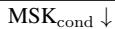</th>
<th>Reach (%) ↑</th>
<th>AUKC ↑</th>
</tr>
</thead>
<tbody>
<tr><td colspan="4"><strong><em>Soft-aggregation</em></strong> 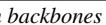</td></tr>
<tr><td>TransMIL</td><td>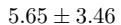</td><td>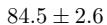</td><td>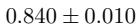</td></tr>
<tr><td>+ FOCI</td><td>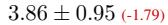</td><td>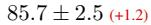</td><td>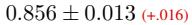</td></tr>
<tr><td>ABMIL</td><td>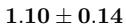</td><td>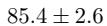</td><td>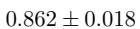</td></tr>
<tr><td>+ FOCI</td><td>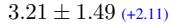</td><td>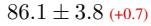</td><td>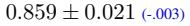</td></tr>
<tr><td>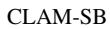</td><td>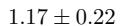</td><td>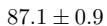</td><td>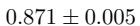</td></tr>
<tr><td>+ FOCI</td><td>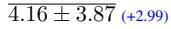</td><td>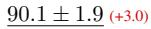</td><td>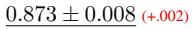</td></tr>
<tr><td>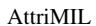</td><td>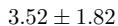</td><td>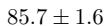</td><td>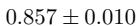</td></tr>
<tr><td>+ FOCI</td><td>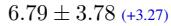</td><td>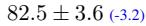</td><td>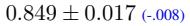</td></tr>
<tr><td>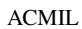</td><td>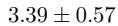</td><td>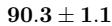</td><td>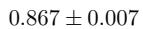</td></tr>
<tr><td>+ FOCI</td><td>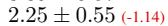</td><td>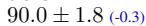</td><td>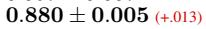</td></tr>
<tr><td colspan="4"><strong><em>Hard-selection</em></strong> 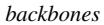</td></tr>
<tr><td>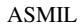</td><td>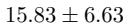</td><td>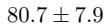</td><td>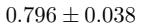</td></tr>
<tr><td></td><td></td><td></td><td></td></tr>
<tr><td></td><td></td><td></td><td></td></tr>
<tr><td></td><td></td><td></td><td></td></tr>
</tbody>
</table>

> 💡 **claude 批注｜Table 13 批读**: 重组后的 4 列表显示三种不同机制，而不是统一收益：TransMIL 的 MSK 从 5.65 降至 3.86、ACMIL 从 3.39 降至 2.25，说明二者仍有可压缩 headroom；ABMIL 与 CLAM-SB 的原生 MSK 已接近单 tile（1.10/1.17），外接 FOCI 后分别增至 3.21/4.16，属于 selection saturation；hard-selection 中 ASMIL 在 BRCA 反而由 15.83 降至 12.81，而 MHIM-MIL 由 12.2 增至 14.94，说明“外部 selector 必然与 hard selection 冲突”也不能脱离 dataset×consumer 组合下结论。

*Table 14: SRP results on PANDA comparing each backbone with and without FOCI (3-seed mean±std). Bold/underline: best/second best. Deltas show change from baseline (improved, degraded).*

> 💡 **claude 批注｜Table 14 批读**: PANDA 上 TransMIL 16.5→10.62、ACMIL 4.78→3.09；ASMIL 则 11.20→27.35。绝对 tile 数明显高于 TCGA，提示最小充分预算也受任务标签与组织异质性影响。

## H.1 Brief per-dataset interpretation

NSCLC. NSCLC shows the clearest positive-headroom pattern among soft-aggregation backbones. FOCI reduces MSK for all five soft-aggregation backbones, including TransMIL (7.33 → 3.21), ABMIL (2.65 → 1.52), and ACMIL (6.08 → 1.79). Hard-selection backbones behave differently: ASMIL has the best native MSK and AUKC on NSCLC, but attaching an external FOCI selector inflates its sufficient set, consistent with an architectural conflict mode.

BRCA. BRCA exposes the selection-saturation regime most clearly for attention-pooling backbones. ABMIL and CLAM-SB already reach near-single-tile MSK (1.10 and 1.17), which leaves little room for an external selector; ABMIL+FOCI and CLAM-SB+FOCI therefore inflate MSK despite small AUKC changes. In contrast, TransMIL and ACMIL retain headroom: FOCI reduces TransMIL MSK from 5.65 to 3.86, and ACMIL+FOCI achieves the highest BRCA AUKC (0.880) with reduced MSK.

PANDA. PANDA has higher baseline MSK for several backbones, consistent with a more distributed prediction footprint under the binarized prostate grading task. FOCI reduces TransMIL MSK from 16.5 to 10.62 and ACMIL MSK from 4.78 to 3.09. However, ABMIL+FOCI and AttriMIL+FOCI are less stable, and ASMIL+FOCI strongly degrades, which again shows that FOCI is a readout probe whose usefulness depends on backbone selection headroom rather than a universal improvement module.

Takeaway. Across datasets, the appendix tables support the main SHI result: compact post-hoc rationales are available when the frozen backbone has selection headroom, the regime saturates when the native ranking is already near-minimal, and the readout can conflict with hard-selection backbones. These tables provide the raw per-dataset breakdown for the family-wise summary in Table 1.

## I Deletion-based perturbation details

Deletion-based perturbation asks whether top-ranked tiles are load-bearing when removed from the input. This is complementary to SRP insertion: deletion measures removal impact, whereas SRP measures confidence recovery as ranked tiles are inserted. Negative values indicate that deleting the ranked tiles increases the true-class probability on average, which usually reflects saturation or noisy ranking under that perturbation protocol.

*Table 15: Deletion-based perturbation faithfulness on TCGA-NSCLC (3-seed mean±std). Faithfulness AUC summarizes the drop in true-class probability when the top-K ranked tiles are deleted, averaged over $K \in \{ 1 6 , 3 2 , 6 4 , \bar { 1 } 2 8 , 2 5 6 \}$ [41]. Higher values indicate a more load-bearing ranking.*

> 💡 **claude 批注｜Table 15 批读**: NSCLC 删除指标中 ABMIL 最高 0.0736，FOCI-on-TransMIL 为 0.0274，远高于 TransMIL proxy 的 0.0003。attention 内生排序更适合 deletion 并不意味着其 sufficient subset 更小，需和 SRP 分开解释。

*Table 16: Cross-dataset deletion-based faithfulness for the three methods with comparable per-tile scoring (3-seed mean±std, normalized by $K _ { \mathrm { m a x } } { = } 2 5 6$ to match Table 15). Higher values indicate a more load-bearing ranking; negative values indicate that deleting the ranked tiles increases the true-class probability on average. Absolute scale differs across datasets because of saturation, so comparisons are within-dataset. Bold: best within each dataset.*

> 💡 **claude 批注｜Table 16 批读**: FOCI 在 NSCLC/BRCA 的可比三方法中 deletion 最好，但 PANDA 的 ASMIL 为 0.1681、FOCI 为 0.0747。没有方法跨数据集统治三种干预轴。

## J FOCI-STE: full technical details

Hard top-K with straight-through (FOCI-STE). FOCI-Soft uses continuous Concrete gates during training, whereas SRP evaluates hard ranked subsets at test time. FOCI-STE reduces this soft-vs-hard cardinality mismatch by enforcing an exactly K-sparse binary mask in the forward pass while routing gradients through a sigmoid surrogate [36]. Given selector logits as i $a _ { s , i }$ for slide $s ,$ we define

and use the straight-through gate

The forward value of $\tilde { m } _ { s , i }$ equals the binary mask $m _ { s , i } ,$ , while the backward gradient follows the sigmoid surrogate,

Thus, exactly K tiles are selected in every forward pass, but the selector logits still receive dense surrogate gradients during optimization.

> 💡 **claude 批注｜STE 公式机制**: hard mask 在前向严格满足 K-sparse；直通表达式的数值等于二值 mask，梯度则来自 sigmoid。预算正则前向恒为 K，实际作用只在反向平滑 rank-K 边界附近的 score scale，不能把它解释成额外稀疏约束。

During training, the auxiliary keep/drop views are realized through multiplicative straight-through gating. During SRP evaluation, unrevealed tokens are excluded through the model’s masking interface (key\_padding\_mask). These two operations are not pointwise identical for every MIL pooling architecture, but they impose the same hard cardinality constraint and use the same tile ranking. This is the relevant alignment for our audit setting: the selector is trained to produce a compact ordered subset, and SRP evaluates the resulting order under hard reveal.

Although the hard top-K operator fixes the forward-pass cardinality, we retain a small per-bag budget regularizer,

Its forward value is constant at $K ,$ but its backward pass provides a small stabilizing gradient to the underlying selector scores through $\sigma ( a _ { s } )$ . This term is therefore not used to enforce sparsity in FOCI-STE (top-K already does that), but to regularize the score scale around the hard selection boundary. The FOCI-Soft counterpart uses continuous gates $z _ { s }$ and is described in §3.4.

FOCI-STE is one parameterization of the same frozen-backbone audit framework as FOCI-Soft. The central object of study is not the gate parameterization itself, but whether a frozen WSI-MIL classifier exhibits selection headroom under a consistent tile ranking.

## K Loss term details

This appendix clarifies three implementation details that are abbreviated in the main method: the budget regularizer, the FOCI-Soft entropy term, and the shorthand “sufficiency objective.”

Budget regularizer. For FOCI-Soft, the budget term is applied to the continuous Gumbel-sigmoid gates:

> 💡 **claude 批注｜FOCI-Soft 预算公式**: 这里的 $z_{s,i}\in(0,1)$ 是 slide $s$ 上 tile $i$ 的连续 Gumbel-sigmoid gate，$\mathcal{L}_{budget}=\sum_i z_{s,i}$ 直接惩罚一袋中的总选择质量；配合 $\lambda_{budget}=5\times10^{-3}$，它鼓励少量高 gate、抑制遍布全袋的中等权重，但不会把前向选择数严格固定为某个 $K$。Table 10 中 FOCI-Soft 的 MSK 为 8.03、劣于冻结 TransMIL 的 7.33，说明仅靠 mass penalty 仍不能解决连续 gate 训练与 hard top-K SRP 之间的 cardinality mismatch。

where $z _ { s , i } \in ( 0 , 1 )$ is the soft gate for tile i in slide s. This term discourages diffuse high-mass gates and encourages the selector to use a compact subset.

For FOCI-STE, the hard top-K forward mask already fixes the selected cardinality exactly, $\begin{array} { r } { \sum _ { i } m _ { s , i } = K } \end{array}$ . We therefore apply the budget term to the straight-through gate $\tilde { m } _ { s }$ defined in Appendix J:

> 💡 **claude 批注｜FOCI-STE 预算公式**: $\tilde m_{s,i}$ 的前向值等于 exactly-$K$ 的二值 top-K mask，所以 $\sum_i\tilde m_{s,i}=K$ 在前向是常数，不能再“多压掉几个 tile”；它只借 straight-through 的 sigmoid surrogate 在反向给 rank-$K$ 边界附近的 logits 一个小尺度正则。因而 Table 10 中 STE 将 MSK 从 7.33 降至 3.21 的关键应解释为训练前向与 SRP hard reveal 对齐，而不是这项预算损失额外制造了稀疏性。

Its forward value is constant at $K ,$ , but its backward pass provides a small stabilizing gradient through the sigmoid surrogate. Thus, in FOCI-STE, $\mathcal { L } _ { \mathrm { b u d g e t } }$ regularizes score scale near the rank-K boundary rather than enforcing sparsity. We use $\lambda _ { \mathrm { b u d g e t } } = 5 \times 1 0 ^ { - 3 }$ in both FOCI-Soft and FOCI-STE.

Sufficiency objective shorthand. We use “sufficiency objective” as shorthand for the keep-bag terms $\mathcal { L } _ { \mathrm { s u f f } }$ and $\mathcal { L } _ { \mathrm { h i n g e } }$ . Both are computed on the keep bag, but they enter the total objective with different weights: $\mathcal { L } _ { \mathrm { s u f f } }$ encourages recovery of the target-class output, while $\dot { \mathcal { L } } _ { \mathrm { h i n g e } }$ enforces the operating-confidence margin used during selector training.

FOCI-Soft entropy term. FOCI-Soft uses continuous gates and therefore does not impose an exact tile count during training. To prevent diffuse fractional masks, we add an entropy penalty

> 💡 **claude 批注｜FOCI-Soft 熵公式**: $\mathcal{H}(z_s)$ 对一袋内每个连续 gate 的 Bernoulli entropy 求平均，$\lambda_{ent}=0.1$ 只用于 FOCI-Soft，目标是把 $z_{s,i}$ 推向 0 或 1，减少大量模糊的 fractional gates。它改善的是 gate 的二值化倾向而非精确 cardinality；即使同时使用 entropy 与 budget mass，Soft 前向仍保留所有非零 token，因此 Appendix G.4 的 8.03 MSK 表明该熵项不足以替代 STE 的 hard top-K 对齐。

which pushes the continuous gates toward binary values. This entropy term is used only for FOCI-Soft; FOCI-STE obtains exact hard cardinality through the top-K forward mask.

## L Full experimental setup details

## L.1 Datasets and features

We evaluate on three public WSI benchmarks (TCGA-NSCLC, TCGA-BRCA, and PANDA), all with slide-level labels and no patch-level annotation.

NSCLC. The non-small-cell lung cancer cohort comprises 1,043 slides (729 train / 105 validation / 209 test). Each slide is labeled LUAD (lung adenocarcinoma) or LUSC (lung squamous cell carcinoma).

BRCA. The breast cancer cohort contains 1,126 slides (724 train / 179 validation / 223 test), labeled as invasive ductal carcinoma (IDC) versus other subtypes. The class distribution is skewed (≈ 73% IDC), and the boundary between IDC and the rarer subtypes is histologically subtle.

PANDA. The PANDA prostate grading dataset [13] has 10,615 slides (6,793 train / 1,699 validation / 2,123 test). Labels are binarized as benign (ISUP grade 0) versus malignant (ISUP grade ≥ 1).

Features. Slides are tiled at 20× magnification into 256×256 patches. We extract d=1536-dimensional features using frozen UNI2-h [4], a vision transformer pretrained on a large-scale histology corpus. Features are extracted once and stored as HDF5 files, and the encoder is never updated. For both FOCI training and SRP evaluation, slides with more than $n _ { \mathrm { c a p } } { = } 1 0 2 4$ patches are pre-filtered to the top $n _ { \mathrm { c a p } }$ tokens by feature L2 norm before MIL aggregation; see Appendix E.2 for sensitivity.

> 💡 **claude 批注｜两级选择与预算**: 原始 WSI 先切成 20×、256×256 tile，再按 feature L2 预筛到最多 1024，FOCI 才从中排序/选 K。故论文的“最小 tile 数”是候选池内充分数，不等价于从整张 WSI 原始 tile 空间直接选出的全局最小集。ReadySlide 应同时记候选构建成本、候选 recall 与最终 K。

## L.2 Implementation details

Backbone. The primary FOCI-STE backbone is a four-layer TransMIL [15] with $d _ { \mathrm { m o d e l } } { = } 5 1 2$ , eight attention heads, and a learned [CLS] token, pretrained for 20 epochs with cross-entropy on the full bag. For cross-backbone experiments, FOCI is additionally applied post-hoc to ABMIL (d=512), CLAM-SB (d=256), AttriMIL (d=512), ACMIL (d=512), ASMIL (d=256), and MHIM-MIL (d=512), each pretrained independently with its original objective. In all cases, the encoder and MIL backbone are fully frozen during FOCI training.

FOCI-STE training. The selection module is a two-layer MLP $( d { = } 5 1 2  2 5 6  1 )$ with 132,609 parameters, which is under 1% of the primary TransMIL pipeline. We train the selector for 30 epochs with a 5-epoch linear warmup using AdamW with cosine annealing from $1 0 ^ { - 4 } ~ \mathrm { t o } ~ 1 0 ^ { - 5 } ;$ the selector uses a $5 \times$ learning-rate multiplier relative to the base schedule and an AdamW weight decay of 0.3. The frozen encoder and backbone are not optimized. Batch size is 2, and slides are padded to $n _ { \mathrm { c a p } }$ tokens. FOCI-STE selects exactly K=32 tiles per slide in the forward pass.

The sufficiency cross-entropy and exclusion losses are weighted equally $( \lambda _ { \mathrm { s u f f } } = \lambda _ { \mathrm { e x c l } } = 0 . 5 ) .$ , with the keepbag confidence hinge added at $\lambda _ { \mathrm { h i n g e } } { = } 1 . 0$ and a light spatial compactness term $( \lambda _ { \mathrm { c o n t i g } } { = } 0 . 0 1 )$ ) to encourage contiguous selections without dominating the rationale losses. The training sufficiency target is set to $\tau { = } 0 . 9 .$ numerically matching the SRP operating threshold $\kappa { = } 0 . 9$ used in the main evaluation; the drop-bag tolerance in the exclusion loss $( \ S \bar { \ S } . \ 4 )$ is set to β=0.2. For FOCI-Soft, we add budget and entropy penalties $( \mathrm { \hat { \lambda } _ { b u d g e t } } = 5 \times 1 0 ^ { - 3 }$ $\lambda _ { \mathrm { e n t } } { = } 0 . 1 )$ to push the continuous gates toward binary values.

Unless otherwise stated, FOCI-STE is trained with the fixed K=32 budget above. The adaptive-K schedule $K _ { s } = \operatorname* { m a x } ( 1 6 , \lfloor 0 . 0 3 N _ { s } ^ { \mathrm { r e a l } } \rfloor )$ is evaluated separately in §G.3 for selected-only downstream analysis and in Appendix E.3 for budget-sensitivity analysis. All reported results are averaged over three seeds and evaluated at $\kappa { = } 0 . 9$

## L.3 Baselines

We compare seven MIL methods, all trained with the same frozen UNI2-h features. TransMIL [15] is the primary frozen backbone without rationale selection. ABMIL [2] uses scalar attention weights. CLAM-SB [3] adds instance-level discrimination via an auxiliary loss. AttriMIL [18] decomposes attention across attribute heads. ACMIL [19] uses multiple attention branches with masked patch training to capture complementary diagnostic regions. ASMIL [37] trains with top-K attention sampling. MHIM-MIL [17] uses masked hard instance mining.

Each baseline is re-evaluated under SRP using its own native per-tile ranking score, summarized in Table 3 (Appendix C).

## M Limitations and future work

Limitations. SRP measures model-output sufficiency, not annotation-validated clinical sufficiency. The selected tiles are candidate rationales for a frozen classifier and do not establish pathologist-level diagnostic sufficiency or clinical utility. Our main experiments use UNI2-h features; because the current FOCI-STE pipeline has not been evaluated across a broad set of pathology encoders, we do not claim universal encoder agnosticism. Extending FOCI to ground-truth tumor annotations (e.g., CAMELYON16/17), broader encoder benchmarks, external clinical cohorts, and multi-reader pathologist studies would be needed to argue clinical relevance beyond model-sufficient rationale highlighting; we leave these directions to future work.

> 💡 **claude 批注｜ReadySlide 可补的证据**: 应补两种不可混称的参照：consumer-optimal combinatorial Oracle 在固定 consumer、候选池、真标签 target、阈值与可行子集空间内最小化 K，用来上界同 consumer selector 的选择性能；tumor/region/reader annotation 则只测临床定位 alignment，不要求保持 consumer 证据。再叠加跨 encoder/consumer transfer、外部队列与 reader study，才能同时量化 selection gap 与临床 gap。

## N Predicted-class SRP variant (audit-time view)

The main SRP analysis tracks $p _ { y } ( K )$ against the ground-truth label $_ { y , }$ which jointly assesses confidence recovery and correctness on labeled test sets. In an audit-time setting, however, explanations are often requested for the model’s own predicted class ${ \hat { y } } = \operatorname { a r g }$ maxc $f _ { c } ( X )$ . We therefore report a predicted-class SRP variant using the same insertion-style reveal protocol, but with K-curves tracking $p _ { \hat { y } } ( K )$

For the binary classification tasks studied here, this variant can be recovered from the stored K-curves without retraining or re-evaluating any model: for slides where $\hat { y } = y , p _ { \hat { y } } ( K ) = p _ { y } ( K )$ , and for slides where $\hat { y } \neq y ,$ $p _ { \hat { y } } ( K ) = 1 - p _ { y } ( K )$ . We report this audit-time view for the TransMIL baseline and TransMIL+FOCI on all three datasets.

*Table 17: Predicted-class SRP variant on TransMIL baseline vs. TransMIL+FOCI (3-seed mean±std at $\kappa { = } 0 . 9 )$ . Reach, $\mathrm { M S K } _ { \mathrm { c o n d } }$ , and AUKC are computed against the model’s own predicted class yˆ rather than the ground-truth label $y .$ . The qualitative pattern matches ground-truth SRP: FOCI compresses MSK on all three datasets, which supports the interpretation that the readout recovers the frozen model’s own decision rather than exploiting label-specific evaluation.*

> 💡 **claude 批注｜Table 17 批读**: 这里仅把评估 K-curve 的 target 从真标签 $y$ 改成 frozen full-bag predicted class $\hat y$，所以错误分类 slide 也可评估 predicted-class recovery，Reach 通常更高；selector 并未以 $\hat y$ 重训，仍使用真标签 keep CE/hinge 与 drop exclusion。因此该表支持“同一 learned ranking 在 predicted-class 视图下也压缩 MSK”，不等于主训练在蒸馏 full-bag 决定。

Predicted-class SRP changes both the reachable set and the target probability being tracked, so its MSK is not expected to match ground-truth SRP exactly. In our binary tasks, the qualitative compression pattern remains the same: TransMIL+FOCI reduces predicted-class MSK on all three datasets. Reach is generally higher under predicted-class SRP because correctness is no longer required. We report predicted-class SRP as a complementary audit view; ground-truth SRP remains the appropriate benchmark for rationale quality on labelled test sets. For binary classification, this analysis also characterizes recovery of the model’s own decision on incorrectly classified slides. Multiclass extensions require tracking $p _ { \hat { y } } ( K )$ directly and are not addressed in this paper.

## 🔖 附录总结

- full-bag 等价在 7 backbone × 3 dataset × 3 seed 上验证到四位小数。
- 预算有三层：原始 WSI tile、L2 候选池 $n_{cap}$、SRP reveal K；三者不能混写。
- FOCI-STE 的 hard K 对齐是有效机制，但 learned selector 仍 consumer-dependent。
- 附录没有 consumer-optimal combinatorial search、clinical/annotation alignment 或跨 consumer 复用矩阵，这是 ReadySlide 最明确的三类增量空间。
