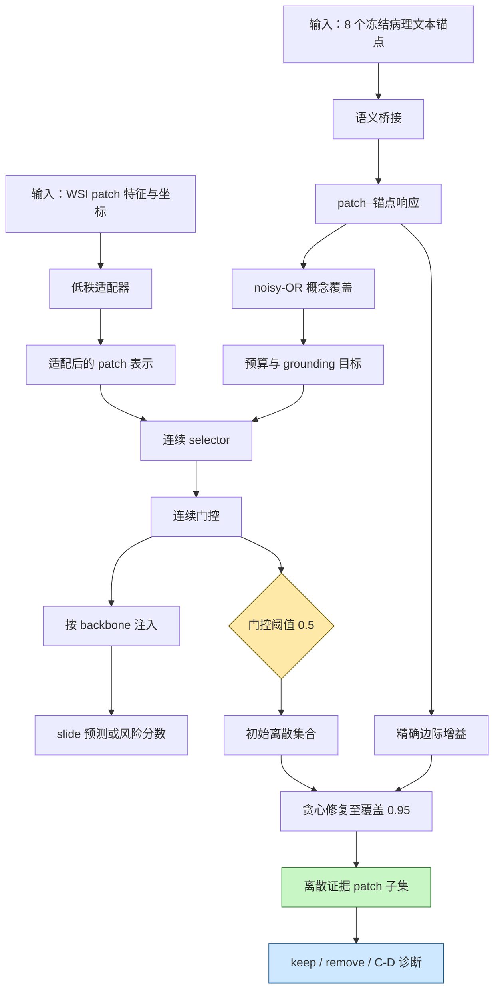

# GCE-MIL：用于全视野病理图像多实例学习的忠实且可恢复证据

**英文题名**：GCE-MIL: Faithful and Recoverable Evidence for Multiple Instance Learning in Whole-Slide Imaging  
**作者**：Xiangyu Li，Ran Su  
**机构**：天津大学智能与计算学部  
**发表状态**：arXiv 预印本 | **年份**：2026 | **类别**：计算机视觉与模式识别  
**链接**：[arXiv 摘要](https://arxiv.org/abs/2605.17456) · [PDF](https://arxiv.org/pdf/2605.17456) · [Connected Papers](https://www.connectedpapers.com/main/2605.17456)

## 一句话总结

GCE-MIL 不再把为分类而学的 attention 直接冒充证据，而是用 Sufficiency、Necessity、Recoverability 三个可干预标准训练一个病理语义锚定、可连续优化且可离散恢复的证据 selector，并把它作为九类 MIL backbone 的插件。

## 核心贡献

1. 把 MIL 证据质量拆成三个互不蕴含的标准：只保留证据是否足够、删去证据是否真正伤害预测、训练时连续门控能否忠实恢复为推理时离散 patch 集合。
2. 用 BRACS 递归充分子集实验诊断证据非唯一性：在 $k=8$ 时，每张 slide 平均有 2.2302 个互斥充分子集，72.67% 的 slide 至少存在两个。
3. 提出 GCE wrapper：8 个冻结 TITAN 文本锚点与低秩 bridge 产生 patch–concept 响应，连续 selector 输出门控，noisy-OR 计算多源概念覆盖，阈值加边际增益修复输出离散证据。
4. 预测主结果覆盖 9 个 backbone × 9 个数据集的 81 个配置；证据诊断、稳定性、定位、消融和成本采用更窄的专门实验范围，不能视为每个 81 配置都完整检查。
5. 用同预算实验排除“只是多选了 patch”的解释：约 5% 证据比例下，GCE discrete 在 BRACS 上达到 0.748 Macro-F1、0.004 prediction gap、0.412 complement degradation。

## 📖 批读导航

| 分节 | 内容 |
|---|---|
| [00 - 摘要](sections/00-abstract.md) | 研究问题、三类失败、方法组成与 headline 数字 |
| [01 - 引言](sections/01-introduction.md) | 临床干预动机、BRACS 证据非唯一性、贡献 |
| [02 - 相关工作](sections/02-related-work.md) | 与预测型 MIL、稀疏门控、事后归因、概念解释的边界 |
| [03 - 预备知识与动机](sections/03-preliminaries-and-motivation.md) | S/N/R 精确定义与三种干预协议 |
| [04 - GCE-MIL 方法](sections/04-grounded-continuous-evidence-mil.md) | 锚点 grounding、连续 selector、noisy-OR、训练目标与离散恢复 |
| [05 - 实验](sections/05-experiments.md) | 主结果、组件消融、同预算 keep/remove、定性图 |
| [06 - 结论](sections/06-conclusion.md) | 结论主张与适用边界 |
| [07 - 参考文献与附录](sections/07-references-and-appendix.md) | 理论、算法、全部补充表、失败审计、成本、数据与可视化 |

## 关键数字

| 指标或设置 | 数值 | 含义 |
|---|---:|---|
| 评估矩阵 | 9 backbone × 9 数据集 = 81 配置 | 检查 wrapper 的架构与任务兼容性 |
| 平均预测变化 | Macro-F1 +0.024；C-index +0.014 | 证据优化没有以普遍牺牲任务效用为代价 |
| attention keep-only 变化 | −0.078 | 只保留高 attention patch 时证据不充分 |
| attention remove 变化 | −0.033 | 删除高 attention patch 后模型大多仍能恢复 |
| GCE keep/remove 变化 | +0.004 / −0.176 | 证据子集自身足够，删除后又明显伤害预测 |
| ABMIL attention C-D gap | 0.029 | 连续 attention 与离散集合不一致 |
| 完整 GCE 的 BRACS C-D gap | 0.004 | 阈值加修复后软硬证据接近 |
| 运行证据预算 | $\rho=0.05$ | 主表约选择 5% patch |
| 恢复设置 | 阈值 0.5；覆盖目标 0.95 | 先阈值，再按 noisy-OR 边际修复 |
| selector 退火 | $T: 1.0\rightarrow0.4$ | 把连续门控推向双峰 |
| 缓存特征成本 | aggregation 0.22×；显存 0.18× | 只减少 MIL 聚合阶段成本 |
| 可选 tile 预筛 | end-to-end 0.20×；效用 0.989× | headline 5× 的实际部署口径 |

## 三类证据失败与干预协议

| 失败 | 精确定义 | 干预输入 | 输出与判据 | GCE 对应修复 |
|---|---|---|---|---|
| 不充分 | 子集 $S$ 不能保持全包预测 | 只保留 $S$ 得到 $X_S$ | 同一 consumer 上类别、概率或任务指标下降；keep-only drop 越低越好 | 5% budget 下联合 task loss，noisy-OR 覆盖多个诊断概念 |
| 不必要 | 删除 $S$ 后预测几乎不变 | 保留补集 $X_{\neg S}$ | complement degradation 越高，说明 $S$ 越不可替代 | TITAN 病理锚点与 grounding loss 避免选择任意显著或重复 patch |
| 不可恢复 | 连续训练信号不能变成忠实离散集合 | 形式定义比较 $X_\pi$ 与纯阈值集合 $X_{S(\pi)}$；GCE 实测比较 $X_\pi$ 与修复后集合 $X_{S^*}$ | C-D gap 越低越好；形式集合与实测集合必须注明 | 温度退火到 0.4；先以 0.5 阈值得 $S_0$，再只按 noisy-OR 边际修复至 anchor coverage 0.95 |

这里的“证据”始终是相对于指定 consumer 的模型证据，不等价于临床因果。按本文形式定义，删除 $S$ 后性能或真类置信显著下降才说明 $S$ necessary；当 $S=X$ 时，补集为空，性能通常也会显著下降，因此整包可以同时满足 Sufficiency、Necessity，若 $\pi=\mathbf{1}$ 且阈值恢复仍为整包，也可满足 Recoverability。三项定义本身不保证证据紧凑，紧凑性来自单独的 budget/cardinality 约束。多源冗余又会使某个充分子集不具 Necessity，所以三项干预仍需分别报告。

## 数据流：输入 → 中间表示 → 输出

*方法图：host backbone 不变，GCE 在输入侧增加语义 grounding、连续门控与离散恢复。*

## 面向 ReadySlide 的专项判断

### 诊断到方法组件的证据链

1. **诊断**：attention top-k 的 keep-only 下降 0.078、remove 仅下降 0.033、ABMIL C-D gap 0.029，说明高权重排序同时存在不充分、不必要和软硬不一致。
2. **失败分类**：BRACS 中 72.67% slide 有至少两个互斥充分子集，证明 failure 不只是 $k$ 选错，而是单一 softmax 排名无法表达多源、等价证据。
3. **组件修复**：budget control 首先把 C-D gap 0.055→0.011；discrete recovery 再到 0.006；semantic grounding 把 complement degradation 0.377→0.403；完整模型到 0.004/0.412。
4. **外部与反事实检查**：同预算 Table 5/9 排除集合大小混淆，CAMELYON-16 Dice/FROC 提供有限空间真值，random/shuffled anchor 排除单纯容量解释。

### 已有先例与本文较安全的组合贡献

- “attention 不等于解释”、Sufficiency/Necessity 干预、稀疏 rationale 与同 fraction 的 post-hoc 比较都有既有先例，不能由本文独占。
- 本文较安全的贡献是面向 WSI MIL 的 GCE 特定组合：病理 foundation-model 文本锚点、noisy-OR 多源覆盖、连续门控与 threshold-plus-repair，以及按 host 类型注入。
- 九类 MIL host 证明该 GCE wrapper 可分别联合训练并保持预测效用；这不是固定 selector 的跨 consumer transfer。
- Table 11 只匹配 evidence fraction；GCE 联合训练 selector 与 predictor，而 gradient/integrated-gradients/occlusion 解释的是 fixed predictor。它支持“本文训练制度下 GCE 优于所列 post-hoc baseline”，不能排除严格 frozen-consumer post-hoc benchmark 的创新空间。

### 仍为空白的选择器—消费者—预算矩阵

| selector 来源 | consumer | budget | 本文覆盖情况 | ReadySlide 可做什么 |
|---|---|---|---|---|
| 与 consumer 联合训练的 GCE | 原训练 MIL | 固定约 5% | 主协议已覆盖；详细同预算对照集中在 BRACS | 作为强基线，但需复现到更多数据集 |
| 与 consumer 联合训练的 GCE | 原训练 MIL | 多预算 | 只在 BRACS 做 sweep | 跨数据集、跨任务画完整 Pareto 曲线 |
| 同一个已训练 selector | 不同 MIL consumer | 固定预算 | 空白；九个 host 都是分别训练 | 测 evidence transfer，不重新训练 selector |
| 不同病理 foundation model 的 selector | 同一 consumer | 固定预算 | 空白；Table 19 换 encoder 但 selector 仍重训 | 比较 UNI、TITAN、其他 FM 选择出的集合及 S/N/R |
| 不同 foundation-model selector | 不同 consumer | 同一预算 | 空白 | 构建真正 selector × consumer 交叉矩阵 |
| post-hoc selector | 严格冻结的同一 consumer | 匹配 fraction 与查询成本 | Table 11 仅匹配 fraction，训练制度不同 | 建立 frozen-consumer、等查询预算的公平基准 |
| 任意 selector | 分类、survival、报告/VLM consumer | 自适应预算 | 基本空白 | 学习逐 slide budget，并报告临床风险–成本曲线 |
| 集合值 selector | 任意 consumer | 固定或自适应 | 空白 | 输出多个等价充分集合，而非单一排名 |

最重要的区分是：本文的“跨 backbone”是 wrapper 分别随 host 训练，并没有证明一个 selector 的证据能迁移到另一个 consumer；“跨 encoder”也没有固定 selector 做 transfer。这两处正是 ReadySlide 可以形成新 benchmark 的空间。

## 优缺点与还能做什么

### 优点

- 指标与机制对齐：每个 failure 都有明确干预、对应组件和消融数字。
- 对证据非唯一性给出递归充分子集诊断，避免把单一排名当唯一真相。
- 同一 noisy-OR utility 贯穿连续训练和离散修复，推理集合不是无关的 post-hoc top-k。
- 预测主结果覆盖 81 个 backbone–dataset 配置；此外用三个分类集的 Table 8、BRACS 专项消融/预算、BRACS/LUAD encoder 表和独立 CAMELYON-16 定位形成分层证据。
- 清楚限定理论只保证 coverage 层面的次模性质，没有夸大为分类全局最优。

### 局限与风险

- 8 个锚点来自预先选择的疾病形态先验；没有 patch-level 概念真值，anchor 完备性只通过间接指标支持。
- Sufficiency/Necessity 多为同一 consumer 的模型相对证据，不能直接推出临床因果或病理学正确。
- 阈值 0.5、覆盖目标 0.95 没有完整逐 slide、逐 fold 二维 sweep；论文明确缺少相应缓存。
- 5% budget 的主依据来自 BRACS validation，跨任务最优预算未建立。
- 多 backbone 与多 encoder 实验都重新训练 GCE，尚未验证 selector transfer。
- 主九数据集矩阵没有外部跨中心证据稳定性；CAMELYON-16 只提供额外定位检查。
- 附录 M 只用一段文字讨论 patch 粒度、固定锚点迁移与模型相对证据；Table 21/22 没有 MinerU 表格图，只能保留英文文本行。

### 还能做什么

- 把 S/N/R 从单 consumer 指标升级为跨 consumer 的证据可迁移性。
- 把一个 slide 的“证据”建模为多个等价充分集合，并测集合族覆盖率与互斥性。
- 将 budget 从全局 5% 常数改为逐 slide、按风险与成本自适应的决策变量。
- 对 scanner、中心、染色、encoder 与 prompt 扰动分别做证据稳定性分解。
- 引入病理专家概念/区域标注，区分“对模型必要”与“对诊断正确”。
- 在分类、survival、VLM 报告生成等 consumer 之间测试同一 selector，形成 ReadySlide 的完整交叉 benchmark。

## 阅读 Q&A 记录

- **问：Sufficiency 与 Necessity 为什么不能只选一个？**  
  **答**：整包 $S=X$ 会平凡满足 Sufficiency；因为删去整包得到空袋，性能通常显著下降，它也可能满足 Necessity；若全 1 门控阈值后仍为整包，还可满足 Recoverability。紧凑性不是 S/N/R 定义推出的，而由 budget/cardinality 另外控制。对非整包子集，一个区域也可能因上下文交互而 necessary 却单独不 sufficient，所以 Table 4 仍需同时报告 keep-only 与 remove。

- **问：Recoverability 是否等于证据正确？**  
  **答**：不是。形式定义比较连续门控 $\pi$ 与纯阈值集合 $S(\pi)$；论文对 GCE 报告的 C-D gap 实际使用 Algorithm 1 的 threshold-plus-repair 输出 $S^*$。repair 的停止条件只有 anchor coverage ≥0.95，不调用 classifier 检查 prediction sufficiency。即便 C-D gap 很低，也仍要另做 keep-only、remove 和 CAMELYON 定位。

- **问：noisy-OR 真正改变了什么中间表示？**  
  **答**：它把 patch–anchor 响应 $r_{im}$ 与门控 $\pi_i$ 聚合为“至少一个 patch 覆盖锚点 $m$”的效用 $v_m$；饱和性让重复形态的边际收益下降，从单一 attention 排名转向互补概念覆盖。对应方法 4.3、公式 4–5 和 Figure 9。

- **问：离散恢复为何不是任意后处理？**  
  **答**：0.5 阈值后，Algorithm 1 仍使用训练时同一 noisy-OR utility 的精确边际增益补 patch，直到 coverage 0.95；Table 17 显示固定 5% hard top-k 的 C-D gap 0.031，而 recovered selector 为 0.005。

- **问：实验是否证明了跨 backbone 的 selector transfer？**  
  **答**：没有。Table 2/8 证明 GCE 能分别接到九个 host 并训练，Table 19 证明换 encoder 后重新训练仍有收益；它们没有固定一个 selector 再换 consumer。这个缺口正适合 ReadySlide。

- **问：headline 5× 是否适用于常规验证？**  
  **答**：不是。缓存特征时主要收益是 aggregation 0.22×、显存 0.18×；end-to-end 0.20× 需要可选 tile prefiltering，并伴随相对效用降到 0.989×。对应附录 J.8–J.9 和 Table 23。

## 📊 Citation Landscape

**查询快照**：2026-08-19 09:40–09:41 UTC。三次请求均调用 Semantic Scholar 官方 API，按 detail → references → recommendations 串行执行，请求间隔至少 3 秒。论文已解析为 [Semantic Scholar 条目](https://www.semanticscholar.org/paper/3a95513c8d518324e230ad68d87ad23c5c62959a)，paperId 为 `3a95513c8d518324e230ad68d87ad23c5c62959a`。

### 自动摘要

**TLDR 中文转述**（Semantic Scholar 字段模型：`tldr@v2.0.0`）：GCE-MIL 是一个不依赖特定 backbone 的 wrapper，通过语义 grounding、作为干预证据搜索可微代理的 noisy-OR coverage，以及由边际增益引导的 threshold-plus-repair，把连续 selector 恢复为离散证据集合。

### 引用统计

| 字段 | API 返回值 |
|---|---:|
| 发表年份 / 日期 | 2026 / 2026-05-17 |
| 参考文献数 | 79 |
| 被引次数 | 0 |
| 重要引用数 | 0 |
| Semantic Scholar Corpus ID | 288651267 |

论文发布仅约三个月且当前被引为 0，因此“相关工作重要性”不能按本论文的 citing papers 判断；下面只对其 references API 返回的论文按主题归类，并在每组内部严格按 `citationCount` 降序排列。主题标签是本批读的归类，不是 Semantic Scholar 自动标签。

### 参考文献分组

#### 全视野病理 MIL 与 backbone

1. [Clinical-grade computational pathology using weakly supervised deep learning on whole slide images](https://doi.org/10.1038/s41591-019-0508-1)（2019，2654）
2. [Data-efficient and weakly supervised computational pathology on whole-slide images](https://arxiv.org/abs/2004.09666)（2020，2269）
3. [TransMIL: Transformer based Correlated Multiple Instance Learning for Whole Slide Image Classification](https://arxiv.org/abs/2106.00908)（2021，1377）
4. [Dual-stream Multiple Instance Learning Network for Whole Slide Image Classification with Self-supervised Contrastive Learning](https://arxiv.org/abs/2011.08939)（2020，1033）
5. [DTFD-MIL: Double-Tier Feature Distillation Multiple Instance Learning for Histopathology Whole Slide Image Classification](https://arxiv.org/abs/2203.12081)（2022，532）

#### 归因、干预与概念解释

1. [Axiomatic Attribution for Deep Networks](https://arxiv.org/abs/1703.01365)（2017，8500）
2. [Deep Inside Convolutional Networks: Visualising Image Classification Models and Saliency Maps](https://arxiv.org/abs/1312.6034)（2013，8467）
3. [Interpretability Beyond Feature Attribution: Quantitative Testing with Concept Activation Vectors](https://arxiv.org/abs/1711.11279)（2017，2455）
4. [Interpretable Explanations of Black Boxes by Meaningful Perturbation](https://arxiv.org/abs/1704.03296)（2017，1745）
5. [RISE: Randomized Input Sampling for Explanation of Black-box Models](https://arxiv.org/abs/1806.07421)（2018，1595）

#### 连续稀疏选择与 rationale 学习

1. [Categorical Reparameterization with Gumbel-Softmax](https://arxiv.org/abs/1611.01144)（2016，6613）
2. [The Concrete Distribution: A Continuous Relaxation of Discrete Random Variables](https://arxiv.org/abs/1611.00712)（2017，2981）
3. [Learning Sparse Neural Networks through L0 Regularization](https://arxiv.org/abs/1712.01312)（2017，1345）
4. [ERASER: A Benchmark to Evaluate Rationalized NLP Models](https://arxiv.org/abs/1911.03429)（2019，878）
5. [Learning to Explain: An Information-Theoretic Perspective on Model Interpretation](https://arxiv.org/abs/1802.07814)（2018，671）

#### 病理 foundation model 与视觉语言预训练

1. [Towards a General-Purpose Foundation Model for Computational Pathology](https://doi.org/10.1038/s41591-024-02857-3)（2024，1743）
2. [Benchmarking Self-Supervised Learning on Diverse Pathology Datasets](https://arxiv.org/abs/2212.04690)（2022，243）
3. [Multimodal Whole Slide Foundation Model for Pathology](https://arxiv.org/abs/2411.19666)（2024，234）
4. [Visual Language Pretrained Multiple Instance Zero-Shot Transfer for Histopathology Images](https://arxiv.org/abs/2306.07831)（2023，189）
5. [GECKO: Gigapixel Vision-Concept Contrastive Pretraining in Histopathology](https://arxiv.org/abs/2504.01009)（2025，10）

括号中依次为年份与本次 API 返回的 `citationCount`；这些计数会随 Semantic Scholar 更新而变化。

### 推荐论文

Recommendations API 返回以下 10 篇，顺序保留 API 原始顺序；本次查询时它们的 `citationCount` 均为 0。

1. [BagShift: Measuring How Patch Selection Changes the Evidence Seen by Whole-Slide MIL](https://arxiv.org/abs/2608.15970)（2026）
2. [CGRL: Concept-Guided Pruning and Representation Learning for Whole-Slide Image Classification](https://arxiv.org/abs/2607.12556)（2026）
3. [PatchGen: Learning Soft Intra-Image Predictive Subsets for Visual Generalization](https://arxiv.org/abs/2608.12766)（2026）
4. [Test-Time Instance Selection for Improved Whole Slide Image Analysis](https://arxiv.org/abs/2608.14759)（2026）
5. [Objective Design for Self-Supervised Slide-Level Aggregation over Frozen Pathology Foundation Features](https://www.semanticscholar.org/paper/802f36329f348d615bf3cfb13aebe7378af6d524)（年份未返回）
6. [From Patches to Evidence Balls: Class-Conditioned Evidence Retrieval for Few-Shot Whole Slide Image Classification](https://arxiv.org/abs/2608.01104)（2026）
7. [TaxoMIL: Taxonomy-Constrained Learning for Hierarchical Whole Slide Image Analysis](https://arxiv.org/abs/2606.31100)（2026）
8. [KHiM-Mamba: Injecting Pathology Knowledge into Mamba via Hidden-State Modulation for Whole Slide Image Analysis](https://arxiv.org/abs/2608.14757)（2026）
9. [PNEA-MIL: Interpretable Multiple-Instance Learning for Whole-Slide Images through Positive-Negative Evidence Analysis](https://doi.org/10.1145/3807503.3819367)（2026）
10. [DeCo-MIL: Debiased Counterfactual Reasoning for Long-Tailed Whole Slide Image Analysis](https://arxiv.org/abs/2608.14719)（2026）

**官方接口**：[论文详情](https://api.semanticscholar.org/graph/v1/paper/ArXiv:2605.17456?fields=paperId%2Ctitle%2Cyear%2CpublicationDate%2CcitationCount%2CreferenceCount%2CinfluentialCitationCount%2Ctldr%2Cvenue%2CexternalIds%2Curl) · [参考文献](https://api.semanticscholar.org/graph/v1/paper/3a95513c8d518324e230ad68d87ad23c5c62959a/references?fields=title%2Cyear%2CcitationCount%2Cvenue%2CexternalIds&limit=1000) · [推荐接口（POST）](https://api.semanticscholar.org/recommendations/v1/papers/) · [Connected Papers](https://www.connectedpapers.com/main/2605.17456)
