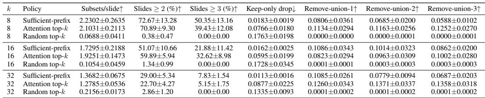
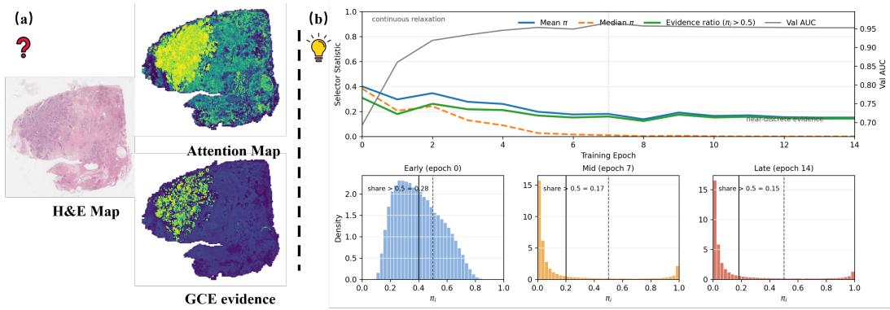
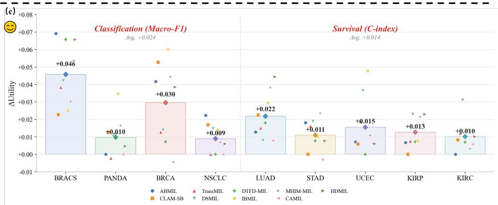

[← 返回 README](../README.md)

> 💡 **claude 批注｜本节预览**: 本节从临床干预问题出发，先用 BRACS 的多充分子集现象证明证据非唯一，再给出 S/N/R 与 GCE-MIL 的整体研究路线。

# 1 Introduction

Whole-slide images contain thousands of patches, diagnostically relevant tissue is sparse, and training supervision is usually available only at the slide level. Multiple instance learning (MIL) is therefore the standard modeling choice: a slide is treated as a bag of patches, and a bag-level predictor is trained from slide labels [Ilse et al., 2018, Lu et al., 2021, Shao et al., 2021]. The same models are often asked to provide evidence by visualizing attention weights or instance scores. This reuse is convenient, but it leaves a clinical question unresolved: which patches actually support the prediction under intervention?

> 💡 **claude 批注｜问题动机**: 这里的关键词是“under intervention”。高 attention 只能说明聚合器分配了较大权重，不能回答“只保留这些 patch 是否仍预测一致”或“删掉这些 patch 是否会破坏预测”。ReadySlide 若把 selector 输出当证据，也必须用同一 consumer 做 keep/remove 干预，不能只看热图。

Current WSI MIL methods mainly improve the predictor. ABMIL introduces gated attention pooling [Ilse et al., 2018]; CLAM adds clustering-constrained attention [Lu et al., 2021]; TransMIL models inter-instance correlation with transformers [Shao et al., 2021]; DSMIL, DTFD-MIL, IBMIL, MHIM-MIL, CAMIL, and HDMIL improve aggregation, regularization, context, or efficiency [Li et al., 2021, Zhang et al., 2022, Lin et al., 2023, Tang et al., 2023, Fourkioti et al., 2024, Dong et al., 2025].

*Table 1: Minimal sufficient subset analysis on BRACS validation slides using an ABMIL teacher. A subset is sufficient if it preserves the full-bag predicted class and has probability drop at most 0.05.*

> 💡 **claude 批注｜表 1 批读**: 这张 BRACS 表不是一般性能表，而是证据非唯一性的诊断：$k=8$ 时 sufficient-prefix 平均找到 2.2302 个互斥充分子集，72.67% slide 至少有两个；attention top-k 虽也能列出候选，但 keep-only drop 为 0.0766，明显高于 sufficient-prefix 的 0.0183。它说明单一 softmax 排名既遗漏等价证据源，也不保证选中集合充分。

<table><tr><td width="50%"></td><td width="50%"></td></tr><tr><td align="center"><i>Figure 1(a)(b)</i></td><td align="center"><i>Figure 1(c)</i></td></tr></table>

*Figure 1: Three evidence failures in classification-optimized MIL. (Left) Attention top-k achieves only 0.640 keep-only Macro-F1 vs. GCE 0.722: attention is not sufficient evidence. (Middle) The continuous selector becomes bimodal during training, enabling discretization with C-D gap 0.004. (Right) Adding GCE preserves 0.99× full-bag performance across backbones.*

> 💡 **claude 批注｜图 1 批读**: 三块图分别对应失效诊断、连续门控的可离散化过程、以及跨 backbone 的任务效用保持。它把证据链串成 diagnosis（attention top-k 不充分）→ mechanism（门控退火为双峰）→ outcome（GCE 不以牺牲全包性能换解释）。(a)(b) 与 (c) 在 MinerU 中被拆成两张整图，这里已归位；重复的 attention-map 裁片已删除。

Attention-regularized variants such as ACMIL, AEM, and ASMIL stabilize or deconcentrate attention maps [Zhang et al., 2024, 2025, Ye et al., 2026]. All these methods, however, share an implicit assumption that classification accuracy is the optimization target and that attention or score rankings are an interpretable byproduct. This conflates two distinct goals: predicting correctly and learning correct evidence.

The failure is not simply that attention chooses the wrong number of patches; in the BRACS diagnostic, WSI evidence is often structurally non-unique. Table 1 reports a recursive BRACS diagnostic using an ABMIL teacher. For $k = 8 ,$ , sufficient-prefix search finds 2.2302 disjoint sufficient subsets per slide on average, and 72.67% of validation slides admit at least two such subsets. Attention top-k also finds multiple candidate subsets, but its keep-only drop remains higher (0.0766 at $k = 8 )$ while random top-k almost never finds reusable evidence. Multiple tissue regions can therefore each preserve the same slide-level decision, while a single softmax ranking collapses them into one list. This BRACS diagnostic motivates the S/N/R framework, which is then evaluated across the full nine-dataset benchmark. Figure 1 summarizes the resulting S/N/R tension.

> 💡 **claude 批注｜诊断到分类法**: 72.67% 的 BRACS slide 至少存在两个互不相交的充分子集，说明“唯一正确 patch 排名”并不是合理假设。安全的本文贡献是用该递归诊断把 WSI 证据非唯一性量化；“attention 不等于解释”与干预式 rationale 评价本身已有先例。ReadySlide 仍可在固定 budget、不同 foundation-model selector 与不同 consumer 之间显式表示多个等价证据集。

Evidence quality is formalized through three model-relative criteria. Sufficiency asks whether the selected subset alone preserves the prediction; Necessity asks whether removing the subset degrades the prediction; Recoverability asks whether the continuous selector learned during training yields a faithful discrete subset at inference. GCE-MIL targets these criteria directly with a semantic anchor bank, a continuous selector trained through exact noisy-OR coverage, and threshold-plus-greedy recovery. It is a wrapper rather than a replacement backbone: the host MIL architecture remains unchanged, and the evidence gate is injected as attention-logit bias, feature reweighting, or a hybrid according to the host aggregation type.

The paper makes four contributions:

• A formalization of MIL evidence quality through Sufficiency, Necessity, and Recoverability, with supporting theoretical notes on independence, recoverability, and coverage in Appendix B.

• A BRACS minimal-subset diagnostic showing evidence non-uniqueness in validation slides, motivating evidence selection beyond a single attention ranking.

• GCE-MIL, a plug-in wrapper that combines semantic grounding, noisy-OR coverage, and discrete recovery through attention-bias, feature-reweighting, and hybrid injection modes.

• An evaluation across 9 backbones and 9 datasets, covering prediction metrics, intervention diagnostics, localization, stability, ablations, and computational cost.

> 💡 **claude 批注｜本节小结**: 关键数字是 $k=8$ 时每张片平均 2.2302 个互斥充分子集、72.67% 至少有两个；可追问点是这些“充分”集合在跨 consumer、跨 encoder 或标注扰动后是否仍然充分。
