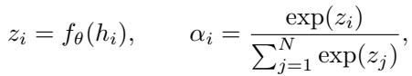

[← 返回 README](../README.md)

> 💡 **claude 批注｜本节预览**: 本节给出 MIL 记号、三类证据失败的精确定义，以及 keep-only、remove-complement、continuous-to-discrete 三种干预视角。

# 3 Preliminaries and Motivation

## 3.1 Notation and MIL Formulation

In MIL for computational pathology, supervision is provided only at the slide level. A whole-slide image is represented as a bag $X \stackrel { \triangledown } { = } \{ x _ { i } \} _ { i = 1 } ^ { N }$ of tissue patches, where N can range from hundreds to tens of thousands. A pretrained encoder maps each patch $x _ { i }$ to a fixed-dimensional embedding $h _ { i } \in \mathbb { R } ^ { d } \left( d = 1 0 2 4 \right.$ throughout). An attention-based MIL model assigns a scalar attention score to each embedding via a learnable scorer:

*公式 1：MinerU 从论文原页提取的行间公式。*

> 💡 **claude 批注｜公式 1 批读**: 公式把每个 patch 的 score $z_i$ 经 softmax 变为 simplex 上的 $\alpha_i$。归一化迫使所有 patch 竞争同一总质量，适合加权聚合，却没有任何 keep-only、remove 或离散恢复约束；后文三类 failure 正是从“把分类用 $\alpha_i$ 复用为证据”这一接口产生。

where $\alpha _ { i }$ lies on the probability simplex $\Delta ^ { N }$ . The slide-level representation $\begin{array} { r } { h _ { \mathrm { b a g } } = \sum _ { i = 1 } ^ { N } \alpha _ { i } h _ { i } } \end{array}$ i is a convex combination of instance features weighted by the attention distribution, and is passed to a classifier to produce the bag-level prediction $\bar { \hat { y } } = f ( \bar { h _ { \mathrm { b a g } } } )$

After training, the attention weights $\left\{ \alpha _ { i } \right\}$ are reused as evidence: the top-ranked patches are presented as the model’s explanation for its prediction. However, this reuse conflates two distinct objectives— classification accuracy and evidence quality—because the attention mechanism is optimized solely for the former.

## 3.2 Motivation: Three Evidence Failures

Three systematic failures arise when attention is treated as evidence, motivating the S/N/R criteria formalized below.

(P1) Insufficiency. Keeping only the top-attended patches should preserve the prediction if they constitute sufficient evidence. Table 4 shows this fails: keeping attention top-k drops Macro-F1 by 0.078 from the full bag, averaged across nine datasets and nine backbones.

> 💡 **claude 批注｜充分性失效协议**: 对选中集合 $S$ 构造 evidence-only bag $X_S$，仍交给原 consumer $f$；若预测类改变或概率/任务指标下降超过阈值，就判为不充分。这里报告 attention top-k 的平均 Macro-F1 下降 0.078。

(P2) Unnecessity. Removing the top-attended patches should degrade the prediction if they are necessary evidence. However, removing attention top-k changes Macro-F1 by only 0.033 (Table 4), indicating the model largely recovers from the remaining patches.

> 💡 **claude 批注｜必要性失效协议**: 对同一集合 $S$ 构造 complement bag $X_{\neg S}$；如果删去所谓证据后输出几乎不变，则它不是决策必要证据。attention top-k 只带来 0.033 的变化，说明剩余 patch 仍含足够替代信息。

(P3) Unrecoverability. During training, the selector operates in continuous space, but at inference a discrete subset must be extracted by thresholding. The continuous-discrete gap reaches 0.029 for ABMIL attention, compared with 0.005–0.011 for GCE-wrapped backbones (Appendix Table 7), meaning the discrete inference-time evidence disagrees with the continuous signal used during training.

> 💡 **claude 批注｜可恢复性失效协议**: 形式口径比较连续门控 $X_\pi$ 与纯阈值集合 $X_{S(\pi)}$；ABMIL attention 的 0.029 用来量化这个软硬接口断裂。GCE 的实验口径另有 repair：实际 C-D gap 比较 $X_\pi$ 与 $X_{S^*}$，不能把 $S(\pi)$ 和 $S^*$ 写成同一个集合。

These failures persist across ABMIL, TransMIL, CLAM, DSMIL, and other architectures [Ilse et al., 2018, Shao et al., 2021, Lu et al., 2021, Li et al., 2021]. The problem is compounded by evidence non-uniqueness: a recursive minimal-subset diagnostic on BRACS (Table 1) reveals that 72.67% of slides admit at least two disjoint sufficient subsets, yet attention produces a single global ranking that conflates these sources. This diagnostic motivates evidence selection beyond a single attention ranking; the subsequent experiments evaluate whether optimizing S/N/R improves evidence quality across datasets and backbones.

## 3.3 S/N/R: Three Criteria for Evidence Quality

The following definitions formalize what it means for an evidence subset to be “correct,” with each criterion addressing one failure.

Definition 1 (δs-Sufficiency, addressing P1). For a bag predictor f and subset $S \subseteq \{ 1 , \ldots , N \}$ , let $X _ { S } = \{ x _ { i } : i \in S \}$ . S is $\delta _ { s }$ -sufficient if $| f ( X _ { S } ) - f ( { \bar { X } } ) | \leq \delta _ { s }$

Definition 2 (δn-Necessity, addressing P2). Let $X \lnot s = \{ x _ { i } : i \notin S \}$ . S is $\delta _ { n }$ -necessary if $| f ( X \neg S ) - f ( X ) | \geq \delta _ { n } $

> 💡 **claude 批注｜必要性定义校正**: 严格按该式，删除 $S$ 后性能或真类置信变化至少达到 $\delta_n$，才说明 $S$ necessary。若 $S=X$，补集为空，模型输出通常与 full bag 差异很大，所以整包也可能满足 Necessity；该定义不自动排除整包，紧凑性必须由 budget/cardinality 另行约束。

Definition 3 (δ -Recoverability, addressing P3). For a continuous selector $\pi \in [ 0 , 1 ] ^ { N }$ , let $X _ { \pi } =$ $\{ \pi _ { i } x _ { i } \}$ and $S ( \pi ) = \{ i : \pi _ { i } \geq \tau \}$ . π is $\delta _ { r }$ -recoverable if $| f ( X _ { \pi } ) - f ( X _ { S ( \pi ) } ) | \le \delta _ { r }$

> 💡 **claude 批注｜可恢复性口径校正**: Definition 3 的 $S(\pi)$ 是纯阈值集合。论文对 GCE 实测 C-D gap 时采用的是 Algorithm 1 输出的 $S^*$：先阈值得 $S_0$，再按 anchor coverage 修复。形式定义与实验操作不能混写；两者都只测软硬输出一致性，不自动保证 Sufficiency 或 Necessity。

Sufficiency ensures the evidence is self-contained; Necessity prevents trivial solutions (e.g., selecting the entire bag); Recoverability bridges training and inference. Together, they separate “correct prediction” from “correct explanation” as two evaluation axes. Appendix Table 6 summarizes the operational diagnostics used in the experiments. The next section presents GCE-MIL, which simultaneously addresses (P1), (P2), and (P3).

> 💡 **claude 批注｜原文定义冲突校正**: 上句原文称 Necessity 可排除 selecting the entire bag，但这与 Definition 2 不一致：$S=X$ 删除后成为空袋，反而很可能产生大幅输出下降并通过 Necessity。整包还可同时满足 Sufficiency，并在全 1 门控时满足 Recoverability。S/N/R 是三条忠实性轴，不是 sparsity 定义；ReadySlide 必须另外固定 selector、consumer 与 budget/cardinality。

> 💡 **claude 批注｜本节小结**: Sufficiency 保留 $S$，Necessity 删除 $S$；Recoverability 的形式对象是纯阈值 $S(\pi)$，GCE 的实测对象则是 repair 后 $S^*$。三者输出都由同一 consumer 比较，但集合紧凑性来自独立 budget/cardinality，不能归因于 Necessity。
