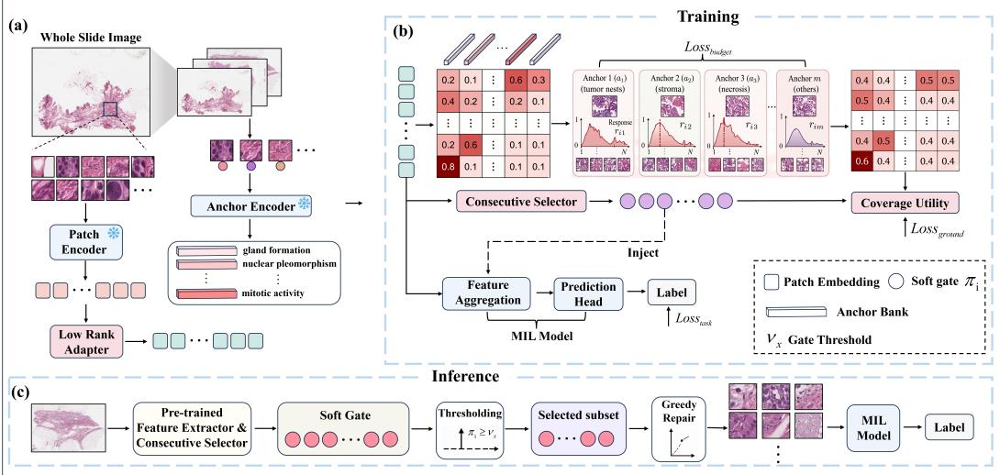
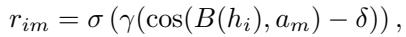
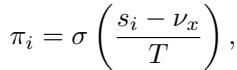
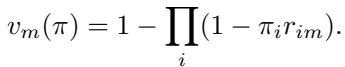
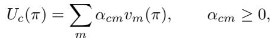
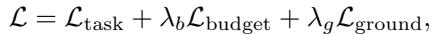

[← 返回 README](../README.md)

> 💡 **claude 批注｜本节预览**: 本节按数据流拆解 GCE：语义锚点把 patch 接到病理概念，连续门控与 noisy-OR 建模多源覆盖，阈值加修复恢复离散证据。

# 4 Grounded Continuous Evidence MIL

## 4.1 Overview

*Figure 2: GCE-MIL architecture. The framework wraps existing MIL backbones with three components: (1) low-rank adapter and semantic bridge for anchor grounding (drives Necessity via concept coverage), (2) continuous selector with exact noisy-OR coverage (drives Sufficiency via multi-source evidence), (3) threshold-plus-repair discrete recovery (drives Recoverability via the same marginal coverage objective). The host backbone remains unchanged, making GCE a plug-in wrapper.*

> 💡 **claude 批注｜图 2 批读**: 图中三条修复路径不是一一独立的 loss：语义锚点与 bridge 给出概念响应，noisy-OR 把多个 patch 对同一概念的响应聚成覆盖效用，selector 输出连续门控，最后阈值加 greedy repair 用同一效用恢复离散集合。诊断→组件的主映射是 P2→grounding、P1→coverage+budget、P3→annealing+recovery。

GCE-MIL is a plug-in wrapper that adds evidence optimization to any existing MIL backbone $f _ { \theta }$ without modifying its architecture. The wrapper introduces three components, each targeting one of the S/N/R criteria identified in Section 3 (Figure 2):

• A semantic anchor bank that grounds patch selection in pathology-specific concepts, addressing Necessity (P2) by tying evidence to diagnostic structures rather than arbitrary attention scores.

• A continuous selector with noisy-OR coverage that produces soft gates $\pi \in [ 0 , 1 ] ^ { N }$ , addressing Sufficiency (P1) by modeling multi-source evidence coverage across diagnostic concepts.

• A discrete recovery procedure that converts π into an inference-time subset using the same submodular coverage utility, addressing Recoverability (P3) by keeping the discrete evidence close to the continuous selector.

The backbone $f _ { \theta }$ remains structurally unchanged—GCE only adds a soft evidence mask that modulates the backbone’s inputs. The gate π is injected according to the backbone’s aggregation type: as an attention-logit bias $\alpha _ { i } \leftarrow \alpha _ { i } + \log \pi _ { i }$ for attention-based backbones (ABMIL, CLAM-SB, IBMIL), as feature reweighting $h _ { i } \leftarrow \pi _ { i } \cdot h _ { i }$ for token-based backbones (TransMIL, DTFD-MIL, HDMIL, CAMIL), or as a hybrid of both for multi-path backbones (DSMIL, MHIM-MIL). This injection preserves the host backbone’s scoring head while giving GCE a consistent interface for evidence evaluation.

## 4.2 Semantic Anchor Grounding

GCE-MIL grounds evidence selection in domain-specific semantic concepts rather than learning selection from classification gradients alone. Diagnostically relevant structures—tumor nests, stromal reactions, necrosis, mitotic figures—have well-defined morphological descriptions that can serve as selection anchors, enabling the selector to distinguish diagnostically informative patches from visually salient but irrelevant ones.

GCE-MIL uses M = 8 semantic anchors defined as frozen text embeddings from TITAN [Ding et al., 2025], a pathology vision-language model. The anchor prompts are task-specific morphology descriptions chosen before training from disease and histology priors, without validation-set tuning or patch-level concept labels. Examples include “gland formation,” “nuclear pleomorphism,” “mitotic activity,” and “necrotic tumor cells”; Appendix Table 21 records the prompt categories used for each dataset family. The text embeddings are computed once and fixed during training, and only the adapter, bridge, selector, and host MIL parameters are learned.

> 💡 **claude 批注｜语义锚定输入输出**: 输入是 UNI patch embedding 与 8 个冻结 TITAN 文本锚点；bridge 把视觉特征映射到锚点空间，输出每个 patch–anchor 的响应矩阵 $r_{im}$。没有 patch-level 概念标注，因此该模块依赖预先给定的病理形态词表；这既是可解释性来源，也是域偏移时的风险点。

Each patch embedding passes through a low-rank residual adapter $e _ { i } = \mathrm { n o r m } ( ( I + U V ^ { \top } ) h _ { i } )$ , where $U , V \in \mathbb { R } ^ { d \times r } \left( r = 3 2 \right)$ are initialized near zero. A separate bridge $B ( \cdot )$ maps raw features into the anchor space. The patch-anchor response is:

*公式 2：MinerU 从论文原页提取的行间公式。*

> 💡 **claude 批注｜公式 2 批读**: $B(h_i)$ 与冻结锚点 $a_m$ 的余弦相似度先减阈值 $\delta=0.15$，再由 $\gamma=8.0$ 放大并过 sigmoid，输出 patch–anchor 响应 $r_{im}$。因此 grounding 的监督对象不是类别 attention，而是每个 patch 对具体病理形态概念的覆盖强度。

where $a _ { m }$ is the frozen anchor embedding, $\gamma = 8 . 0$ sharpens the response, and $\delta = 0 . 1 5$ suppresses weak matches. Disease-specific anchors improve over generic prompts in Table 18, lowering the C-D gap from 0.015 to 0.010 and raising complement degradation from 0.210 to 0.290. Random and shuffled prompts remain close to no grounding, while generic prompts, disease-specific prompts, and constrained TITAN grounding improve in order; this pattern suggests that the gain is not only an effect of adding selector capacity. The full TITAN anchor configuration with the constrained bridge further reaches 0.004 C-D gap and 0.412 complement degradation.

## 4.3 Continuous Selector and Noisy-OR Coverage

Given the anchor responses $\{ r _ { i m } \}$ , the continuous selector determines which patches to include in the evidence subset. For each patch, a small MLP receives the adapted embedding $e _ { i }$ and spatial coordinates $c _ { i } .$ , and outputs a scalar score $s _ { i }$ . The inclusion gate is computed as:

*公式 3：MinerU 从论文原页提取的行间公式。*

> 💡 **claude 批注｜连续门控机制**: selector MLP 接收适配后的 patch embedding 和坐标，输出标量 $s_i$；温度 $T$ 从 1.0 降到 0.4，使 sigmoid 门控从平滑概率变成接近 0/1 的双峰分布。它直接缩短训练软门控与推理硬集合之间的距离，是 Recoverability 的前半段。

where $\nu _ { x } = 0$ is a centering constant and $T$ is a temperature that is annealed from 1.0 to 0.4 during training. This annealing gradually pushes the gate distribution toward a bimodal regime (Figure 1, middle panel), making the continuous selector increasingly discrete-like and facilitating recovery at inference time.

Why noisy-OR for coverage? The S/N/R criteria impose specific requirements on how per-patch anchor responses are aggregated into coverage. Mean pooling conflates “many weak responses” with “one strong response,” violating coverage semantics. Attention pooling reintroduces softmax concentration. Noisy-OR provides the right inductive bias: for anchor $m ,$ coverage under continuous gates π is

*公式 4：MinerU 从论文原页提取的行间公式。*

> 💡 **claude 批注｜公式 4 批读**: $v_m(\pi)=1-\prod_i(1-\pi_i r_{im})$ 计算锚点 $m$ 至少被一个已门控 patch 覆盖的概率。乘积结构使已覆盖概念继续加入同类 patch 的收益饱和，从机制上纠正 attention 将多个等价证据压成单一排名的问题。

This models each patch as an independent evidence channel with diminishing marginal returns. The class-level utility aggregates coverage across anchors:

*公式 5：MinerU 从论文原页提取的行间公式。*

> 💡 **claude 批注｜多源覆盖机制**: $v_m(\pi)$ 表示锚点 $m$ 至少被一个已门控 patch 激活的概率；某概念一旦已覆盖，重复 patch 的边际收益递减，selector 因而更愿意补充新形态而不是反复选同类高 attention patch。这正针对 WSI 多源、非唯一证据。

where $\alpha _ { c m }$ are learnable class-anchor weights. Crucially, noisy-OR provides closed-form marginals for greedy repair: $\begin{array} { r } { \partial U _ { c } / \partial \pi _ { i } = \sum _ { m } \alpha _ { c m } r _ { i m } \prod _ { j \neq i } ( 1 - \bar { \pi } _ { j } r _ { j m } ) } \end{array}$ . The marginal gain decreases as more patches are selected, which is the diminishing-returns property needed for Necessity. Appendix B gives the corresponding modeling interpretation, including S/N/R independence, a gate-margin recoverability bound, conditional coverage bounds, and a Cox risk-pathway view.

Proposition 1 (Submodularity of Noisy-OR Coverage). For fixed anchor responses $r _ { i m }$ and class weights $\alpha _ { c m } \geq 0 ;$ , the utility $\begin{array} { r } { \bar { U _ { c } } ( S ) = \bar { \sum _ { m } } \alpha _ { c m } [ 1 - \bar { \prod _ { i \in S } } ( 1 - r _ { i m } ) ] } \end{array}$ is monotone submodular in S.

Proof. For $S \subseteq T$ and $i \not \in T$ , the marginal gain is $\begin{array} { r } { \Delta _ { m } ( i | S ) = r _ { i m } \prod _ { j \in S } ( 1 - r _ { j m } ) \geq r _ { i m } \prod _ { j \in T } ( 1 - } \end{array}$ $r _ { j m } ) = \Delta _ { m } ( i | T )$ , since $S \subseteq T$ implies the product over S is at least as large. Summing over m with $\alpha _ { c m } \geq 0$ preserves the inequality. □

This submodularity justifies greedy marginal repair at the coverage-utility level: under the standard cardinality-limited coverage setting, greedy selection attains the usual $( 1 - 1 / e )$ approximation [Nemhauser et al., 1978]; Appendix B gives the curvature-aware refinement. The implemented repair additionally checks threshold recovery and prediction sufficiency, so the claim is a coverage-property statement rather than a global optimality statement about the classifier.

> 💡 **claude 批注｜repair 范围校正**: 上句“repair additionally checks ... prediction sufficiency”与正文 Algorithm 1 不一致。算法只在 $\min_m v_m(\mathbf{1}_S)\lt0.95$ 时继续添加 patch，停止条件只有 anchor coverage；它没有调用 classifier 或执行 keep-only check。prediction sufficiency 是 recovery 之后的独立实验诊断，不是 repair 内部约束。

## 4.4 Training Objective and Discrete Recovery

GCE-MIL trains the host backbone and selector jointly with a composite loss:

*公式 6：MinerU 从论文原页提取的行间公式。*

> 💡 **claude 批注｜公式 6 批读**: 总损失由原 host 的 task loss、权重 $\lambda_b=0.1$ 的 budget loss、权重 $\lambda_g=0.5$ 的 grounding loss组成。要注意 Recoverability 没有单独 loss 项，而是由 selector 退火与推理时 threshold-plus-repair 实现；Table 3 才能区分三条路径的主效应。

where each term targets a specific S/N/R criterion. $\mathcal { L } _ { \mathrm { t a s k } }$ is the unmodified backbone loss (crossentropy for classification, Cox partial likelihood for survival), preserving the host model’s predictive capacity. $\mathcal { L } _ { \mathrm { b u d g e t } } = \mathrm { R e L U } ( \dot { \mathbb { E } } [ \pi ] - \rho ) ^ { 2 }$ enforces sparsity, driving Sufficiency by requiring the selector to preserve the prediction with a compact subset. The reported benchmark uses the operating evidence budget $\rho = 0 . 0 5$ , selected by the validation sweep in Appendix Table $1 6 ;$ larger budgets are reported as sensitivity points rather than mixed into the main tables. $\mathcal { L } _ { \mathrm { g r o u n d } }$ aligns π with noisy-OR anchor responses, driving Necessity by ensuring selected patches are grounded in diagnostic concepts rather than arbitrary features. Recoverability is enforced by temperature annealing and the threshold plus-repair procedure, which make the learned continuous gate compatible with discrete evidence extraction at inference. The weights $\lambda _ { b } = 0 . 1$ and $\lambda _ { g } = 0 . 5$ define the reported cross-dataset setting and are kept fixed across datasets and backbones after selection on BRACS validation folds. Table 3 validates each component’s contribution: adding budget control reduces the C-D gap from 0.055 to 0.011; adding grounding increases complement degradation from 0.318 to 0.403; the full pipeline reaches 0.004 gap and 0.412 degradation.

> 💡 **claude 批注｜训练目标证据链**: task loss 保住 consumer 效用，budget loss 把平均证据压到 5%，grounding loss 让门控覆盖病理锚点；Recoverability 不是单独一项 loss，而由退火与推理修复实现。Table 3 的相邻行应读作：budget-only 将 C-D gap 0.055→0.011、complement degradation 0.090→0.318；随后 discrete recovery 行的 degradation 为 0.377；再加 semantic grounding 才是相邻的 0.377→0.403；Full GCE 达 0.412。上方英文原文把 budget-only 的 0.318 与 semantic row 的 0.403 作非相邻比较，不能直接解释为 grounding 的相邻增益。

Discrete recovery at inference. At test time, GCE-MIL converts the continuous selector into a discrete evidence subset via threshold-plus-repair (Algorithm 1). The initial subset $S _ { 0 } = \{ i : \pi _ { i } \gt$ 0.5} is obtained by thresholding; if empty, the top-1 patch is used as a fallback. Greedy repair then adds patches in decreasing order of marginal coverage gain until the coverage target $c = 0 . 9 5$ is met. Because the coverage utility is monotone submodular (Proposition 1), this greedy procedure has a principled diminishing-returns objective rather than an unrelated post-hoc ranking. The pseudocode is provided in Appendix C.

> 💡 **claude 批注｜离散恢复协议**: 先以 0.5 阈值得到纯阈值集合 $S_0$，空集时回退到 top-1；随后按 noisy-OR 精确边际增益补 patch，直到最弱锚点覆盖达到 0.95，输出 $S^*$。Algorithm 1 的循环只检查 anchor coverage，不调用 classifier，也不检查 prediction sufficiency。论文对 GCE 的 operational C-D gap 比较 $\pi$ 与 $S^*$；Definition 3 的形式对象则是未经 repair 的 $S(\pi)$。

Proposition 2 (Greedy recovery scope). Let $\pi \in [ 0 , 1 ] ^ { N }$ be the continuous selector, $S _ { 0 } = \{ i : \pi _ { i } \gt$ 0.5} be the thresholded subset, and ${ \bar { S } } ^ { * }$ be the output of Algorithm 1 with coverage target c. Then the following statements hold:

1. If the loop terminates by satisfying the coverage condition, then minm $v _ { m } ( \mathbf { 1 } _ { S ^ { * } } ) \geq c$ by construction.

2. Each added patch maximizes the exact one-step marginal gain of the noisy-OR utility used during training.

3. If repair is restricted to a fixed-size shortlist and evaluated only as coverage maximization, the greedy part inherits the standard $( 1 - 1 / e )$ approximation to the best shortlist subset of that size.

These are coverage-level properties; they do not assert global optimality of the host classifier under arbitrary interventions.

Proof sketch. The first claim follows directly from the termination condition. The second follows because Algorithm 1 ranks candidates by ${ \partial \dot { U } _ { c } } / { \partial { \pi _ { i } } }$ computed from the noisy-OR utility. The third follows from standard greedy analysis for monotone submodular maximization under a cardinality budget [Nemhauser et al., $1 9 7 8 ] ;$ prediction sufficiency is then checked empirically by the intervention diagnostics rather than assumed by the theorem. □

> 💡 **claude 批注｜本节小结**: 数据流为 patch 特征/坐标 + 8 个 TITAN 锚点 → adapter/bridge 响应 $r_{im}$ → selector 门控 $\pi_i$ → noisy-OR 覆盖与三项训练目标 → 0.5 阈值 + 0.95 覆盖修复 → 离散证据集合；最重要的可追问点是锚点完备性与跨域 prompt 迁移。
